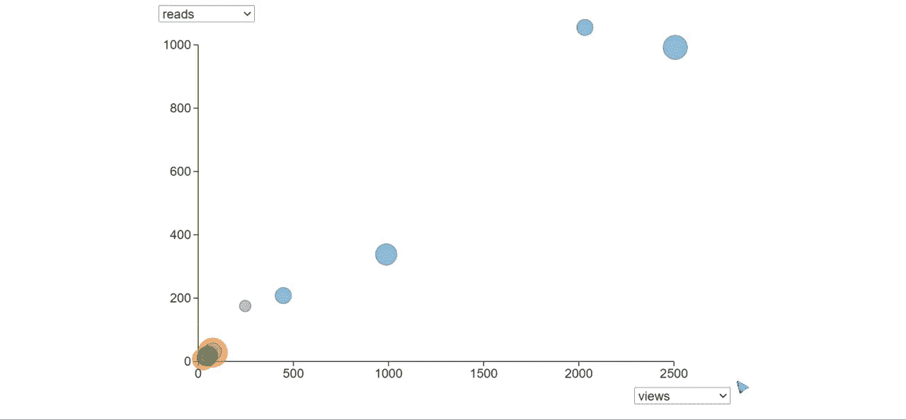

# 交互式散点图

> 原文：<https://medium.com/codex/an-interactive-scatter-plot-e5a01064b17?source=collection_archive---------8----------------------->

## D3.js 入门

所有图片由作者提供

D3 非常适合创建交互式在线数据可视化。它允许我们将数据绑定到 SVG 元素([可缩放矢量图形](https://developer.mozilla.org/en-US/docs/Web/SVG))，然后当数据改变时，或者在用户交互之后，更新 SVG 并制作动画。

让我们从一个`circle`元素的 SVG 标记开始。`cx`和`cy`属性给出中心坐标，`r`设置半径。