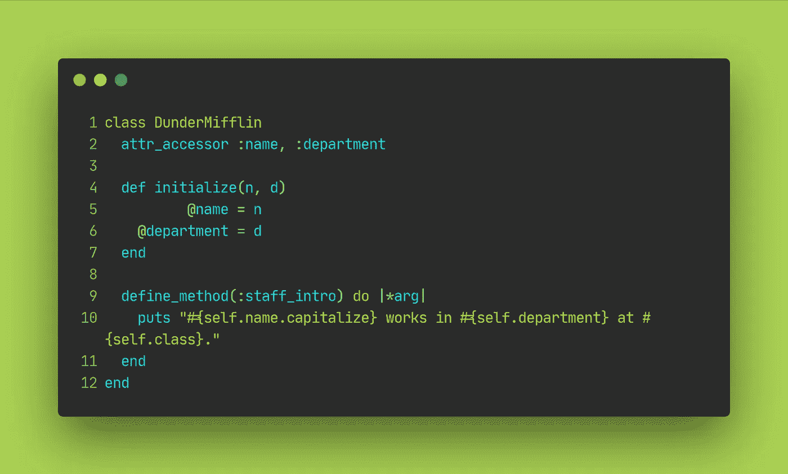

# Ruby 元编程简介

> 原文：<https://medium.com/codex/an-intro-to-metaprogramming-in-ruby-28f1bad3ed8e?source=collection_archive---------9----------------------->

# Ruby 中的自动属性

我经常在 Ruby 文档和问题栏中看到提到的一个词是“*automagic*”。从表面上看，Ruby 确实有自动变量和方法。然而，Ruby 在幕后做了很多工作，元编程是这种自动关联背后的关键。

# 定义元编程

互联网上流传着各种定义，试图解释什么是元编程。以下是一些例子:

> "元编程是编写编写程序的程序."— [安德鲁·理查兹](/swlh/metaprogramming-in-ruby-1b69b1b54202)
> 
> "元编程是为我们编写代码的实践."耶利米·塔布
> 
> "元编程的定义是…操纵程序的程序."迪安·哈罗普

这些都是非常有效的定义，但对于这个概念的新手来说，它们解释不了什么。下面是 Jordan Hugens 的另一个定义，它给出了这个概念背后的更多细节:

> "元编程允许程序动态地创建方法，而不必在程序本身中定义它们."

# 那么…这到底意味着什么呢？

为了真正解释什么是元编程，我们来看三个例子:

1.  猴子补丁
2.  `define_method`
3.  `method.missing`

# 猴子补丁

Ruby 的一个非常强大但潜在危险的方面是能够打开任何类并改变其变量和方法。让我们观察一些工作中的元编程。

在 Ruby 中，每个存在的类(例如:`String`、`Array`、`Time`)都是`Class`类的一个实例。当我们在`Class`类中定义一个新方法时，我们可以在任何其他类中调用它，如下所示。

观察从同一个`hello_world`方法返回的两个不同输出。使用`self`关键字，我们的新方法能够动态地将新类的名称插入到自身中，并返回自定义字符串。

这就是元编程:**我们动态地创建了一个方法，我们的程序为我们编写代码。我们不需要进入每个类，手动将名字插入到我们的字符串中。**

## 猴子打补丁的危险

> 权力越大，责任越大…

这正是猴子打补丁的情况。看看下面我们的代码片段。

正如你所看到的，我们能够打开 Ruby 中内置的`String`类并覆盖它的`upcase`方法来返回完全不同的东西。你可以想象这可能导致的潜在副作用(和头痛)

# `define_method`

现在对元编程的工作原理有了更好的理解，我们可以深入到 Ruby 中一个稍微高级一点的叫做`define_method`的类方法。`define_method`的主要用途是在应用程序运行时创建方法。

让我们用猴子补丁示例中的`DunderMifflin`类来演示一下。

使用`define_method`，我们能够定义一个`staff_intro`实例方法，并将其用于`DunderMifflin`的所有雇员。这是一个让我们的代码干涸的好方法！

# 方法 _ 缺失

我们的最后一个例子将向我们展示 Ruby 最强大的方法之一。方法允许我们调用不存在的方法，并动态定义它们。

在上面的例子中，每当我们试图调用一个不存在的方法`include?`单词`‘pawnee’`时，我们使用`method_missing`方法返回一个自定义字符串。程序不知道我们将调用什么方法名，但是我们已经把它编程为在某个条件下输出一个响应。

*自动的！*

这种技术非常有用，尤其是在构建库或声明性 DSL(特定领域语言)时，因为它允许程序在处理新情况时具有更大的灵活性。事实上，`method_missing`与`scoped_by_*`一起为 Rails 活动记录中的许多动态[查找器方法提供动力！](https://apidock.com/rails/ActiveRecord/Base/method_missing/class)

当使用`method_missing`时，为了让你的[动态方法与](https://makandracards.com/makandra/9821-when-overriding-method_missing-remember-to-override-respond_to_missing-as-well) `[#method](https://makandracards.com/makandra/9821-when-overriding-method_missing-remember-to-override-respond_to_missing-as-well)`一起工作，同时实现`response_to_missing?`方法也很重要。然而，由于本文旨在介绍元编程，为了简洁起见，我们省略了这个细节。

# 摘要

让我们回顾一下本文开头的定义:

> "元编程是编写编写程序的程序."
> 
> "元编程是为我们编写代码的实践."
> 
> "元编程的定义是…操纵程序的程序."
> 
> "元编程允许程序动态地创建方法，而不必在程序本身中定义它们."

希望在阅读本文后，您能够更好地理解这些定义的含义。我们的基本猴子补丁、`define_method`和`method_missing`例子仅仅开始触及元编程的皮毛。它在许多其他语言中广泛使用，如 Python、C++和 TypeScript。

虽然元编程很有用，但应该谨慎使用，因为它有潜在的副作用和代码维护问题。否则，元编程允许我们创建更灵活和适应性更强的程序，总体来说，学习元编程对于提高您的开发职业来说是一项很好的技能！

# 更多元编程

 [## Ruby 中的元编程

### 什么是元编程？

medium.com](/swlh/metaprogramming-in-ruby-1b69b1b54202)  [## Ruby 元编程-缺少方法

### method_missing 是一个 ruby 提供的方法，当你调用一个…

www.leighhalliday.com](https://www.leighhalliday.com/ruby-metaprogramming-method-missing)  [## 元编程的魔力

### 用抽象的魔法改造你的程序

better 编程. pub](https://betterprogramming.pub/the-magic-of-metaprogramming-732f0300a5c7) 

# 参考

*   [https://www.youtube.com/watch?v=lZfv4H-9ato&feature = emb _ title](https://www.youtube.com/watch?v=lZfv4H-9ato&feature=emb_title)
*   [https://www . cron dose . com/2016/08/examples-元编程-指南-初学者/](https://www.crondose.com/2016/08/examples-metaprogramming-guide-beginners/)
*   [https://medium . com/swlh/meta programming-in-ruby-1b 69 B1 b 54202](/swlh/metaprogramming-in-ruby-1b69b1b54202)
*   [https://better programming . pub/the-magic-of-meta programming-732 f 0300 a5c 7](https://betterprogramming.pub/the-magic-of-metaprogramming-732f0300a5c7)
*   [https://www.quora.com/What-is-metaprogramming](https://www.quora.com/What-is-metaprogramming)
*   [https://cult TT . com/2015/06/17/what-is-monkey-patching-in-ruby/](https://culttt.com/2015/06/17/what-is-monkey-patching-in-ruby/)
*   [https://www . leighhalliday . com/ruby-元编程-方法-缺失](https://www.leighhalliday.com/ruby-metaprogramming-method-missing)
*   [https://API dock . com/rails/active record/Base/method _ missing/class](https://apidock.com/rails/ActiveRecord/Base/method_missing/class)