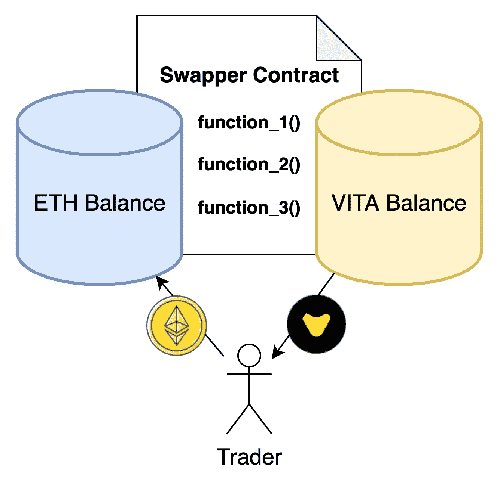
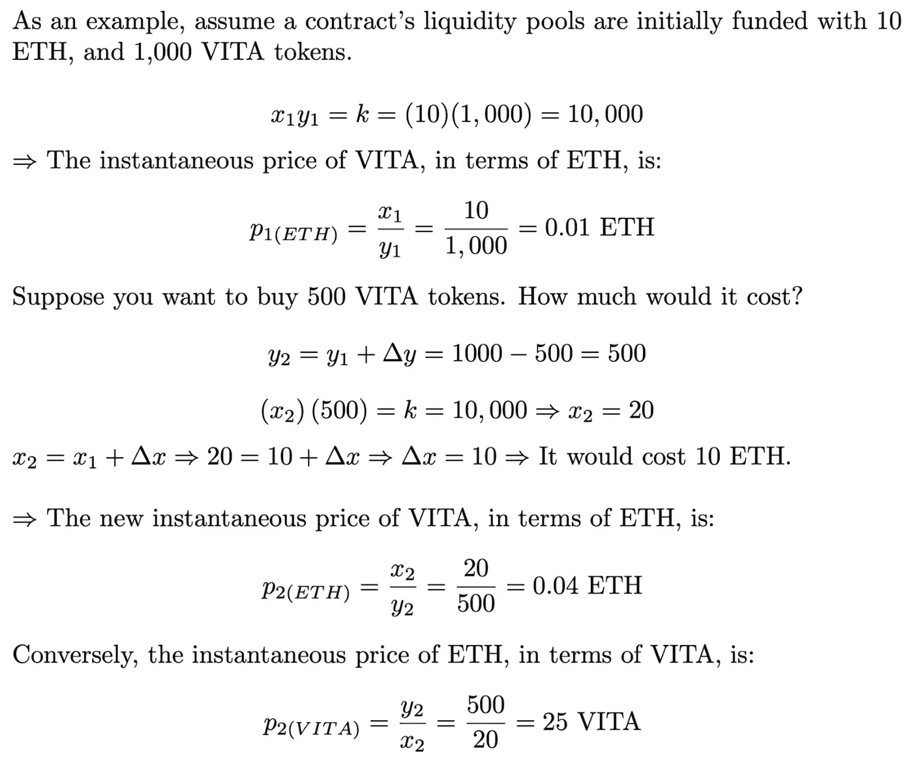
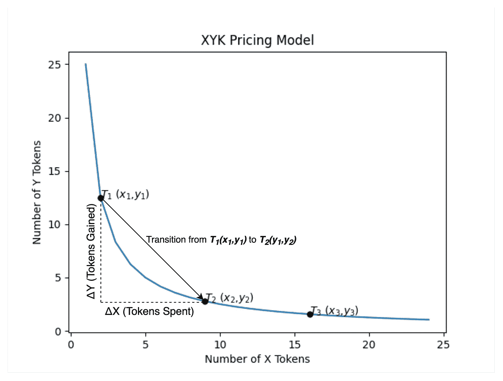
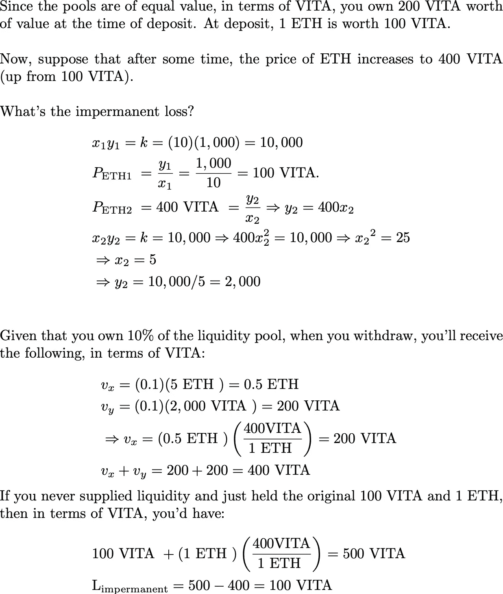
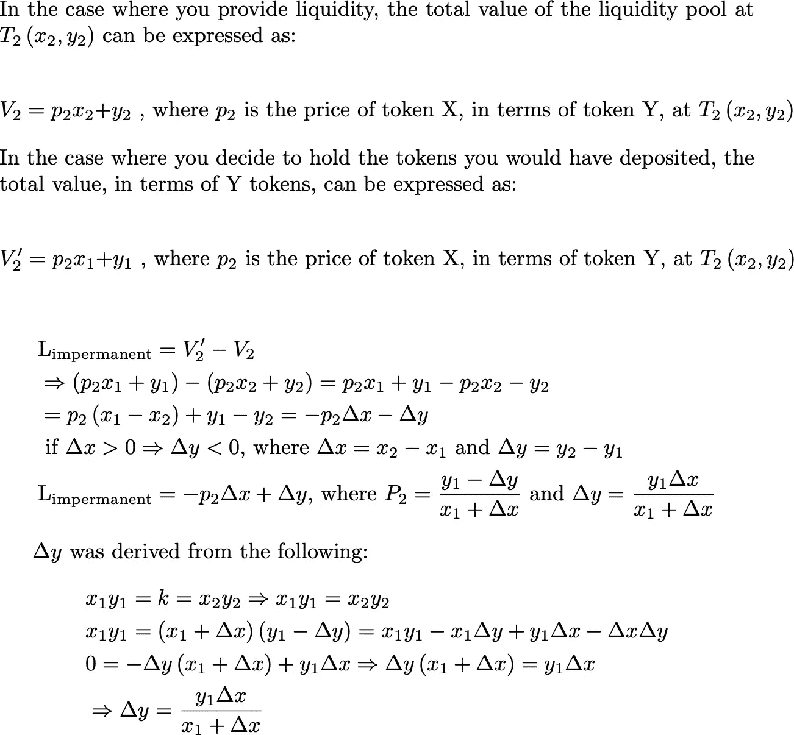

# 自动做市介绍

> 原文：<https://medium.com/codex/an-introduction-to-automated-market-making-994bc76c61f4?source=collection_archive---------4----------------------->

前言:下面这篇文章旨在巩固知识，因为我了解自动化做市。如果任何信息是不正确的，部分不正确的，或不完整的，我竭诚欢迎您的投入。

**目的:**本文旨在介绍自动做市商(AMM)的概念，及其与分散金融的相关性。

**文章结构:**在这篇文章中，我们将涵盖以下概念:

*   流动性池，因为它们有助于代币交易
*   XYK 定价模型，因为它与自动化资产定价相关
*   XYK 定价带来的潜在问题

## 太久了，没看

*   **流动性池**是智能合约的代币余额。促进交易包括提供商定数量的代币 X，为此，您将获得代币 Y 的补偿。在这种情况下，代币 X 的余额将增加所提供的数量，代币 Y 的余额将减少所收到的数量。
*   **XYK 定价**规定，一旦提供流动性，代币总数 X 乘以代币总数 Y 必须始终等于一个常数值。利用这个属性，可以推导出交易的成本。
*   **自动做市商问题**包括价格影响和滑点。当交易者互换代币时，每一次互换实际上都改变了标的代币的价格。与交易金额相关的流动性池越深，交易对代币价格的影响就越小。

# 基础

**分散资产交易所(dex)**是*分散金融*生态系统中不可或缺的组成部分。它们是开放的、无需许可的软件系统，能够实现数字资产的自动化、分散化交易。这些软件系统由智能合同组成，与任何智能合同一样，它们的持续运行取决于为网络提供计算的独立实体。换句话说，一旦部署，契约是不可变的，并且它们不受集中实体的控制。从这个意义上说，分散的交易所可以被认为是公共产品。

**举例:**让我们假设你有一些乙醚(ETH)，你想用其中的一些去换一些[维他道](https://www.vitadao.com/) ERC-20 代币(VITA)。根据基本原则，为了进行这种交易，VITA 代币必须存在，并且当前的所有者必须愿意卖给你一些来交换你的 ETH。换句话说，一定有一个假设的 VITA 代币子集可以用于你的交易。进入流动性池。

# 流动性池

流动性池只是智能合约上的象征性余额。使用上面的示例，可以创建一个智能合同，并最初提供一个 ETH 余额和一个 VITA 余额。假设 ETH 天平的总价值等于 VITA 天平的总价值，将这些天平配对在一起。换句话说，ETH 余额和 VITA 余额都占合同价值的 50%。这些余额提供了便利交易所必需的可用代币。

**图 1:**

可视化的流动性池。

鉴于上述流动性池对，可以说 VITA 是根据 ETH 定价的→“购买一个 VITA 令牌需要多少 ETH？”反过来也是如此:ETH 以 VITA 定价→“我需要多少 VITA 令牌才能购买一个 ETH？”。根据另一个令牌，即时令牌价格由 *XYK 定价模型*指定，我们将在下面深入讨论。如果交易者同意合约的当前 VITA 价格(根据 ETH)，那么为了促进交易，他必须向合约发送指定数量的 ETH，为此他将被自动授予指定数量的 VITA。换句话说，交易者发送 ETH，作为回报，他的账户会收到之前约定数量的 VITA 令牌(加减滑点，我们将在下面介绍),所有这些都没有中介——分散融资！

鉴于上述交易，需要注意的是，通过用 ETH 交换 VITA，ETH 的总量增加了(根据交易者发送的量)，而 VITA 的总量减少了(根据交易者收到的 VITA 的量)。请记住，该模型假设令牌 1 的池(ETH)的总价值始终等于令牌 2 的池(VITA)的总价值。这意味着这笔交易实际上转移了 VITA 在 ETH 方面的价格；下一个交易者将不得不为 1 维他支付更多的 ETH。这种由单一交易引起的价格变化被称为交易的 [*价格影响*](https://help.1inch.io/en/articles/4585109-what-is-price-impact-vs-price-slippage-in-defi) 。价格变化有多大？输入 XYK 定价。

# XYK 定价模型

XYK 定价模型是一种计算代币价格的机制。它指出，一旦提供了流动性，*池 1* 中的代币总数乘以*池 2* 中的代币总数等于某个常数，由此可以导出代币价格。

*   *x =* *池 1 中的令牌总数*
*   y = *池 2 中的令牌总数*
*   *k = x 和 y 的乘积；它用于计算令牌成本，我们将在下面看到*

**图二:**

从上面可以看出，从自动做市商处购买 VITA 代币的行为改变了这些代币的价格(0.01 ETH → 0.04 ETH)。这种关系可以通过图 3 中的下图来可视化:

**图 3:**

XYK 定价曲线，可视化。该图仅用于说明目的；它并不代表上面的 ETH-VITA 示例。[这个图的代码可以在 Github](https://github.com/cucupac/defi) 上查看。

上图描绘了由事务触发的从***【t₁】***到***【t₂】***的状态变化，由此***δx***令牌被花费以获得***δy***令牌。现在，当前往 ***T₂*** 到 ***T₃*** 时，请注意，再次支付***δx***代币将产生数量少得多的 y 代币——随着时间的推移购买更多的 y 代币，y 代币会变得更贵。鉴于由 *XYK 定价模型*促成的交易会改变基础资产的合约内价格，在任何给定时间，合约价格都有可能与其他交易所的价格不同步。这种价格差异为交易者创造了套利机会，迫使合约价格与整体市场价格相匹配。

# XYK 定价的潜在问题

## 价格影响

如上所述，每一次互换都改变了标的证券的价格。根据*【₁】***(x***₁***，y***₁***)***在定价曲线上的位置以及流动性池的*深度*，大宗交易可以对代币的价格产生实质性影响。一个*深*的流动性池要求 ***X*** 和 ***Y*** 相对于大多数互换的规模而言都很大。换句话说，当 ***X*** 和*Y 分别比***δX***和***δY***大时，价格影响小。**

## ****滑移****

**[滑点](https://help.1inch.io/en/articles/4585109-what-is-price-impact-vs-price-slippage-in-defi)是指从你提交交易到你的交易在区块链执行的这段时间内，其他交易者对价格的综合影响。与价格影响类似，深度流动性池有助于减轻滑点。如果合计的***δX***s 和***δY***s(与每笔交易相关联的一对***δX***和***δY***)与 ***X*** 和***Y***(X 和 Y 代币的总量)相比较小，那么滑点将成比例地较小。相反，如果流动性池较浅，总交易活动有可能对交易提交和交易执行之间的代币价格产生较大影响。**

## **非永久性损失**

**当提取时您的流动性池基于百分比的份额的**值比您在提取时存入**的代币 **数量的**值少*时，发生非永久性损失，如果您从未存入代币并持有代币。尽管您将获得流动资金池中的公平份额(无论您提供的比例是多少)，但在提款时，您可能会获得不同数量的 X 和 Y 代币。换句话说，持有代币可能比将代币提供给流动性池更好。通过一个例子可以最好地理解这个概念:*******

*****示例:**给定上面的 ETH-VITA 示例，假设:***

*   ***你将 1 ETH 和 100 VITA 存入流动资金池。***
*   ***存款后，流动资金池有 10 个 ETH 和 1，000 个 VITA →您拥有该池的 10%。***

******

***这张图片的灵感来自币安写的一篇关于短暂损失的伟大文章。***

***更正式地说，非永久性损失可以定义为:***

******

***这项工作的灵感来自于 Ryan Tian 的文章，关于池流动性的 XYK 模型。***

***对于那些感兴趣的人，我将把它留给你继续探索非永久性损失的数学。***

# ***结论***

***我真诚地希望自动化做市商和 XYK 定价模型在读完这篇文章后会变得更有意义。如果您想了解最新的以太坊和 Web3 知识，请随时订阅[我的简讯](https://adamcuc.substack.com/)！此外，如果你愿意捐款支持我的写作，请在 **cucupac.eth** 随意捐款；每一点都非常感谢！谢谢你。***