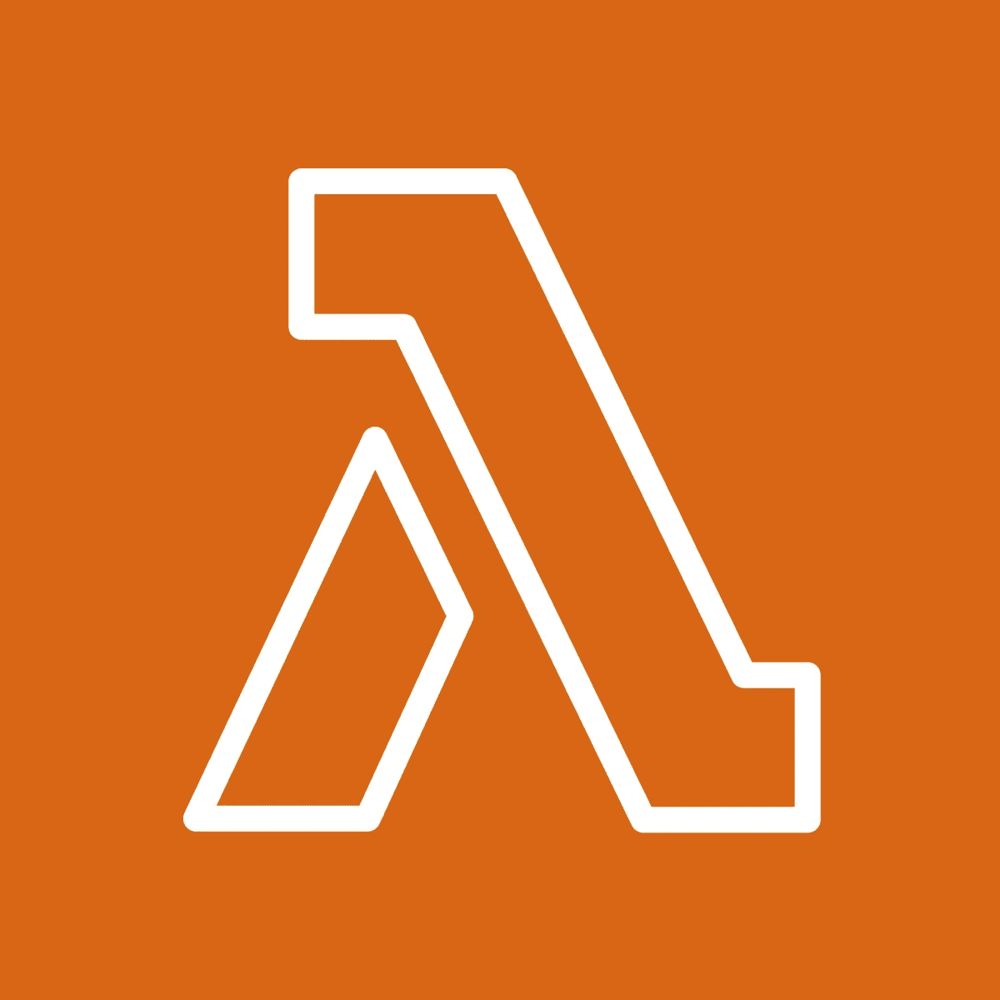

# AWS Lambda 函数简介

> 原文：<https://medium.com/codex/an-introduction-to-aws-lambda-functions-b18e2554338f?source=collection_archive---------7----------------------->



# AWS 无服务器应用程序

为了开始理解 AWS Lambda，我们首先需要理解它在 AWS 无服务器应用程序中的位置。原来每个 AWS 无服务器应用程序都是以 AWS Lambda 开始的。然而，什么是无服务器应用程序呢？"[无服务器计算是一种按需提供后端服务的方法。无服务器提供者允许用户编写和部署代码，而不必担心底层基础设施。](https://www.cloudflare.com/learning/serverless/what-is-serverless/)“这是一种更具成本效益的利用云服务的方式，因为用户按代码执行的时间付费，而不用担心维护自己的硬件基础设施的额外成本和劳动力。

# 什么是 AWS Lambda？

根据 AWS 的说法，“ [Lambda 是一种计算服务，让您无需配置或管理服务器即可运行代码。](https://docs.aws.amazon.com/lambda/latest/dg/welcome.html)“使用 AWS Lambda 的用户把他们的代码组织成 Lambda 函数。这些函数由用户在创建 Lambda 函数时设置的预定事件触发。

# λ函数

Lambda 函数意味着要么处理触发它的事件，要么响应触发事件而运行。每个函数都需要以无状态格式编写，这样它就不知道底层的计算基础设施。任何需要保留的数据都需要保存到另一个服务中(例如，亚马逊 S3、亚马逊 DynamoDB、亚马逊 EFS 等)。).

Lambda 函数的一个简单示例是测试给定网站可用性的重复函数。如果触发事件设置为每分钟运行一次，那么 Lambda 示例函数将每分钟运行一次，并每分钟检查一次给定网站的状态。然而，我们的触发器可以与任意数量的 AWS 服务相关联。例子包括:

1.  响应资源生命周期事件，如亚马逊简单存储服务(亚马逊 S3)。
2.  响应传入的 HTTP 请求
3.  使用队列中的事件

# λ函数解剖学

每个 lambda 函数都有一个处理函数。这是响应触发事件而执行的主要功能。该处理程序有两个必需的参数，还有一个可选的第三个参数。它们分别是事件对象、上下文对象和回调对象。

如果我们要在 AWS 中创建 Lamda，并使用他们的`cloudwatch-logs-process-data`蓝图来构建 NodeJs 环境。我们的示例函数如下所示:

```
exports.handler = async (event, context) => {
    const payload = Buffer.from(event.awslogs.data, 'base64');
    const parsed = JSON.parse(zlib.gunzipSync(payload).toString('utf8'));
    console.log('Decoded payload:', JSON.stringify(parsed));
    return `Successfully processed ${parsed.logEvents.length} log events.`;
};
```

事件对象包含关于触发 Lambda 函数的事件的信息。上下文对象包括关于调用、功能配置和执行环境的信息。第三个参数 callback 是一个函数，您可以在非异步处理程序中调用它来发送响应。回调函数有两个参数:一个错误和一个响应。当你调用它时，Lambda 等待事件循环为空，然后将响应或错误返回给调用者。响应对象必须与 JSON.stringify 兼容。“在我们的示例函数中，您可以看到我们能够使用事件对象中包含的信息来执行我们的函数。AWS 示例没有使用上下文对象，但是如果需要的话，它当然可以使用。

# 概观

AWS Lambda 是 AWS 无服务器应用程序的组成部分，因为 Lambda 函数是无服务器应用程序的入口点。每当 Lambda 函数的触发事件被激发时，它们就被执行。使用无服务器应用程序有许多潜在的好处，比如不需要维护和管理服务器、持续的伸缩性，以及只需支付代码的执行时间(以毫秒计)。

首发于:[https://twl . lab 49 . com/author/Tim-quirk-lab 49/3 f 9388d 0 c 331d 9 f 6 e 33 c 75d 79525 a 810](https://twl.lab49.com/author/tim-quirk-lab49/3f9388d0c331d9f6e33c75d79525a810)