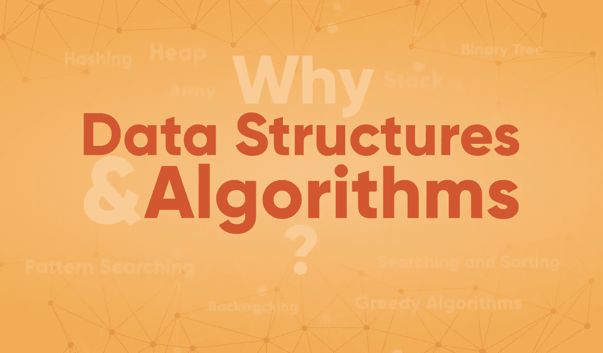

# 数据结构和算法导论

> 原文：<https://medium.com/codex/an-introduction-to-data-structures-and-algorithms-4647d9da454d?source=collection_archive---------12----------------------->

## [法典](http://medium.com/codex)

> **什么是数据结构和算法，为什么是数据结构和算法？**

在这篇文章中，我们将讨论一个最基本的概念，无论你来自哪个领域，每个人都应该知道这个概念。

数据结构和算法是你一定听过的最时髦的词，所以，让我们从它的定义开始讨论吧