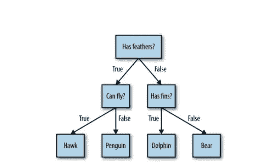
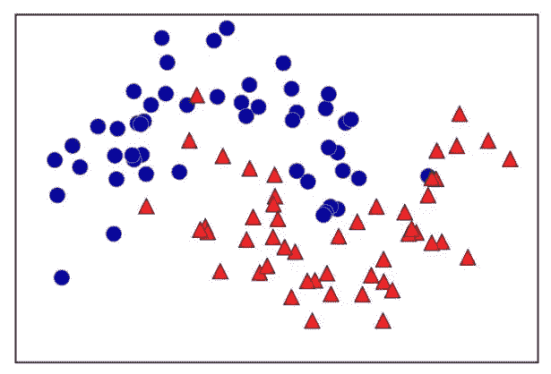
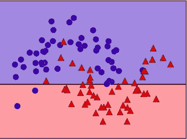
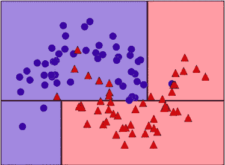

# 决策树介绍

> 原文：<https://medium.com/codex/an-introduction-to-decision-trees-part-1-e6fda59b50ff?source=collection_archive---------21----------------------->

决策树通常用于机器学习中的分类和回归问题。简而言之，他们学会了 if/else 问题的层次结构，这最终允许他们做出决定。这些问题更像是我们在 20 个问题的游戏中问的问题。让我们想象一下，我们想要区分四种动物，比如——熊、鹰、企鹅和海豚。你的目标是通过尽可能少地问“如果/否则”问题来找到答案。我们可以从问动物是否有羽毛开始，这个问题将可能性缩小到只有两种。如果答案是“是”。我们也可以问动物是否会飞来区分鹰和企鹅。如果动物没有羽毛，可能的正确答案是——海豚和熊，需要提出进一步的问题以从两个选项中找到正确的动物，例如——有鳍，等等。

我们可以将这一系列问题表示为决策树，如下所示—

图一。区分不同动物的决策树

在此图中，树中的每个节点代表一个问题或一个终端节点，也称为包含答案的叶子。节点或叶子的边连接到一个问题的答案和下一个要问的问题。

在机器学习领域，我们建立了一个模型，使用三个特征“有羽毛”、“会飞”和“有鳍”来区分上述四类动物。这些模型可以通过监督学习来学习，而不是手工完成。

# 我们如何构建决策树？

现在，我们将了解为图 2 所示的 2D 分类数据集构建决策树的过程。数据集包含两个半月形，其中每个类由 75 个数据点组成。这个数据集被称为两个月亮。正如我们前面提到的，学习决策树意味着学习一系列 if/else 问题，这些问题能让我们最快地找到正确答案。在机器学习格式中，这些问题被称为测试(不要将其与测试集混淆，测试集是我们用来测试我们的模型有多一般化的数据)。这些数据并不像上面的动物例子那样以二元是/否特征的形式出现，而是经常表现为连续的特征，如图 2 所示的 2D 数据集。

图二。双月数据集

当我们建立一个决策树时，算法会遍历所有可能的测试，并找到一个最能提供目标变量信息的测试。图 2 显示了选择的第一个测试。当我们在 x[1]=0.0596 处垂直划分数据集时，这产生了最有价值的数据，并且最好地将类 1 中的点与类 2 中的点分开。称为根的顶部节点代表整个数据集，其中 75 个点属于类 0，75 个点属于类 1。

通过测试 x[1] <= 0.0596, indicated by a black line. If the test is true, a point is assigned to the left node, which contains 2 points belonging to class 0 and 32 points belonging to class 1\. Otherwise
点是否被分配到正确的节点来划分数据集，其中包含 48 个属于 0 类的点和 18 个属于 1 类的点。这两个节点对应于图 3 所示的顶部和底部区域。即使第一次分割很好地分离了两个类，底部区域仍然包含属于类 0 的点，顶部区域仍然包含属于类 1 的点。我们可以通过在两个区域重复寻找最佳测试的过程来建立更准确的模型。图 4 示出了左和右区域的最具信息性的下一个分割是基于 x[0]的。

图 3-深度为 1 的树的决策边界

图 4-深度为 2 的树的决策边界

这个过程被称为递归，它给出了一个决策二叉树，其中每个节点由一个测试组成。另一方面，每个测试可以被认为是沿着一个轴划分数据的一部分。这将创建算法的分层分区。由于每个测试只关注一个单一的特征，结果分区中的区域将总是具有轴平行的边界。我们重复数据的递归分区，直到分区中的每个区域只有一个目标值。由共享相同目标值的数据点组成的决策树的叶子被称为 pure。当我们对一个新的数据点进行预测时，通过检查该点位于特征空间分区的哪个区域，然后预测该区域中的多数目标。可以通过从根开始遍历树并向左或向右找到该区域，这取决于测试是否完成。我们也可以使用完全相同的方法将决策树用于回归。为了进行预测，我们基于每个节点中的测试遍历树，并找到新数据点所在的叶子。这个数据点的输出是决策树的这个叶子中的训练点的平均目标。