# 使用 NLTK 的自然语言处理简介

> 原文：<https://medium.com/codex/an-introduction-to-nlp-natural-language-processing-with-nltk-ede02367830c?source=collection_archive---------7----------------------->

NLP 现在被广泛使用，从聊天机器人到客户评论分析。随着 GPT-3 和伯特的出现，它的应用日益广泛。

# 但是什么是 **NLP 呢？**

Siri——苹果语音助手

NLP 或自然语言处理是计算机理解人类语言的能力，如果用简单的术语来说。它是 AI(人工智能)的子集。

下面可以提到 NLP 的一些广泛使用的应用

1.  语音识别，它的任务是可靠地将语音数据转换成文本数据。“嘿 Siri，今天天气怎么样？”
2.  词性标注，是根据特定单词或文本片段的用法和上下文来确定其词性的过程。
3.  命名实体识别，它将单词或短语识别为有用的实体。
4.  情感分析，它试图从文本中提取主观品质——态度、情感、讽刺、困惑、怀疑。

聊天机器人的一个例子——自然语言处理的普遍应用

它有两个组成部分

1.  自然语言理解——它将输入映射为有用的表示，并分析语言的不同方面。例如句子规划和文本规划。
2.  自然语言生成——它处理自然语言实际句子的生成。

在自然语言理解中，有三种类型的歧义

1.  词汇歧义——一个渔夫什么时候到了**银行**，这里的银行是指水银行、钱银行吗？
2.  句法歧义——鸡是可以吃的，鸡是可以吃的，还是可以给我们吃的？
3.  指代模糊——送披萨的男孩很快就给我的同学送去了披萨。**他**连态度都很好，这里的**他**指的是谁？

为了将 NLP 整合到 python 中，我们使用了自然语言工具包(NLTK)，NLTK 是构建 Python 程序以处理人类语言数据的领先平台。

它提供了词汇资源，如 WordNet，以及一套用于分类、标记化、词干化、标记、解析和语义推理的文本处理库。

> 关于 NLTK 的文档，可以访问官方网站[https://www.nltk.org/](https://www.nltk.org/)

它有各种组件，我们将一个接一个地讲解，

# **标记化**

它是把复杂的句子分解成单词，根据句子的上下文来理解每个单词的重要性。它提供了句子的结构描述。

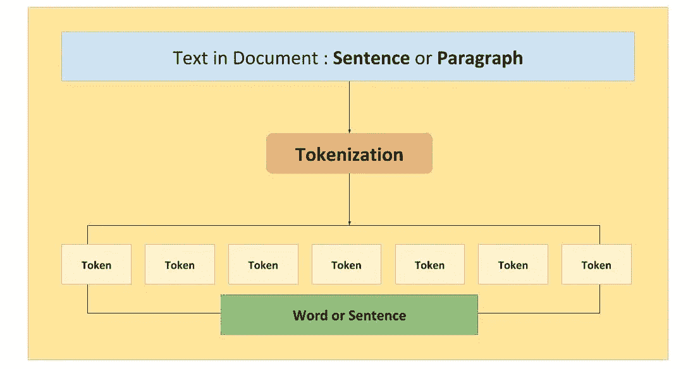

标记化概述

下面给出了包含 NLTK 单词标记器的 Python 代码

NLTK 中的单词标记器

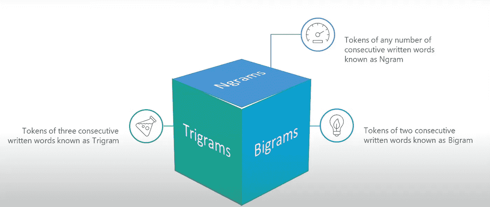

令牌的类型

NLTK Python 实现中的标记类型

# **词干**

将单词规范化为它们的基本形式或词根形式。

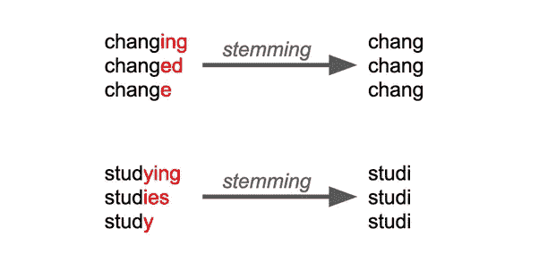

词干概述

下面显示了三种类型的词干

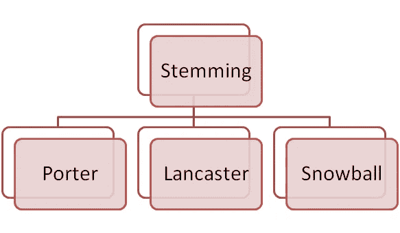

三种词干

各种词干的 NLTK 实现如下

用于词干分析的 Python 代码

词干分析有一个局限性，有时它不能给我们提供词根，例如 fish 和 fishing stem to fish，这不能为分析提供有见地的结果。

在这些情况下，当词干工作通过截尾和乞求单词来完成时，变元化就进入了画面。变元化考虑了对单词的形态学理解。

# 词汇化

将一个词的不同屈折形式组合在一起，称为词元。它的输出是一个合适的词。

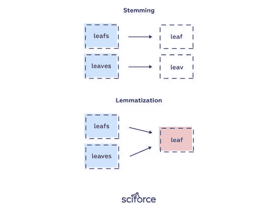

词干化和词汇化的比较

引理化的 Python 实现

NLTK Python 中的引理化

# **停止字**

用于为句子提供意义但没有意义或洞察力的单词。

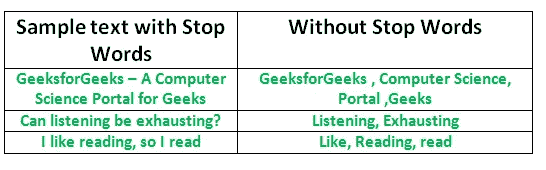

有无停用词的句子示例

停止字的 NLTK 实现

停止字的 NLTK 实现

# **词性**

词类是语言语法的重要组成部分，它为句子提供意义，并帮助区分不同句子中相同的单词但不同的意义。

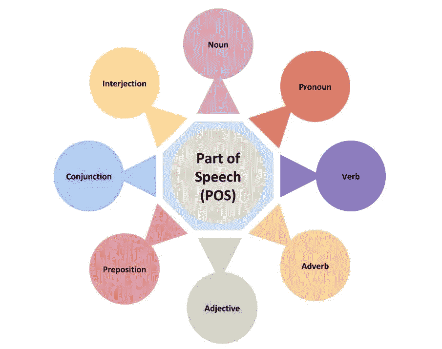

语言中的词性

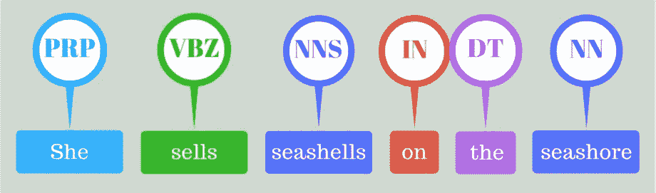

句子的词性示例

在上面的例子中，她被标记为 PRP，这是人称代词，塞尔为 VBZ，这是动词，非第三人称单数现在时，其余的在年表中相同，可参考下表。

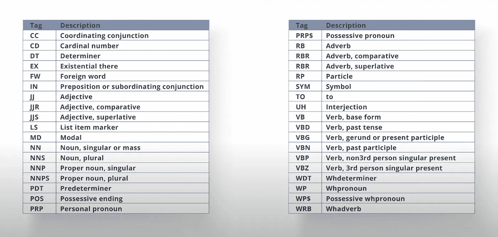

位置—标签及其描述

Python 中的 NLTK 实现

NLTK 中的 POS 实现

# 命名实体识别(NER)

从句子中识别命名实体如电影、地点、组织被称为 NER。

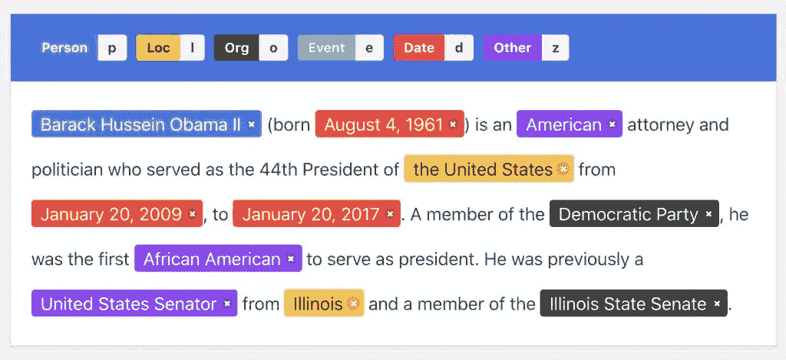

NER 的例子

在上面提供的例子中，p 用于标记命名实体 Person(在这种情况下是贝拉克·侯赛因·奥巴马)和 rest(按时间顺序排列)。

NLTK NER 实现

NLTK 中命名实体识别的实现

# 语法树

它是句子或字符串的句法结构的树形表示。

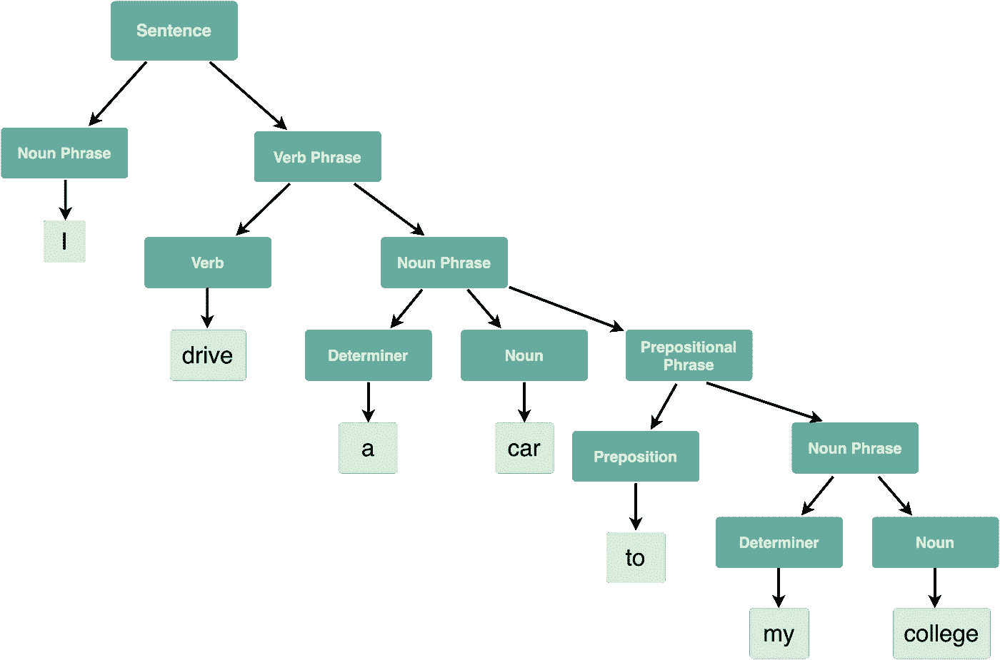

语法树示例

Python 中的 NLTK 实现

NLTK 中的语法树

上面的代码输出产生了两个输出，这两个输出都显示在下面的括号中。

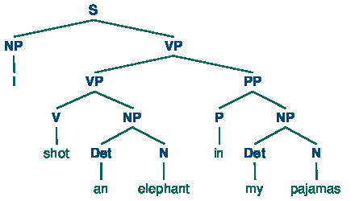

上面的代码输出可视化了(1)

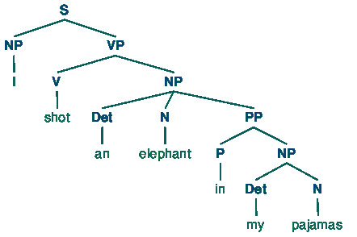

上面的代码输出可视化了(2)

# 组块

它是提取**单个**信息片段，然后**将它们组合**成更大的片段。

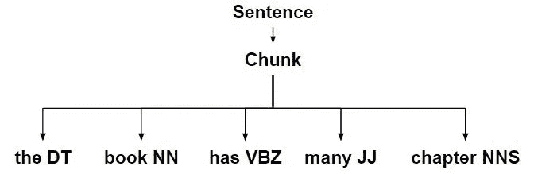

组块的例子

Python 中的 NLTK 实现

下面是一次访问代码的整个 Jupyter 笔记本

 [## 谷歌联合实验室

### 编辑描述

colab.research.google.com](https://colab.research.google.com/drive/1iRa_6kGyBek-6On1gPhpTiQGAXah-a4d?usp=sharing) 

> 参考
> 
> [https://www.youtube.com/watch?v=X2vAabgKiuM](https://www.youtube.com/watch?v=X2vAabgKiuM)
> 
> [https://www.nltk.org/book/ch08.html](https://www.nltk.org/book/ch08.html)
> 
> [https://www.nltk.org/howto/chunk.html](https://www.nltk.org/howto/chunk.html)
> 
> https://www.geeksforgeeks.org/

我的 **LinkedIn** 个人资料如果你想联系:

[https://www.linkedin.com/in/tripathiadityaprakash/](https://www.linkedin.com/in/tripathiadityaprakash/)