# 迁移学习介绍以及如何在 python 中使用它

> 原文：<https://medium.com/codex/an-introduction-to-transfer-learning-and-how-to-use-it-in-python-e38fbc339868?source=collection_archive---------6----------------------->

艾莉娜·格鲁布尼亚克在 [Unsplash](https://unsplash.com?utm_source=medium&utm_medium=referral) 上的照片

收集数据是数据科学中耗时的步骤之一。当您使用神经网络时尤其如此，因为您需要收集数百万个观察值来从头构建一个好的神经网络。不幸的是，这并不总是可能的，并且需要大量的时间和资源。那么我们能做什么呢？我们可以应用需要相对较小数据集的迁移学习，而不是从头开始。在这篇文章中，我们将讨论什么是迁移学习，为什么它有效，以及如何在 python 中使用 Keras 包。

# 什么是迁移学习？

概括地说，神经网络中有输入层、隐藏层和输出层，在隐藏层内部，有包含唯一权重的神经元。

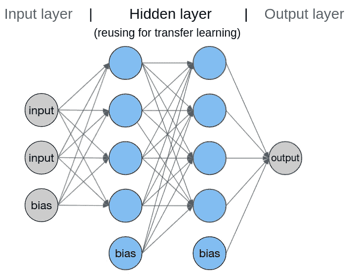

神经网络的一般结构

迁移学习是重用另一个神经网络的隐藏层的结构和权重，该神经网络是为了解决与您的问题类似的问题而构建的。例如，如果一个网络 A 是为分类不同的物体而建立的，我们可以重用它的一些层来分类不同类型的衣服。这种方法在机器学习中很有用，因为它大大减少了我们训练神经网络所需的时间和资源。但是为什么会起作用呢？

# 迁移学习为什么有效？

当你学习数学时，你从理解基本的计算开始，如+、×、。在你了解它们是如何工作的之后，你可以用它们来解决稍微复杂一点的问题。在神经网络中，它的过程与你学习数学的方式不同，但一般概念是一样的。

> 1.从输入数据中学习基本特征
> 2。用这些知识去解决一个复杂的问题

神经网络将什么视为基本和复杂特征取决于它被设计来解决哪个任务。例如，如果神经网络处理图像，识别边缘和形状被认为是一项基本任务，通常在它的较低层完成。然后，使用它从较低层学习的内容，它在较高层对图像进行分类，这被认为是一项复杂的任务。

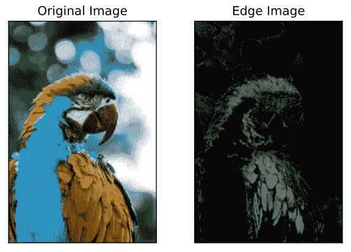

边缘检测是什么样子/原图作者:[安德鲁·庞斯](https://unsplash.com/photos/lylCw4zcA7I)

回到数学类比，你不仅仅在一个特定的问题中使用简单的计算。因为它是一个基本的，你可以在许多不同的情况下应用它，比如计算你在餐馆需要支付多少钱，或者你需要为某个项目做多少预算。同样的概念也适用于神经网络。

下层所学的非常普遍，可以应用于类似的问题。因此，就像上面的类比一样，我们可以对其他类似的问题重用更低的层。

# 利用迁移学习在 python 中进行服装分类

在知道了 [BeMyEyes](https://www.bemyeyes.com/) 应用程序可以做什么之后，我想做一些可以让视障人士的生活更轻松的东西。由于我们每天都要穿衣服，但视障人士无法轻松区分衣服并找到它们的风格，我认为一个卷积神经网络(CNN)可以告诉我们哪些衣服搭配得很好，这可能会有很大的帮助。建立这种 CNN 的第一步是对不同的衣服进行分类。然而，由于很难收集数百万的数据，我决定使用迁移学习。但是在我们进入应用程序之前…

## 在 CNN 中使用迁移学习时要记住的事情

**输入大小**
你可能会想，既然 CNN 是根据特定的输入形状训练的，那么当你使用与原来不同的输入形状时，迁移学习可能就不起作用了。好吧，最好调整你的训练数据的大小，以匹配你将要使用的 CNN 的输入形状，但这并不总是必要的。

比方说，您有 450×450 的图像，但您要使用的 CNN 的输入大小为 299×299。根据图像的不同，将 450×450 的图像调整为 299×299 可能会模糊一些细节。或者当您有 100×100 的图像时，放大这些图像可能会损害图像的质量。因此，在这种情况下，建议设置不同于原始 CNN 的输入大小。

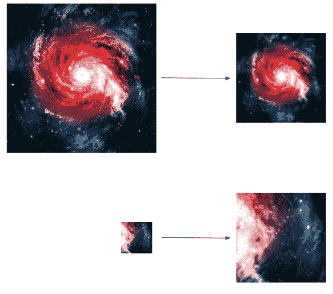

演示了调整大小如何扭曲图像

但是，极端的变化会导致弹出警告消息。因此，如果是这种情况，你可能需要从你所拥有的东西中找到其他具有相似输入形状的 CNN。

**解冻多少**
如上所述，迁移学习的总体思路是重用隐含层，用相对较小的训练集训练上层和输出层。但是我需要训练几个上层呢？这取决于你的训练集大小。

假设你有一个小的训练集。由于网络无法从小数据集学到很多东西，因此使用大部分隐藏层并只重新训练输出层将是一个好主意。根据不同的情况，你甚至可能要删除一些隐藏层，使网络更简单。

相比之下，如果你有一个大的训练集，这意味着你可以给神经网络更多的信息。因此，与小训练集相比，您可以解冻更多的层。或者你甚至可以根据情况添加更多的隐藏层。

## 我要用 CNN

在众多 CNN 模型中，我决定使用 Xception 架构，这是 Inception 架构的扩展版本，具有 299×299 的输入形状。你可以从 Keras 包中下载一个经过数百万 ImageNet 图像训练的，它能够对 1，000 个对象进行分类。更详细的解释可以在[这里](https://arxiv.org/abs/1610.02357)找到。

## 收集数据

为了应用迁移学习，我首先需要收集衣服图像。感谢 Grigorev 和他的[项目](https://www.kaggle.com/agrigorev/clothing-dataset-full)的合作者，我可以轻松下载 10 个不同类的训练、验证和测试集。不幸的是，Google Colab 的 RAM 无法处理所有 10 个类别，所以我不得不删除 5 个类别，并将每个类别的大小减少到大约 200 张图像。

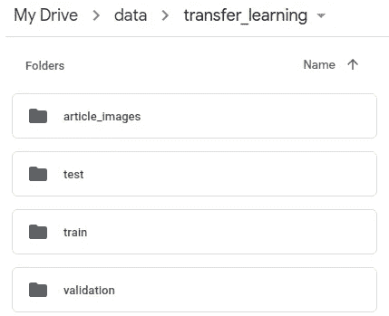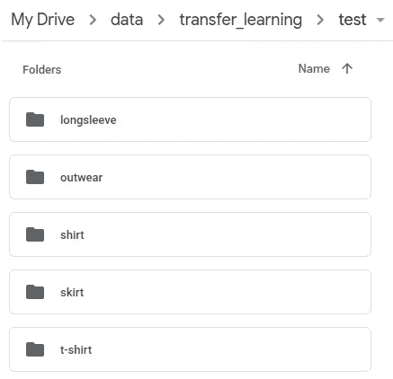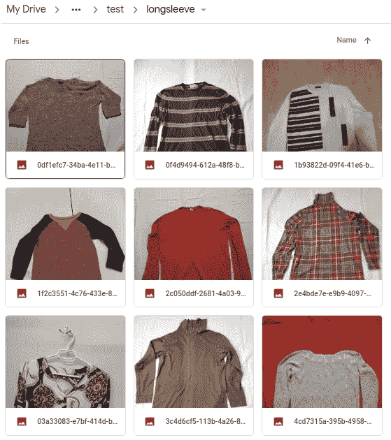

服装数据集是如何存储的

## 预处理数据

然后，由于 CNN 不能处理原始的 jpg 文件，我不得不将它们转换成数组。但在此之前，我必须决定是否要改变输入形状。由于数据集中的每个图像都有不同的尺寸，因此将所有图像调整为 299×299 比均匀地裁剪图像更容易。

我需要预处理的另一件事是规范化值。因为图像文件中的颜色由范围从 0 到 255 的数字表示，保持原样会导致训练时的计算负荷。因此，最好将每个像素除以 255，以将值归一化到 0 到 1 的范围内，并减少计算量。

最后，因为我缺少训练数据集，我应用图像增强来创建更多的训练实例。在我的例子中，它只是水平翻转图像，因为内存问题，我无法添加其他增强。

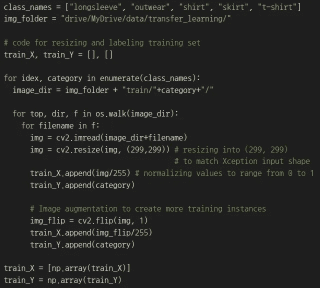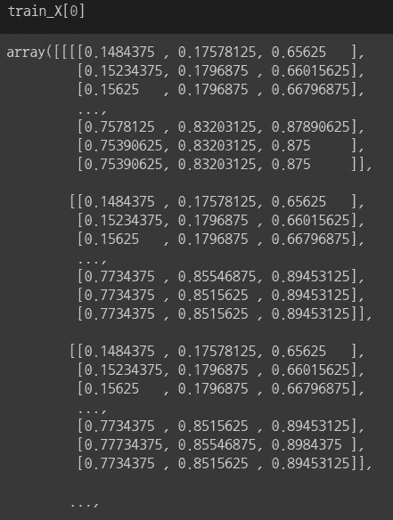

预处理图像的代码以及预处理后训练集的样子

在预处理输入数据之后，我处理输出数据。原始输出数据如下图所示。

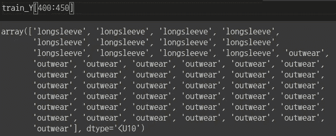

原始输出数据的样子

在对输出数据进行预处理时，我应该考虑一个模型的损失函数。由于检查多类分类是否在迭代过程中有所改进的最佳方式是通过比较预测标签和真实标签的概率分布，因此通常使用分类交叉熵作为损失函数。因此，我需要对训练和验证数据集应用一次性编码。幸运的是，np_utilis 提供了一个名为 to _ categorical()的函数来轻松应用一键编码。

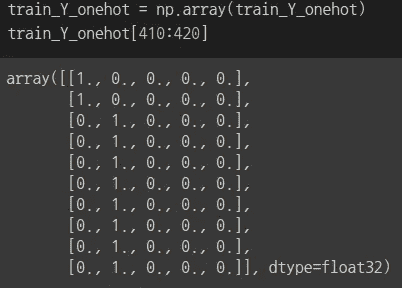

一键编码后输出数据的样子

## 基于 Xception 架构构建模型

下一步是构建一个模型，这可以通过下面的代码轻松完成。

从下面的代码来看，weights="imagenet "意味着它正在下载在 imagenet 数据上训练的 Xception 的权重，input_shape=(299，299，3)意味着该模型采用 299 × 299 的输入大小和 3 个颜色通道。include_top=False 意味着模型不会下载 Xception 的输出层，之所以包含它是因为我要重新构造输出层。然后，由于迁移学习是关于重用隐藏层的，所以 base _ model.trainable 被设置为 False。

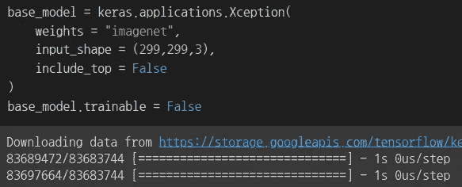

用于从 Xception 架构下载权重的代码

下载完隐藏层后，我开始处理神经网络的输出层。

如下所示，在隐藏层和输出层之间有一个全局平均池层，用于计算每个输入通道的单个平均值，而不是一个完全连接的层。所以你可能想知道为什么我可以完全连接这些层的时候只传递了 3 个值。这是因为我们可以避免过度拟合，并且通过这样做，模型可以对空间差异更加鲁棒。

在全局平均池层之后，我添加了具有 5 个节点和 softmax 激活函数的密集层，因为该问题是 5 类分类问题。

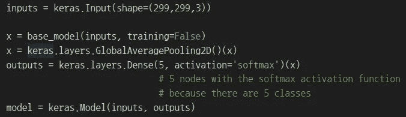

用于构建模型输出层的代码

最后，我需要做的就是编译和拟合模型。对于超参数，由于内存问题，我无法运行 gridsearchCV 来找到最佳参数。因此，我选择了 Adam optimizer，这样它可以自动更新学习率，并将批量大小设置为一个公共值 32。

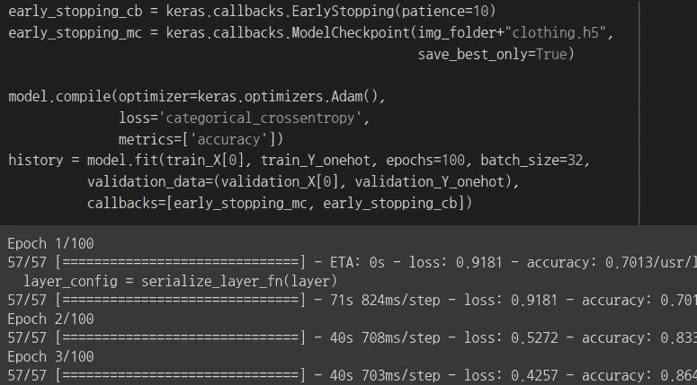

用于编译和拟合模型的代码

27 个周期后，训练停止，下图显示了训练过程中损失和准确度的变化。

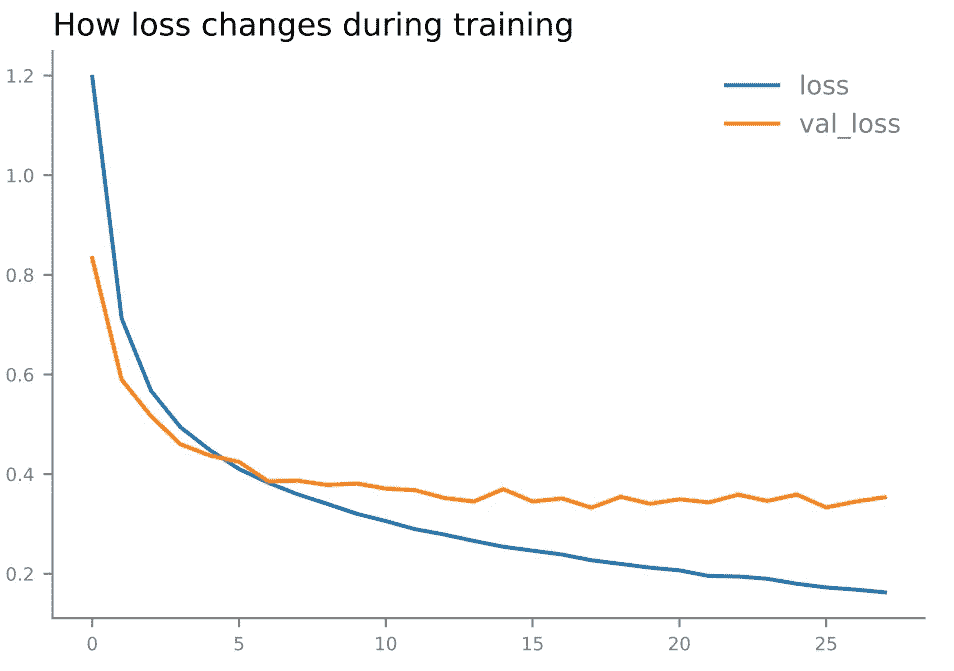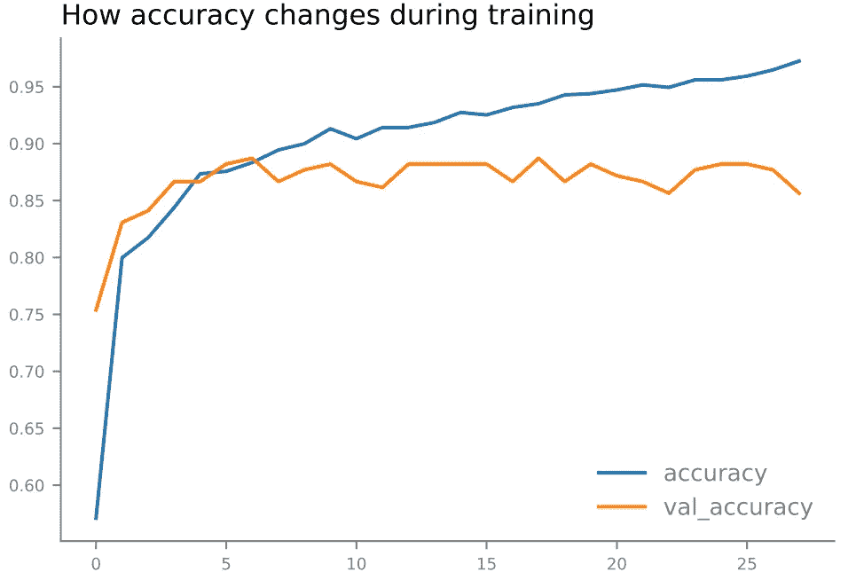

培训和验证集的培训历史记录

从图中可以看出，val_loss 和 val_accuracy 在某个点之后趋于保持不变，而训练损失和准确度随着历元数的增加而不断提高。这是因为模型开始过度适应训练集。因此，当我们使用测试集进行预测时，我们可以看到准确率没有达到训练集所达到的 98%左右。

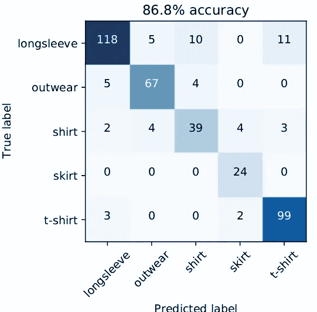

预测结果与测试集的混淆矩阵

## 提高学习率低的结果

但是有方法可以改善这个结果，其中一个方法就是在学习率较低的情况下对整个网络进行微调。目前，有 20，861，480 个不可训练的参数，因为我们将 base _ model.trainable 设置为 False。也就是说，隐藏层中的大多数参数不是专门针对衣服分类的。

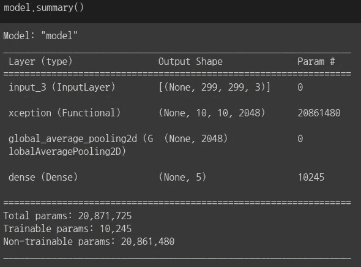

base_model.training 设置为 False 时的模型摘要

因此，如果我们根据我的数据集稍微调整一下这些隐藏层，精确度可能会提高。这样做的第一步是通过设置 model.trainable = True 将大多数不可训练的参数变成可训练的参数。下一步是用低得多的学习率重新训练模型，因为我只想要隐藏层中的小变化。

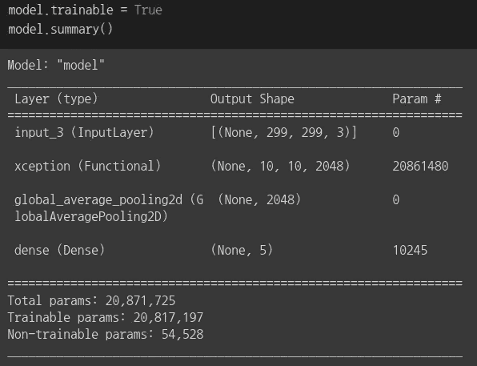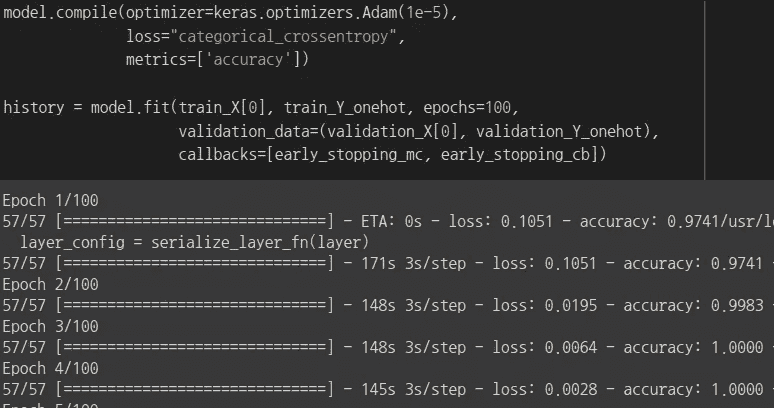

用于解冻隐藏层和重新训练模型的代码

由于学习率很小，训练模型需要一段时间，但训练完成后，我们可以通过从每个实例中提取最高概率来检查模型是如何预测的。通过构建混淆矩阵，我们可以确认准确率从 86.8%提高到 88.5%。没有大幅度增加，但也算了。

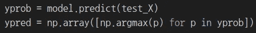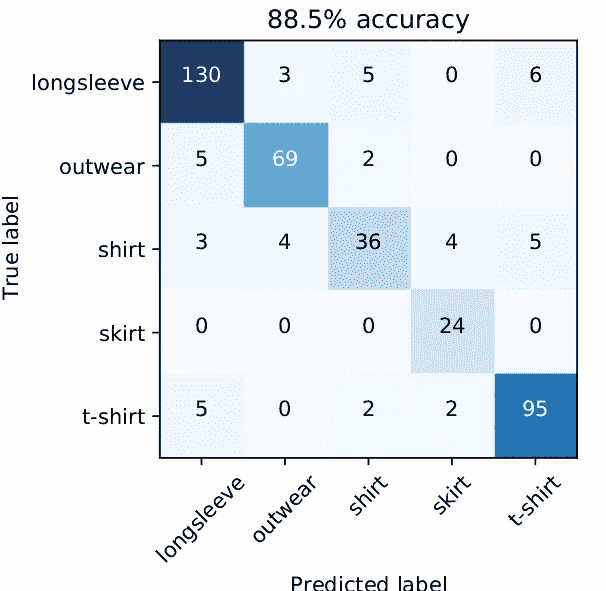

用于提取最高概率的代码(上图)/微调模型的混淆矩阵(下图)

# 反射

然而，你可能认为这还不够。这种准确性可能有许多原因，我认为最大的原因之一是训练集的大小。由于内存问题，我不得不删除大约 2/3 的训练集。所以下次我在 CNN 工作时，我应该在一个有更大内存和存储空间的环境中工作。

# 参考

[1]詹森·布朗利。"深度学习的亚当优化算法的温和介绍."*机器学习掌握*，2021 年 1 月 12 日，[https://machinelingmastery . com/Adam-optimization-algorithm-for-deep-Learning/。](https://machinelearningmastery.com/adam-optimization-algorithm-for-deep-learning/.)

[2]弗朗索瓦·乔莱。"例外:具有深度可分卷积的深度学习."ArXiv.org2017 年 4 月 4 日[https://arxiv.org/abs/1610.02357.](https://arxiv.org/abs/1610.02357.)

[3]杰龙，奥雷连诺。*用 Scikit-Learn、Kears & TensorFlow* 进行动手机器学习。奥莱利，2017。

[4]克拉斯。" Keras 文档:迁移学习和微调."*喀拉斯*，[https://keras.io/guides/transfer_learning/.](https://keras.io/guides/transfer_learning/.)

[5]林，闵。"论文与代码-全球平均池解释."*解释|论文代码*，[https://paperswithcode.com/method/global-average-pooling.](https://paperswithcode.com/method/global-average-pooling.)

[6]阿德里安·罗斯布鲁克。"用 Keras 改变输入形状尺寸进行微调." *PyImageSearch* ，2021 年 4 月 17 日，[https://www . PyImageSearch . com/2019/06/24/change-input-shape-dimensions-for-fine-tuning-with-keras/。](https://www.pyimagesearch.com/2019/06/24/change-input-shape-dimensions-for-fine-tuning-with-keras/.)

[7]阿德里安·罗斯布鲁克。" ImageNet: Vggnet、ResNet、Inception 和 Xception with Keras . " *PyImageSearch* ，2021 年 6 月 17 日，[https://www . PyImageSearch . com/2017/03/20/imagenet-vggnet-resnet-inception-xception-keras/。](https://www.pyimagesearch.com/2017/03/20/imagenet-vggnet-resnet-inception-xception-keras/.)

[8]维萨尔，赫瓦贾。"对新图像尺寸的迁移学习."*数据科学栈交流【2019 年 8 月 18 日[https://Data Science . Stack Exchange . com/questions/57639/transfer-learning-on-new-image-size。](https://datascience.stackexchange.com/questions/57639/transfer-learning-on-new-image-size.)*