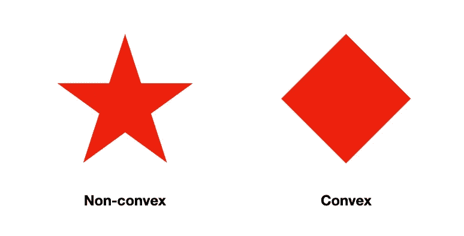
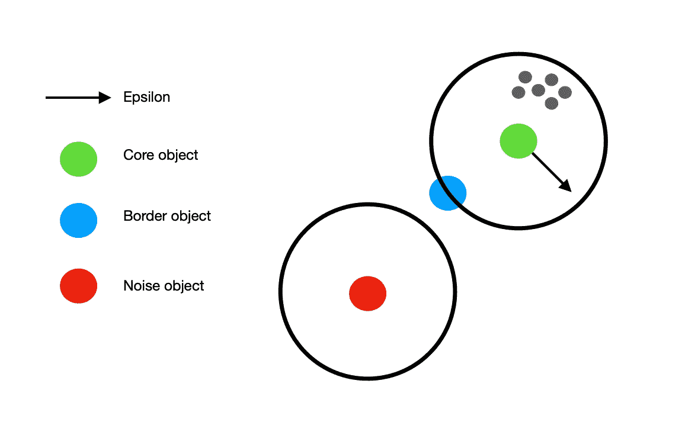

# 无监督学习:三种主要的聚类方法

> 原文：<https://medium.com/codex/an-introduction-to-unsupervised-learning-three-main-clustering-methods-7afbcbe6b834?source=collection_archive---------6----------------------->

Mikael Blomkvist 摄影:[https://www . pexels . com/photo/a-person-holding-a-digital-table t-6476585/](https://www.pexels.com/photo/a-person-holding-a-digital-tablet-6476585/)

无监督学习是机器学习的一个领域，它对标签未知的数据使用算法。这使得它适用于特定的任务，如异常值分析和数据简化。无监督学习的主要范例之一是聚类。本文讨论了三种主要聚类方法的来龙去脉，即:

*   基于划分的方法
*   基于分层的方法
*   密度方法

# 聚类基础

但是首先，在讨论具体的方法之前，重要的是要对集群的实际情况有一个总体的了解。聚类识别给定数据集中类别、类或组的有限集合。它根据相似性对数据点进行分组。因此，目标是同一聚类内的数据点应该尽可能相似，而不同聚类的数据点应该尽可能不相似。

## 集群类型

在比较不同的分类方法时，了解数据集中可能存在的分类类型是很重要的。根据不同的数据，聚类可能看起来非常不同。一些数据包含非常显著的聚类，而其他数据包含重叠和模糊的聚类。通常有两种类型的簇形状要区分:

*   **凸簇**:簇的形状带有向外延伸或向外凸出的曲率，例如圆形或矩形
*   **非凸星团**:一个曲率向内延伸或弯曲的星团形状，比如一颗星星

非凸与凸簇形状

# 聚类方法

在无监督学习中有三种主要的聚类方法，即划分、层次和基于密度的方法。每种方法都有自己的分类策略。根据数据，一种方法可能优于另一种方法。然而，在为数据集寻找正确策略的过程中，实验是关键。

## 基于划分的方法

基于分区的方法将数据集划分为预定义数量的分区(簇)。数据点属于它最接近的聚类。有很多算法和算法的变种使用这种方法。例如 K-Means、K-Medoids、CLARA(对大型应用程序进行聚类)和 CLARANS(基于随机搜索对大型应用程序进行聚类)。

最著名的基于划分的方法之一是 K-Means 算法。这个算法有很多变化，但是直观的想法是一样的。

1.  选择聚类的数量(k)
2.  在数据集中任意放置 k 个聚类代表点
3.  在每次迭代中，该算法将聚类代表移动到其周围最近的数据点的平均值
4.  当集群代表在几次迭代后停止移动时，这意味着找到了最佳的集群划分。

基于划分的方法中最大的挑战是算法搜索的聚类数需要预先指定。集群的数量需要作为一个参数提供，这可能相当困难。做到这一点的一种方法是使用人类的判断来估计集群的数量。还可以通过试验不同数量的聚类并使用定量评估方法(例如轮廓分数)来更精确地做到这一点。

基于划分的方法可以用于各种各样的应用。一个例子是在商业应用中对客户群进行细分。也可以进行文档聚类。请记住，对于文档聚类，需要非常具体的预处理步骤来将一组文档转换为算法可以理解的表示。

最后，使用基于划分的方法几乎不可能在数据集中找到非凸聚类。每当您的数据集需要查找这样的聚类时，您应该寻找其他方法。

## 基于分层的方法

说到聚类，基于层次的方法通常是自底向上的方法。它试图通过合并彼此最接近的集群来创建集群的层次结构。这可以是自上而下的方法，也可以是自下而上的方法。算法的例子有凝聚算法(自下而上)和除法算法(自上而下)。

让我们放大一下凝聚聚类。这是一种自底向上的方法，但是自顶向下(分裂)方法的一般思想是相同的。凝聚聚类算法执行以下步骤:

1.  计算每个聚类之间的距离(开始时每个数据点代表一个聚类)
2.  合并彼此最接近的聚类
3.  重复直到剩下一个大簇

这种方法最大的优点是你不必像基于分区的方法那样预先指定 k。这减少了对人工输入的需求，这在您不知道要寻找的集群数量时尤其有用。此外，基于分层的方法能够找到一些任意形状的聚类(非凸的)。

有几种方法可以计算聚类之间的距离(如单个链接、完全链接和 ward)，但我不会深入讨论这一点。但是，重要的是要理解，每次迭代都需要计算所有聚类之间的距离。这极大地增加了计算的复杂性，使得它在大数据集上非常慢。

最大的缺点是它不能检测噪音。当算法处于最后一次迭代时，距离最远的异常值被视为单独的聚类。这是因为它只考虑了距离。

## 密度方法

可能最有希望的是基于密度的方法。基于密度的方法的基本思想是簇是由低密度区域分隔的密集区域。当我们放大一个具体的算法时，这个想法会变得更加清晰。有许多基于密度的聚类算法。例如 DBSCAN(基于密度的带噪声的空间聚类)和 OPTICS(对点进行排序以识别聚类结构)。

让我们放大数据库扫描。DBSCAN 有两个输入参数，ε和最小点。ε是算法在数据点周围搜索的空间。最小点是目标在 epsilon 中需要成为聚类的一部分的数据点的数量。DBSCAN 算法迭代执行以下步骤:

1.  选择一个随机数据点(目标)
2.  搜索目标的ε中有多少个数据点
3.  epsilon 中有超过最小数量的点吗？然后，该算法开始形成聚类，并在当前目标的ε中选择下一个目标。
4.  目标的ε中的点不够多吗？那么该目标被认为是噪声，并且该算法随机选择下一个目标。

该算法中的关键概念是核心对象、边界对象和噪声之间的区别。下图很好地展示了这种差异。

基于密度的聚类中的不同对象类型

与其他方法相比，使用基于密度的方法的主要优点是它可以检测噪声。此外，因为它寻找密集区域，所以可以找到非凸簇。然而，它在密度差异较大的数据集上表现不佳。

# 结论

读完这篇文章后，您的脑袋可能会爆炸，但是我们已经在涵盖集群的基础知识方面取得了长足的进步。本文旨在对三种主要的聚类方法进行简要说明。这不是一个详尽的列表，随着技术的进步和新研究的增加，该领域将会有很大的发展。然而，为了理解未来的新方法，最重要的是掌握基本知识。