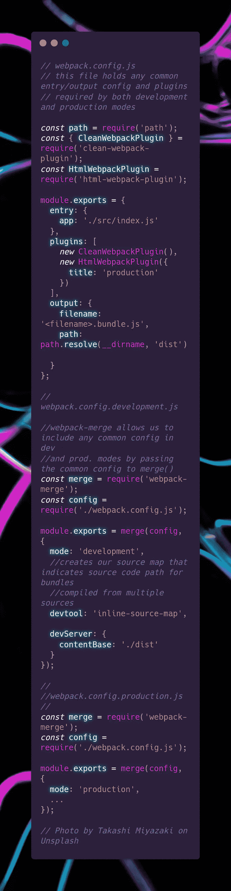

# Webpack 简介

> 原文：<https://medium.com/codex/an-introduction-to-webpack-5b96caad3f27?source=collection_archive---------16----------------------->

[亚历山大·奈特](https://unsplash.com/@agk42?utm_source=medium&utm_medium=referral)在 [Unsplash](https://unsplash.com?utm_source=medium&utm_medium=referral) 上拍照

## 第 2 部分:为开发和生产模式配置 Webpack

你好！欢迎来到这一系列文章的第二部分(如果你没有读过第一部分，请在这里阅读)。上次我分解了 Webpack 模块以及如何为我们的前端代码定义一个入口点，为我们的捆绑文件提供一个路径，如何将我们的非 JavaScript 文件编译成可读的 JavaScript，任何任务的插件属性都不能由。这篇文章将更多地关注为生产模式配置 Webpack 和部署生产包。对于这篇文章，我假设你理解 Webpack 配置的基础知识，包括 Webpack 加载器和插件，以及使用 NPM 导入第三方模块。说到这里，让我们开始吧！

# 开发与生产

Webpack 通过使用本地主机服务器提供源代码映射和实时重载/热模块替换，在开发模式中利用我们的代码。它用于定义在优化我们的代码时，何时在本地代码和第三方代码(加载器和插件)之间转换。插件和加载器处理 Webpack 用其本机代码还不能实现的任何事情。例如，任何需要使用全局变量的模块都可以通过 *imports-loader* 来处理，它会将全局变量注入到一个模块中。或者我们可以使用 *HtmlWebpackPlugin* 来生成 HTML 文件，为我们的捆绑代码提供服务。如果你想知道有哪些可用的插件，Webpack 文档提供了一个可用插件列表[。](https://webpack.js.org/plugins/)

通过创建一个生产版本，我们的目标是完成缩小我们的包、简化源地图和优化图像文件等资产的任务。Webpack 通过确保编译顺利进行以及我们的代码没有错误来利用这个过程。由于 Webpack 的配置在开发模式和生产模式之间仅在几个方面有所不同，因此将不同的配置分离到它们自己的文件中是一个好的做法。这样我们就避免了代码的重复。以下示例演示了三个文件的实现， *webpack.config.js* 、*web pack . config . development . js*和*web pack . config . production . js*。正如它们的名字一样，后两个文件分别构建了与开发和生产模式相关的依赖图，而前一个文件将包含任何常见的配置需求。

开发模式和生产模式配置都单独使用一些加载器和插件，因此将 Webpack 模块分成三个独立的模块。第一个模块 *webpack.config.js* 将处理定义入口点和输出路径，以及在配置开发和生产模式时通用的任何加载器和插件。

第二个模块*web pack . config . development . js*将处理源映射的创建，该映射将定义由多个源文件组成的包文件中各种*块*的源位置。例如，如果 *bundle.a.js* 是将 *module.a.js* 、 *module.b.js* 和 *module.c.js* 编译成一个文件的输出，那么我们的源映射需要能够指示 *bundle.a.js* 中的哪些块来自 *module.a.js* 、*module . b . js*

第三个模块将处理我们的生产模式配置。正如前面提到的前两个模块，*web pack . config . production . js*将只定义它独占使用的加载器和插件，并合并第一个模块的公共配置。

今天就到这里吧！感谢您阅读我关于 Webpack 基础的系列文章的第二部分！下次见！

# 引用的消息来源

> "配置|网络包。"*网络包*，[https://webpack.js.org/configuration/.](https://webpack.js.org/configuration/.)2021 年 7 月 21 日接入。
> 
> 欧文斯汤姆。 *Webpack 5 启动并运行*。第一版。，派克特出版社，2020 年，第 80–94 页，第 118–24 页。