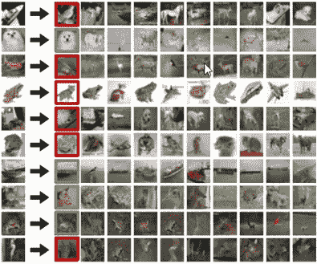

# 通过人类视觉、计算机视觉和 CNN 的直观的目标探测之旅

> 原文：<https://medium.com/codex/an-intuitive-journey-to-object-detection-through-human-vision-computer-vision-and-cnns-58d15ac6578c?source=collection_archive---------9----------------------->

# **为什么是计算机视觉(CV)？**

下一次，当你在拍你那张漂亮的自拍照时，或者当你坐在你崭新的特斯拉车里时，或者当你被跳着[舞的机器人惊呆时，你爱我吗？](https://www.youtube.com/watch?v=fn3KWM1kuAw)’，CV 是它的核心。这些应用进一步扩展到面部检测和识别，比训练有素的医生更好地从扫描和 X 射线中识别乳腺癌、皮肤癌和新冠肺炎。

# **人类视觉**

礼貌:[https://www.pexels.com/](https://www.pexels.com/)

快速浏览一下这张照片，你看到了什么？可能是一群来自大学的朋友，在一个新的国家，在火车站或汽车站，试图弄清楚他们下一个目的地的时间表。我们的大脑用不到一秒钟的时间为我们提供如此多的信息，这些信息在这里是不明确的。

这怎么可能呢？由于数百万年的进化，我们所有人都有幸拥有地球上最复杂的系统之一，即拥有 800 亿神经元的人脑。在我们大脑不断处理和整合的 5 种感觉中，超过一半的处理能力只用于一种感觉，即视觉。

# **人类如何看？**

[来源](http://www.blogs.paulesbarakaldo.com/lh4/files/2018/02/1.-Presentacion-3%C2%BA.pdf)

一切都与光有关。光从一个物体上反射，如果这个物体在你的视野中，它就会进入眼睛(1，2，3)

当光线照射到视网膜(眼睛后部的一层感光组织)时，称为感光细胞的特殊细胞将光线转化为电信号(4，5)。这些电信号从视网膜通过**视神经** **神经**传到大脑。然后大脑将这些信号转化成你看到的图像

# **分等级的人类视觉**

两位神经生理学家 David Hubel 和 Torsten Wiesel 在 1959 年发表了人类/动物视觉领域最有影响力的论文之一，该论文也启发了计算机视觉。他们发表的题为“ [*猫纹状皮层单个神经元的感受野*](https://www.ncbi.nlm.nih.gov/pmc/articles/PMC1363130/) *”的论文，重点研究了猫大脑中的视觉神经元如何对各种形状做出反应。*

来源:[https://goodpsychology.wordpress.com/2013/03/13/235/](https://goodpsychology.wordpress.com/2013/03/13/235/)

他们将电极放入麻醉猫大脑的初级视觉皮层区域，在给动物展示各种图像的同时，观察或至少试图观察该区域的神经元活动。研究人员通过他们的实验确定，**在初级视觉皮层中有简单和复杂的神经元**和**视觉处理总是从简单的结构开始，如定向边缘。**

1982 年，英国神经学家大卫·马尔(David Marr)发表了另一篇颇具影响力的论文——《[*视觉:对视觉信息*](https://mechanism.ucsd.edu/teaching/f18/David_Marr_Vision_A_Computational_Investigation_into_the_Human_Representation_and_Processing_of_Visual_Information.chapter1.pdf) *的人类表征和处理的计算研究》。* 基于 Hubel 和 Wiesel 的想法(他们发现视觉处理**总是从简单的结构开始，比如定向边。**)，大卫给了我们下一个重要的洞见:**他确立了视觉是分等级的**。他认为，视觉系统的主要功能是创建环境的 3D 表示，以便我们可以与之互动。

女装:[http://cs231n.stanford.edu/](http://cs231n.stanford.edu/)

*他引入了一个视觉框架，其中包含检测边缘、曲线、拐角等的低级算法。，用作对视觉数据的高级理解的垫脚石。*

David Marr 的代表性愿景框架包括:

*   图像的原始草图，包括边缘、线条、边界等。，都有代表(这显然是受了 Hubel 和 Wiesel 的研究启发)。
*   一种 2 D 草图表示，其中表面、关于深度的信息和图像上的不连续性被拼凑在一起。
*   根据表面和体积图元分层组织的 3D 模型。

将这一理论映射到实际的大脑中，你看到的初级视觉皮层在大脑后部的绿色区域中表示为 v1，它是进行图像处理的第一层，从边缘检测开始。随后的层聚集来自 V1 的信息，并执行逐渐复杂的任务，以实现视觉的最终目标。

来源:[https://fig share . com/articles/dataset/腹侧 _visual_stream/106794](https://figshare.com/articles/dataset/Ventral_visual_stream/106794)

# **计算机视觉**

让我们换个话题，转到今天的主题“计算机视觉”，我们的重点是计算机识别图像中物体的能力，这就是通常所说的“分类问题”，即给定的图像是猫还是狗？

[来源](https://worldcatcomedy.com/omg-so-cute-cats-%E2%99%A5-best-funny-cat-videos-2021-74/)

虽然这个问题看起来是一个基本的图像分类练习，但它是计算机视觉中复杂任务的最基本的构建块之一，如下所示。

http://cs231n.stanford.edu/

# **电脑怎么看？**

人类视物体为物体反射的光，而计算机视图像为数字。

下面是存储亚伯拉罕·林肯图像的灰度图像缓冲区的简单说明。每个像素的亮度由一个 8 位数字表示，其范围从 0(黑色)到 255(白色)

礼貌用语:[http://introtodeeplearning.com/](http://introtodeeplearning.com/)(麻省理工学院)

这应该给了你一个很好的想法，关于我们如何解决图像分类的问题。如果你有一个与猫图像(猫 A)等价的数字，那么对于一个呈现的新图像(图像 A)，如果我们将其数字表示与猫 A 进行比较，如果发现数字相似，那么图像 A 也应该有一只猫，对吗？

这正是早期 CV 算法的工作原理，该算法被命名为“[K-最近邻](https://yearsofnolight.medium.com/intro-to-image-classification-with-knn-987bc112f0c2)”算法。在名为 [CIFAR-10 数据集](https://www.cs.toronto.edu/~kriz/cifar.html)的标准化图像分类测试数据集上，这被发现有 38.6%的有效性。该数据集由 60，000 幅 32 像素高和 32 像素宽的微小图像组成。每幅图像被标记为 10 类中的一类(例如*“飞机、汽车、鸟等”*)。这 60，000 幅图像被分成 50，000 幅图像的训练集和 10，000 幅图像的测试集。

在下面左侧的图片中，您可以看到 10 个随机示例图片，分别来自 10 个类别:

女装:[http://cs231n.stanford.edu/](http://cs231n.stanford.edu/)

下图第一列显示了几幅测试图像，每幅图像旁边是根据像素差异确定的训练集中前 10 个最近的相邻图像。

女装:[http://cs231n.stanford.edu/](http://cs231n.stanford.edu/)

但是，这里确实有问题。第一个图像是一艘船，但是第一个与之匹配的图像是一只鸟。此外，第三个图像是一只青蛙，但首先与一只猫匹配！！！

是的，这就是这个算法的主要缺陷。在第一种情况下，算法可能会混淆，因为船的轮廓看起来像匹配图像中的鸟，而在第二种情况下，颜色和姿势是匹配的。这些进一步凸显了计算机视觉**中的一个关键挑战，即相似的物体受到各种设置的影响。**

http://cs231n.stanford.edu/

**为了解决这个**，我们必须找到一种方法**从图像中提取人脸的特征**，如鼻子、嘴唇、眼睛、耳朵等，然后通过组合这些特征，我们可以将物体识别为人类，而不管它在什么环境中，我们看到这与人脑/人类视觉的工作方式非常相似。这就是我们今天讨论的主题进入“卷积神经网络(CNN)”的原因。

# **卷积神经网络**

在一个非常高的层面上，CNN 关注两个关键领域

1)从图像中提取低级特征(线、边缘等)。
2)从这些低级特征建立高级特征(鼻子、嘴唇、眼睛、耳朵等)。

**1)**提取低层特征

来源:https://cs.nyu.edu/~fergus/tutorials/deep_learning_cvpr12/

一个**滤镜**(红色轮廓)滑过输入图像(**卷积运算**)产生一组特征(**特征图**)。另一个滤镜(绿色轮廓)，在同一张图片上滑动，给出不同的特征图，如图所示。值得注意的是，卷积运算捕获原始图像中的局部相关性/低级特征。还要注意这两个不同的过滤器是如何从相同的原始图像生成不同的特征图的。请记住，上面的图像和两个过滤器只是数字矩阵，我们已经讨论过了。

更多数学细节，请参考这篇伟大的文章[https://mlnotebook.github.io/post/CNN1/](https://mlnotebook.github.io/post/CNN1/)

这可能是一个介绍实际卷积神经网络(CNN)的好时机

**图 1.1 —** [来源](https://developers.google.com/machine-learning/practica/image-classification/images/cnn_architecture.svg)

CNN 是多个“卷积模块”堆叠在一起，最终的分类层决定了图像的实际内容，例如猫或狗。
**Conv。模块#1** 可以被认为是提取低级特征的模块。

**2)**从这些低级特征中建立高级特征(鼻子、嘴唇、眼睛、耳朵等)。
低级特征被组合在一起以构建中级特征，然后在后面的层中构建高级特征，类似于人的视觉层次。

女装:[http://cs231n.stanford.edu/](http://cs231n.stanford.edu/)

这里显而易见的问题是，CNN 如何知道要应用的模板(滤波器),因为这可能因不同类型的图像而异，以及 CNN 如何提出如此精确地表示输入图像的中/低级特征？这就是机器学习的学习部分发挥作用的地方。正如你可能已经猜到的那样，这不会在 CNN 一看到图像就自动发生。

CNN 经历了一个训练(监督学习)过程，在这个过程中，它会看到一堆不同的猫图像，然后一次一个地浏览它们。在过程开始之前，模板是空白的石板，当它通过 CNN，
**Conv 的不同层处理第一个图像时。第一单元→Conv。模块# 2→分类(如图 1.1)** 几乎没有低/中/高级特征识别发生，CNN 将其预测为猫图像的置信度将非常低。

然而，通过这些层反馈回来的是，
**分类→Conv。第二单元→Conv。模块#1(如图 1.1)** 关于“预测”与“实际”图像相比有多好。这种反馈会跨层调整，让 CNN 变得更聪明一点。对所有图像重复该过程，并且该批图像被处理多次，每次都增强了学习。

把这看作是教一个孩子苹果的样子。我们第一次给她看苹果的图像时，她可能会称之为球。但是当我们纠正她时，她可能会捕捉到图像中的一个特征，假设它是圆的。下一次我们给她看同样的图像，她可能会称之为桔子，接近但不完全在那里。然后，我们将它强化为一个苹果，这样她可能会得到一个额外的特征，即它是红色的。随着时间的推移，重复同样的过程有助于她识别苹果最相关的特征，而这些知识也将永远嵌入她的脑海。

看看[由](https://www.cs.ryerson.ca/~aharley/vis/conv/flat.html)[亚当·哈利](http://scs.ryerson.ca/~aharley/)在 MNIST 手写数字数据库上训练的卷积神经网络的惊人可视化效果。

如果你对 CNN 的深度报道感兴趣，请参考[这篇文章](https://ujjwalkarn.me/2016/08/11/intuitive-explanation-convnets/)。

# **物体检测**

现在我们对图像分类有了很好的直觉，让我们将概念扩展到一个高级问题**对象检测。** 物体检测是一种计算机视觉技术，用于识别和定位图像或视频中的物体。具体来说，对象检测在这些检测到的对象周围绘制边界框，这允许我们定位所述对象在给定场景中的位置(或者它们如何移动)。

女装:[http://cs231n.stanford.edu/](http://cs231n.stanford.edu/)

基于我们目前所看到的，如果有一种方法可以让我们**识别图像中每个对象的边界**，那么我们可以裁剪该部分，并使用图像分类算法来识别该部分中的对象。

在非常高的水平上，考虑两种方法**来识别图像中的对象边界**。

**1。滑动窗口检测器** —不同尺寸和长宽比的窗口从上到下和从左到右在图像上滑动。我们根据滑动窗口从图片中剪切出小块。由于许多分类器仅拍摄固定大小的图像，因此这些片是扭曲的。

[来源](https://jonathan-hui.medium.com/what-do-we-learn-from-region-based-object-detectors-faster-r-cnn-r-fcn-fpn-7e354377a7c9)

**2。选择性搜索** —与“滑动窗口检测器”中的强力方法不同，我们使用区域提议方法来创建**感兴趣区域(ROIs)** 进行对象检测。在**选择性搜索** ( **SS** )中，我们从每个单独的像素开始作为自己的组。接下来，我们计算每个组的纹理，并组合两个最接近的组。但是为了避免一个地区吞并其他地区，我们倾向于先分组。我们继续合并区域，直到所有的东西都被合并。在下面的第一行中，我们展示了我们如何扩大区域，第二行中的蓝色矩形显示了我们在合并过程中产生的所有可能的 ROI。

资料来源:范德桑德等人，ICCV，2011 年

主要有两种类型的对象检测算法

**1。基于区域的对象检测器(更快的 R-CNN，R-FCN，FPN)**——首先它们识别图像中的对象，然后对它们进行分类。相对较慢但更准确。
2**。单发物体探测器(SSD，YOLO)**——识别物体并并行分类。速度更快，但相对不太准确。

如果你有兴趣了解物体检测算法的细节，请查看这篇文章。

# **动手**

脸书的 Detectron2 是一种快速简单的方式来开始你的物体探测之旅。如果您想将对象检测应用到您的自定义数据集，请查看这篇文章。

# **应用**

## **自动驾驶**

资料来源:联合国人类住区规划署

**医学影像**

[**深度病变:利用深度学习自动挖掘大规模病变标注和通用病变检测**](https://www.spiedigitallibrary.org/journals/journal-of-medical-imaging/volume-5/issue-03/036501/DeepLesion--automated-mining-of-large-scale-lesion-annotations-and/10.1117/1.JMI.5.3.036501.full?SSO=1)

**机器人学**

在我们身后打扫卫生的机器人

# **近期趋势**

**3D 物体检测:**3D 物体的检测有其自身的要求。例如，这些对象不遵循任何特定的方向，这带来了相当大的挑战。近年来取得了一定的进步，但要持续实现高绩效，仍有许多工作要做。

**实时、高速检测:**物体检测是资源密集型的，无论是人工干预还是模型处理(计算)。因此，实时高速检测，尤其是移动设备的实时高速检测，是一个重要的发展领域。

**小物体检测:**大多数检测器都难以检测小物体。小物体探测的不准确性比那些与中或大物体相关的不准确性要高得多

**基于视频的对象检测:**现代对象检测主要是为图像设计的，而不是明确为视频设计的。因此，在检测发生之前，视频需要被分成单独的帧。这造成了低效率，如检测延迟、将视频转换成帧的开销以及没有考虑帧级关系。解决这些问题是当前和未来发展的一个关键领域。

# **深潜参考**

**MIT 6。S191:深度学习简介**——[https://github.com/jim-j-james/introtodeeplearning](https://github.com/jim-j-james/introtodeeplearning)

**斯坦福 CS231n:用于视觉识别的卷积神经网络**——[https://github.com/jim-j-james/cs231n](https://github.com/jim-j-james/cs231n)

**帕德海，IIT·马德拉斯**——[https://github.com/jim-j-james/PadhAI_Deep_Learning](https://github.com/jim-j-james/PadhAI_Deep_Learning)

*   ***这些观点是我个人的观点，不代表我的雇主的观点****