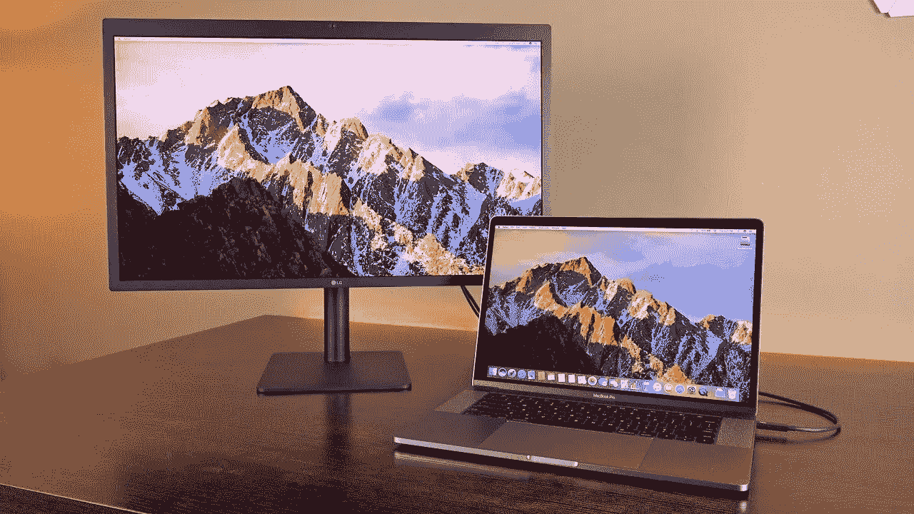
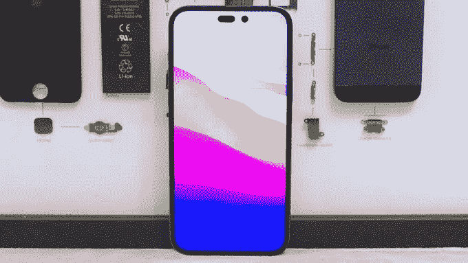
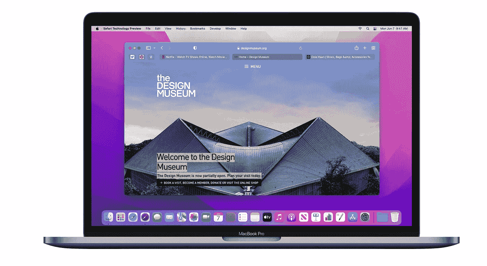
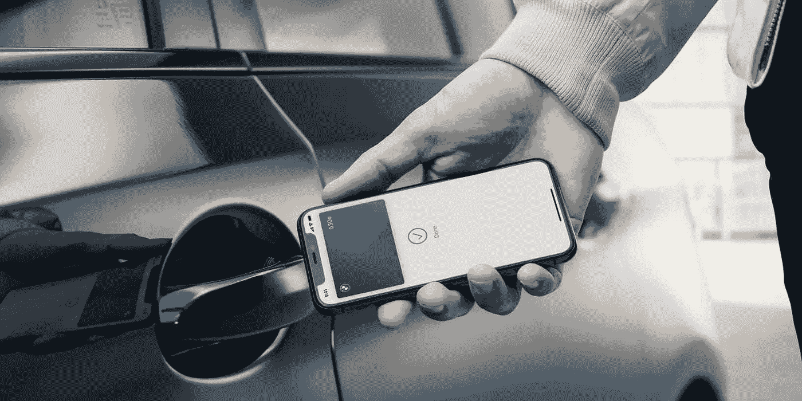

# iPhone 支付计划即将到来，iPhone 15 新闻，更大的 Mac 电脑&重返路由器市场

> 原文：<https://medium.com/codex/an-iphone-payment-plan-is-coming-iphone-15-news-bigger-macs-back-in-the-router-market-77f68eaa1860?source=collection_archive---------6----------------------->

苹果视图综述 2022 年 3 月 21 日至 3 月 25 日

带着更多苹果路由器回来？

## 路由器

苹果实际上处于制造消费级无线路由器的最前沿。1999 年，他们发布了机场基站。他们的想法非常简单。你可以先把以太网电缆插到 AirPort 上，而不是直接把它插到你的 Mac 上，这样这个设备就可以为你的家提供 Wi-fi 了。太棒了。我记得，史蒂夫·乔布斯有一次著名的展示是通过一台 Mac 电脑(【to】它实际上是一台 iBook！！)穿过呼啦圈，以示其未连接任何线缆。路由器的范围一度相当成功，并发展到包括低端版本的 AirPort Express、AirPort Extreme，甚至高端的 Airport Time capsule。该版本包括网络上 Mac 的无线备份。那么，如果苹果带着网状网络的想法重返路由器市场，会怎么样呢？如果你像我一样，有几个 HomePod 迷你星罗棋布，不难想象，它们可能是未来的网状网络路由器，是吗？ ***吸引人、色彩鲜艳、酷炫的 Wi-fi 路由器——我来了！***

庭外和解

 [## 苹果公司将会推出什么产品？

### 今年有这么多传言，让我们看看营销计划

medium.com](/codex/whats-coming-down-the-apple-pipeline-cb95005e0563) 

## 苹果公司庭外和解

苹果公司已经同意支付 1480 万美元以避免诉讼！Ben Lovejoy 报告说，一项集体诉讼已在庭外解决，同意向在特定时间段内订阅其付费存储层之一的美国居民支付金钱。问题似乎是他们将用户数据存储在非苹果服务器上。该和解协议包括在 2015 年 9 月 16 日至 2016 年 1 月 31 日期间任何时间支付 iCloud 订阅费的任何人。必须强调的是，苹果公司否认有任何不当行为，但他们宁愿赔偿也不愿接受审判。不需要采取任何行动，任何属于这一类别的美国居民将在适当的时候被联系。然而，当律师们拿到他们的提成时，不要指望能快速致富！

更大的 MacBook Air 显示屏

## **新款 Mac 不断推出**

在一份来自*显示器供应链顾问*的深度季度报告中，有传言称苹果计划明年增加众多产品的屏幕尺寸。MacBook Air 将是主要的受益者，据报道，它将获得一个新的 15 英寸屏幕，目前的型号将达到 13 到 14 英寸。预计入门级 iPad 也将配备更大的屏幕。看来越大越好。适合我！

 [## 我们对修理权的理解是错误的吗？

### 四个月过去了，几个产品发布之后，它在哪里？

medium.com](/codex/are-we-wrong-about-right-to-repair-a2d8b71fb27e) 

苹果数码身份证

## 数字身份证是活的！

终于，在拖延了很久之后，苹果钱包存储驾照和身份证的功能正式实现了。在 2021 年 6 月首次亮相后，它首次在某些州上线。你将能够在你的*iPhone*&*Apple Watch*上存储物理 ID。目前，它只在亚利桑那州推出，很快将在包括爱荷华州、犹他州和肯塔基州在内的 12 个州推出。要使用这些功能，你需要有一部 *iPhone 8* 或更高版本，或者一部 *Apple Watch Series 4* 或更高版本，这两款都需要运行最新的 iOS。要添加 ID，您只需进入钱包应用程序，点击 **+** 图标。一个非常棒的想法，迫不及待地想在英国实现。

iPhone15

## iPhone 15

是的，你没看错！距离今年的 iPhone 15 发布还有 6 个月的时间，关于明年的 iPhone 15 的第一批传言开始出现。据韩国网站 *The Elec* 报道，三星正在研究新的屏幕技术，这将使相机处于玻璃之下。苹果公司计划明年用这种屏幕来隐藏他们的 Face ID。人们一直担心的是，显示不足技术是否会像目前的系统一样有效或安全。三星首先计划将该技术应用于其所谓的 Galaxy Z Fold5。这些谣言很有根据，因为它们来自罗斯·杨。 ***又是关于刻痕的一切！***

LG 超细和 macOS 12.3

## 现在你看到了…

距离 macOS 12.3 发布只有十天，但 bug 已经开始浮出水面。许多用户发现通过 USB-C 电缆连接的显示器根本检测不到显示，或者屏幕输出不准确。帖子可以在苹果支持页面和 MacRumours 网站的论坛上阅读。然而有趣的是，这些问题似乎只发生在 LG 和明基等第三方面板上，而不是在他们自己的专有屏幕上，即*演播室显示器*。苹果现在已经意识到这个问题，希望很快会发布更新。 ***当然是他们的展示作品！***

 [## 为什么我们就不能满足呢？

### 苹果工作室的展示才刚刚开始两周，但我们似乎已经不满足了。

medium.com](/codex/why-cant-we-just-be-satisfied-f70e6490095b) 

iPhone 14 notch

## 最新的 iPhone 14 图片

那么，你有什么想法？

噱头 Mac 恶意软件

## Mac 上的恶意软件警报

名为*‘噱头’*的新定制 macOS 恶意软件浮出水面。该恶意软件被认为是中国间谍组织的作品，是在运行 Big Sur 11.6 的 MacBook Pro 上发现的。不过，有问题的电脑已经在 2021 年的一次网络间谍攻击中受损。 *Mactrast* 报道称其严重滥用 *Google Drive* 设备，恶意软件以二进制文件的形式嵌入其中。 ***更新的理由…还是不用 Google Drive！***

新的 Twitter 功能

## 推特新闻

你和我一样，花太多时间在推特上吗？如果是这样的话，我有好消息告诉你！从现在开始，搜索您的 DM 将会容易得多，因为您将能够使用关键字和名称来查找特定的邮件。虽然 DM 搜索栏本身并不是一个新功能，但在过去它只能让你搜索聊天对象或群组。这项新功能可以让你更精确地搜索。 ***更进一步，花时间在推特上的理由，那么！***

macOS 12.3 上的游戏问题

## 游戏玩家的新闻

macOS Monterey 的更多 bug，这次影响到了游戏玩家。一些 Mac 用户在更新操作系统后遇到了游戏控制器的问题。一些 *Xbox* 、 *PlayStation* 和其他一些控制器似乎无法通过蓝牙正常工作。 ***嗯，如果你会在 Mac 上玩游戏的话！***

面向开发者的新版本 Safari 预览版

## Safari 技术预览

Safari 技术预览版本周发布了新版本。Preview 于 2016 年 3 月首次推出，其想法是测试可能会在浏览器的后续版本中推出的功能。新版本修复了 142 个错误，并提高了性能。这个版本建立在 15.4 之上，包括了在 macOS Monterey 中引入的特性。该公司的目标是收集开发者和用户的反馈。它可以与现有浏览器并行运行，并可通过*系统偏好>软件更新*访问。 ***只给认真的极客！***

苹果电视+ —我们崩溃了

## 你爱 Apple TV+

我喜欢，而且今年真的很喜欢。电视+网站本周更新了一个节目的 Up Next 队列。在此次更新之前，用户可以选择将节目添加到“下一个”列表中，但实际的列表不会显示在网站上。在 Safari 或 Chrome 上使用 Apple ID 登录 TV+网站，现在可以查看该列表，这使得在没有电视应用程序的平台上跟踪观看情况变得非常方便。结账时，我们崩溃了——我喜欢这样。拍摄真是棒极了。

新的 Instagram 搜索

## 这个词就是 Instagram

尽管我在 Twitter 上花了太多时间，但我几乎没有在 Instagram 上花时间，但如果你有，请继续读下去。据 MAC rumors 报道，最新更新中包含了一个新的*粉丝和收藏源*。它允许用户按时间顺序查看他们所关注的人的内容。收藏夹显示选定帐户组的最新帖子。我试过 Insta，但它从未真正吸引过我。

## 如果我有打开世界的钥匙

早在 2020 年，苹果就推出了数字车钥匙功能。它允许用户只需将 iPhone 或 Apple Watch 靠近司机的车门，即可解锁并启动汽车。直到现在，仅限于宝马。根据苹果网站，现在又有两家制造商上榜，它们是创世纪和起亚。数字密钥存储在我们之前讨论过的钱包应用程序中。最初，该功能仅适用于 NFC 技术，但基于超宽带技术的最新版本意味着手机可以放在口袋里。 ***为什么我的车没有这个功能？我要！***

iPhone 的新租赁选项

## 最后，更多新的方式将我们联系在一起！

苹果公司刚刚发布了购买他们产品的新方法。最初从纯 iPhone 开始，苹果公司正在研究继续发展硬件订阅服务的潜力。该公司希望拥有一部 iPhone 更像是订阅应用程序。据马克·古尔曼称，这项服务最终可能会与 AppleCare 和其他各种数字服务捆绑在一起。更传统的购买方式如直接购买或运营商补贴仍将保留，但这将是减轻购买负担的进一步方式。该计划仍在进行中，但我们知道总部位于库比蒂诺的科技公司渴望在今年年底推出该产品。各种层级、级别和捆绑包都是可用的，它将通过用户已经在他们的设备上链接到应用程序商店的帐户来工作。 ***为什么没有人预见到这一点？绝妙的主意！***

## 你订阅媒体了吗？

我只是高端博客网站 Medium 上众多作家中的一员。正是如此物超所值，你可以在这里加入 https://medium.com/membership(https://medium.com/membership)

**加入我的幕后邮件列表(**[**https://www.talkingtechandaudio.com**](https://www.talkingtechandaudio.com/blog)**)**

*原载于 2022 年 3 月 25 日*[*【https://www.talkingtechandaudio.com】*](https://www.talkingtechandaudio.com/post/an-iphone-payment-plan-is-coming-iphone-15-news-bigger-mac-s-back-in-the-router-market)*。*