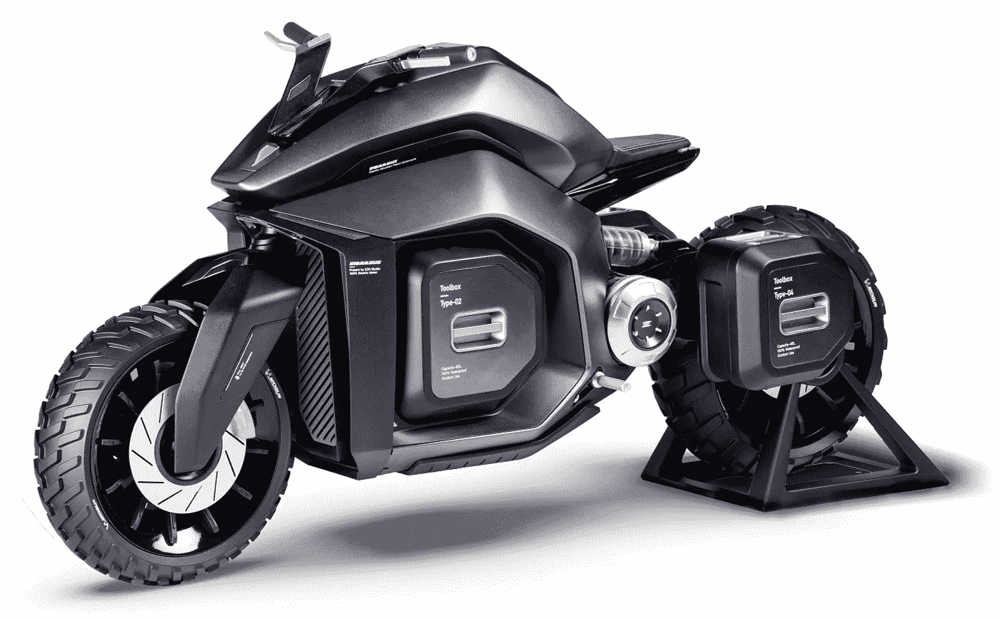

# 一辆越野电动山地摩托车！

> 原文：<https://medium.com/codex/an-off-road-electric-mountain-motorcycle-a3a5c3201497?source=collection_archive---------13----------------------->

## 这看起来像蝙蝠侠电影里的东西！

[EQUULEUS(行为媒体)](https://mir-s3-cdn-cf.behance.net/project_modules/2800_opt_1/020379116076667.605ae09d8ff1d.jpg)

当我第一次看到[的骑士](https://www.behance.net/gallery/116076667/EQUULEUS?tracking_source=for_you_feed_recommended)时，我立刻把它等同于克里斯托弗·诺兰黑暗骑士电影中的蝙蝠战车。也许是超大的轮胎或者只是摩托车本身的黑暗。这个名字在拉丁语中的意思是“小马”无论哪种情况，这辆摩托车都是一股不可忽视的力量…