# 界面 GANs 概述:使用 GANs 编辑人的面部属性

> 原文：<https://medium.com/codex/an-overview-into-interfacegan-edit-facial-attributes-of-people-using-gans-34f2273d5941?source=collection_archive---------5----------------------->

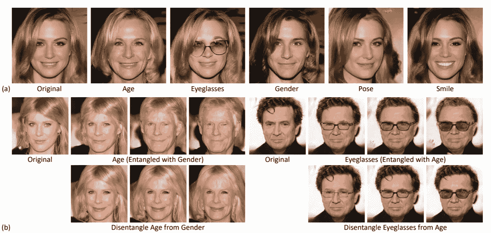

我们如何使用 GANs 编辑图像的语义属性？比如改变一个人的年龄或者性别，同时保留大致的脸型等属性？两幅图像的潜在向量之间的典型扭曲展示了面部特征的平滑过渡，但是多个特征纠缠在一起，并且对特定属性的精确控制几乎是不可能的。

尽管 GANs 可以生成质量惊人的图像，但在理解和操纵潜在空间方面却做得不多。以前使用 GANs 进行语义图像编辑的工作包括使用精心设计的损失函数、附加属性标签或特殊架构进行再训练。我们不能使用现有的高质量图像生成器来编辑给定的图像吗？正如论文所建议的，我们必须从理论和经验上理解个人面部特征是如何在潜在空间中被编码的。

[在之前的](/codex/how-to-edit-images-with-gans-controlling-the-latent-space-of-gans-afde630e53d1)中，我们回顾了 Image2StyleGAN，其中我们讨论了将给定图像映射到 StyleGAN 潜在空间的方法，这通常被称为 GAN 反转。我们将回顾一种在多个语义中解开和隔离变化的方法。该论文提出了一个由一组技术组成的流水线，以在潜在空间中解开语义级别的人脸属性，并实现对属性的精确控制。

这篇论文…

*   分析和测量不同的语义属性在潜在空间中是如何编码的。
*   使用*子空间投影*解开这些语义属性。
*   提出了一种人脸编辑管道，能够改变一个属性而不影响其他属性。

[*官方论文:InterFaceGAN:解读 GANs*](https://arxiv.org/pdf/2005.09635.pdf) 学到的被解开的人脸表征

## 性能

论文中考虑了以下*性质*😨。但是不要害怕，因为直觉很简单😆。

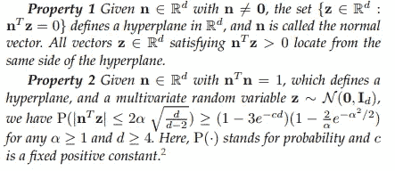

n 维空间的超平面是能把原空间分开的(n-1)维子空间。例如，2D 平面可以分离 3D 空间，1D 线可以分离 2D 平面。

第一个性质表明，当我们定义法向量 n^T z=0 的超平面时，n^T z>0 的向量点在超平面的特定边上。想象一个被线性方程分割的 2D 平面。

## 了解 GAN 的潜在空间

GAN 中的生成器可以被视为函数 g: Z → X，其中 Z 通常是高斯分布，X 是图像空间。考虑一个*语义空间* S ⊆ R^m，具有 m *语义*和一个*语义得分函数* f_S: X → S，直观地，一个潜在的语义得分度量为 f_S(g(z))。

该论文提出，当我们在两个潜在代码之间进行线性插值时，我们观察到图像中包含的语义的线性变化。假设只有一个语义(m=1)。考虑一个具有法向量 n 的超平面。我们将到样本 z 的“距离”定义为 d(n，z) = n^T z。我们期望距离与语义得分成比例，f(g(z)) = λ d(n，z)。

根据性质 2，任何潜在的 z ~ N (0，Id)都有可能接近给定的超平面。因此，我们可以将一个语义建模到线性子空间 n 中。

让我们考虑具有多个 m>1 语义的一般情况。考虑 s = [s_1，… s_m]作为生成图像的真实语义得分，s≈f _ s(g(z))= λn^t z 其中λ是常数向量，n 是包含 m 个分离边界的矩阵。使用基本的统计规则，我们可以计算平均值和协方差统计值，如下所示

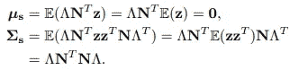

然后我们可以得出结论，s 实际上是从一个正态分布 s ~ N (0，σs)中采样的。直观上，对于 s 中的每个向量，要完全解开，σs 必须是对角矩阵。(n_i)^T (n_j)也可以用来度量第 I 个和第 j 个语义之间的纠缠。

**n^T 表示向量 n 的转置。*

## 条件操纵

假设我们找到了某个语义的决策边界 n。我们用 z_edit = z + αn 编辑原始潜在代码 z，当多个语义纠缠在一起时，编辑一个语义可以影响其他属性。例如，在 n1 方向上移动一个点不仅会影响属性 1，还会改变属性 2 的距离。为了抵消这一点，本文应用*投影*使 N^T N 成为语义相互独立的对角矩阵。

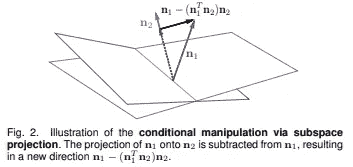

考虑具有法向量 n1 和 n2 的两个超平面，投影方向 n1(n1^t N2)N2(黑色向量)改变属性 1 而不影响属性 2。对于两个以上的属性，我们减去从原始方向(n1)到由所有条件方向构成的*平面上的投影。*

## 寻找语义边界

如何在潜在空间中定义面部属性的语义边界？我们训练一个**线性** SVM 来预测给定潜在代码的某个二元语义(例如男人和女人的图像)。**线性**模型本身定义了潜在空间上的超平面，并且法向量 n 可以从该模型中导出。

潜在代码上的事实属性的标签使用在 CelebA 属性上训练的辅助分类器来分配。在 500，000 幅合成图像中，对每个标签具有最高置信度的 10K 图像(例如，10K 男人和 10K 女人图像)被采样作为训练和验证集。这一过程将在第 3.3 节中详细说明。论文的“实施细则”。

## 操纵真实图像

我们如何将学到的语义应用到给定的图像上，以进行编辑应用呢？这通过两种方法实现:GAN 反转和进一步训练。

GAN 反转将目标面映射回潜在代码。这可能具有挑战性，因为 gan 不能捕获完整的图像分布，并且经常会丢失信息。我们在[之前的](/codex/how-to-edit-images-with-gans-controlling-the-latent-space-of-gans-afde630e53d1?source=your_stories_page-------------------------------------)文章中讨论了 GAN 反转的一般情况和一种强大的 GAN 反转方法。

在 GAN 反演的两种方法中，该论文使用 LIA 作为基于编码器的反演的基线，并搜索 W+空间用于基于优化的反演，由 Image2StyleGAN 和其他论文提出。与基于编码器的方法相比，基于优化的方法性能更好，但速度慢得多。

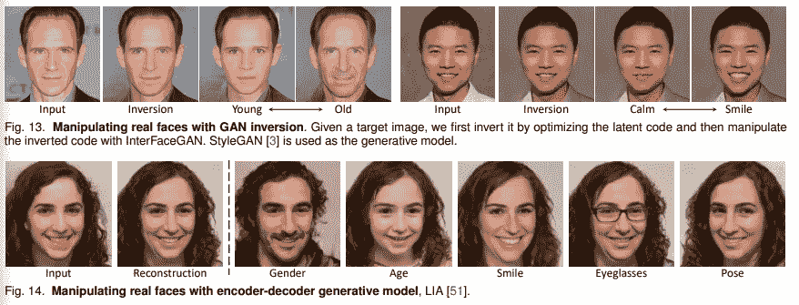

基于 GAN 反转的方法

另一种方法是使用学习接口 GAN 在合成生成的成对数据集上训练*附加模型*。InterFaceGAN 模型可以生成无限的高质量*配对*数据。这个想法是在生成的数据上训练一个图像到图像的翻译模型，比如 pix2pixHD。为了实现连续操作，翻译模型首先学习一个相同的映射网络和一个微调到属性翻译的网络。在推断时，我们在从相同模型到微调模型的模型权重之间进行插值。

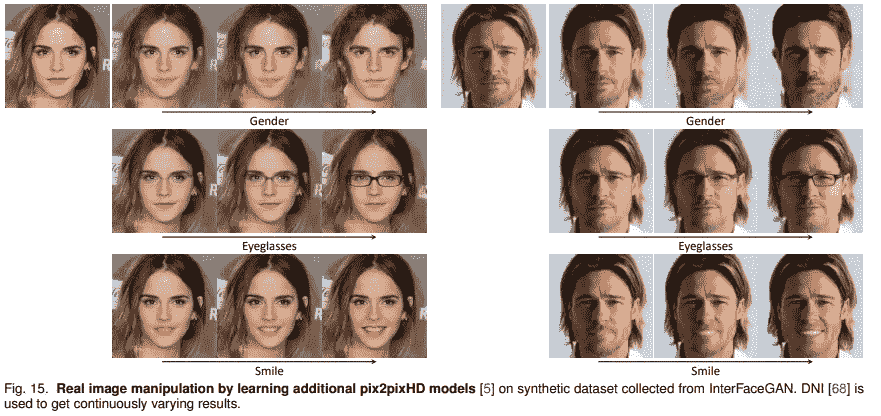

这种方法具有更快的推理速度和完全保留附加信息的能力，因为它消除了重建的需要。但由于 pix2pixHD 固有的局限性，模型无法学习到 pose、微笑等较大的动作。因此，应用受到限制。

## 结果和实验

在上述方法的公式中有许多假设。语义在潜在空间中真的是线性表示的吗？线性模型可以适当学习语义边界吗？每个语义子空间真的是相互独立的吗？子空间投影真的能解开复杂的语义吗？学习到的语义边界可以推广到现实世界的图像吗？这些关于假设的问题将在本节中进行评估。

首先，潜在空间可以被线性边界或超平面分离吗？下图显示了线性 SVM 的分类性能。对于验证集上的 PGGAN(渐进 GAN)和 SyleGAN W 空间，线性边界实现了约 95%的准确度。这表明，对于二元语义，近似线性超平面确实存在。

在一系列实验中，论文观察到 W 空间中的插值比 Z 空间中的插值更好。在*整个集合*上的结果是低的，因为它们包括语义不太重要的图像。

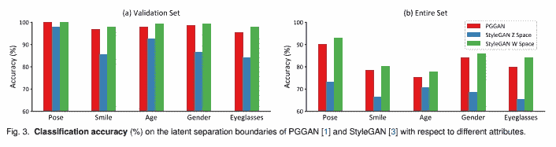

下图基于法向量直接插值一个潜在代码，没有解纠缠。我们可以清楚地看到，每个属性都被正确地应用和删除。这进一步证明了潜在空间是线性可分的，InterFaceGAN 可以成功地找到分离超平面。

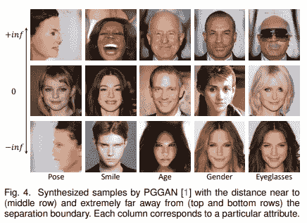

然后，我们回答这个问题，这些语义边界是否推广到编辑真实图像。如果我们观察下图，结果是令人震惊的。我对模特如何学会画“强”眼镜和“弱”眼镜感到特别惊讶。GAN 似乎在潜在空间中学习了一些可解释的语义。

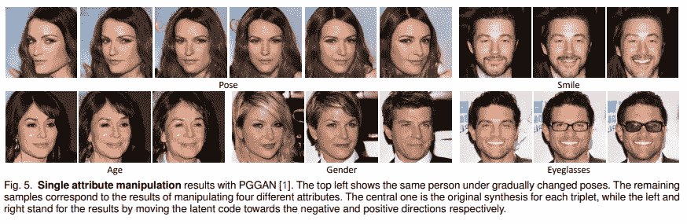

他们观察到，当潜在样本距离边界和自然潜在分布太远时，会引入其他属性的变化。如下图中的示例所示。

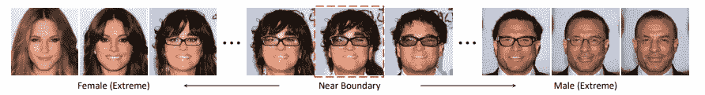

使用提出的方法，语义真的被解开了吗？为了评估语义之间的相关性，本文提出了几个度量去纠缠的方法。

被训练来预测属性的预测器被用于测量真实数据中两个属性之间的相关系数。这可以用来衡量两个属性之间的纠缠度。计算了合成数据的相关系数，并与实际数据的相关系数进行了比较。最后，可以使用潜在边界的法向量之间的余弦相似性。直觉上，这些方法应该能够测量解缠结。

这些方法实际上都显示出相似的结果。在下面的表格中，我们观察到某些属性之间的高度纠缠，例如年龄、性别和眼镜。我们还观察到在 CelebA-HQ 上训练的 PGGAN 和在 FF-HQ 上训练的 StyleGAN 之间的纠缠差异。我们可以在 FF-HQ 特有的数据中观察到一些偏差比如微笑和性别的纠结。另一个有趣的观察结果是，与 z 空间相比，W 空间明显更清晰。然而，z 空间中的这种纠缠可以通过提议的条件操作来减轻，如下图最后一行所示。

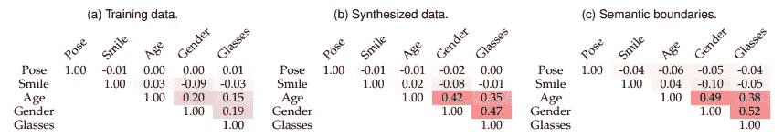

对 PGGAN，CelebA-HQ 的解纠缠分析

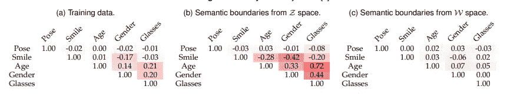

对 StyleGAN，FF-HQ 的解纠缠分析

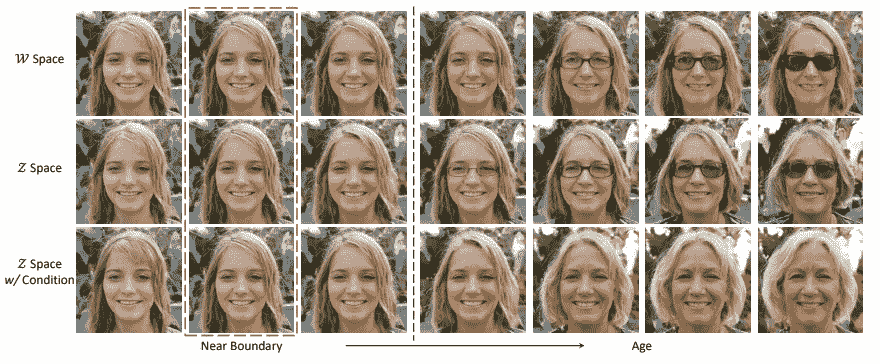

## 结论

本文通过假设语义的线性变化来理解甘的潜在空间。观察的结论是，每个语义被表示为基于超平面的法向量的正态分布。通过考虑可以根据语义属性线性分离潜在空间的超平面，我们可以使用线性分类器对该超平面建模。从潜在标签到语义标签的线性 SVM 可以定义潜在空间中语义属性的“方向”。这是用子空间投影解开的。

在理解神经网络如何解释人脸方面，本文提出的见解非常有趣。我对投影如何能够理清各种语义感到特别震惊。