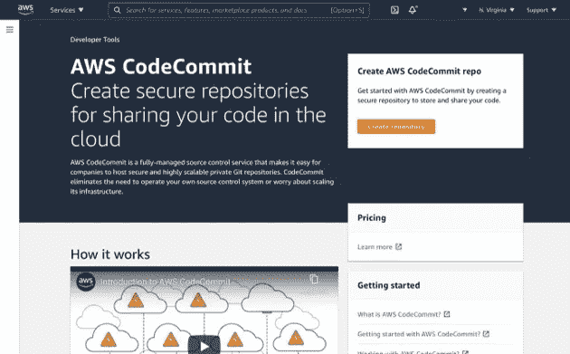

# AWS 代码提交概述

> 原文：<https://medium.com/codex/an-overview-of-aws-codecommit-ff553efb8aaf?source=collection_archive---------3----------------------->

今天，当我们想到源代码管理(SCM)时，首先想到的是 git。在组织中实现 git 有很多种方法。我们可以运行自己的 git 服务器，购买 GitLab 许可证用于内部部署或云，使用 GitHub、Atlassian BitBucket 或其他 git 存储库服务。这些服务中有许多提供私有和公共存储库，尽管私有存储库通常是一个“付费”特性。如果你使用…