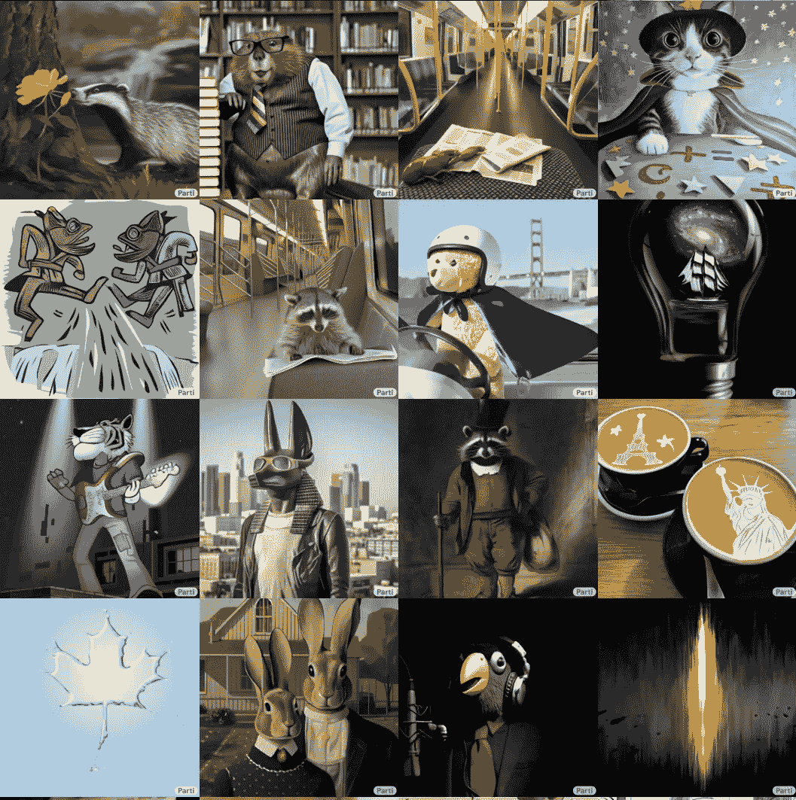

# 路径自回归文本到图像模型综述

> 原文：<https://medium.com/codex/an-overview-of-pathways-autoregressive-text-to-image-model-a4565113a6ac?source=collection_archive---------4----------------------->

## 探索 Google AI 在图像生成方面的新大事。

几天前，我写了一篇关于 **DALL-E 2** 的文章:一个增强的人工智能能够产生逼真的图像，你可以在其中键入你想要的任何东西，为你创建它。

图像生成器在将文本提示转换成高质量的…