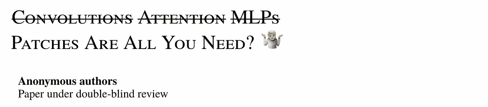
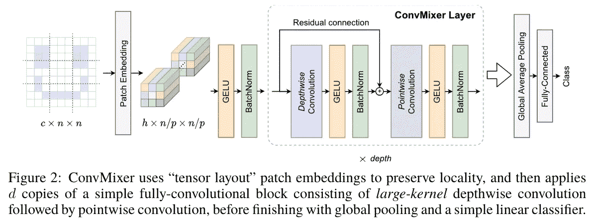
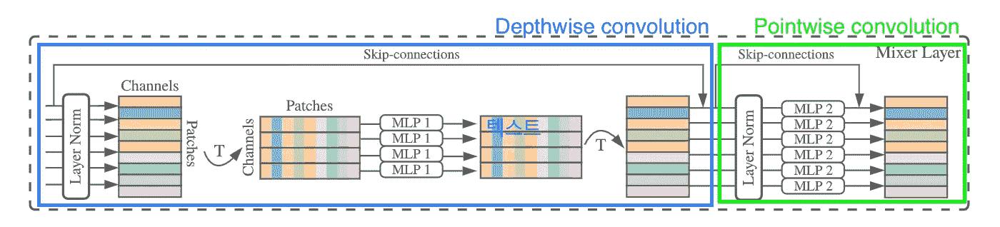
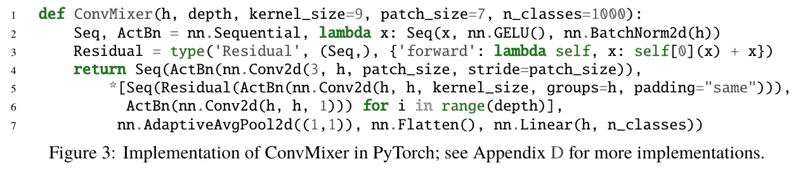
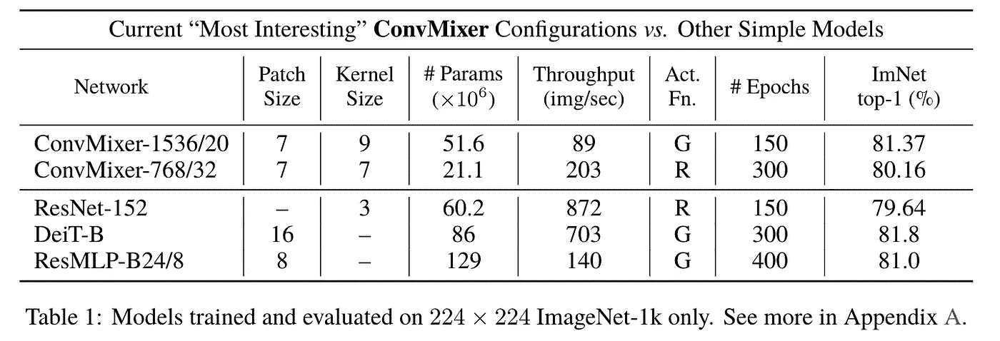
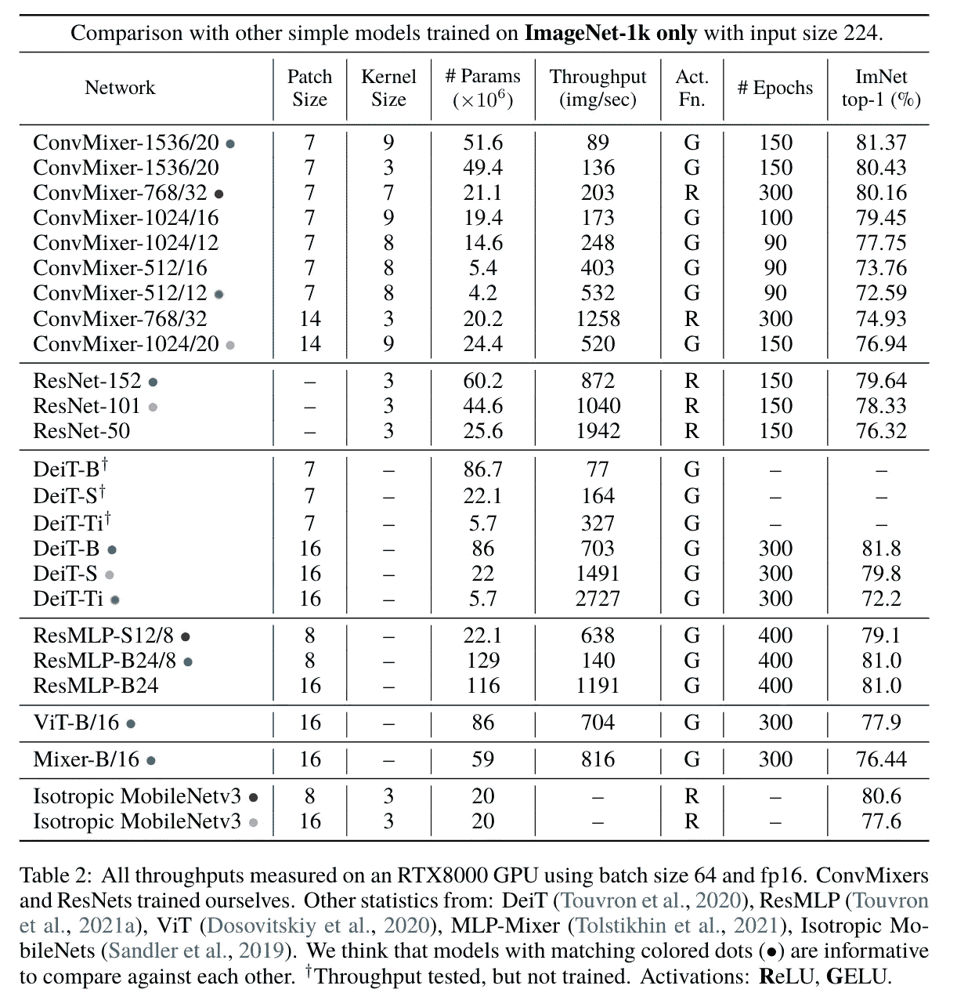
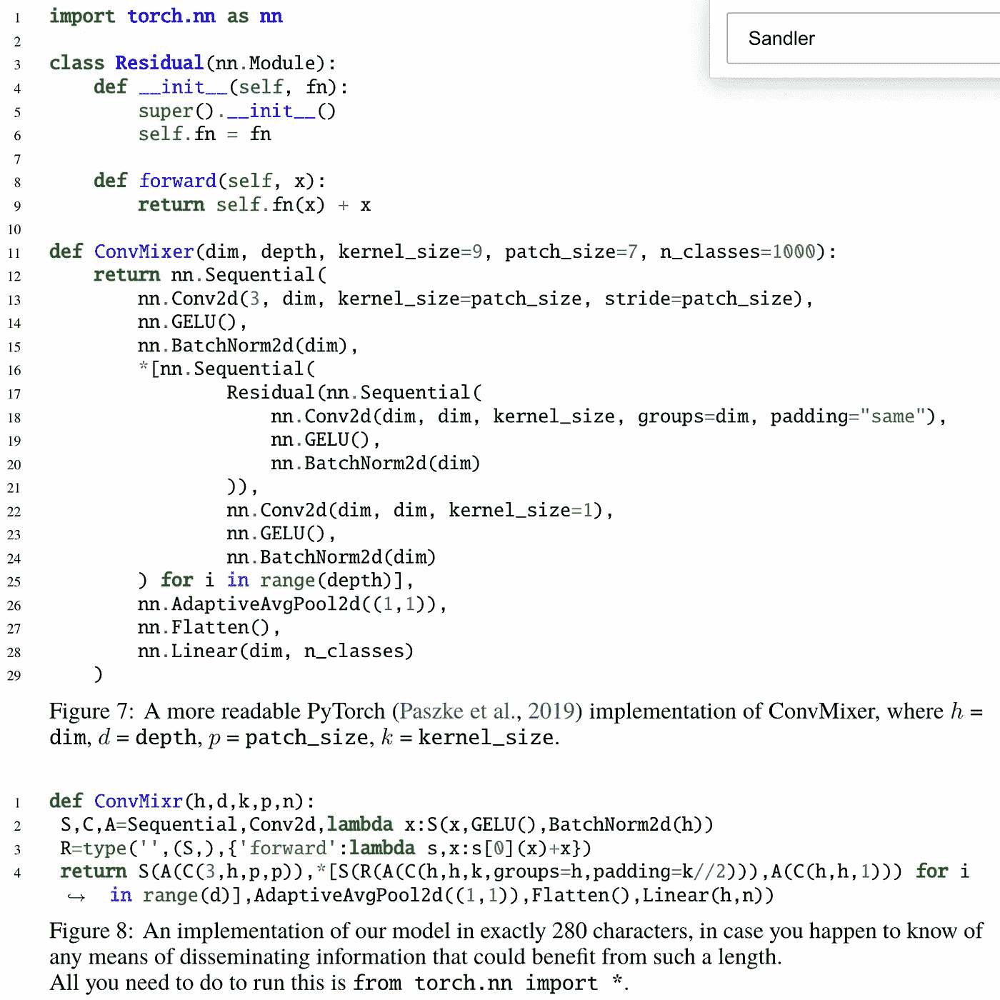

# ConvMixer:你只需要补丁吗？概述和想法🤷

> 原文：<https://medium.com/codex/an-overview-on-convmixer-patches-are-all-you-need-8502a8d87011?source=collection_archive---------1----------------------->

## CNN 并不总是需要逐渐降低分辨率。一个革命性的想法可能会塑造计算机视觉的下一代架构。

🤷

***TL；【T2 博士】***

*   变形金刚(NLP): **各向同性建筑**+自我关注
*   ViT:变形金刚(NLP)+ **补丁表示**
*   CNN:*金字塔架构(分辨率递减)* + **卷积**
*   ConvMixer: *各向同性架构+面片表示+卷积*

变形金刚的代表是注意力的广泛使用及其各向同性的架构，这种架构多次重复同一块。他们在许多问题上表现出惊人的性能，尤其是在自然语言处理方面。然而，在图像分辨率非常高的情况下，自我注意的二次计算复杂度是视觉的主要瓶颈。因此，多年来计算机视觉的主流架构是 CNN。

这种情况已经改变，因为最近关于视觉变形金刚的工作提出了一种方法，将图像分成小块，并将每个图像小块嵌入到一个可以输入变形金刚的令牌中。ViT 表现出了良好的性能，并在后来的作品如 DeiT 和 Swin transformers 中进一步改进，在许多视觉任务中超过了 CNN。ConvMixers 的作者提出了一种基于以下想法的架构:虽然视觉变压器的一些增益是由于强大的变压器架构，但面片表示可能是一个重要因素。

作者完全破坏了 CNN 架构的惯例，即自 AlexNet 以来一直没有改变的增加特征尺寸和降低分辨率的*金字塔*设计。ConvMixers 无疑是计算机视觉和各向同性视觉架构中最具革命性的想法之一。他们并没有提出任何最先进的网络，而是提出了一个重要的讨论:补丁在卷积架构中工作得非常好，值得我们关注。

作者:

*   描述一个极其简单而有效的模型类别，该类别可以容纳 280 个字符，无需大量实验即可达到 80%的分类准确率。
*   与其他 vit 和 CNN 相比，比较如何解释新架构。

*原文:* [*补丁都是你需要的？*](https://openreview.net/forum?id=TVHS5Y4dNvM) *(在审)*

一篇研究论文的非常规标题🤷

## ConvMixer 架构

提议的架构非常简单。它有一个*补丁嵌入阶段*，后面是各向同性重复的*卷积块*。

补丁嵌入将一个 p×p 补丁总结为一个嵌入的 e 维向量。作者通过与内核大小 p、步长 p 和 h 输出通道进行单卷积，然后进行非线性运算来实现这一点。这个惊人的技巧将把 n×n 图像转换成 h × n/p × n/p 形状的特征。

连续卷积和合并的 CNN 和 vit 变压器由*一致*重复的 ConvMixer 模块取代。单个 ConvMixer 模块是一种稍加修改的深度方向可分离卷积，广泛用于现代 CNN 架构。在典型的 CNN 中，特征尺寸通过汇集或步进卷积逐步减小，并且频道的数量增加。相反，ConvMixer 的每个中间特性都具有一致的尺寸。

类似于典型的 CNN，特征通过全局平均池变平，并且在最后阶段使用 softmax 分类器进行推断。

## 将 ConvMixer 解释为其他架构的变体

看完论文后，我脑海中浮现出许多类似的架构。作者也提出了类似的概念。我觉得类似架构的特点对理解 ConvMixer 架构是有帮助的。

MLP 密炼机公司

最重要的是，所提出的 ConvMixer 架构在很大程度上是一个带卷积的 MLP 混频器。它直接作用于嵌入的补丁，分辨率和大小在所有层中都是一致的。此外，深度方向可分离卷积类似于 MLP 混合器(甚至跳跃连接是相同的)分离信息的信道方向混合和空间混合。

同时，该网络实际上是一个完全卷积的神经网络。ConvMixer 的所有操作都可以仅使用激活、BN 和卷积来实现。因此，它实际上只是一个 CNN 与一些特定的建筑超参数。具体来说，

*   初始层中的大量下采样，但在主要瓶颈中不再进行。
*   具有相同分辨率的各向同性架构，每层中有#个通道。
*   非常规的大内核大小，我们将很快讨论这个问题(注意在上面的实现中内核大小默认为 9)。

我认为这尤其具有革命性，因为这些选择导致 CNN 完全破坏了 CNN 架构的惯例，即自 AlexNet 以来一直没有改变的增加特征尺寸和降低分辨率的*三角形*设计。

然而，我们必须注意到，重复的各向同性 CNN 网络运行在 224/7=32 的图像大小上，当与大多数 CNN 相比时，这并不小，因为大多数 CNN 具有更多的层来处理更小分辨率的特征。

各向同性架构实际上类似于变形金刚(NLP 和 vision)，而主要计算是通过卷积而不是自我关注来执行的。因此，我个人对架构的理解是:

> 设计像变形金刚一样的 CNN，使用面片表示。

*好吧，革命就是酷。但是，像变形金刚一样设计 CNN 有什么好处呢？他们真的表现好吗？*

TL；大卫:是的，他们展示了*有前途的*性能。

## 动机和优势:大感受野

我们将讨论面片表示和 ConvMixer 架构的一些理论优势和动机。

作者认为这项工作的动机是用卷积代替 MLP 混合器的混合操作。深度方向卷积可以混合空间位置，点方向卷积可以混合通道方向位置。

MLP 和变压器可以在空间位置混合过程中模拟相距较远的信息，但卷积只能在内核大小内混合信息。然而，作者认为卷积的这种*感应偏差*非常适合视觉任务，并导致高数据效率。

映射空间上相距较远的信息的能力，也称为感受野，可以由深度方向卷积的核大小来控制。MLP 混合器是指我们使用的内核大小等于输入分辨率。作者在非常规的大核尺寸(例如 9)中找到了深度方向卷积的平衡，以更快地增加感受野，并发现这样做是有益的。

此外，小块嵌入产生了更大的感受野，因为下采样同时发生，并且所有层都以小分辨率操作。

## 实验

ConvMixer 的设计参数包括:

*   补丁大小:补丁的尺寸
*   内核大小:深度方向卷积的内核大小
*   宽度:面片嵌入的维数 e，在整个网络中保持一致，等于输出特征的维数。
*   深度:要使用的 ConvMixer 块(层)的数量。

网络配置命名为 *ConvMixer-h/d* ，其中 h 指网络宽度，d 指网络宽度。

所有这些实验都是在受控环境中完成的，在每个实验中，潜在的混淆配置(如数据扩充策略或学习率计划)都是固定的。

ConvMixer-1536/20 具有 51.6M 的参数，是最大且工作最佳的 ConvMixer 设置，其 ImageNet 精度为 81.6%，优于其他类似尺寸的 ResNets 和 vit。实验设置意味着在验证 ConvMixers 的性能方面有更多有趣的见解。

训练配置类似于 DeiT，因为 DeiT 在网络架构方面类似于原始 ViT，所以评估在 ViT 设计中加入卷积的效果应该是有意义的。我要说的是，这种比较是有争议的，至少当 ConvMixer 在有限的计算和次优超参数下接受训练时是如此。

当比较类似大小的 DeiT 和 conv mixer 时，conv mixer 在模型大小(参数计数)和准确性方面确实表现稍好，尽管没有模型能够赢得最大的 DeiT-B 模型。然而，吞吐量明显更差，尤其是对于具有大内核大小的网络。虽然这是因为 conv mixer 使用小得多的小块大小 7，因为作者在使用小块大小 7 的 DeiT 时观察到类似的吞吐量，但缓慢的推断是一个显著的缺点，因为当 conv mixer 使用较大的小块大小时，准确性会显著下降。

三个 ResNets 在相同的训练配置上进行训练，并且优于 ConvMixers。各向同性 MobileNetv3 基准测试是在重复各向同性 MobileNet 块的前期工作的基础上进行的。积木非常复杂，作者认为动机与这项工作非常不同。我不能对此发表太多评论，因为我不知道那项工作，但它似乎绝对值得一试。

然而，由于计算能力有限，与竞争对手相比，这些模型在更少的时期上进行训练，根据作者的说法，没有超参数调整，它们是根据常识从一个模型中选择的。因此，模型可能是过度正则化或欠正则化的，并且报告的精度可能低估了我们的模型的真实能力。

关于超参数的选择，我们观察到两个重要趋势:

*   小的补丁大小对于性能来说是至关重要的**，但是对计算的要求要高得多。**
*   **增加内核大小具有显著的优势，同时需要相对较小的计算量。**

## **简单**

**ConvMixer 的一个特殊优势是各向同性和基本架构的简单性。我们可以在下面描述的实际实现中看到这一点。在 PyTorch 中，CNN 和 ViT 都不可能只用 280 个字符来实现。除了能够“适合一条 tweet”之外，实现简单也是一个优势，因为它有可能实现复杂架构改进的应用，可能来自 CNN 和 transformer 领域。**

****

**def ConvMixr '..？281 个字符应该合适…🤔**

## **摘要**

*   **变形金刚(NLP): **各向同性建筑**+自我关注**
*   **ViT:变形金刚(NLP)+ **补丁表示****
*   **CNN:*金字塔* *架构* + **卷积****
*   **ConvMixer: ***各向同性架构+面片表示+卷积*****

**ConvMixer 是一种非常简单的网络架构，结合了 ViTs 和卷积中的贴片思想。我很惊讶自己是如何无意中接受了 CNN 的分辨率必须逐渐降低的观点，却不知道为什么。**

**结果很有希望，但在 ConvMixers 成为下一代视觉模型的基准之前，肯定还有改进的空间。虽然大的感受野肯定是重要的，但我觉得 ConvMixers 的有效性和效率还没有足够的理论支持。“为什么你只需要补丁？”这个问题似乎有更多的答案。**

**作者们也承认，他们提出了一种可能性，并证明了一个革命性想法的概念。尽管如此，还是要对作者们令人惊叹的工作表示祝贺！我将期待后续的论文进一步改进这种方法，并可能在许多基准测试中实现最先进的性能。我个人认为可能性很大。**

**此外，我认为研究基于 ConvMixer 的模型的特征会很有趣，因为该架构是两种非常不同的架构的混合。例如，我们如何回答这样的问题:我们应该像 EfficientNets 或 ViTs 那样扩展 ConvMixers 吗？[他们看到的更像 ViTs 还是 CNN](https://arxiv.org/abs/2108.08810)？我们如何有效地将它们应用于像语义分割这样的像素级任务？**