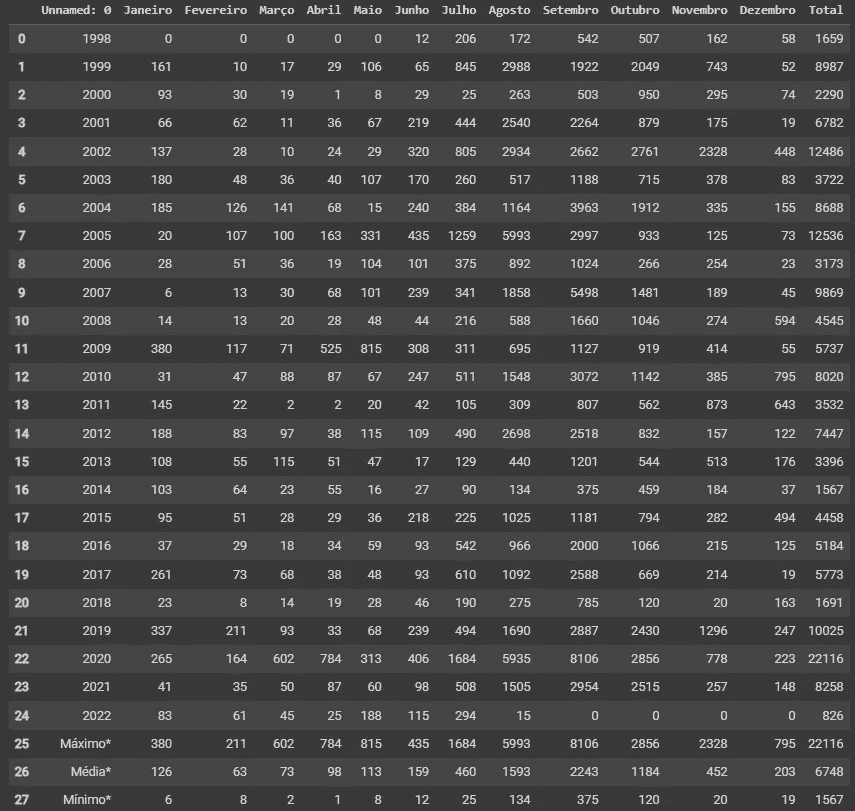
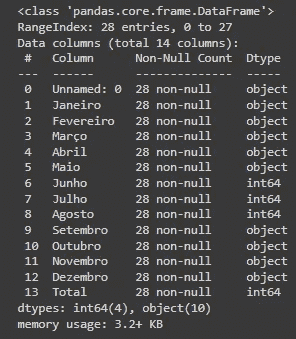
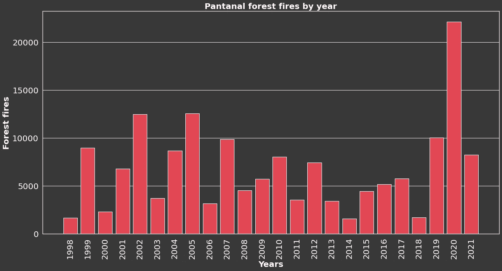
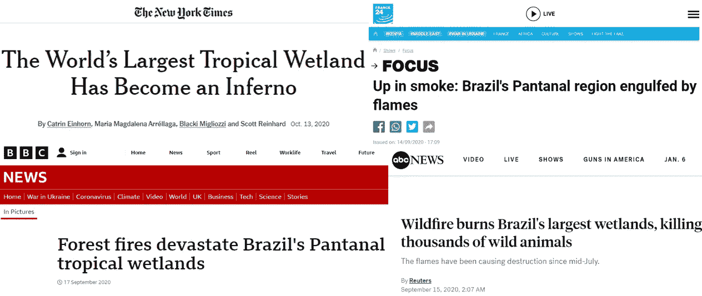
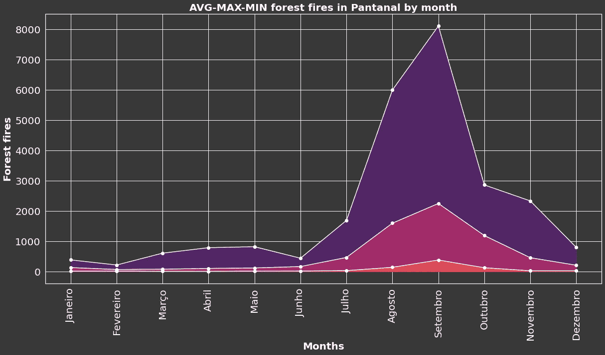
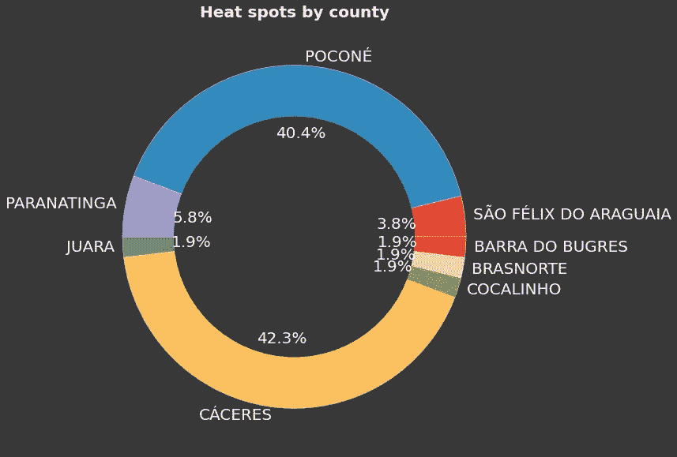
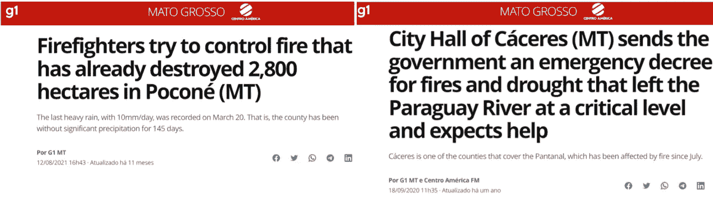

# 分析世界最大湿地的森林火灾数据

> 原文：<https://medium.com/codex/analysing-forest-fires-data-in-the-worlds-largest-wetlands-b5cc9049e28b?source=collection_archive---------18----------------------->


法比安·琼斯在 [Unsplash](https://unsplash.com/s/photos/forest-fire) 上的照片

在世界范围内，主要是在欧洲、美国和巴西等地区，发现关于森林火灾的新闻越来越普遍。一个最重要的例子是巴西的生物群落，它经常遭受森林火灾。全球变暖、缺少雨水和砍伐森林是引发这些火灾的一些因素。
有趣的是，巴西的湿地(潘塔纳尔)是受火灾影响最严重的地区之一。据世界自然基金会组织报道，该地区每年都有新的火灾记录被打破。
另一方面，数据分析是理解、分享和生成火灾信息的重要工具。在本文中，我们将使用 Python 进行数据探索，以更好地了解潘塔纳尔每年发生的森林火灾。

# 数据

这些分析中采用的数据来自 [Programa Queimadas 开放数据门户](https://queimadas.dgi.inpe.br/queimadas/dados-abertos/)。Queimadas 方案是巴西国家空间研究所的一个项目，利用遥感、地理处理和数字建模技术，提供公开可用的数据，重点是监测和模拟植被活跃火灾的发生、传播和分类及其风险、范围和严重程度。

在这些分析中，我们将使用两个不同的数据集:

1.  潘塔纳尔生物群落多年来的历史火灾系列，包括:

*   每月火灾数量；
*   每月最大火灾数量；
*   每月平均火灾数量；
*   每月最少的火灾数量。

2.马托格罗索州在过去 48 小时内的热区域数量，包括:

*   热 id；
*   日期和时间；
*   县；
*   巴西州；
*   生物群落。

# 准备环境

因此，让我们从导入必要的 python 库开始:

```
import pandas as pd
import matplotlib.pyplot as plt
import urllib.request
import seaborn as sns
```

下一步是从 Programa Queimadas 门户网站检索按年份划分的森林火灾数据集，并转换为 Pandas 数据框架:

```
csv_url_hist_pantanal = 'https://queimadas.dgi.inpe.br/queimadas/portal-static//bioma/csv_estatisticas/historico_bioma_pantanal.csv'urllib.request.urlretrieve(csv_url_hist_pantanal, 'pantanal.csv')df = pd.read_csv('/content/pantanal.csv', encoding='utf-8')
df.replace(to_replace='-', value=0)
```

在分析提取的数据集时，可以注意到一些数据带有“-”字符，可能代表未收集的数据。为了解决这个问题，我们可以假设这些值为零。该数据集还采用 PT-BR 语言来标识月份(*Janeiro-dezecru*)和最大值(*má摩西*)、平均值( *Média* )和最小值( *Mínimo* )。



按年份分列的森林火灾数据集

# 探索性数据分析

## 按年份分列的潘塔纳尔森林火灾

为了理解森林火灾场景，让我们首先创建一个图表来查看潘塔纳尔森林火灾的历史演变。虽然，通过执行`df.info()`方法，我们可以观察到只有第 6、7、8 和 13 列采用 int64 类型，其他列采用 object 类型。



数据帧信息

`tolist()`函数可以标准化这些值，因此我们可以快速生成想要的图形。此外，我们还可以基于`Unnamed: 0`和`Total`列为我们的图表定义`years`和`forest_fires`变量。

```
years = df['Unnamed: 0'][0:24].tolist()
forest_fires = df['Total'][0:24].tolist()
```

现在我们可以生成图表来了解潘塔纳尔的森林火灾历史演变。使用`plt.bar()`函数创建与`years`和`forest_fires`变量相关的图表。此外，通过采用一系列设计功能，我们可以增强可视化，如下所示:

```
plt.figure(facecolor='#383838') #changing image colour background
sns.set(rc = {'figure.figsize' : (20, 10)}) #setting the graph sizeplt.bar(years, forest_fires, color='#e14854') #defining the x and yplt.title('Pantanal forest fires by year', color='white', fontweight='bold', fontsize=20 ) #graph title 
plt.xlabel('Years', color='white', fontweight='bold', fontsize=20 ) 
plt.ylabel('Forest fires', color='white', fontweight='bold', fontsize=20 )
plt.xticks(years, rotation=90)ax = plt.axes()
ax.set_facecolor('#383838') #changing graph color background
ax.tick_params(axis='x', colors='white') #x parameters colour
ax.tick_params(axis='y', colors='white') #y parameters colour
ax.xaxis.set_tick_params(labelsize=20) #y parameters text size
ax.yaxis.set_tick_params(labelsize=20) #y parameters text size
ax.xaxis.grid() #Hiding the x gridplt.show()
```



按年份分列的潘塔纳尔森林火灾

因此，2020 年被认为是整个历史系列中火灾记录最多的一年。2020 年在潘塔纳尔搜寻大火时，无数新闻报道了这一悲剧。



纽约时报[、英国广播公司](https://www.nytimes.com/interactive/2020/10/13/climate/pantanal-brazil-fires.html)、[法国 24](https://www.france24.com/en/americas/20200914-up-in-smoke-brazil-s-pantanal-region-engulfed-by-flames) 和美国广播公司援引 2020 年潘塔纳尔火灾的新闻标题

## 潘塔纳尔森林火灾每月最高、平均和最低

使用相同的数据集，我们还可以确定一年中什么时候火灾风险更大。显示潘塔纳尔火灾逐月演变的线形图有助于这一分析。为此，数据集中存在的最大值、平均值和最小值变量通过以下方式收集:

```
months = df.columns[1:13]months_max = df.loc[25, 'Janeiro':'Dezembro'].tolist()
months_max = list(map(int, months_max))months_avg = df.loc[26, 'Janeiro':'Dezembro'].tolist()
months_avg = list(map(int, months_avg))months_min = df.loc[27, 'Janeiro':'Dezembro'].tolist()
months_min = list(map(int, months_min))
```

使用了三次`plt.plot()`函数来表示`months_max`、`months_avg`、`months_min`变量。此外，`plt.fill_between()`函数填充月份变量所代表的区域，以丰富图形可视化。该图表的颜色和标签设计遵循以前使用的格式。

```
plt.figure(facecolor='#383838') #image brackground colour# months X months_max line graph
plt.plot(months, months_max, color='white', marker='o', label='Max')
plt.fill_between(months , months_max, color='#522564')# months X months_avg line graph
plt.plot(months, months_avg, color='white', marker='o', label='Avg')
plt.fill_between(months , months_avg, color='#a22a69')# months X months_min line graph
plt.plot(months, months_min, color='white', marker='o', label='Min')
plt.fill_between(months , months_min, color='#e14854')plt.xticks(months, rotation=90) #rotation of the x parameters
plt.title('AVG-MAX-MIN forest fires in Pantanal by month', color='white', fontweight='bold', fontsize=20) #title
plt.xlabel('Months', color='white', fontweight='bold', fontsize=20)
plt.ylabel('Forest fires', color='white', fontweight='bold', fontsize=20)ax = plt.axes()
ax.set_facecolor('#383838')
ax.tick_params(axis='x', colors='white')
ax.tick_params(axis='y', colors='white')
ax.xaxis.set_tick_params(labelsize=20)
ax.yaxis.set_tick_params(labelsize=20)plt.show()
```



潘塔纳尔每月平均最大最小森林火灾

该图显示了潘塔纳尔森林火灾在 2008 年下半年的大幅增长。八月、九月和十月是潘塔纳尔火灾发生率最高的三个月，图表中所有分析的变量都显示了这一增长。这一特点与潘塔纳尔的旱季有关，旱季发生在每年[7 月至 10 月](https://www.caiman.com.br/en/pantanal/seasons/)。

## 按县份额划分的热点

Programa Queimadas 门户还提供来自各种卫星的数据，收集所有可能的火灾爆发。这些火灾的爆发是由一个叫做热点的区域的温度上升来界定的。南美、巴西和巴西各县的数据集可在门户网站上获得。在巴西，潘塔纳尔生物群落出现在马托格罗索州和南马托格罗索州。在这种情况下，我们选择马托格罗索州进行数据分析。

```
csv_mt = 'https://zenodo.org/record/5669098/files/focos48h_estados_MT.csv?download=1'
urllib.request.urlretrieve(csv_mt, 'heatspots_MT_48h.csv')
```

在`heatspots_MT_48h.csv`数据集中，每个记录都是一个由卫星识别的新热点。通过对记录进行分组，我们可以看到有更多热点的马托格罗索县。由此，我们可以确定哪些县更有可能发生森林火灾。创建`counties`和`heatspot_county_id`变量是为了存储热点的发生率并生成一个圆环图。

```
df_mt = pd.read_csv('/content/heatspots_MT_48h.csv')
df_area = df_mt.groupby(['municipio']).nunique().sort_values(by=['municipio'], ascending=False)
counties = df_area.index.tolist()
heatspot_county_id = df_area['FID'].tolist()
```

`plt.pie()`功能用于可视化按县分类的热点。我们还采用了一些额外的过程来改变生成的圆环图的设计。

```
plt.figure(facecolor='#383838') #image brackground colour

plt.pie(heatspot_county_id, labels = counties, autopct='%1.1f%%', labeldistance=1.05, textprops={'color':'w', 'fontsize':'20',})plt.title('Forest fires in Pantanal by month', color = 'white', fontweight='bold', fontsize=20) #title# generating a empty space inside the circle 
my_circle = plt.Circle((0, 0), 0.7, color='#383838')
plt.gca().add_artist(my_circle)plt.show()
```



各县热点

作为这种可视化的结果，我们可以识别出马托格罗索州具有较高热点的县。当我们在这些县寻找潘塔纳尔火灾的新闻时，这一结果也得到了证实。



环球网[网站援引波科内](https://www.globo.com/)和卡塞雷斯县火灾的新闻

# 摘要

通过这些 Pantanal 数据探索性分析，我们可以更好地了解数据如何在关键情况下成为一个强大的工具。政府、县、非营利组织和其他利益相关者必须能够执行数据分析任务，以防止森林火灾。此外，我们可以将生成的结果与相关新闻进行比较，并确认这些新闻报道和我们获得的结果的可靠性。

本文中采用的脚本首次在我们为巴西教师和学生举办的数据素养研讨会上推出，该研讨会由[InformA o project](http://www.im.ufrj.br/index.php/pt/extensao/projetos-e-parcerias/817-informacao-informacao-para-acao)和 [SESC 教育中心](http://www.poloeducacionalsesc.com.br/)组织。此处可进入[车间。](https://github.com/Grupo-GRECO/material_cursos/tree/main/Oficina_Letramento_de_Dados_SESC_2021)

请在评论区提出你有价值的问题。干杯，感谢阅读！😊