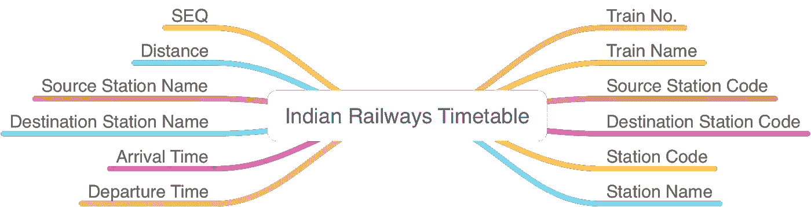
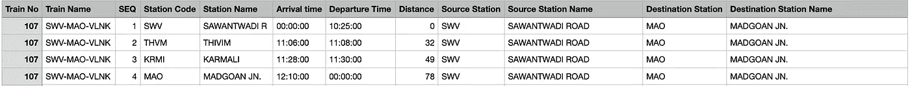
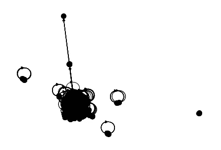
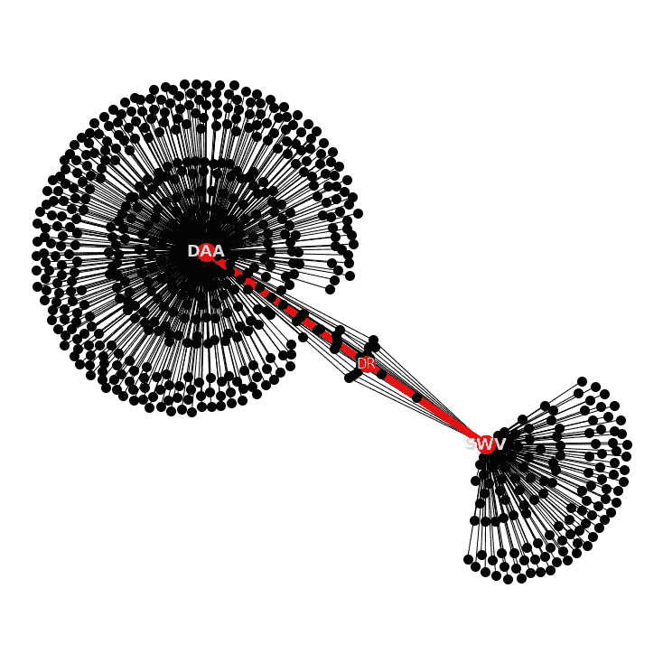
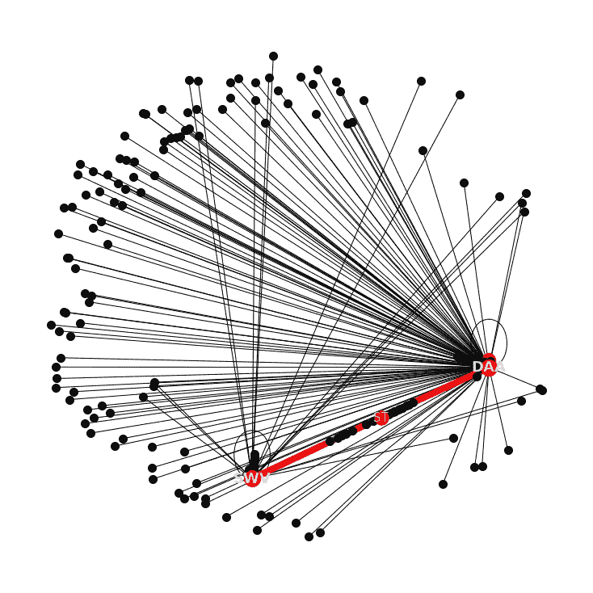
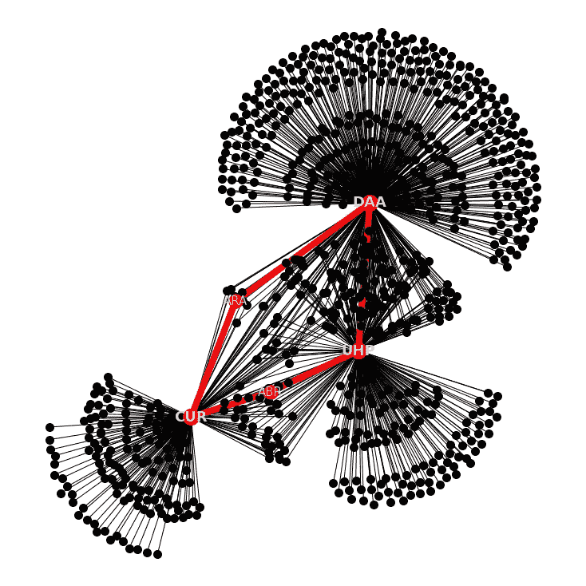
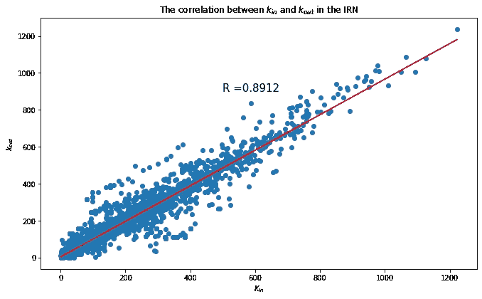
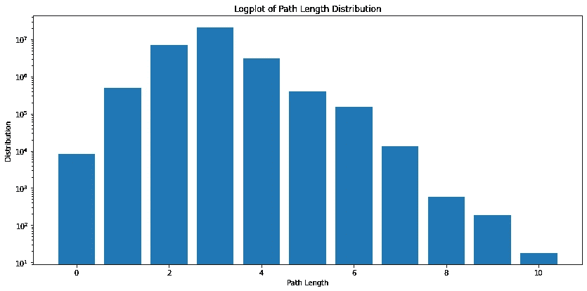

# 印度铁路网分析

> 原文：<https://medium.com/codex/analysis-of-the-indian-railway-network-4fe0c501779e?source=collection_archive---------4----------------------->

## 网络科学方法

## 解构世界第三大铁路网


[亚历山大·波波夫](https://unsplash.com/@5tep5?utm_source=medium&utm_medium=referral)在 [Unsplash](https://unsplash.com?utm_source=medium&utm_medium=referral) 上拍照

火车和铁路网的出现被证明是人类不可或缺的。由于它们易于接近的性质，世界已经变成了一个更小的地方，无论你是在去越野滑雪旅行的路上，还是在向遥远的荒野运送货物和商品的路上，还是在通过 9 号站台学习如何抵御摄魂怪的路上。

几乎每个国家都有自己的铁路网络，剖析这些真实世界的网络有助于我们进行规模扩张、拥堵管理和整体社会经济增长。

本文简要介绍了一个网络科学项目的构成和标志，并强调了所获得的结果和推论。

# 目标

*   从印度铁路网或 IRN 中提取属性和推论。
*   能够查询网络并画出区域间的子图和连接。
*   计算各种中心性测量、可视化和网络参数。

# 资料组

我们分析中使用的数据来自印度政府发布的**印度铁路公司 2017 年 11 月 1 日列车时刻表**。

数据集由以下各列组成:



**印度铁路时刻表**数据集的列。(图片作者)

数据集中的每一行都告诉我们一列具有特定名称和编号的火车，它在所述时间内从特定的源出发，跨越确定的距离，行驶到特定的目的地。

对于从源 A 行驶到最终目的地 Z 的火车，火车将在旅程中停靠的每个车站都有行，由递增的序列号分隔。请看数据集的这张快照。



数据集快照— **印度政府发布的 2017 年 11 月 1 日**印度铁路列车时刻表。

在上面的快照中，我们有一个关于一列名为*“SWV-毛-VLNK”*的火车的故事，它将于 10:25:00 从*萨万瓦迪 R****【SWV】***开往*马德冈 JN* 。**(毛)**，12:10:00 到达，行程 78 公里。列车将在*Thivim*T28【THVM】和*Karmali*T32【KRMI】停靠。

我们知道这是火车经过的路径，因为它友好地用 SEQ 表示的递增序列号向我们突出显示。当我们开始查看不同的列车时，SEQ 重置为 1。通过递增 SEQs，与源站和目的站相关的值保持不变。

这样我们就有了 **7580** 车次和 **8147** 不同火车站的数据。

如果你想自己尝试一下数据集，这里有[源](https://data.gov.in/catalog/indian-railways-train-time-table-0?filters%5Bfield_catalog_reference%5D=332021&format=json&offset=0&limit=6&sort%5Bcreated%5D=desc)。

# 网络形成

既然我们已经扫清了保护我们的数据和理解它所代表的意义的第一个障碍，下一个明显的步骤就是形成一个网络，不可否认，没有这个网络，分析数据将变得无限复杂。

我们需要定义一套启发法来驱动我们的网络形成过程。以下是我们为构造定义的规则。

*   每个火车站都是一个独特的节点。
*   如果存在连接两个节点的火车，则这两个节点之间存在边。因此，路线中的每个站点必须通过一条直接边相互连接，形成一个完整的图。
*   可以根据两个节点之间的距离和列车数量来考虑边权重。我们两个都试试。

有了基本规则，我们可以从数据集中删除空值，并根据两个车站之间的列车数量创建有向加权图。

我们正在制作有向图，因为只要调用 *graph* ***，我们就可以随时转换成无向图。*** *to_undirected()，*感谢 networkx。

以下是我们形成的网络的一些基本细节:

```
Number of nodes: 8147
Number of edges: 902602
Average in degree: 110.7895
Average out degree: 110.7895
```

正如我们在上面看到的，IRN 共有 8147 个火车站。用我们上面陈述的试探，我们总共有 902602 条边，平均进出度为 110.7895。

因为，这张图是对 IRN 的直接描绘。将其转换为无向图并获取相同的属性

```
Number of nodes: 8147
Number of edges: 500412
Average degree: 122.8457
```

我们注意到，节点的数量是相同的，而边的数量减少了，这是可以预料的。平均学位也从 110.7895 增加到 122.8457，也是意料之中的。

但是阅读这些价值观并不是很有吸引力。让我们试着加入一些视觉效果。我们应该画出整个图，看看这个网络到底是什么样子。



印度铁路网的春季布局。(图片由作者提供)

公平地说，这张照片对我们的铁路网并不公平。节点和边的数量太大，无法以有意义的方式绘制。

我们需要从这个网络中取出一个子图，这样我们就可以更好地绘图了。你可以在这里找到这段[使用的代码。](https://github.com/suryanktiwari/Indian-Railway-Network-Analysis/blob/main/Data%20Preprocessing%2C%20Querying%20and%20Visualization.ipynb)

# 两个节点之间的计算区域——子图查询和可视化系统

在本节中，我们将一组指定的节点(站)、它们的邻居以及它们之间的最短路径可视化。

我们计划从我们创建的原始铁路网络中查询一组节点。对于这组节点，我们将突出显示从一个站点到另一个站点的最短路径。为了美化图形，我们还将标出我们查询的节点的直接邻居。

要找到这一部分的代码，你可以查看[这本笔记本](https://github.com/suryanktiwari/Indian-Railway-Network-Analysis/blob/main/Data%20Preprocessing%2C%20Querying%20and%20Visualization.ipynb)。
*(注:在基于距离的球杆的链接版本中，边缘权重代码尚未更新)*

**以下是车站代码的子图查询和可视化演示:DAA 和 SWV，以车次作为边权重**



子图突出显示了 DAA 站和 SWV 站之间的最短路线(图片由作者提供)

这里，从 DAA 到 SWV 的最短路线用红色突出显示。最初查询的节点以粗体显示。没有标记相邻的站，因为这只会导致混乱。

我们可以看到从 DAA 到 SWV 还有其他路径，但是突出显示的路径受 networkx 库的 shortest_path 函数的支配，该函数在突出显示最短路径方面做得很好。

请记住，由于我们使用连接车站的列车数量作为我们的边权重，此图不一定给出两个火车站之间的最短物理距离，因此我们在这里没有使用边权重功能。我们只是选择了中间站数最少的路线。

如果我们使用站点之间的距离作为边权重，我们会得到一个完全不同的图。让我们查询一下相同的电台。



子图突出显示了 DAA 站和 SWV 站之间的最短路线，边权重由距离决定(图片由作者提供)

所以我们现在对邻居之间的距离有了一些概念，结果我们原来的路线不是最短的，因为我们现在必须通过不同的车站 st。

为了演示起见，让我们再看一些演示。

我们看到的早期车站是较小的车站。让我们查询新德里(NDLS)、德拉敦(DDN)和班加罗尔(BNCE)的子图。最初，我们看火车计数边加权图。


子图突出显示了 NDLS、DDN 和 BNCE 站之间的最短路线(图片由作者提供)

我们看到相邻的车站层层叠叠，因为它们可以连接的列车数量是一个离散的数字。因此，由 1 列火车连接的站仅一起排序，由 2 列不同火车连接的连接到我们查询的站的邻居一起排序，等等。这当然会产生视觉上令人愉悦的图案。

这里还有一个:



子图突出显示了 DAA、UHP 和 CUR 站之间的最短路线(图片由作者提供)

这很有趣，但是我们不能从这些子图中得出真正的推论。让我们继续寻找一些有用的信息。

# 网络分析和推理

在这一节中，我们将介绍几种中心性的基本定义以及它们的含义。我们还将列出在这些特定领域中具有最高值的顶级站点。

## 程度中心性

定义:度中心性根据每个节点所连接的节点数来计算重要性分数。

***推论:度中心性告诉我们网络中最受欢迎的，或者说连接良好的节点是什么。***

在我们的例子中，这些节点与其他节点或站点的单跳连接最多。这些节点可以以较少的跳数连接到更大的网络。在我们的网络中，连接最紧密、拥有最多信息的站点如下:

```
 STATION NAME		 DEGREE CENTRALITY HOWRAH JN. 		 0.30211146575006137
	 VIJAYWADA JN 		 0.2704394794991407
	 KANPUR CENTR 		 0.263810459121041
	 VARANASI JN. 		 0.25767247728946724
	 GHAZIABAD JN 		 0.25202553400441935
	 KALYAN JN 		 0.24797446599558065
	 ITARSI 		 0.24441443653326786
	 LUCKNOW JN. 		 0.243677878713479
	 AHMEDABAD 		 0.23852197397495703
	 MATHURA JN. 		 0.2363123005155905
```

## 中间中心性

定义:介数中心性是一个站节点位于其他站之间的最短路径上的次数的度量。

***推论:该度量显示哪些站充当了将其他站连接在一起的“桥梁”。具有高中间中心性的站将位于两个站之间的最短路径上。这些电视台在网络中有很高的影响力。***

充当桥梁或对网络流量有较大影响的站点如下:

```
 STATION NAME		 BETWEENNESS CENTRALITY HOWRAH JN. 		 0.03406351792928565
	 SEALDAH 		 0.021795409939440936
	 KANPUR CENTR 		 0.020930718809083173
	 VIJAYWADA JN 		 0.015177400281457002
	 AHMEDABAD 		 0.014301664879802252
	 YESVANTPUR J 		 0.014256569821548529
	 VADODARA JN. 		 0.012967968029171826
	 VARANASI JN. 		 0.012623744668081235
	 KOLKATA 		 0.011898350401287686
	 PILIBHIT JN. 		 0.01184539309233258
```

## **接近中心性**

定义:紧密度中心性根据每个车站节点与铁路网络中所有其他车站的“紧密度”为其分配分数。

***推论:接近中心性有助于找到最快速影响整个铁路网的车站。这种方法有助于识别网络中的优秀“广播公司”。***

具有最高接近中心性的站按顺序如下:

```
 STATION NAME		 BETWEENNESS CENTRALITY HOWRAH JN. 		 0.5124082033874587
	 AHMEDABAD 		 0.5107660799308908
	 VADODARA JN. 		 0.5063522924820026
	 KANPUR CENTR 		 0.5062879529276847
	 VARANASI JN. 		 0.5052287059583946
	 NEW DELHI 		 0.5051966767517281
	 KALYAN JN 		 0.5036640360941574
	 MUGHAL SARAI 		 0.5035049206471066
	 VIJAYWADA JN 		 0.5021406666088064
	 ITARSI 		 0.4998101090743702
```

## **特征向量中心性**

定义:这种方法的工作原理类似于度中心性，通过测量一个站点基于其度对其他站点的影响，但它也考虑了诸如站点的良好连通性以及整个网络中连接了多少个节点等等。

***推论:特征向量中心性是一个很好的全面的度量。它显示哪些站对整个网络有影响，而不仅仅是它所连接的站。***

```
 STATION NAME		 BETWEENNESS CENTRALITY VARANASI JN. 		 0.07072646825994845
	 HOWRAH JN. 		 0.0696564673531263
	 KANPUR CENTR 		 0.06676069453032213
	 ITARSI 		 0.06674728443587287
	 NEW DELHI 		 0.06624320025503437
	 LUDHIANA JN. 		 0.06593208791866616
	 MATHURA JN. 		 0.06569071466478024
	 KALYAN JN 		 0.06527068019550916
	 PATNA JN. 		 0.06473312502358505
	 MUGHAL SARAI 		 0.06457963445769375
```

# 基于地理位置的推断

基于站(节点)-度关系的印度铁路网中的主要站可以从度中心性来推断。这些站点根据其地理位置进一步分为两组:

1.  印度大都市附近的车站。例如:加尔各答附近的豪拉、新德里附近的加济阿巴德和孟买附近的卡良车站
2.  位于国家中部或连接国家不同地区的铁路线交汇点的车站。比如:Vadodara 路口，Vijaywada 路口。这些站点是网络中潜在的拥塞点，因为与大城市附近的站点相比，它们没有太多的资源。

所有这些节点都处理大量流量。

例如:

1.  豪拉-靠近加尔各答，这是一个大都市。(类型 1)可能拥有更多资源。
2.  伊塔西瀑布位于该国中部地区。(类型 2)可能具有较少的资源并导致拥塞。

# 一般推论

```
Number of trains: 7580Number of stations: 8147Longest train route: 4260 km. Train =  15905 CAPE - DBRG . Starting station:  KANNIYAKUMARI . Ending Station:  DIBRUGARHShortest train route: 1 km. Train =  3308 PLJE-SZE MEM . Starting station:  PHULWARTANR . Ending Station:  SONARDIHMaximum distance between any two consecutive stations: 1301  km with train RSD-PJP BSFMinimum distance between any two consecutive stations: 1  km with train  LGL KNJ EMUAverage total train route distance: 439.7 kmAverage distance between consecutive stops 17.91 km
```

通过这些部分，我们对网络进行了一些推断，这可以帮助我们确定可能的拥塞点和其他一般细节。在下一节中，我们将深入探讨基于网络的属性。

这一节的代码可以在[这本笔记本里找到。](https://github.com/suryanktiwari/Indian-Railway-Network-Analysis/blob/main/Centrality%20Measures%20and%20Inferences.ipynb)

# 进一步的网络分析

在这最后一部分，我们来看看 IRN 的一些常见网络属性。这些主题将松散地结合在一起，但将突出有关网络的重要信息。

## 绘制 IRN 的入度 kᵢₙ和出度 kₒᵤₜ之间的相关性。

入度定义为到达一个节点的路径数量，而出度定义为网络中离开一个节点的路径数量。IRN 的入度与出度的相关图为:



IRN 的入度和出度之间的相关性。(图片由作者提供)

*   强的入度和出度相关性以及 0.8912 的高**互易参数 R 都表明 **IRN 是一个对称网络**。**
*   为有向图计算的互易性被定义为指向两个方向的边的数量与图中边的总数的比率。
*   **以上推论表明，如果有 I 站到 j 站的列车，也有很大的可能性有 j 站到 I 站的列车**

## 关于铁路网节点连通性的思考

以下是我们网络中度数最高的站点:

```
The 4 stations having the highest degree (that are directly accessible the most) by different stations in the Indian Railway Network are:
HOWRAH JN. 1284
VIJAYWADA JN 1171
VARANASI JN. 1124
KANPUR CENTR 1119
```

## 铁路网的路径长度分布

路径长度被定义为两个节点之间的最短距离。平均路径长度是所有节点对的平均路径长度的平均值。

通过计算有多少节点对(源站和目的站)具有特定的路径长度，我们找到了网络的路径长度分布。



IRN 的路径长度分布(图片由作者提供)

上图推断，大多数节点对都是以最短路径长度 3 连接的。

这些站相互连接的最大距离为 10，这样做的节点对的数量为 18。想象一下，换乘 10 列火车到达你的车站。

这最后一部分的代码可以在本笔记本的[中找到。](https://github.com/suryanktiwari/Indian-Railway-Network-Analysis/blob/main/Network%20Analysis.ipynb)

我们还做了一些实验，可以在这个项目的 [Github 库](https://github.com/suryanktiwari/Indian-Railway-Network-Analysis)中找到。

请随意放弃任何评论或任何可以在此主题上进一步执行的想法。

感谢阅读。

# 贡献:

[**甘内什·巴格勒博士**](https://www.iiitd.ac.in/bagler) —全程指导。

**素拉克·提瓦里** ( [素拉克·提瓦里](https://medium.com/u/f5220f19938?source=post_page-----5710ee869505-----------------------------------)

**罗斯维尔马(** [罗斯维尔马](https://medium.com/u/4f0aadbc3369?source=post_page-----5710ee869505-----------------------------------) **)**

哈什塔·潘迪

该项目已在 [IIITD](https://www.iiitd.ac.in/) 为网络科学 2021 课程完成。