# 用 PYTHON 分析紧急事件— 911 电话

> 原文：<https://medium.com/codex/analysis-on-emergency-911-calls-with-python-ff8a63b3f06c?source=collection_archive---------25----------------------->

关于项目
众所周知，紧急情况是指无法预见或突然发生的事情，需要立即采取补救措施或行动。在某些时候，我们倾向于更多地考虑为什么会有一些紧急呼叫，这是我决定对 911 呼叫数据集进行一些分析的主要原因。

**获取数据**
对于这个项目，我将分析来自宾夕法尼亚州蒙哥马利郡[卡格尔](https://drive.google.com/file/d/1nZdt9ShDU02rRmVVjP6QVSF4D-3CgSbs/view?usp=drivesdk)的一些 911(紧急呼叫)数据。该数据包含以下字段:

lat:字符串变量，纬度

lng:字符串变量，经度 desc:字符串变量，紧急呼叫的描述

zip:字符串变量，邮政编码

标题:字符串变量，标题

时间戳:字符串变量，YYYY-MM-DD HH:MM:SS

twp:字符串变量，城镇

addr:字符串变量，地址

e:字符串变量、虚拟变量(始终为 1)

**PYTHON 库导入**
一个库，它是我们包含在 PYTHON 代码中的函数集合，在需要时调用。使用库，可以导入预先存在的函数，这将有效地扩展代码性能。对于这个项目，我将导入以下库 pandas，numpy，matplotlib，seaborn，sklearn e.t.c .然后设置%matplotlib inline，因为我使用的是 Jupiter 笔记本

**程序**
采取了很多程序，我将逐一讨论它们。

1. ***读入-911 将数据集称为一个名为“df”的数据帧***
读入文件有几种方法。在这个项目中，我使用了熊猫图书馆。它允许您读取带有多个分隔符的文件，并使用 info()方法返回有关数据帧的基本信息。

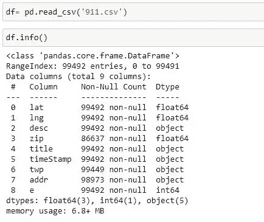

2. ***检查数据集的头部***
head()函数是熊猫库中的一个函数。它用于获取数据帧的前 n 行。这对于测试对象中是否有正确的数据类型很有用。

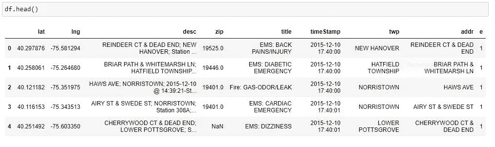

**回答一些基本问题**

1. ***拨打 911 电话的前 5 位邮编***

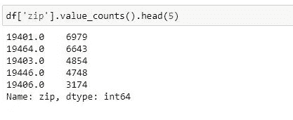

2.***【Twp】911 来电前 5 名乡镇***

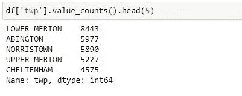

**创建新特征**
在标题栏中，标题代码前有指定的“原因/部门”。这些是紧急医疗服务，消防和交通。我会用。使用自定义 lambda 表达式 apply()创建包含该字符串值的名为“Reason”的新列。
例如，如果“标题”列值为“EMS:背痛/受伤”,则“原因”列值为“EMS”。

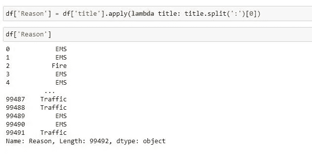

3.基于这个新专栏的 911 报警电话最常见的原因是什么？

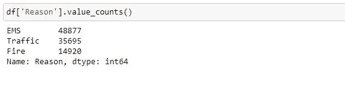

4.现在使用 seaborn 创建一个 911 电话的原因计数图。

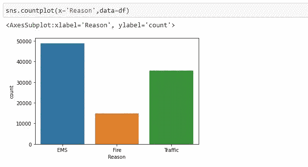

5.我将查看 911 电话发生的时间，但首先，让我们将时间戳列的数据类型从字符串更改为日间。

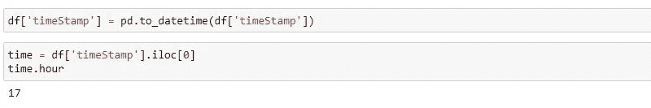

6.既然时间戳列实际上是 DateTime 对象，那么使用。apply()创建 3 个名为小时、月和星期几的新列。您将基于时间戳列创建这些列。

注意星期几是一个 0-6 的整数。使用。map()使用此字典将实际的字符串名称映射到一周中的某一天:
dmap = {0:'Mon '，1:'Tue '，2:'Wed '，3:'Thu '，4:'Fri '，5:'Sat '，6:'Sun'}

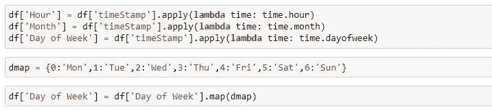

7.我使用 seaborn 创建了一个星期几列的计数图，其色调基于原因列。

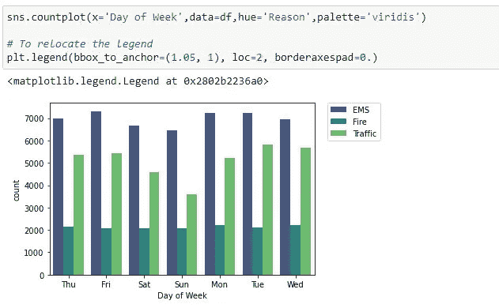

8.我使用 seaborn 创建了一个月列的计数图，其色调基于原因列。

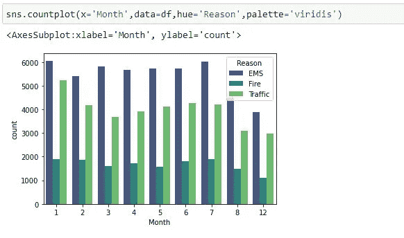

9. ***你有没有注意到剧情有些奇怪？***
你应该已经注意到它丢失了几个月，让我们看看我们是否可以通过以另一种方式绘制信息来填充这些信息，可能是一个简单的填充丢失月份的线图，为了做到这一点，我们需要做一些关于熊猫的工作。
现在创建一个名为 byMonth 的 gropuby 对象，在这里您按照 Month 列对 DataFrame 进行分组，并使用 count()方法进行聚合。对这个返回的数据帧使用 head()方法。

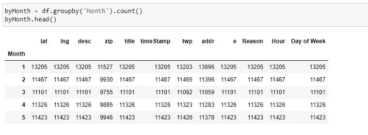

10.现在在数据框上画一个简单的图表，显示每月的通话次数。可能是任何列。

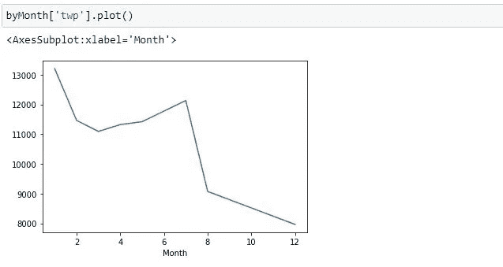

11.我使用 seaborn 的 lmplot()对每月的通话次数进行了线性拟合。请记住，您可能需要将索引重置为列。

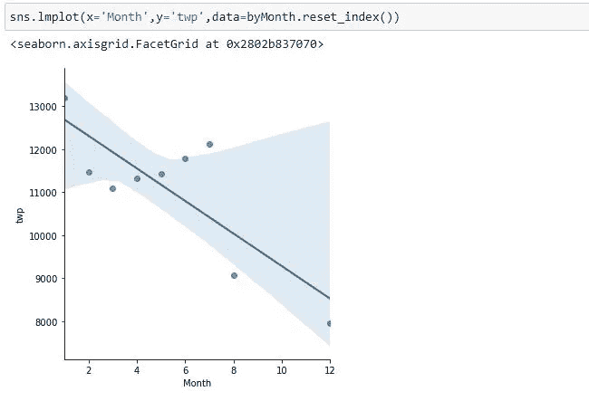

12.创建一个名为“Date”的新列，其中包含时间戳列中的日期。您需要将 apply 与。date()方法。

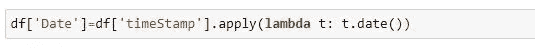

现在用 count()聚合 groupby 这个日期列，并创建一个 911 呼叫计数图。

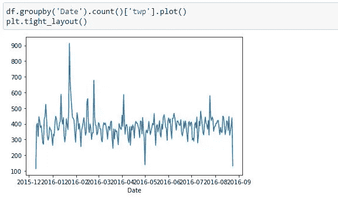

13.现在，我将重新创建上述三个独立的图，每个图代表拨打 911 电话的一个原因。

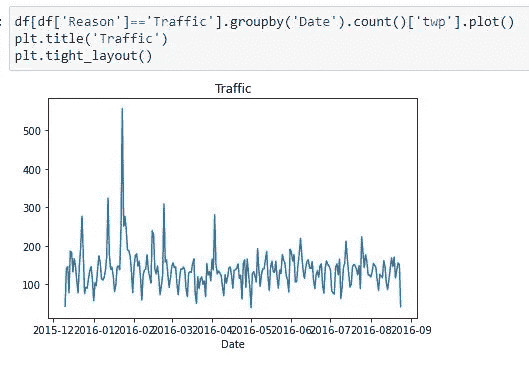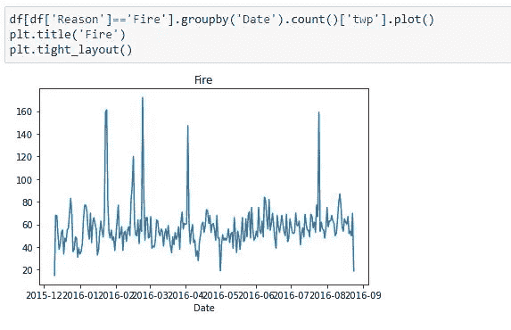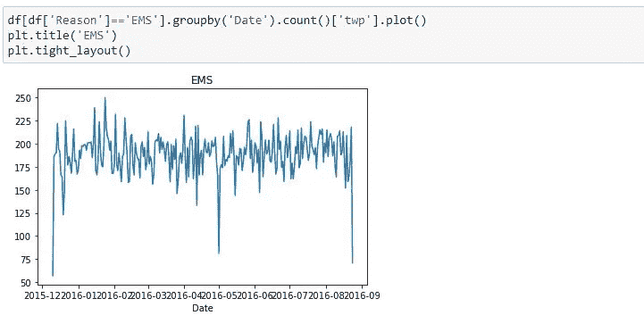

现在让我们继续用 seaborn 和我们的数据创建热图。我们首先需要重构数据帧，使列变成小时，索引变成星期几。有很多方法可以做到这一点，但我建议尝试将 groupby 与 unstack 方法结合使用。

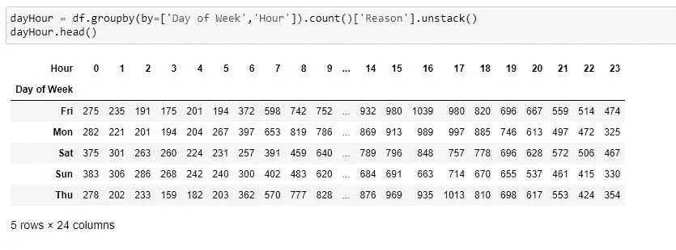

14.然后，我使用这个新的数据框架创建了一个热图。

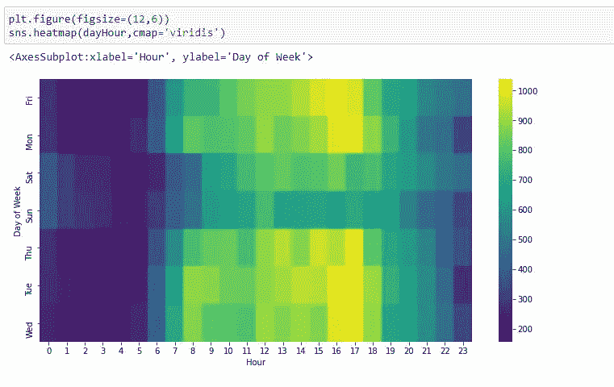

15.我还重复了上面的绘图和操作，得到了一个以月份为列的数据帧。

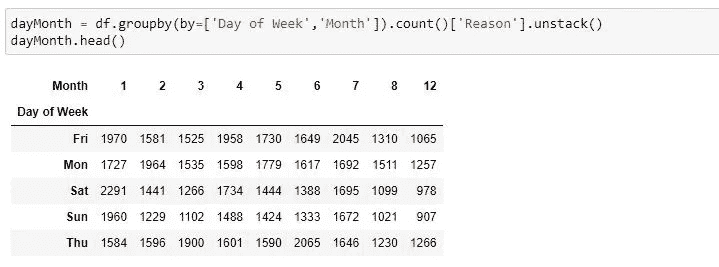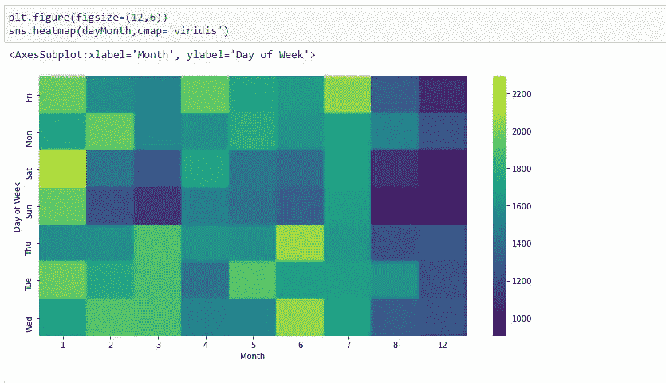

**结论**

从目前的分析中，我已经能够发现一些真知灼见，包括:
。Lower Merion 是 911 报警电话最多的城镇，大约有 8443 个报警电话

EMS 是拨打 911 的常见原因，其次是交通原因

在一周的几天中，注意到周日因交通原因拨打 911 的情况较少，而周二因同样原因拨打 911 的情况最多。在一周的所有日子里，911 呼叫最常见的原因是 EMS，而最少的原因是火灾。

就交通原因而言，一月份的 911 电话最多，而十二月份最少。

就火灾原因而言，7 月份拨打的 911 电话最多，12 月份最少。

就 EMS 原因而言，一月份的 911 电话最多，而十二月份最少。

从对数据进行的分析来看，12 月因各种原因拨打的 911 电话最少。因此，这意味着年底无论什么原因打来的 911 电话都会减少。

感谢您浏览我的项目，非常感谢您的意见和建议，您可以在评论环节留下您的意见，直接给我发电子邮件[ [此处](http://usangajonah@gmail.com) ]或通过下面我的其他社交媒体平台联系我。

[领英](https://www.linkedin.com/in/jonahusanga)

[推特](https://twitter.com/Jobenofficial?t=F06epko9lD5L8p3-VkkT9w&s=09)

[Github](https://github.com/Usangajonah)

[数据集](https://drive.google.com/file/d/1nZdt9ShDU02rRmVVjP6QVSF4D-3CgSbs/view?usp=drivesdk)

[完整代码](https://github.com/Usangajonah/ANALYSIS-ON-EMERGENCY-911-CALLS/blob/main/Analysis%20on%20911%20calls%20.ipynb)