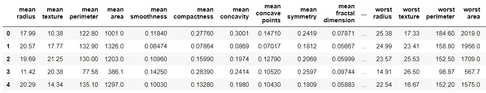
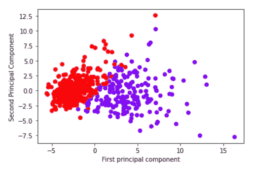
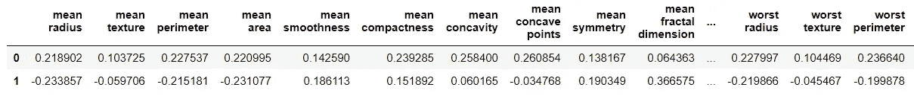
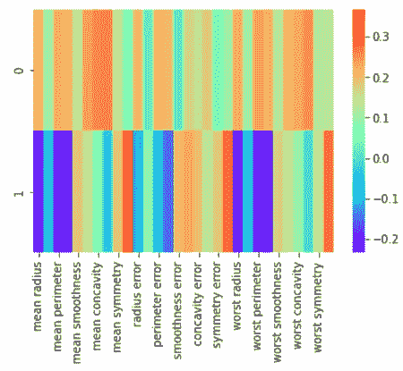

# 使用主成分分析(PCA)分析数据

> 原文：<https://medium.com/codex/analyzing-data-using-principal-component-analysis-pca-836802e7e7fb?source=collection_archive---------8----------------------->

## 使用 Python 了解和理解 PCA 的指南。


弗兰基·查马基在 [Unsplash](https://unsplash.com/s/photos/data?utm_source=unsplash&utm_medium=referral&utm_content=creditCopyText) 上拍摄的照片

# 什么是主成分分析？

主成分分析是一种无监督学习技术，缩写为 PCA。它也被称为一般因素分析。它用于研究一组变量之间的相互关系，以便找出这些变量的潜在结构。它用于分析数据。

# 它是如何工作的？

PCA 产生几条正交线，它们很好地拟合了数据。正交线是 n 维空间中相互垂直的线。因此，如果创建了一条回归线，那么垂直于这条线的线将是正交线。现在组件的概念出现了。组件是一种线性变换，它为数据集选择一个变量系统，使数据集的第一个最大方差位于第一个轴上，第二个最大方差位于第二个轴上，依此类推。该程序减少了分析过程中使用的变量数量。

# 如何用 Python 实现？

这里使用的数据集将是乳腺癌的内置 scikit 学习数据。使用主成分分析，数据将被转换，并找出哪些特征解释了数据中的最大差异。

**→导入库**

导入了处理数据的基本库，如 pandas 和 numpy。与它一起用于可视化的还有 matplotlib 和 seaborn。

```
**>>> import** pandas **as** pd
**>>> import** numpy **as** np
**>>> import** matplotlib.pyplot **as** plt
**>>> import** seaborn **as** sns
**>>> %**matplotlib inline
```

**→读取数据**

乳腺癌数据从 sklearn 导入。

```
**>>> from** sklearn.datasets **import** load_breast_cancer
>>> data **=** load_breast_cancer()>>> data.keys()
dict_keys(['data', 'target', 'frame', 'target_names', 'DESCR', 'feature_names', 'filename'])>>> df **=** pd.DataFrame(data['data'],columns**=**data['feature_names'])
>>> df.head()
```



**→ PCA 可视化**

PCA 将用于找到前两个主成分，并在新的 2-D 空间中可视化数据。为此，将对数据进行缩放，以便每个要素都有一个单位方差。从 sklearn 导入标准标量模块，其对象适合数据。

```
**>>> from** sklearn.preprocessing **import** StandardScaler
>>> scaler **=** StandardScaler()>>> scaler.fit(df)
StandardScaler()
```

现在，这些数据被转换。

```
>>> scaled_data **=** scaler.transform(df)
```

现在从 sklearn 导入 PCA，创建它的对象。指定了组件的数量。然后使用 fit()方法找到主成分。然后使用 transform()函数，进行旋转和降维。

```
**>>> from** sklearn.decomposition **import** PCA
>>> pca **=** PCA(n_components**=**2)>>> pca.fit(scaled_data)
PCA(n_components=2)
```

数据被转换成它的前两个主成分。

```
>>> x_pca **=** pca.transform(scaled_data)
```

现在可以比较原始数据和转换后的数据，发现转换后的数据有两个部分。

```
>>> print(scaled_data.shape)
>>> print(x_pca.shape)
(569, 30)
(569, 2)
```

所以现在从 30 维减少到 2 维。可以绘制这两个分量。

```
>>> plt.scatter(x_pca[:,0],x_pca[:,1],
c**=**data['target'],cmap**=**'rainbow')
>>> plt.xlabel('First principal component')
>>> plt.ylabel('Second Principal Component')
```



因此，使用这两个组件，分类可以很容易地完成。

**→了解组件**

这些组件是原始功能的组合。它们被存储为适合的 PCA 对象的特征。因此，当我们查看下面以 NumPy 矩阵形式出现的 PCA 分量时，每行代表一个主分量，每列对应于原始特征。

```
>>> pca.components_
array([[ 0.21890244,  0.10372458,  0.22753729,  0.22099499,  0.14258969,
         0.23928535,  0.25840048,  0.26085376,  0.13816696,  0.06436335,
         0.20597878,  0.01742803,  0.21132592,  0.20286964,  0.01453145,
         0.17039345,  0.15358979,  0.1834174 ,  0.04249842,  0.10256832,
         0.22799663,  0.10446933,  0.23663968,  0.22487053,  0.12795256,
         0.21009588,  0.22876753,  0.25088597,  0.12290456,  0.13178394],
       [-0.23385713, -0.05970609, -0.21518136, -0.23107671,  0.18611302,
         0.15189161,  0.06016536, -0.0347675 ,  0.19034877,  0.36657547,
        -0.10555215,  0.08997968, -0.08945723, -0.15229263,  0.20443045,
         0.2327159 ,  0.19720728,  0.13032156,  0.183848  ,  0.28009203,
        -0.21986638, -0.0454673 , -0.19987843, -0.21935186,  0.17230435,
         0.14359317,  0.09796411, -0.00825724,  0.14188335,  0.27533947]])
```

可以绘制热图来显示特征和主要成分之间的关系。

```
>>> comp **=** pd.DataFrame(pca.components_,
columns**=**data['feature_names'])
>>> comp
```



```
>>> sns.heatmap(comp,cmap**=**'rainbow',)
```



> *这里指笔记本*[](https://github.com/jayashree8/Machine_learning_PCA/blob/master/PCA.ipynb)**。**

## *初级机器学习书籍可以参考:*

*[](https://amzn.to/3i3XU1A) [## Python 机器学习:机器学习和深度学习的 Python 编程初学者指南](https://amzn.to/3i3XU1A) [](https://amzn.to/3fQc6IW) [## 一百页的机器学习书](https://amzn.to/3fQc6IW) 

## 可以参考的高级机器学习书籍:

[](https://amzn.to/2SxwQNw) [## 用 Scikit-Learn、Keras 和张量流进行机器学习:概念、工具和技术…](https://amzn.to/2SxwQNw) [](https://amzn.to/3wz62eE) [## 模式识别和机器学习(信息科学和统计学)](https://amzn.to/3wz62eE) 

> *联系我:* [*LinkedIn*](https://www.linkedin.com/in/jayashree-domala8/)
> 
> *查看我的其他作品:* [*GitHub*](https://github.com/jayashree8)*