# 用 Python 分析尼日利亚的经济前景。

> 原文：<https://medium.com/codex/analyzing-nigerias-economic-outlook-using-python-938ab9fa77b8?source=collection_archive---------7----------------------->

> 我们隐约听到很多关于大多数非洲国家经济的谣言、事实和可怕的预测；尤其是尼日利亚。好吧，让我们客观地看问题。让数据自己说话。在本文中，我们将' *datasmiths* '。我们试图从手头的数据中描绘出尼日利亚经济的真实面貌。这些数据，可以在 [**这里找到**](https://drive.google.com/file/d/1B1Wn6ct7Z9JVIF8nJuut21CnJaCK-5Wd/view?usp=drive_web&authuser=3)**是从 [data.world](http://data.world) 网站**下载的。****

**在数据分析中，您需要采取不同的步骤，第一步是导入您的库(编程语言中的库是用户可以用来优化任务的预写代码的集合)，如 pandas、NumPy、Matplotlib、Seaborn 等。然后导入要分析的数据集。我导入了将要使用的库(这对我来说是最好的部分)，然后导入了数据集。如果您成功完成了这些任务，您就完成了**数据提取**。**

****

# ****数据清理****

**这是我提取数据集后做的下一件事。对于一个刚刚开始数据分析之旅的人来说，清理数据需要做很多工作。为了了解我正在处理的数据类型，我必须查看我笔记本上的数据，我使用了*。头()*，*。describe()，。形状，。isna()* 等。*。isna()* 可帮助您了解数据集中是否存在缺失值，缺失值会影响您的分析。我检查缺失值，并使用*用新值零(0)填充缺失值。*fillna(0)法。**

**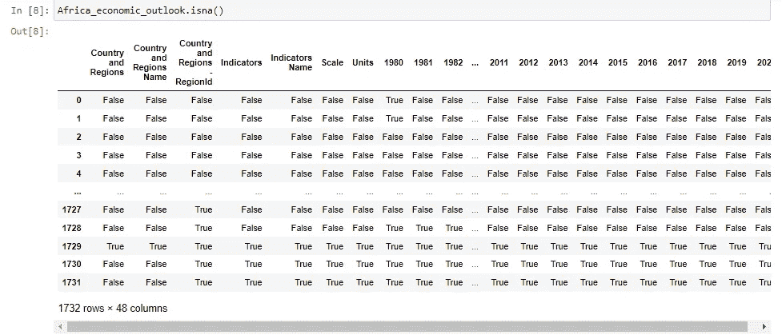**

**为了进一步了解每一列缺失值的总数，我使用了*。isna()。sum()* 方法如下图所示**

**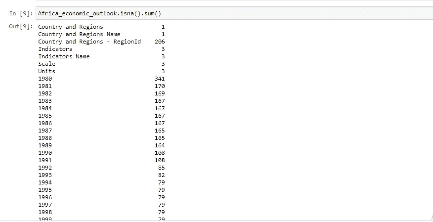**

**我有很多缺失的值。填完之后，我通过检查填完之后缺失值的总和来检查我所做的是否正确。**

**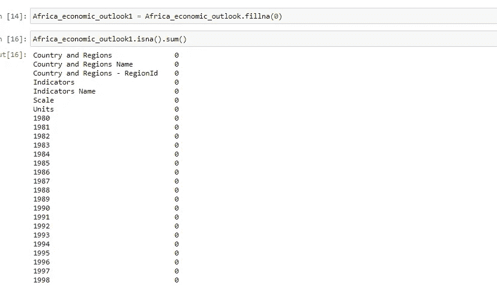**

**请记住，我只是试图分析尼日利亚的经济前景，但我的数据仍然包括其他非洲国家。我不得不从数据中删除所有其他国家**

**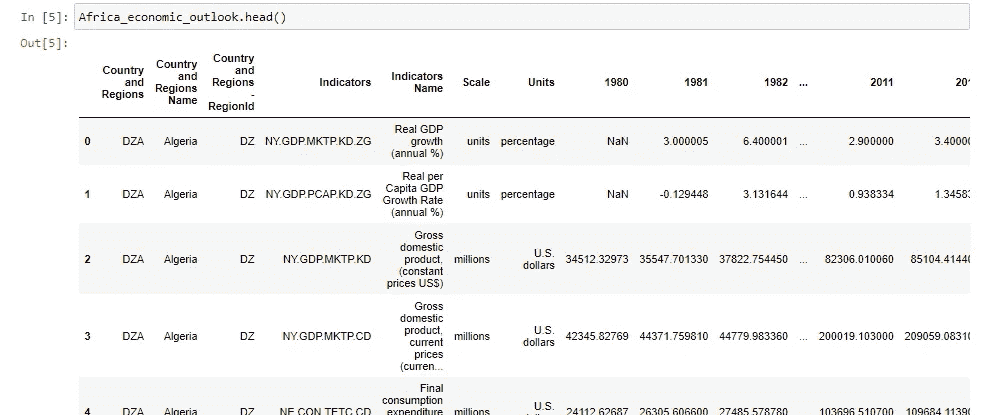****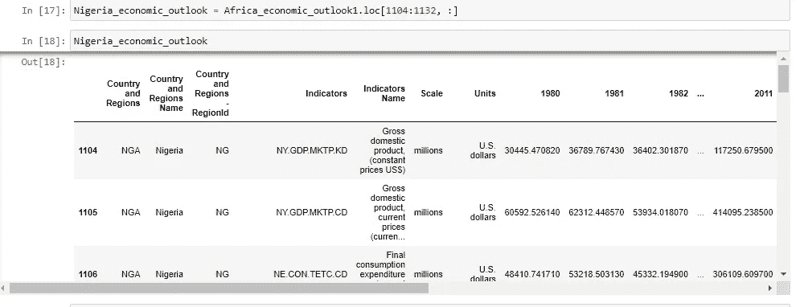****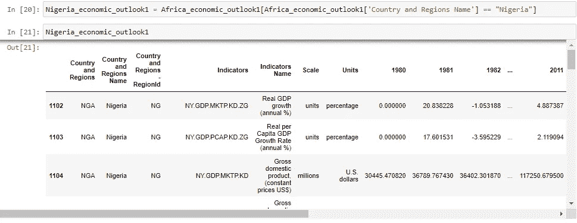**

**可以用几种方法来选择只有国家尼日利亚的行。如上图所示，我展示了两种方法。*。loc* 方法，你必须知道尼日利亚的指数范围。我还展示了另一个方法*(Nigeria _ economic _ outlook 1 = Africa _ economic _ outlook 1[Africa _ economic _ outlook 1[' Country and Regions Name ']= = " Nigeria "])*，它只挑选出包含尼日利亚的行，而不包含其他没有尼日利亚的行。此时，数据已经被清理到一定程度，我们现在可以重新排列数据了。数据重排仅在必要时进行。**

# ****数据角力****

**这指的是各种旨在将原始**数据**转换成更易于使用的格式的过程。**

**为了将数据转换成易于阅读的格式，我做了一个. transpose()。这样做是为了使当前的第一列成为标题。下图会给出更好的解释。**

**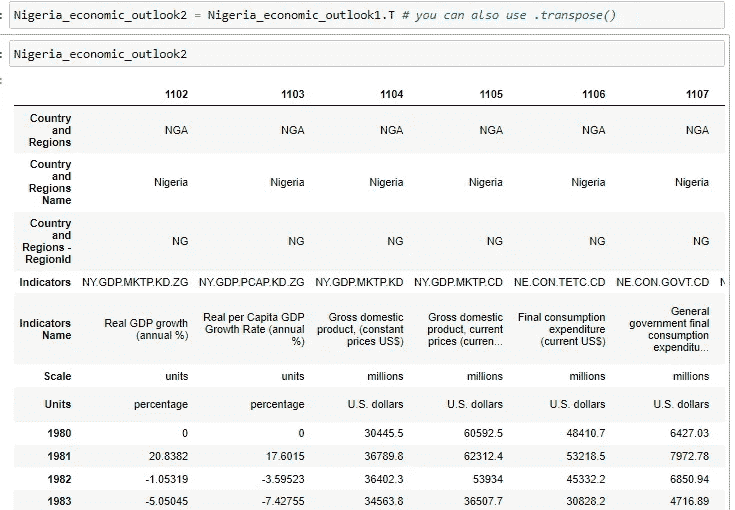**

**下一件事是使指标名称及其所有属性成为标题。我使用。iloc 方法，并将其添加为新列，这样我就可以将其转换为标题，因为我希望它成为我的新标题，如下所示。**

**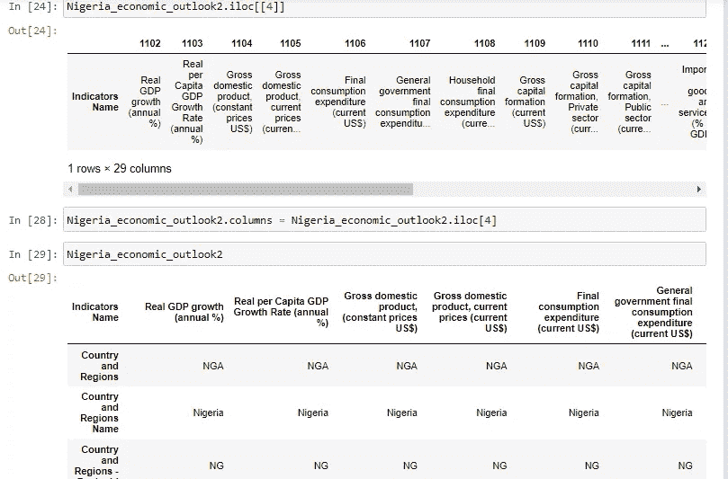****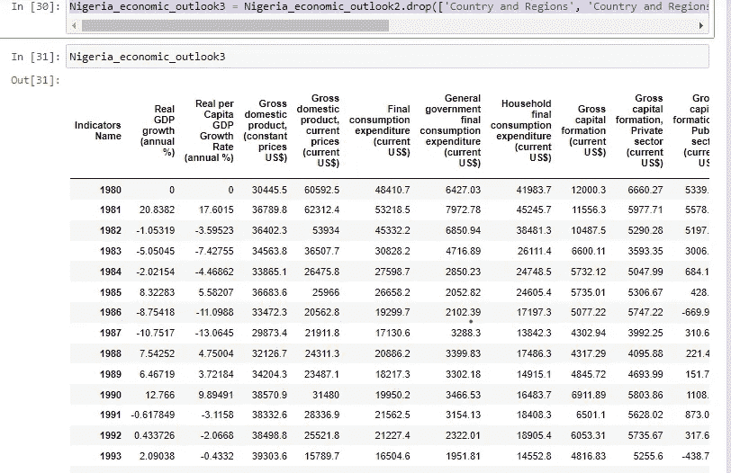**

**我终于有了我的标题，我不得不使用上面的代码删除其他不需要的列。年份的索引被标记为指标名称，我决定将标签改为年份，并将指标名称作为索引。下面的图片会让你有更好的理解。**

**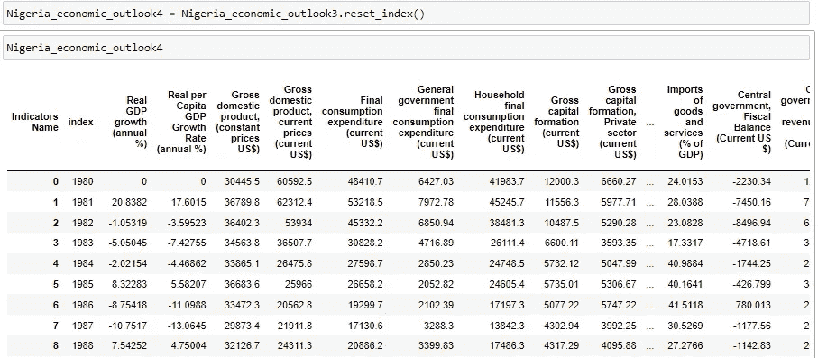**

**在我们进入另一个方面之前，我们现在可以将单词 index 改为 Year，如下所示。**

**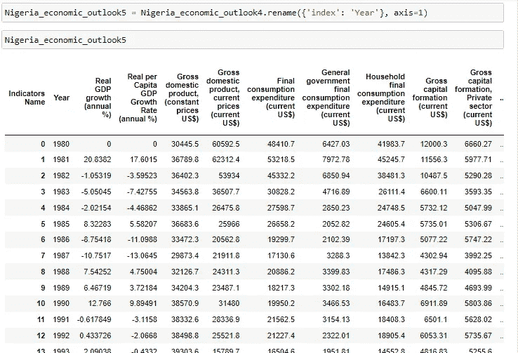**

# ****数据可视化****

**这是一种将信息转化为视觉环境(如地图或图表)的实践，以使人类大脑更容易理解并从试图分析的数据中获得洞察力。数据可视化的主要目标是使识别大型数据集中的模式、趋势和异常值变得更加容易。下面展示了我对数据集做的各种可视化，你可以自己尝试。**

**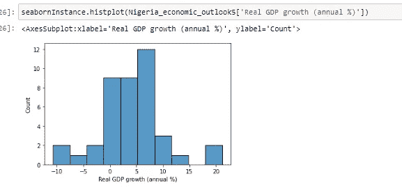****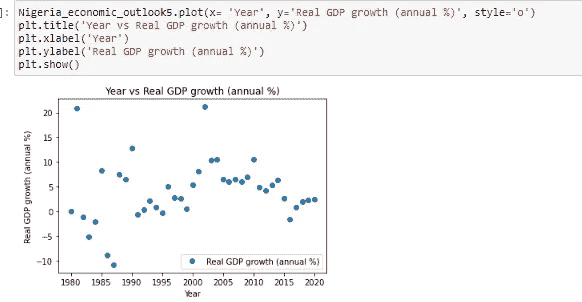****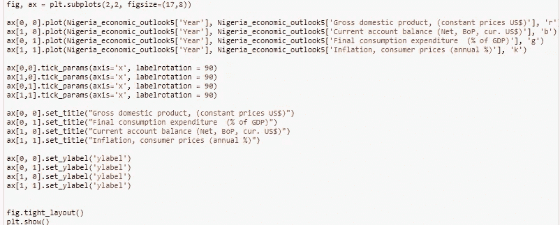**

**上面的图像显示了我们如何制作支线剧情，代码的结果如下所示。**

**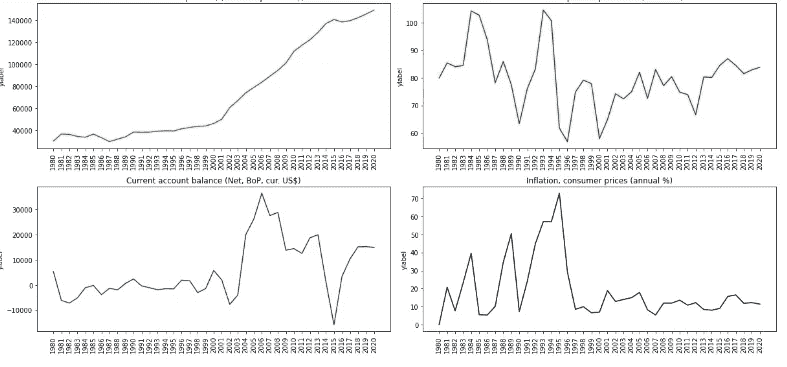****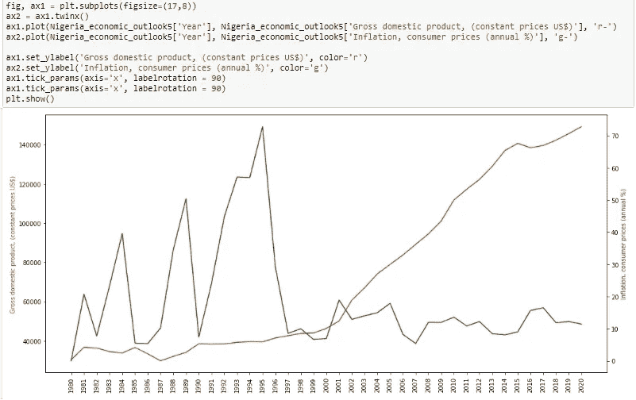**

**上图是通胀和国内生产总值(GDP)两个量的折线图，这基本上显示了通胀和 GDP 之间的关系。根据这个数据集，表明通货膨胀和 GDP 是负相关的。每当通货膨胀率上升时，我们就会看到国内生产总值下降，反之亦然，因为通货膨胀率上升会导致货币购买力下降，从而减少消费，因此国内生产总值也会下降。**

**我们还可以注意到，这些年来国内生产总值有所增加。我们还可以注意到，通货膨胀在 1994 年至 1996 年期间达到最高点。**

# ****机器学习(预测实际 GDP 增长)****

**这是训练机器学习算法以根据要素预测标签、根据必要的需求对其进行调整，并根据维持数据对其进行验证的过程。有不同类型的模型，包括逻辑回归、决策树、线性回归和多元回归。**

**线性回归试图通过将线性方程拟合到观察到的数据来模拟两个变量之间的关系。一个变量被认为是解释变量(自变量)，另一个被认为是因变量。**

**回归分析广泛用于预测和预报，其使用与机器领域有大量重叠。它还可以用来推断自变量和因变量之间的因果关系。重要的是，回归本身仅揭示了固定数据集中因变量和自变量集合之间的关系，例如，建模者可能希望使用线性回归模型将个体的体重与其身高相关联。**

**对于这个特殊的分析，我使用了线性回归模型。该模型旨在通过观察下面的模式，从自变量预测因变量。**

**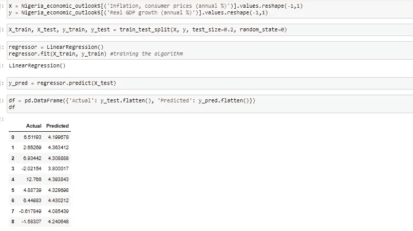****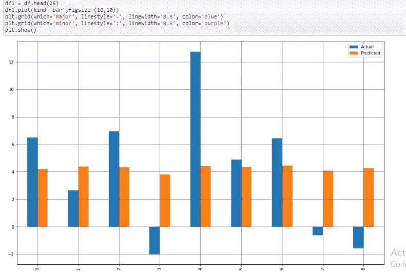****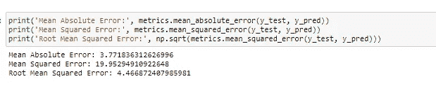**

**如上所述，预测的平均绝对误差大于 1。一个非常精确的预测应该给出小于 0 的平均绝对误差，并且更接近于 0。**

**为了有一个准确的预测，你应该寻找有很强相关性的变量，无论是正相关还是负相关。通过使用*。corr()* 然后创建一个热图(sns.heatmap) *，你应该能够得到一个清晰的可视化，显示你的变量的相关性，如下所示。***

****

**查看上面的热图，您可以看到正相关的变量颜色较浅，负相关的变量颜色较深，既不正相关也不负相关的变量介于两者之间。**

**在这一点上，我们试图使用数据分析和一点点机器学习，从数据中塑造出尼日利亚经济的真实图景。**

**我希望这是一个很好的阅读，我希望你能从这篇分析中学到一两件事。**