# 分析常规文本

> 原文：<https://medium.com/codex/analyzing-regular-text-b8eb99966378?source=collection_archive---------12----------------------->

在这篇文章中，我将涉及以下几点:

*   **简介“常规文本”**
*   **用于分析常规文本的策略**

# **简介**

这是我所做的里程碑项目的一部分，它与医疗保健业务有关，包括回答了多个问题。

在这一部分，我将一步一步更详细地解释如何使用 python 分析来自医疗系统的常规文本，特别是紧急数据。

首先，我想定义一个常规文本。

> 我说的这个数据中的常规文本是什么意思？

> 它是由用户输入的任何请求或回复，然后由计算机以系统的方式写成文本并翻译。

让我们从常规文本中寻找一个样本。

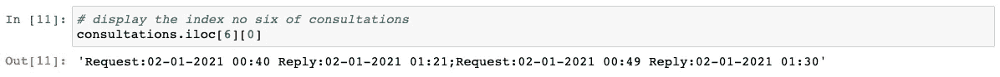

正如我们在上面看到的，这是我所指的常规文本。你可以注意到文本有两个用分号分隔的顺序。每个订单以单词 Request、冒号、日期和时间开始，然后是单词 Reply、冒号、日期和时间。

有一些空格位于日期和时间之间以及时间和单词回复之间。这是六个索引，此外，其他索引具有相同的结构，但日期和时间不同。

让我来问一个问题，当你读完上面的段落后，你可能会想到这个问题。

> 谁输入请求并回复？这篇课文指的是什么？

好的，正如我上面提到的，这是医疗保健数据，特别是紧急数据。每个索引涉及单个患者，且每个患者具有一个或多个订单。这些订单涉及患者接收的咨询。而且，每个订单都包含“请求:日期时间回复:日期时间”。

急诊医生的咨询请求，医疗顾问的答复。当医生需要咨询时，他/她通过医院系统提出请求，并存储为带有日期和时间的请求，这也发生在医疗顾问身上，但存储为带有日期和时间的回复，然后请求和回复作为单个订单存储在患者文件中。

我想现在你已经理解了这些数据中的常规文本，以及医疗系统如何以系统的方式将这些数据存储为文本。

# 使用的策略

作为一名数据科学家，我认为如果你有这样一个简单的挑战，你不需要战略，但当你想向客户展示你的工作时，这将是必要的。正如我们所知，大多数客户对你提取结果的方式不感兴趣，他们感兴趣的是他们在决策中可以依赖的精确结果。所以你应该证明这一点，那就是通过有详细步骤的策略来安排你的工作。

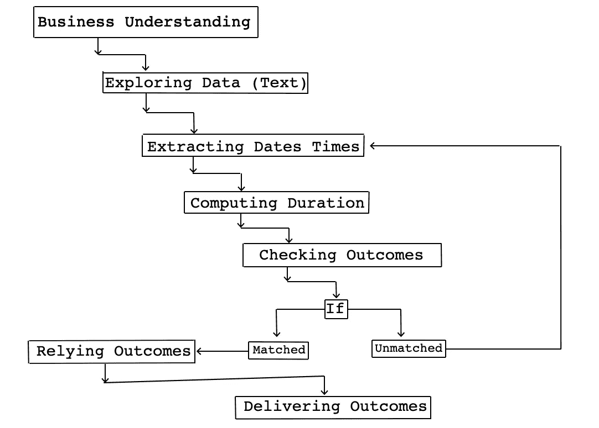

上图向我们展示了所使用的策略，其中包含了我遵循的所有步骤，从**业务理解**开始，直到**交付成果**。让我们看一下这一战略的概况。

当你处理文本时，例如从文本中提取任何东西，我认为你需要更准确，应该确定你的结果。

在这一部分，客户有多个问题，其中一个是关于咨询请求和回复之间的持续时间，我们可以通过提取请求和回复的日期和时间，然后从请求中减去回复的日期和时间来计算。

因此，结果将是持续时间，这些持续时间应该与原始数据相匹配，特别是在将结果交付给客户之前的数据中的日期和时间。

当数据与原始数据不匹配时，这意味着在提取日期和时间或计算持续时间时出现了错误。因此，我们应该回到*提取日期时间步骤*并再次提取和计算它们，然而，如果它匹配，我们可以依赖结果并交付给客户。然后庆祝:)

# 商业理解

这是至关重要的一步，因此接下来的所有步骤都将以此为基础。不要忘记在任何项目中。

我应该回答他们一些主要的问题，这些问题与来急诊室接受医疗咨询的病人有关。他们中的一些人不需要医疗咨询，而其他人已经得到了。

我会见了客户，我们讨论了一些挑战，并提出了以下问题:

> 有多少病人接受或没有接受医疗咨询？
> 
> 总共咨询了多少次？如你所知，有些病人不止接受一次咨询？
> 
> 咨询花费了多长时间，或请求和回复之间的持续时间？
> 
> 数据中咨询次数较多的是多少？
> 
> 有没有没有没有回复的咨询？如果有，有多少？

# 浏览数据(文本)

在这一步中，我导入了`numpy, panda, Matplotlib and seaborn`库，然后加载数据作为数据帧，之后选择了包含常规文本的`consultations` 特征。

在我确定了`consultations`特征后，我打印了前十行，所以每个索引都是针对单个患者的。一些病人没有接受咨询。

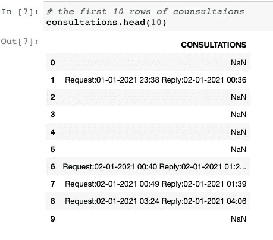

让我们首先找到数据的形状。

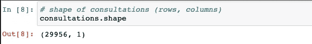

> **有多少患者接受或未接受医疗咨询？**

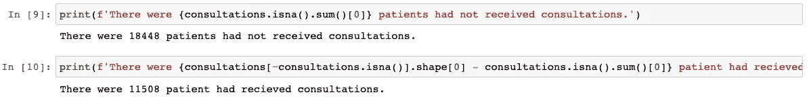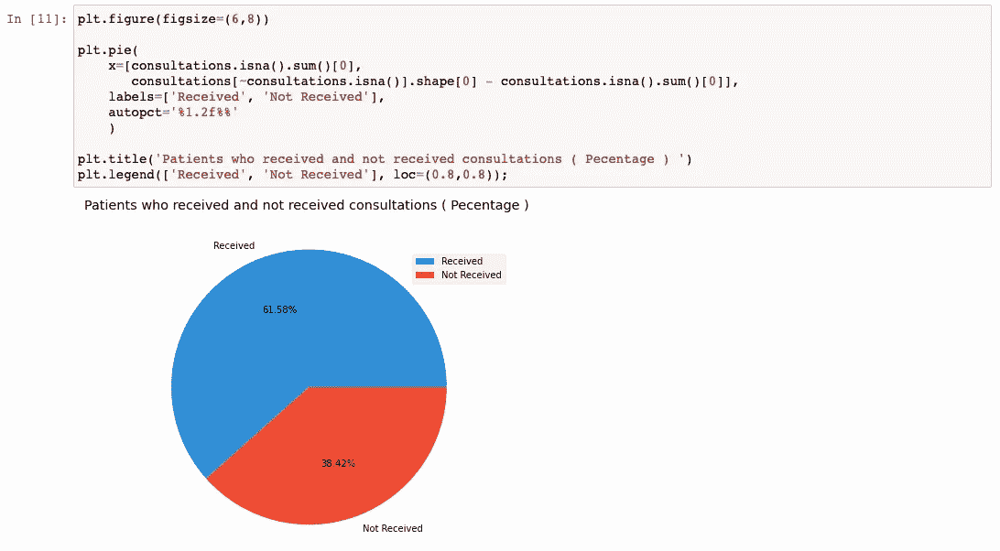

好了，现在让我们来发现常规文本`consultation values.`

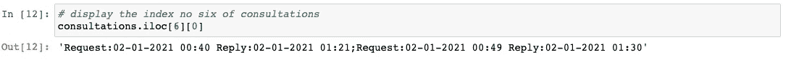

如上所述，我们有两次咨询，每次都有一个请求和回复，因此每次都有日期和时间:

*   请求日期和时间:这是急诊医生安排会诊的日期。
*   回复日期和时间:这是咨询医生回复的日期。

# 从常规文本中提取日期和时间

现在，我们希望提取每个患者的日期和时间，以计算咨询的持续时间。

正如我们在上面的文本中所提到的，每个单独的咨询由分号`;`分隔，这将帮助我们使用分号`;`作为参数的`split`方法来拆分每个单独的咨询，然后我们可以将文本(字符串)转换为列表。

有两个步骤:

1.  将文本(字符串)转换为列表。
2.  确定请求和回复的所有日期和时间索引。

让我们做吧。

## 1.将文本(字符串)转换为列表

我们可以用两种方式拆分每个咨询:

1.  通过使用`apply`和`lambda`功能，然后对字符串使用`split`方法。
2.  通过使用`dictionary comprehension`和使用`split`的方法进行串。

让我们尝试第一种方法，通过使用`apply`和`lambda`函数，然后对字符串使用`split`方法。

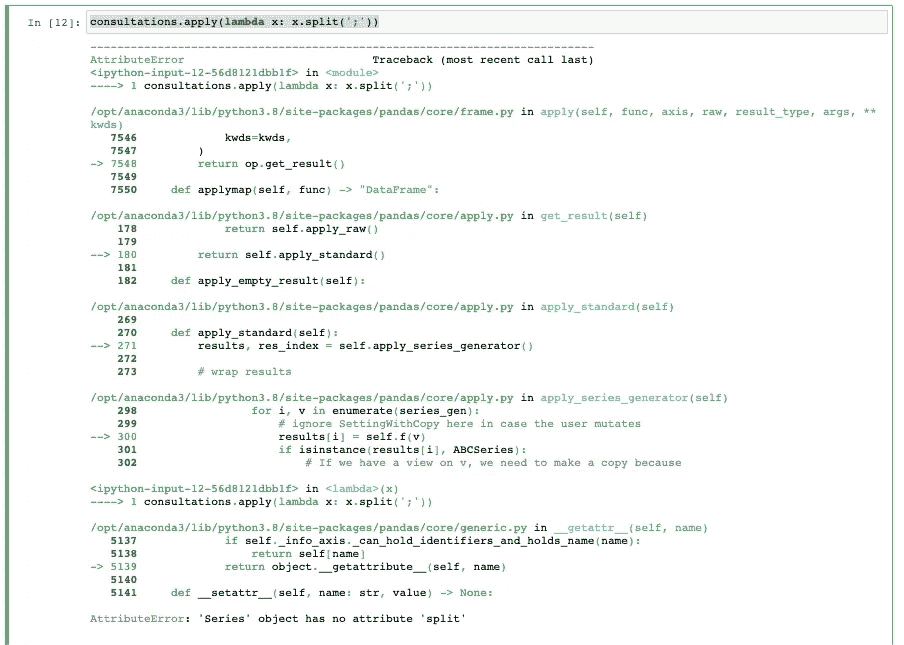

哦，为什么这个错误？

当我们面对一个错误时，我们应该读那个错误的最后一行`AttributeError:'Series' object has no attribute 'split'`。

那是什么意思？

我们对数据帧而不是系列`**CONSULTATIONS**`使用 apply，所以`x`考虑的是数据帧的特征而不是我们系列`**CONSULTATIONS**`的值。

现在，让我们识别序列`**CONSULTATIONS**`，然后使用`apply, lambda`函数和`split`方法。

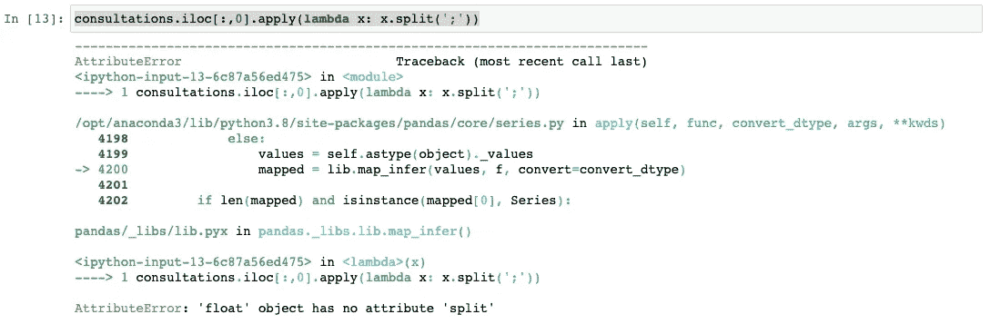

哦，又一个可怕的错误。让我们试着探索错误在哪里？让我们看看这个错误，知道为什么会发生？

`AttributeError:'float' object has no attribute split`，在我们确定系列`Consultations`并使用`apply, lambda`功能和`split`方法后。有一些值是空值，这些值的数据类型是`float`，所以没有属性与`float`对象分离。

我们可以使用`isna()`函数来忽略这些空值，然后使用`apply,lambda`函数和`split`方法来分离每个患者的每个单次咨询`index`。

首先识别系列`CONSULTATIONS`，然后创建`mask`，并在`mask`前使用非符号`~` 来忽略所有空值。

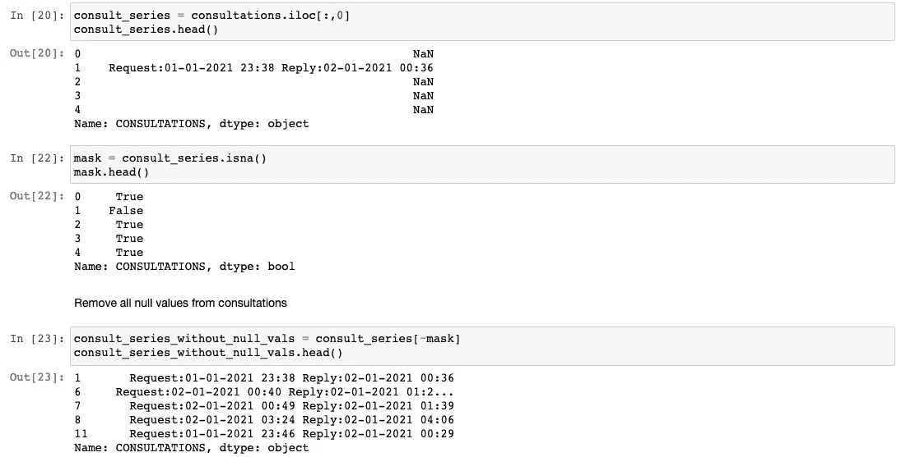

啊呜，我们找到了。

*   正如我们在单元格`23`中看到的，我们有所有没有空值的咨询。
*   每个患者在请求和答复的日期或时间或咨询次数上与其他患者不同。

现在，让我们提取请求日期时间和回复日期时间。通过我提到的第一种方式。

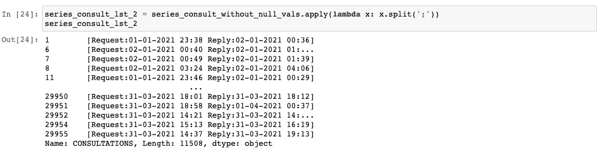

如上所述，我们将每个文本`string`转换为列表，然后用逗号`,`将每个订单“请求:日期时间回复:日期时间”分别拆分为其他订单。

现在，让我们试试我提到的第二种方法。

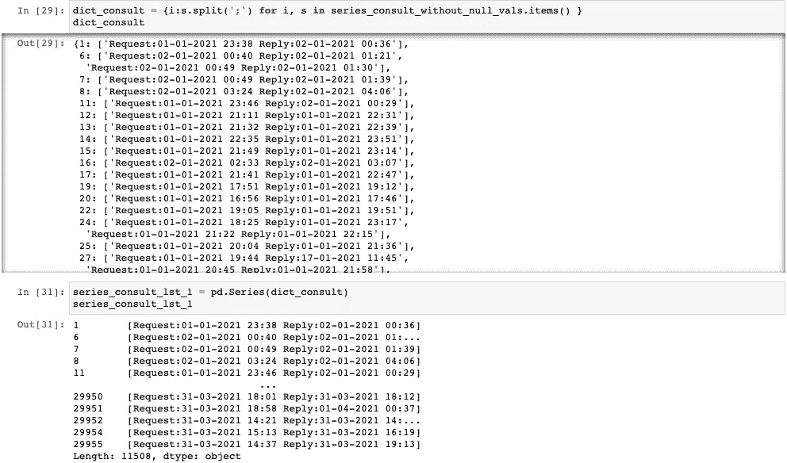

正如我们在上面看到的，我们已经使用了`itmes()`方法，它可以到达序列内部的`keys and values`，并创建了`for loop`，用分号`;`分割每个值(文本)并将其转换为列表。现在，我们应该把字典转换成级数。

让我们以一名患者`index`为例，编号为 6。

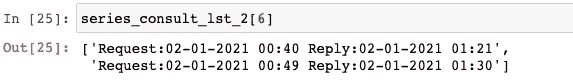

该患者接受了两次咨询，每次咨询都注明了请求日期时间和回复日期时间。

让我们检查一下这个病人在我们分开后是否在原始数据中接受了两次会诊。

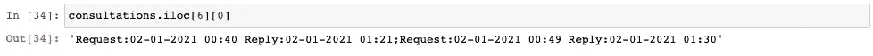

原始数据中指数为#6 的患者的两次会诊与分离后的值相匹配。

## 2.确定请求和回复的所有日期和时间索引。

让我们确定请求日期和时间的第一个索引，类似于我们以前所做的那样。因此，请求的第一索引从索引#8 开始，以索引#23 结束，此外，回复的第一索引从索引#31 开始，直到文本结束。

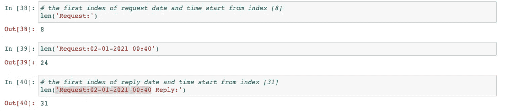

好的，在我们知道请求日期时间和回复日期时间的索引后，我们将使用`apply()`、`lambda`函数和`list comprehension`。

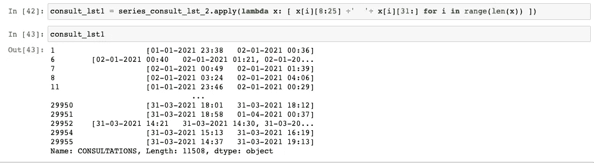

# 计算持续时间

好的，我想在这里补充一点。这种情况下，如果我们有请求日期时间和回复日期时间，但如果我们只有请求日期时间而没有回复日期时间。在这种情况下，如果我们使用参数，第一个没有回复日期时间且不会影响计算持续时间的索引在`to_datetime()`函数中被称为`error='coerce'`，我们应该设置`day_first=True`，因为我们的日期中第一个是日期。

在我们确定了日期和时间的所有请求和回复索引之后，我们使用`apply`、`lambda`和`list comprehension`来获得每个患者‘索引’的每个值。在列表中，我们将从请求日期时间中减去回复日期时间。

> 持续时间=回复—请求

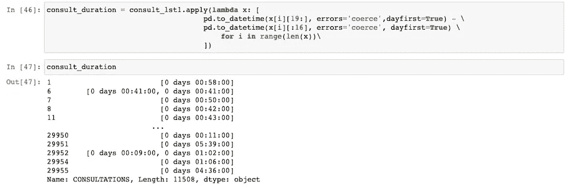

# 检查结果

现在，让我们检查一下这些持续时间是否计算正确。

我们将随机选择五个指数。

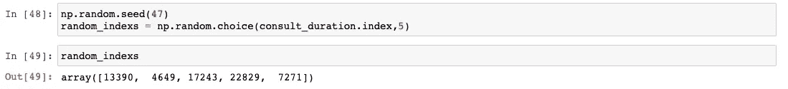

然后，我们将在持续时间列表中看到每个索引，并将其与原始请求日期时间和回复日期时间进行比较

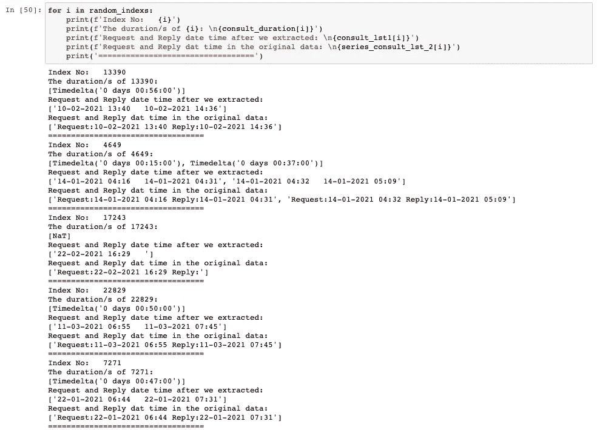

惊人的工作，持续时间列表中的所有五个索引都与原始数据中的请求日期时间和回复日期时间相匹配。看索引#17243 没有回复数据时间，所以时长应该是 NaT。

现在，我们想知道磋商的最大次数。

> **数据中咨询次数最多的是多少？**

为了找到所有患者的咨询次数，我们将使用`apply, lambda and len`函数，以便 len 找到每个值`consultation`的长度，然后使用`value_counts`函数并设置`normalize=True`以获得我们的值`consultations`的百分比，并将值四舍五入为四位数`round()`，然后将时间值乘以 100。

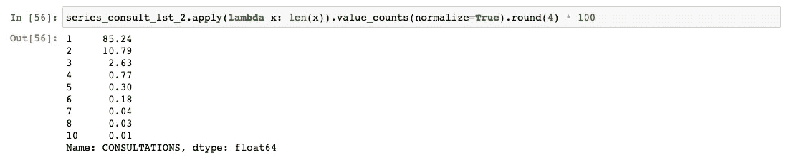

最多的咨询次数是“为一名患者”进行十次咨询，最多的咨询次数是一次，占 85%。

让我们找出十个咨询的索引

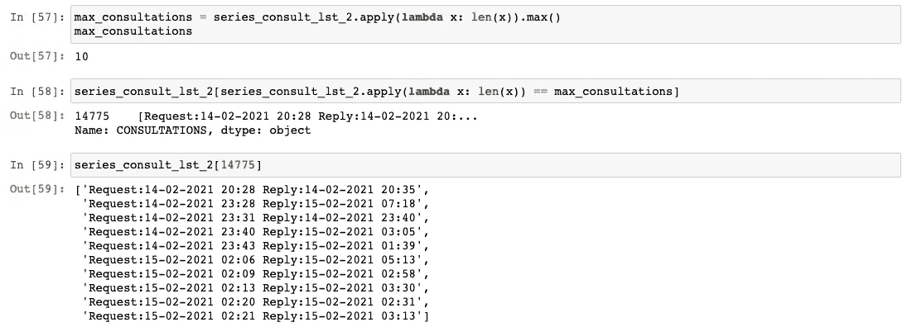

让我们将所有咨询持续时间合并在一起，以找到基本统计“集中趋势”。

> **咨询花费了多长时间，或请求和回复之间的持续时间？**

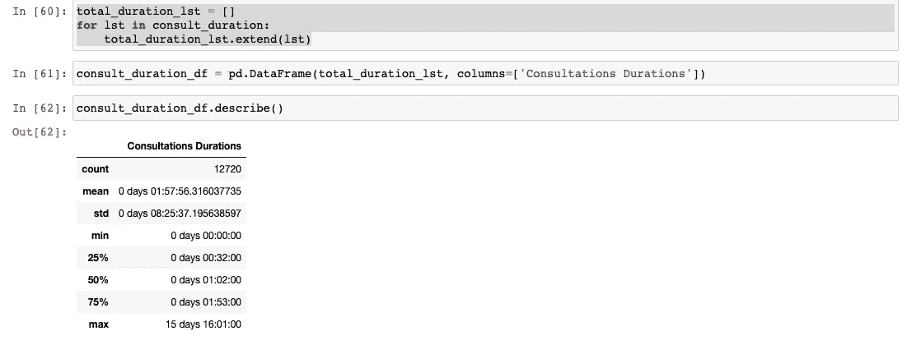

让我们通过找到它的索引来查看咨询的最大持续时间，然后检查请求和回复中的日期和时间是否与原始数据匹配。

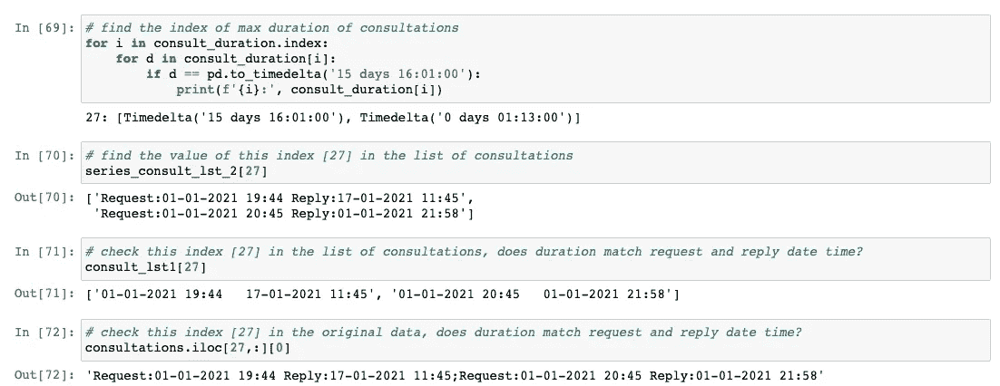

现在让我们分别解释一下每个细胞。

[69]我们通过索引为每个患者创建了`for loop`，然后为每个持续时间创建了`nested for loop`。在此之后，我们检查，如果持续时间等于最大持续时间，它将打印“给我们”的指数的持续时间和所有持续时间的指数。

[70，71，72]在我们知道了最大持续时间的索引之后，我们通过拆分后的数据中的索引来检查它是否与原始数据的索引相匹配。

正如我们在上面看到的，最大持续时间在索引#27 中，它与原始数据相匹配。

# 依赖结果

在我们检查了开发环境中的所有代码都是正确的并且结果是精确的之后，应用了软件工程的一部分，即 OOP，也称为面向对象编程，它简化了开发环境中的所有代码，并以专业的方式将它们合并，更加系统化，并且更易于更新和调试。

让我们从导入库开始。

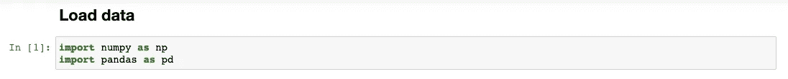

创建了两个类:

*   `SeparatingConsultations`

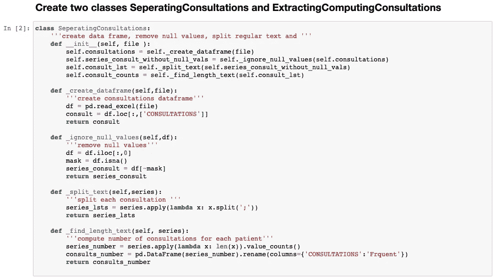

*   `ExtractingComputingConsultations`

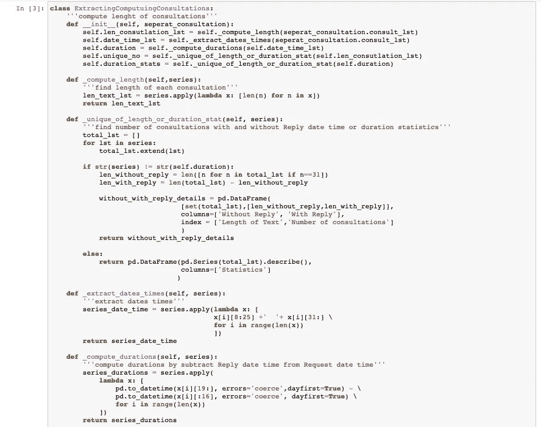

在我们创建了两个类之后，现在我们将文件“数据路径”传递给第一个类`SeparatingConsultations`，然后创建一个名为`consults_to_sep`的新对象。

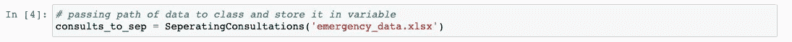

第二类继承了第一类的所有变量和方法，然后创建了另一个名为`consults_to_comp`的对象。

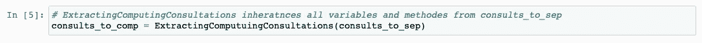

现在，让我们通过用适当的对象运行类名来回答我之前提到的五个问题。

> 有多少病人接受或没有接受医疗咨询？

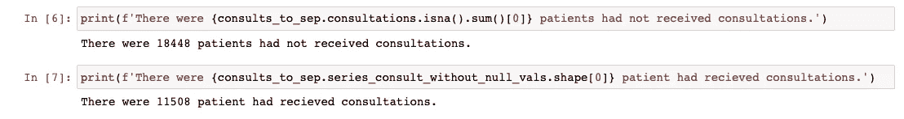

[6]我们选择了`consultations`变量，然后使用`isna()`和`sum()`方法和第一个指数来查找未接受咨询的患者人数。

[7]我们选择了`series_consult_without_null_vals`变量，然后使用带有第一个索引的`shape`方法来查找与接受咨询的患者人数相关的行数。

> 数据中咨询次数较多的是多少？

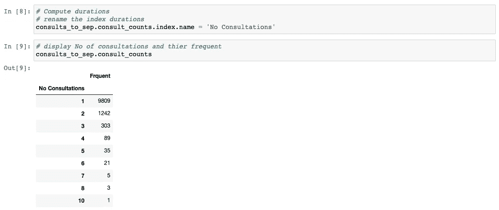

[8]我们通过选择`consult_counts`变量将数据帧的第一列重命名为咨询次数，然后使用`index`和`name`方法。

[9]我们选择了`consult_counts`变量来显示所有咨询次数及其频率。

我们创建的第二个对象的下一个代码与`consults_to_comp`相关。

> 有没有没有没有回复的咨询？如果有，有多少？

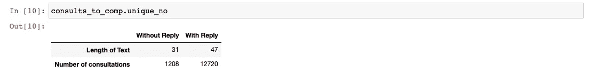

[10]我们选择了`unique_no`变量来显示有回复和无回复的详细咨询次数。

> 总共咨询了多少次？

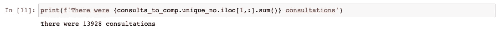

[11]我们选择了`unique_no`变量，并使用第一行和所有列的`iloc()`方法以及`sum()`方法来显示我们数据中的所有咨询计数。

> 咨询需要多长时间，或者从请求到答复之间需要多长时间？

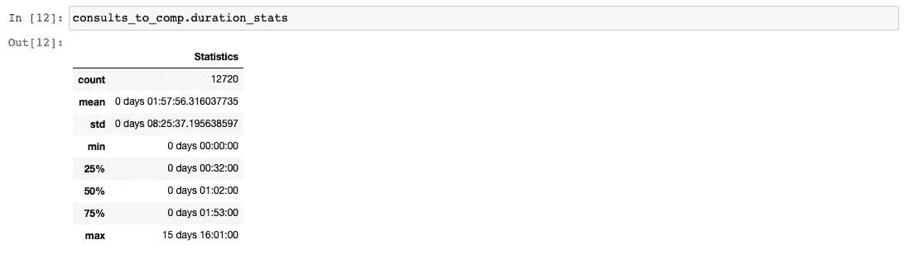

[12]我们选择了`duration_stats`变量来显示所有咨询的基本统计数据。

最后，我们可以用两个文件向客户交付成果，第一个文件包括我们完成所有步骤的开发环境。所有代码单独用于逐步检查结果。

第二个文件包含所有代码，因此被合并到两个类中。根据这两类中的变量，我们可以更容易地显示结果。

希望你在阅读这篇文章的过程中度过了一段美好的时光，并学会了如何制定策略，将你的任务分成几个部分，以便在你展示成果时让你的客户一目了然。