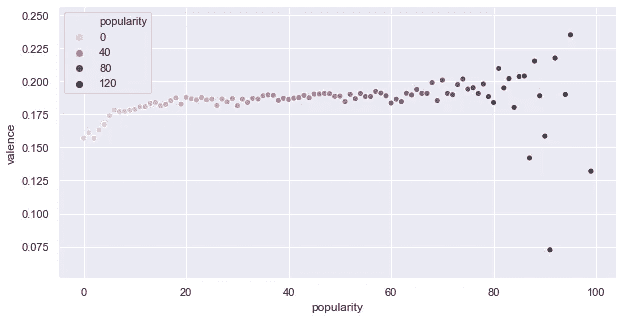

# 分析 Spotify 数据轨道

> 原文：<https://medium.com/codex/analyzing-spotify-data-tracks-what-makes-a-song-a-hit-and-popular-5ef319272fde?source=collection_archive---------6----------------------->

# 是什么让一首歌红了，流行了？

Udacity 纳米学位项目—项目一

## 介绍

几乎不可能找到一个不喜欢音乐的人。音乐的类型是另一回事。每个艺术家、乐队、词曲作者或制作人都会问同一个问题，是什么让一首歌走红？

随着音乐流媒体平台的出现，如 Spotify、Apple Music、Deezer 等，大量的数字信息可供使用，并添加到用户交互中，当涉及到获得一些问题的答案时，就有了有价值的数据，如:**是什么使一首歌特别，或者应该具有哪些特征才能成为热门歌曲？**

在本帖中，我们将尝试回答前面的问题。我们将使用 Spotify 的 [**Kaggle**](http://www.kaggle.com) 中的数据集，该数据集包含大约 60 万首歌曲，其中包含一系列有趣的功能，值得深入探索和分析。

**CRISP-DM 流程(数据挖掘的跨行业流程)**

对于本项目的开发，我们将使用 CRISP-DM 方法，包括以下阶段。

1.  商业理解
2.  数据理解
3.  准备数据
4.  数据建模
5.  评估结果
6.  部署

这 6 个阶段并不是所有项目都需要的；很多问题不用建模型就能回答。在本文中，我将对数据集应用 CRISP-DM 步骤 1、2、3、5 和 6。

## 商业理解

为了回答这个一般性的问题，我们可以提出几个具体的问题，这样我们就能以一种更好、更清晰的方式接近结果。

1.  一首歌要成为热门需要具备哪些特征？
2.  一首听起来比较悲伤或者愤怒的歌能红吗？？
3.  一首歌要适合跳舞需要具备哪些特征？
4.  为什么平克·弗洛伊德的歌曲没有其他排名靠前的歌曲受欢迎？

## 数据理解

首先，我们探索并理解可用的信息。这个数据集包含许多数字特征，我们可以从 [Spotify Web API Referenc](https://developer.spotify.com/documentation/web-api/reference/#endpoint-get-audio-features) e 中获得信息，通过这个链接我们将获得数据集每一列的详细内容。

在数据集中所有可用的列中，我们可以提到一些最有趣的列:

*   流行度:这首歌的流行度。该值将介于 0 和 100 之间，100 是最受欢迎的。
*   **duration _ ms:**曲目的持续时间，以毫秒为单位。
*   **露骨:**曲目是否有露骨的歌词(真=是有；false =否，它不存在或未知)。
*   **可跳舞性:**可跳舞性描述了一首曲目根据音乐元素的组合适合跳舞的程度，包括速度、节奏稳定性、节拍强度和整体规律性。值 0.0 最不适合跳舞，1.0 最适合跳舞。
*   **能量:**能量是从 0.0 到 1.0 的度量，代表强度和活动的感知度量。通常，高能轨道感觉起来很快，很响，很嘈杂。例如，死亡金属具有高能量，而巴赫前奏曲在音阶上得分较低。对该属性有贡献的感知特征包括动态范围、感知响度、音色、开始速率和一般熵。
*   **响度:**一个音轨的整体响度，单位为分贝(dB)。响度值是整个轨道的平均值，可用于比较轨道的相对响度。响度是声音的质量，是与体力(振幅)相关的主要心理因素。值的典型范围在-60 和 0 db 之间。
*   **语速:**语速检测音轨中是否存在口语单词。越是类似语音的录音(例如脱口秀、有声读物、诗歌)，属性值就越接近 1.0。高于 0.66 的值描述可能完全由口语单词组成的轨道。介于 0.33 和 0.66 之间的值描述可能包含音乐和语音的轨道，可以是分段的，也可以是分层的，包括说唱音乐。低于 0.33 的值很可能代表音乐和其他非语音类轨道。
*   **acousticness:** 从 0.0 到 1.0 的音轨是否声学的置信度度量。1.0 表示音轨是声学的高置信度。
*   **乐器性:**预测音轨是否不包含人声。“Ooh”和“aah”在这种情况下被视为乐器。Rap 或口语词轨道明显是“有声的”。乐器度值越接近 1.0，轨道不包含人声内容的可能性就越大。高于 0.5 的值旨在表示乐器轨道，但随着该值接近 1.0，置信度会更高。
*   **活跃度:**检测录像中是否有观众。较高的活跃度值表示音轨被现场执行的概率增加。高于 0.8 的值表示该轨迹很有可能是实时的。
*   **效价:**从 0.0 到 1.0 的量度，描述一个音轨所传达的音乐积极性。高价曲目听起来更积极(例如，快乐、愉快、欣快)，而低价曲目听起来更消极(例如，悲伤、沮丧、愤怒)。

现在我们对数据集列有了更好的理解，让我们通过热图来看看列的相关性。

热图

上面的图表给我们提供了与歌曲流行度相关的有趣数据，乍一看，能量和响度的特征表明与流行度有直接关系。

## 问题 1:一首歌要成为热门需要具备哪些特征？

为了回答这个问题，我们将建议知道所有可用数据的分布，并将它与仅 10，000 首最流行歌曲的分布进行比较。

所有数据集数据分布

10，000 首流行歌曲数据分布

分析这两个直方图，我们可以考虑相关的特征:声音、能量、清晰度、乐器性、响度、语速和效价。现在我们可以展示一个散点图，结合流行特征和其他相关特征，我们的目标，来发现关系和行为。

流行与声音

**人气 vs 声音**

这张图表显示，声音最小的歌曲往往更受欢迎。换句话说，更多的电子和数字仪器被使用。

人气 vs 能量

**人气 vs 能量**

该图显示，能量最高的歌曲往往最受欢迎。快速，响亮和嘈杂的歌曲属性建议更高的知名度。

流行与露骨

**人气 vs 露骨**

不管我们很多人怎么想，图表显示，如果一首歌包含明确的歌词，它往往会更受欢迎。

大众性 vs 工具性

**人气 vs 工具性**

关于一首歌的乐器，我们可以说一首歌流行的原因是它的声音内容越少。

流行度与响度

**人气 vs 响度**

另一个有趣的特征是响度，图表显示响度越高，歌曲越受欢迎。

流行与雄辩

**人气 vs 口才**

对于语音特征，图表表明与流行度没有关系，这意味着不管这首歌是否有很多口语词，这并不意味着它会流行。

流行度与效价

**人气 vs 价态**

对于化合价的属性，图表显示这一属性与流行度没有直接关系，不管是正面的歌曲(快乐、欢快)还是负面的歌曲(悲伤、愤怒、沮丧)，在这两种情况下它们都能变得流行。

受欢迎程度与可跳性

**人气 vs 可舞性**

最后，我们观察了适合跳舞的属性，该图表明，如果一首歌适合跳舞，那么它成为热门歌曲的概率就更高。

总结所观察到的情况，我们可以如下回答第一个问题:

歌曲成为热门歌曲的相关特征:

*   **声音变小**
*   **更有活力**
*   **更露骨的**
*   **工具性差**
*   **更高的响度**
*   **更适合跳舞**

没有相关功能:

*   语音
*   效价

## 问题 2:一首听起来比较悲伤或者愤怒的歌能成为热门吗？

为了回答这个问题，我们将价属性小于 0.3 的数据分成子集，这将有助于我们只分析听起来悲伤或愤怒的歌曲。

人气 vs 化合价，带化合价的数据集< 0.3

The graph above confirms that no matter how sad, depressed or angry it sounds, it can become a hit.

The answer is **是的。**

## 问题 3:对于一首适合跳舞的歌曲来说，什么特征是重要的？

dance 属性的数据类型是 float，因此按范围分组是必要的，这将有助于我们更好地分析和寻找其他特征之间的关系。

下图显示了按其余属性分类的可跳舞要素范围。

我们可以得出结论，曲线上升的特征给了我们适合跳舞的歌曲最好的影响，这些特征如:流行，明确的歌词，有很多能量，高音量也很欢快，似乎可以衡量适合跳舞的声音。

## 问题 4:为什么平克·弗洛伊德的歌曲没有其他排名靠前的歌曲受欢迎？

我是平克·弗洛伊德的超级粉丝，这是有史以来最好的乐队之一，它为摇滚和音乐做出了很大贡献。他们的音乐跨越了国界，这启发了今天的许多艺术家如何创作出好的音乐。

不幸的是，即使不说，知道他们的歌曲的受欢迎程度低于最受欢迎的，至少是这个数据集显示的，这让我很难过。

让我们来分析一下数据，以了解为什么这个不可思议的乐队的歌曲没有成为热门。

我们将首先通过直方图来看看它们的数据分布。

平克·弗洛伊德跟踪数据分布

现在让我们比较一下它所有特征的平均值和所有流行度超过 80 的歌曲的平均值。

表:平克·弗洛伊德与 80 款热门功能和差异

表格显示了平克·弗洛伊德歌曲在响度、明确性、可舞性、效价和能量等方面的不足。

我个人不想要适合跳舞的歌曲，但我认为他们可以在歌词上做更多的工作，并调整音量。你怎么想呢?

## 结论

在本文中，我们探索并分析了 Spotify 平台上可用数据集中的歌曲信息。这项工作的目的是试图理解是什么让一首歌如此特别而成为热门。

为了获得我们的答案，我们问了自己 4 个具体的问题，这使我们能够通过可用的数据来指导搜索和分析信息。

已经确定了与受欢迎程度有直接关系的特征，其中一些具有很大的影响。效价、可跳舞性、响度、明确性在理解人们的口味时起着重要的作用。

通过分析行为，我们可以得出这样的结论:一首歌要成为热门歌曲，并不需要复杂，也就是说，不需要太多的乐器化或不需要使用声学乐器(电子乐器越多越好)。如果你的歌曲是现场录制的，它也不会发挥重要作用。

一首热门歌曲可以很简单，就像它有明确的歌词，或者有更有活力的歌曲(动态范围、感知音量、音色)，最后是音量级别的调整，这可以确保一首歌曲从其他歌曲中脱颖而出。

## 推荐

在这项工作中，没有使用预测模型，在后面的帖子中，我们将扩展这一步，因为建立一个模型，让我们通过预先知道其他特征来预测一首歌是否会流行，这将是很有趣的。

另一个对未来分析有兴趣的方面是按流派对歌曲进行分组，如果你想做音乐，你喜欢摇滚，你不应该通过改变你的音乐基础或你的音乐品味来将自己卖给市场，相反，这种类型的分析将更好地评估哪些参数需要调整。

## 我的 Github repo 在这里:

 [## GitHub - urvog/Spotify-Tracks:数据科学项目- Spotify tracka 1922 - 2021 600k 曲目

### 数据科学项目-来自 Udacity 纳米学位项目 I 的分析在这个项目中，我们将进行一项…

github.com](https://github.com/urvog/Spotify-Tracks) 

## 资源

*   [https://www . muyinteresante . com . MX/pre gutas-y-respuestas/porque-gusta-musica/#:~:text = Las % 20 melod % C3 % ADas % 20 afectan % 20a % 20 nuestro % 20 cerebro % 2C % 20 suscitando % 20 respuestas % 20 emocionales。&text = Al % 20 mismo % 20 tiempo % 2C % 20se % 20 despiertan，se % 20 generan % 20en % 20 nuestra % 20 mente](https://www.muyinteresante.com.mx/preguntas-y-respuestas/porque-gusta-musica/#:~:text=Las%20melod%C3%ADas%20afectan%20a%20nuestro%20cerebro%2C%20suscitando%20respuestas%20emocionales.&text=Al%20mismo%20tiempo%2C%20se%20despiertan,se%20generan%20en%20nuestra%20mente)。
*   [https://www . hispasonic . com/noticias/hace-can cion-sea-exito/43900](https://www.hispasonic.com/noticias/hace-cancion-sea-exito/43900)
*   [http://www . future music-es . com/que-es-El-loudness-o-sonoridad-y-que-es-capaz-de-hacer-por-tu-musica/](http://www.futuremusic-es.com/que-es-el-loudness-o-sonoridad-y-que-es-capaz-de-hacer-por-tu-musica/)