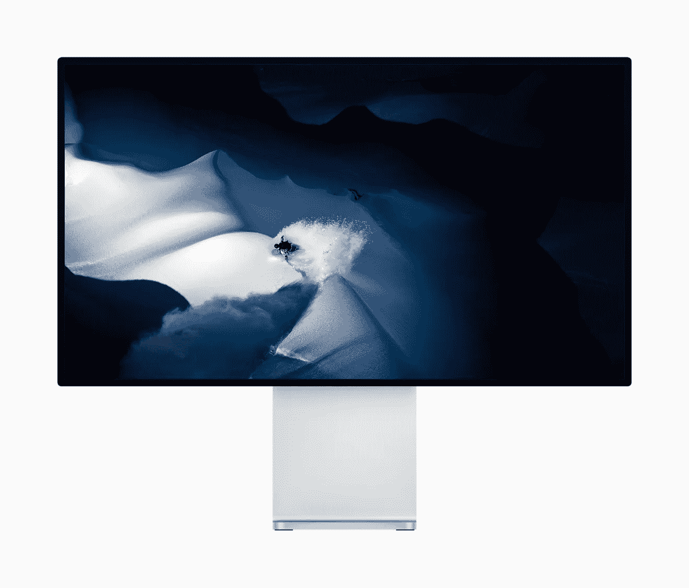
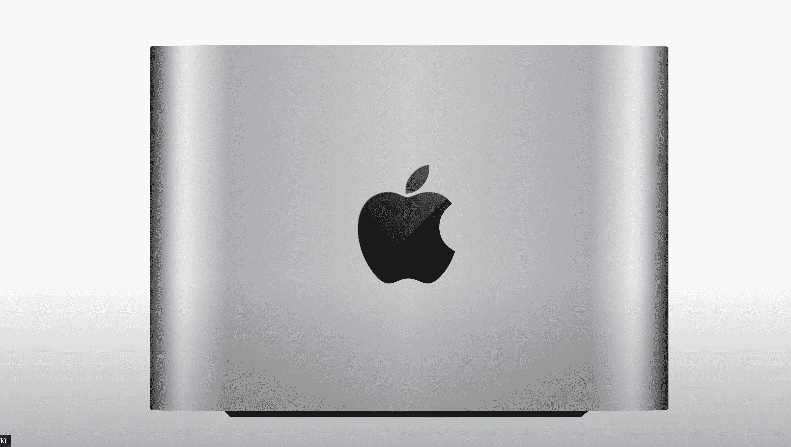
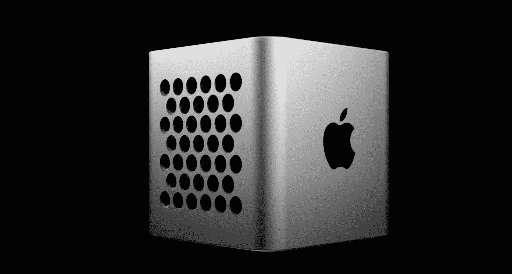

# 它已经准备好了——苹果的全新外部显示器

> 原文：<https://medium.com/codex/and-it-could-even-be-announced-this-week-fb801693a773?source=collection_archive---------5----------------------->

## 甚至有可能在本周宣布！

 [## 苹果工作室是个东西！

### 苹果再次做到了这一点，并一直致力于一个全新的品牌线的 Mac Pro

medium.com](/codex/apple-studio-is-a-thing-82848e4db458)  [## 苹果和谷歌——最好的伙伴？

### 他们是两个最大的科技巨头，但奇怪的是，也是好朋友

medium.com](/codex/apple-google-best-buddies-97e8d35a7983) 

给那些正在寻找独家新闻的人一个快速的提示，期待已久的第一款新苹果显示器似乎已经准备好发布了。

事实上，它早在 2021 年 11 月的最后一次苹果活动上就已经准备好了。在本周的 **Power On** 简讯中，**马克·古尔曼**暗示它应该已经准备好了去年 M1 Max & M1 Pro MacBook pros 的发布。

也有证据表明，有一个 7K 显示器将运行 A13 仿生芯片。它的开发代号一直是 **J327** 。像素数量和最终尺寸目前尚未证实，但它可能会与 32 英寸的专业显示器 XDR 一起销售，最大可能为 36 英寸。如果是这样的话，那么这将是自 2014 年以来第一次有一个以上的苹果显示器可用。

除了 Studio display 之外，一款新的 Studio Mac 也即将面世。针对专业用户，它将基于 Mac Mini，并位于当前英特尔 Mac 系列产品之间；高端 Mac mini 和 Mac Pro。两个版本正在开发中，项目名为 **J375** 。他们将使用与 2021 年 MacBook Pro 型号相同的 M1 Max 芯片，而另一款将使用比‌M1 Max‌.更强大的苹果硅芯片

这将是忙碌的几周，这是肯定的。请在 Medium 和 YouTube 上关注我。内容不断涌现…..

## 在你走之前

## 你订阅媒体了吗？

我只是高端博客网站 Medium 的众多作者之一。这是如此好的价值，你可以在这里加入 https://medium.com/membership

[**加入我的幕后邮件列表**](https://www.talkingtechandaudio.com)

**原载于 2022 年 3 月 6 日 https://www.talkingtechandaudio.com/blog****的** [**。**](https://www.talkingtechandaudio.com/blog)