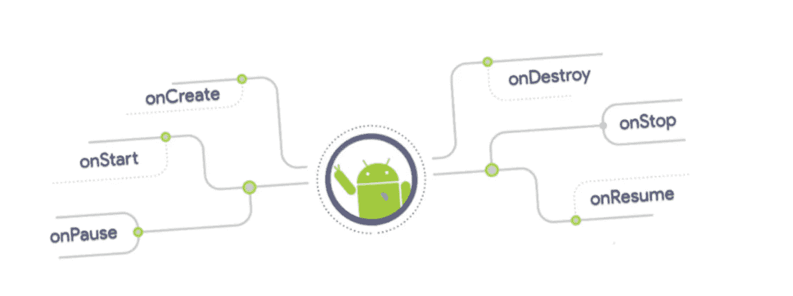
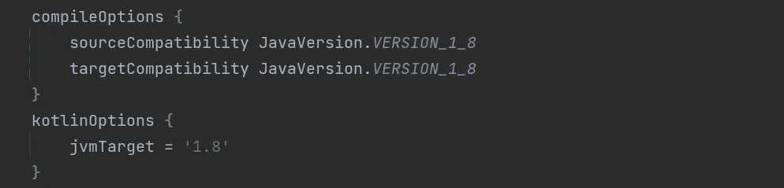
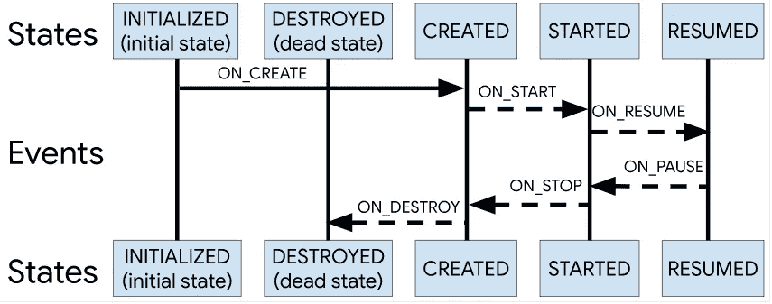

# Android Jetpack:生命周期感知组件(LifecycleEventObserver)。

> 原文：<https://medium.com/codex/android-jetpack-lifecycle-aware-components-df0e716648cb?source=collection_archive---------4----------------------->

图片来源:谷歌图片

L 如果感知生命周期的组件，比如活动和片段，采取行动来响应另一个组件的生命周期状态的变化。这些组件有助于创建更加组织良好的代码，并且在许多情况下，是更易于维护的轻量级代码。

在活动和片段的生命周期方法中实现依赖组件的动作是一种流行的做法。另一方面，这种方法会导致混乱的代码库和大量的错误。通过利用生命周期感知组件，您可以将依赖组件的代码从生命周期方法转移到组件本身。

考虑以下场景:我们有一个在屏幕上显示设备位置的活动。下面是一个常见实现的示例:

尽管这个示例看起来可以工作，但是在真实的项目中，您将会有太多的调用来管理 UI 和其他组件以响应当前的生命周期状态。生命周期方法，如 onStart()和 onStop()，在管理几个组件时包含大量代码，使它们难以维护。

此外，不能保证组件会在活动或片段终止之前开始。如果需要长时间运行的操作，例如 onStart()中的配置检查，这一点尤其正确。这可能会导致一种争用情况，在这种情况下，onStop()函数在 onStart()方法之前完成，导致组件保持不必要的活动时间。

如果我告诉你有可能使它更容易实现呢？

让我们看看如何使用生命周期组件。

*   ***LifecycleEvents(已弃用):*** 一个已弃用的方法，如果您已经实现了它，让我们看看如何设置它以使用*lifecycleeventsobserver*

Android Studio 在将生命周期库升级到 2.4.0 后，将所有生命周期事件标识为不推荐使用。

不推荐使用它，因为您现在应该使用 Java 8 并实现 DefaultLifecycleObserver 接口。因为 Java 8 允许接口有默认的实现，所以他们创建了 DefaultLifecycleObserver，它有所有方法的空实现，所以你只需要覆盖你需要的方法。

更改您的类以实现 DefaultLifecycleObserver，并更改您的函数以覆盖您的情况中必需的 DefaultLifecycleObserver 函数。如果您的项目还没有使用 Java 8，您必须更改您的 Gradle 构建文件。将这些放入模块的`build.gradle`中的`android`块:

`build.gradle(Module)`

这就是我们现在准备使用的*生命周期事件观察者* ***。***

*   ***LifecycleEventObserver:***是一个类，存储关于组件生命周期状态的信息(比如一个活动或者一个片段)，并允许其他对象查看。

为了监控其相关组件的生命周期状态，*生命周期事件观察者*使用了两种主要的枚举:

Android 活动生命周期由状态和事件组成。

*   **事件:**框架和生命周期类的生命周期事件被调度。活动和片段中的回调事件与这些事件相对应。
*   **状态:**一个类可以跟踪一个组件的生命周期。

让我们通过创建 LifecycleEventObserver 和覆盖 onCreate、onStart 等方法来看看。然后，如下例所示，您可以通过执行 Lifecycle 类的 addObserver()函数并提供观察者的实例来添加观察者:

*   ***life cycle owner:***life cycle owner 接口是一个单一的方法接口，表示一个类是否有生命周期。它只有一个方法，getLifecycle()，该类必须实现它。

这个接口将生命周期的所有权从特定的类(如 Fragment 和 Activity)中分离出来，允许您编写与之交互的组件。

让我们通过调用`Lifecycle`类的`addObserver()`方法并传递一个 observer 实例来添加一个 observer

就这样，现在代码应该准备好运行并提供所需的输出。

# 参考

*   [**用生命周期感知组件处理生命周期**](https://developer.android.com/topic/libraries/architecture/lifecycle)
*   [**活动生命周期**](https://developer.android.com/guide/components/activities/activity-lifecycle)
*   [**生命周期观察者**](https://developer.android.com/reference/android/arch/lifecycle/LifecycleObserver)

这里是你可以找到完整代码的地方。

 [## GitHub-vinodbaste/Android-life cycle ware-component:生命周期感知组件，如…

### 感知生命周期的组件，比如活动和片段，采取行动来响应生命周期中的变化…

github.com](https://github.com/vinodbaste/android-lifeCycleAware-component) 

感谢您花时间阅读这篇文章。如果你觉得这个帖子有用又有趣，请鼓掌推荐。

如果我做错了什么，请在评论中提出来。我很想进步。