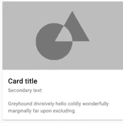
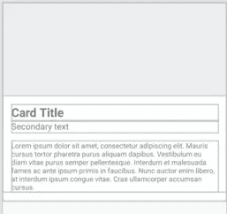
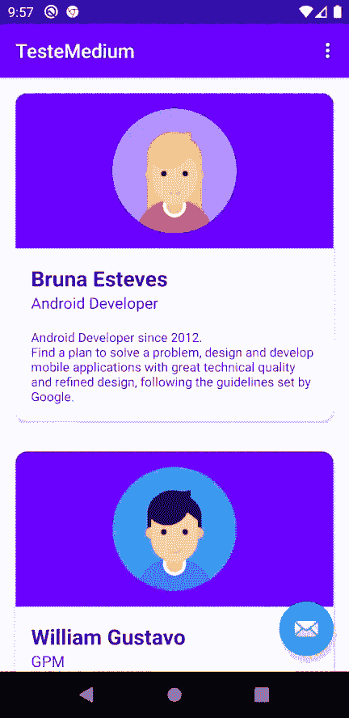

# Android 列表——一种有效而简单的方法

> 原文：<https://medium.com/codex/android-lists-an-effective-and-simple-approach-3160f87ed20b?source=collection_archive---------2----------------------->

## [法典](http://medium.com/codex)

# 一步一步来…再来一次。

嗨，我是布鲁纳！😃但你已经知道了，对吧？(或者不是…😕)

如果你不认识我，也许你想先看看[安卓编程小技巧](/swlh/android-programming-tips-the-beginning-for-everyone-8fe88343efc1)和[后天你好世界](/codex/the-day-after-hello-world-3c51f03dcf6f)。😉

这篇文章讲的是最精彩的部分——动手实践的开始。我们已经知道了基础知识，所以我们可以开始开发我们的 Android 应用程序了。

我们的应用程序将有一个主屏幕，上面有一个自定义视图列表(用来创建每个项目)，我们将讨论一个可以在这个场景中使用的设计模式。

也就是说，让我们开始吧。


照片由 [ThisisEngineering RAEng](https://unsplash.com/@thisisengineering) 在 [Unsplash](https://unsplash.com/?utm_source=medium&utm_medium=referral) 上拍摄

## 该结构

我们有 MainActivity 类和两个片段。
它们由流连接，在文件 **nav_graph.xml** (您的导航文件)中配置。

在我的例行程序中，在集成数据之前启动布局屏幕是很普遍的，这就是为什么我们要从 XML 布局开始。

## 布局

正如我们在上一篇文章中讨论的那样，**布局**文件位于 **/res/layout 下。**
下面我们可以看到，FirstFragment 是第一个被调用的目的地。

```
<navigation     xmlns:android="http://schemas.android.com/apk/res/android"
    xmlns:app="http://schemas.android.com/apk/res-auto"
    xmlns:tools="http://schemas.android.com/tools"
    android:id="@+id/nav_graph" **app:startDestination="@id/FirstFragment"**>
```

这意味着第一个屏幕将服从 FirstFragment 配置。

## 列表布局

打开布局 fragment_first.xml，删除视图 **textview_first** 和 **button_first。** 我们将创建一个项目列表，所以我们要添加一个名为 RecyclerView 的视图。

**回收查看**

这个组件可以处理一组数据并高效地显示出来。它与众不同，因为它回收视图元素来改善行为和 UX。要在我们的项目中添加这个执行视图，请遵循下面的步骤。

1 —在**应用程序/构建中声明依赖关系。点击**并点击**立即同步** (Android Studio 信息性消息)

```
dependencies {
    implementation "androidx.recyclerview:recyclerview:1.1.0"
}
```

2 —将 RecyclerView 添加到 ConstraintLayout 级别内的 **fragment_first.xml** 中，它将如下所示:

```
*<?*xml version="1.0" encoding="utf-8"*?>* <androidx.constraintlayout.widget.ConstraintLayout xmlns:android="http://schemas.android.com/apk/res/android"
    xmlns:app="http://schemas.android.com/apk/res-auto"
    xmlns:tools="http://schemas.android.com/tools"
    android:layout_width="match_parent"
    android:layout_height="match_parent"
    tools:context=".FirstFragment">

    **<androidx.recyclerview.widget.RecyclerView
        android:id="@+id/recycler"
        android:layout_width="0dp"
        android:layout_height="0dp"
        app:layout_constraintBottom_toBottomOf="parent"
        app:layout_constraintEnd_toEndOf="parent"
        app:layout_constraintStart_toStartOf="parent"
        app:layout_constraintTop_toTopOf="parent"
        tools:itemCount="20" />**

</androidx.constraintlayout.widget.ConstraintLayout>
```

3 —现在我们将创建回收器视图项目，这是将根据列表大小重复的布局。
步骤是:右键点击布局>新建>创建布局资源文件 **view_recycler_item** 。

打开文件后，我们将开始构建回收器视图的项目。

**PS:** 我们在市面上看到的很多 app 的设计都采用了大量的材质设计。在 [**素材**](https://material.io/components) 中有很多已经被安卓用户接受行为的默认组件。您将会看到许多测试和包含在项目中的选项。

我们可以使用 Card 组件创建列表项视图，默认外观如下:



4 —我们将 CardView 添加到我们的项目中，在 **app/build 中。Gradle** 文件:

```
dependencies {
    implementation "androidx.cardview:cardview:1.0.0"
}
```

5-将 view_recycler_item 修改为:

```
*<?*xml version="1.0" encoding="utf-8"*?>* <androidx.cardview.widget.CardView 
    xmlns:android="http://schemas.android.com/apk/res/android"
    xmlns:app="http://schemas.android.com/apk/res-auto"
    xmlns:tools="http://schemas.android.com/tools"
    android:id="@+id/cardview"
    xmlns:card_view="http://schemas.android.com/apk/res-auto"
    android:layout_width="match_parent"
    android:layout_height="wrap_content"
    card_view:cardBackgroundColor="@android:color/white"
    card_view:cardCornerRadius="12dp"
    card_view:cardElevation="3dp">

    <androidx.constraintlayout.widget.ConstraintLayout
        android:layout_width="match_parent"
        android:layout_marginBottom="16dp"
        android:layout_height="wrap_content">

        <ImageView
            android:layout_width="match_parent"
            android:layout_height="170dp"
            android:contentDescription="@null"
            android:id="@+id/image"
            app:layout_constraintTop_toTopOf="parent"
            app:layout_constraintStart_toStartOf="parent"
            app:layout_constraintEnd_toEndOf="parent"
            android:src="#10000000" />

        <TextView
            android:id="@+id/tvTitle"
            android:layout_margin="16dp"
            app:layout_constraintTop_toBottomOf="@+id/image"
            android:layout_width="match_parent"
            android:layout_height="wrap_content"
            android:textSize="22sp"
            android:textStyle="bold"
            tools:text="Card Title" />

        <TextView
            android:id="@+id/tvSubtitle"
            android:layout_marginBottom="16dp"
            android:layout_marginStart="16dp"
            android:layout_marginEnd="16dp"
            app:layout_constraintTop_toBottomOf="@+id/tvTitle"
            android:layout_width="match_parent"
            android:layout_height="wrap_content"
            android:textSize="16sp"
            tools:text="Secondary text" />

        <TextView
            android:id="@+id/tvDescription"
            android:layout_margin="16dp"
            app:layout_constraintTop_toBottomOf="@+id/tvSubtitle"
            android:layout_width="match_parent"
            android:layout_height="wrap_content"
            android:textSize="13sp"
            tools:text="Lorem ipsum dolor sit amet, consectetur adipiscing elit. Mauris cursus tortor pharetra purus aliquam dapibus. Vestibulum eu diam vitae purus semper pellentesque. Interdum et malesuada fames ac ante ipsum primis in faucibus. Nunc auctor enim libero, at interdum ipsum congue vitae. Cras ullamcorper accumsan cursus." />

    </androidx.constraintlayout.widget.ConstraintLayout>
</androidx.cardview.widget.CardView>
```

我们项目的结果是:



你是 tired❓吗
如果你是……请给自己一个机会。你将能够在这篇文章的结尾有一个列表的应用程序。坚强点！😅

我们已经配置好了布局，接下来的步骤是:

*   创建一个适配器，将视图与其值相关联
*   将组件链接到自定义视图

## 适配器

这就是我们谈论设计模式的要点。

> 设计模式是给定环境中常见问题的通用、可重用的解决方案。

适配器就是关于这个概念的。这是一种结构模式，它允许我们连接 recyclerview 和元素，包括行为。

这个概念不是安卓才有的。您可以在不同的技术应用程序中使用这种模式。

在 Android 中，适配器带来了一个视图保持器。这用于设置列表中每个项目视图的行为。

但是布鲁纳，这在理论上很容易，我想看看它在实践中如何运作。
好的。👍

**型号**

我们需要创建一个对象来存储联系人的信息，并将它连接到列表的每一行。所以，我们应该创建这样一个数据类:

```
**class** Contact(
    **val name**: String,
    **val role**: String,
    **val bio**: String
)
```

好，下一步->连接到自定义视图

**自定义视图**

我们将创建一个将所有行为和数据放在同一个地方的类。
我们已经有了项目视图布局(view_recycler_item)，这个类代表了联系人列表的每个视图。
因此，实现应该是这样的:

```
**open class** ContactCardView
@JvmOverloads **constructor**(context: Context, attrs: AttributeSet? = **null**, defStyleAttr: Int = 0) : MaterialCardView(context, attrs, defStyleAttr) {

    **protected lateinit var title**: TextView
    **protected lateinit var subtitle**: TextView
    **protected lateinit var description**: TextView
    **protected lateinit var img**: ImageView

    **override fun** onFinishInflate() {
        **super**.onFinishInflate()

        **title** = findViewById(R.id.*tvTitle*)
        **subtitle** = findViewById(R.id.*tvSubtitle*)
        **description** = findViewById(R.id.*tvDescription*)
        **img** = findViewById(R.id.*image*)
    }

    **open fun** bind(contactItem : Contact){

        **title**.*text* = contactItem.**name
        subtitle**.*text* = contactItem.**role
        description**.*text* = contactItem.**bio

        img**.setImageDrawable(ContextCompat.getDrawable(*context*, contactItem.**img**))
    }
}
```

如您所见，**联系人**用于管理数据，ContactCardView 控制行为。
既然我们已经准备好了自定义视图，我们应该将它的引用作为我们的根项目布局，并像这样修改它:

```
*<?*xml version="1.0" encoding="utf-8"*?>* **<com.testemedium.ContactCardView
**    xmlns:android="http://schemas.android.com/apk/res/android"
    xmlns:app="http://schemas.android.com/apk/res-auto"
    xmlns:tools="http://schemas.android.com/tools"
    android:id="@+id/cardview"
    android:theme="@style/Theme.MaterialComponents"
    android:layout_width="match_parent"
    android:layout_height="wrap_content"
    app:cardBackgroundColor="@android:color/white"
    app:cardCornerRadius="12dp"
    app:cardElevation="3dp">

    <androidx.constraintlayout.widget.ConstraintLayout
        android:layout_width="match_parent"
        android:layout_marginBottom="16dp"
        android:layout_height="wrap_content">

        <ImageView
            android:padding="16dp"
            android:layout_width="match_parent"
            android:layout_height="160dp"
            android:contentDescription="@null"
            android:id="@+id/image"
            android:scaleType="fitCenter"
            android:background="#10000000"
            android:adjustViewBounds="true"
            app:layout_constraintTop_toTopOf="parent"
            app:layout_constraintStart_toStartOf="parent"
            app:layout_constraintEnd_toEndOf="parent"
            android:src="@drawable/person_girl_flat" />

        <TextView
            android:id="@+id/tvTitle"
            android:layout_margin="16dp"
            app:layout_constraintTop_toBottomOf="@+id/image"
            android:layout_width="match_parent"
            android:layout_height="wrap_content"
            android:textSize="22sp"
            android:textStyle="bold"
            android:textColor="@color/colorPrimaryDark"
            tools:text="Card Title" />

        <TextView
            android:id="@+id/tvSubtitle"
            android:layout_marginBottom="16dp"
            android:layout_marginStart="16dp"
            android:layout_marginEnd="16dp"
            app:layout_constraintTop_toBottomOf="@+id/tvTitle"
            android:layout_width="match_parent"
            android:layout_height="wrap_content"
            android:textColor="@color/colorPrimary"
            android:textSize="16sp"
            tools:text="Secondary text" />

        <TextView
            android:id="@+id/tvDescription"
            android:layout_margin="16dp"
            app:layout_constraintTop_toBottomOf="@+id/tvSubtitle"
            android:layout_width="match_parent"
            android:layout_height="wrap_content"
            android:textSize="13sp"
            android:textColor="@color/colorPrimary"
            tools:text="Lorem ipsum dolor sit amet, consectetur adipiscing elit. Mauris cursus tortor pharetra purus aliquam dapibus. Vestibulum eu diam vitae purus semper pellentesque. Interdum et malesuada fames ac ante ipsum primis in faucibus. Nunc auctor enim libero, at interdum ipsum congue vitae. Cras ullamcorper accumsan cursus." />

    </androidx.constraintlayout.widget.ConstraintLayout>
</com.testemedium.ContactCardView>
```

系统将视图连接到类，并在我们的适配器中解析它。但是什么是适配器呢？🙋

**适配器**

让我们在与片段和活动相同的级别创建一个名为 ContactsAdapter 的文件。
PS:你的 app 的组织和架构到现在都不是最重要的，所以文件可能停留在同一层次。

新文件将如下所示:

```
**class** ContactsAdapter : RecyclerView.Adapter<ContactsAdapter.ViewHolder>() {

    **var contactList** : MutableList<Contact> = *mutableListOf*()

    **class** ViewHolder(**val view**: ContactCardView) : RecyclerView.ViewHolder(view)

    **override fun** onCreateViewHolder(parent: ViewGroup, viewType: Int): ViewHolder {
        **return** ViewHolder(LayoutInflater.from(parent.*context*)
            .inflate(R.layout.*view_recycler_item*, parent, **false**) **as** ContactCardView)
    }

    **override fun** onBindViewHolder(holder: ViewHolder, position: Int) {
        **val** contact: Contact = **contactList**[position]
        **val** view = holder.**view** view.bind(contact)
    }

    **override fun** getItemCount(): Int {
        **return contactList**.**size** }

    **fun** setItems(list: List<Contact>) {
        **contactList** = list.*toMutableList*()
        notifyDataSetChanged()
    }
}
```

我们必须理解适配器类的一些要点。

*   实现了 **ViewHolder** 类，它的目的是管理我们列表中的每一行。
*   列表的每次迭代都会调用 onBindViewHolder ,它调用自定义视图(ContactCardView)中的方法
*   **getItemCount** 覆盖列表的大小
*   **onCreateViewHolder** 是你设置列表中每个视图的布局文件的地方。在我们的例子中，我们将使用***view _ recycler _ item****创建*。-**
*   ***setItems** 是传递视图持有者要呈现的联系人列表的方法*

*我们已经实现了几乎所有的目标。😻
但是假的联系人名单却不见了。*

## *创建本地联系人列表*

*为了用假数据创建它，我们将在第一个片段中创建一个提供模拟(模拟对象)的方法:*

```
***class** FirstFragment : Fragment() {

    **override fun** onCreateView(
        inflater: LayoutInflater, container: ViewGroup?,
        savedInstanceState: Bundle?
    ): View? {
        *// Inflate the layout for this fragment* **return** inflater.inflate(R.layout.*fragment_first*, container, **false**)
    }

    **override fun** onViewCreated(view: View, savedInstanceState: Bundle?) {
        **super**.onViewCreated(view, savedInstanceState)

        setupView()
    }

    **private fun** setupView() {
        **val** layoutManager = LinearLayoutManager(*context*, RecyclerView.*VERTICAL*, **false**)
        **val** adapter = ContactsAdapter()
        adapter.setItems(mockContactsList())
        recycler.*adapter* = adapter
        recycler.*layoutManager* = layoutManager
    }

    **private fun** mockContactsList(): List<Contact> {
        **return** *listOf*(
            Contact(
                **"Bruna Esteves"**, **"Android Developer"**, **"Android Developer since 2012.\n"** +
                        **"Find a plan to solve a problem, design and develop mobile applications with great technical quality and refined design, following the guidelines set by Google."**,
                R.drawable.*person_girl_flat* ),
            Contact(
                **"William Gustavo"**,
                **"GPM"**,
                **"Manage the product throughout the Product Lifecycle, gathering and prioritizing product and customer requirements, defining the product vision, and working closely with engineering, to deliver winning products."**,
                R.drawable.*person_flat* ),
            Contact(
                **"Diego Ramos"**, **"Tech Lead"**, **"Android Developer since 2012.\n"** +
                        **"responsible for managing technical aspects of software development flow in a specific context or team. It's crucial to a good tech lead to ensure the success of delivered solutions. In other words, tech leads are software engineers that enable the team to work with quality"**,
                R.drawable.*person_flat* ),
        )
    }* 
```

*快跑。！！！🏃‍♀
结果:*

**

*希望对你有帮助。我们继续吧。*

## *接下来的步骤*

*我们有一个包含本地数据的列表。成功了！！💛
下一部分是我们将与服务器集成的部分。你准备好了吗？*

*因为我是。
再见。*