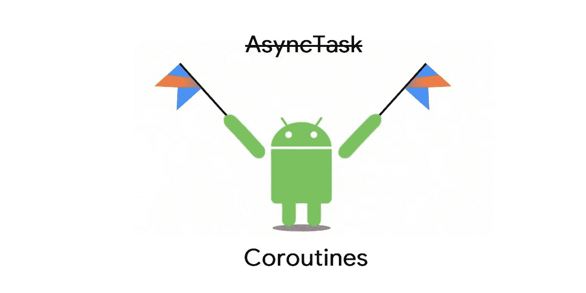

# Android:(第 2 部分)协程的实际工作。

> 原文：<https://medium.com/codex/android-part-2-real-work-of-coroutines-881890f5acea?source=collection_archive---------11----------------------->

来源:谷歌图片

本文是关于使用 Android 协程的系列文章的一部分。这里使用一次性请求来解决协程的实际困难。

如果你是协程的新手，我推荐从系列的第一部分**开始。**

****本系列包括以下文章:****

** [## Android:(第一部分)协程简介

### Android 有许多异步编程技术，但是选择最好的可能很棘手。有一个…

medium.com](/@vinod.baste/android-part1-introduction-to-coroutines-eb36e06fb5d9) 

让我们开始吧。

# **代码设置**

在构造协程之前，必须首先将依赖项添加到 Android 项目中。首先编辑应用程序级别的 build.gradle 文件，并添加以下依赖项:

# 使用具有协程作用域的调度程序

一个**协程作用域**跟踪它用 launch 或 async builder 函数生成的任何协程。

**调度程序**是一种定义执行协程的线程的方法。

在上面的代码中，我们使用了 3 个不同的调度程序和 3 个不同的协程范围。

*   ***协查范围(Dispatchers。*i0):T19*协程范围(Dispatchers。I0)与输入/输出操作相关联，它在 IO 线程上运行。***

*   ***Globalscope。启动(调度员。*main):T25*global scope。启动(调度员。Main)与整个应用程序相关联。***

*   ***主镜()。启动(调度员。*默认):**主镜()。启动(调度员。Default)与实现它的活动相关联。

**输出:**

关于被调度的线程。我们的输出为** 

# **使用 Suspend with 函数**

**协程有助于实现可以挂起的功能&稍后在指定点恢复，而不会阻塞线程。**

**在上面的代码片段中，我们定义了两个函数，它们是挂起函数。**

**任务 1 将执行并挂起 1 秒钟，然后任务 2 将执行并挂起 2 秒钟。**

**为了启动这些暂停功能，我们使用了*协程示波器。***

****输出:****

**您可以看到，第一个任务 1 被执行并挂起，然后协程启动另一个挂起函数任务 2，它挂起以等待任何其他挂起函数完成指令。**

> ****注意:** delay 和 yield 是协程中使用的两个暂停点。**

# ****职务使用****

***作业是一个可以取消的东西，它有一个生命周期，最终会完成。***

**让我们看看作业是如何返回的，以及如何以编程方式使用它。**

*   ****job.jion():** 在**内** runBlocking 调用 join 方法被调用。这意味着一旦 suspend 方法执行完毕，就会调用日志。**

*   ****job.cancel():** 用于停止协程，而不必等待它完成任务。**

**在协程启动 2 秒钟后，作业被取消。**

**取消一个协程并不总是像上面例子中显示的那么简单。重要的是要记住，当使用 cancel()方法时，协程应该知道 cancel 方法将被调用，因为有可能在协程仍在运行时调用 cancel 方法。换句话说，必须有足够的时间通知协程它已经被终止。**

**为了避免这种情况，我们必须手动检查协程是否被取消。这可以通过使用 **isActive** 来检查协程是否有效来实现。**

**一旦任务取消。协程启动立即被取消。**

*   ****withTimeOut():** 经过指定的时间后，协程将自动取消。**

**协程启动 3 秒钟后，作业被取消。**

# **参考**

*   **[**Android 上的 Kotlin 协程**](https://developer.android.com/kotlin/coroutines?gclid=CjwKCAjwi6WSBhA-EiwA6Niok2lmU1xNMY8CxzZbHEY_wCNlsMHcjBUjzGamubkxndEXK33W61cZ9xoCTrIQAvD_BwE&gclsrc=aw.ds)**
*   **[**协程基础知识**](https://kotlinlang.org/docs/coroutines-basics.html)**
*   **[**协程**](https://kotlinlang.org/docs/coroutines-overview.html)**

**感谢您花时间阅读这篇文章。如果你觉得这个帖子有用又有趣，请鼓掌推荐。**

**如果我做错了什么，请在评论中提出来。我很想进步。**