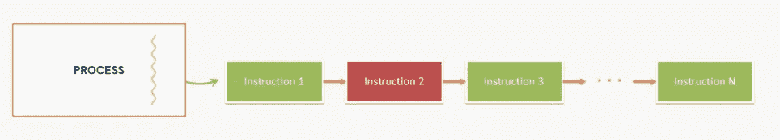

# Android:(第一部分)协程简介

> 原文：<https://medium.com/codex/android-part1-introduction-to-coroutines-eb36e06fb5d9?source=collection_archive---------9----------------------->


来源:谷歌图片

一个 ndroid 有许多异步编程技术，但是选择最好的一个可能很棘手。有些系统的学习曲线很陡。其他的需要大量的样板代码，并且不是很简洁。所有这些都会对你的应用程序的可伸缩性产生影响，并增加新开发者的认知负担。如果您使用的 API 易于使用，并且可以根据需要进行扩展，这是最理想的。

因为在 JVM 上运行的所有系统都面临同样的问题，JetBrains 团队设计了一个新的 API。它的目标是帮助你解决所有这些问题，而不需要很高的学习曲线。——**科特林花冠**。

**本系列包括以下文章:**

[](/@vinod.baste/android-part-2-real-work-of-coroutines-881890f5acea) [## Android:(第 2 部分)协程的实际工作。

### 这是关于使用 Android 协程的文章的一部分。这里使用了一次性请求来解决实际问题…

medium.com](/@vinod.baste/android-part-2-real-work-of-coroutines-881890f5acea) 

# 为什么应该使用协程？

每个 android 应用程序都有一组指令，需要花费大量时间来处理数据并将数据绑定到 UI，即所谓的长时间运行任务。

所有编写的代码都在主线程上按顺序执行。



并且通过这样做，指令 2 main 上的长时间运行的任务冻结应用程序或暂停主线程，直到它完全执行，这导致应用程序的不良行为。

但是协程程序让它变得超级简单。它将长时间运行的任务放在主线程的顶部，即模仿主线程，并且在不冻结或暂停主线程或其他指令序列的情况下执行。

在此过程中，您还会发现以下内容:

*   Kotlin 协程的内部工作方式。
*   了解如何构建自己的协程。
*   如何使用协程来处理异常。

# **要定义协程，我们需要理解:**

在我们开始实现和使用协程之前，理解某些关键点是至关重要的。

# ***协程作用域***

协程作用域跟踪它用 launch 或 async builder 函数生成的任何协程。它让您可以随时取消协程。范围仅限于单个生命周期。如果协程没有任何作用域，它就不能启动。当出现故障时，会向 CoroutineScope 发出警报。

Android 的 KTX 库包括一个与生命周期类相关的协同作用域，如 viewModelScope 和 lifecycle scope。

# ***协程上下文***

它包含一个协程调度器，它选择适当的协程在哪个(哪些)线程上执行。

以下部分组成了一个协程上下文，它决定了协程的行为:

*   工作:管理协程的生命周期。
*   **CoroutineDispatcher:** 使用 CoroutineDispatcher 将工作分派给适当的线程。
*   **协程名:**协程名对于调试很有用。
*   **CoroutineExceptionHandler:**未捕获的异常由 CoroutineExceptionHandler 处理。

# *调度员*

调度程序是定义执行协程的线程的一种方式。

一些预定义的调度程序包括:

*   **调度员。IO:** 将阻塞 IO 任务卸载到线程和网络操作的共享池是协程调度程序的目标。按需创建和关闭该池中的更多线程。
*   **调度员。Main:** 一个协同程序调度器，它处理 UI 项，并且仅限于主线程。您可以直接或通过 MainScope 工厂使用此调度程序。通常，使用单线程调度程序。
    如果类路径中没有可用的主线程调度程序，访问该属性可能会导致 IllegalStateException。
*   **调度员。Default:** 如果在其上下文中没有给定 Dispatcher 或其他 ContinuationInterceptor，则所有协同例程构造函数(如 launch、async 等)都会使用默认的协同例程 dispatcher。它是为脱离主线程的 CPU 繁重任务而设计的。

# 暂停

暂停只不过是一个术语。挂起功能就是:一个可以被中断并在以后恢复的功能。我们可以执行长时间运行的流程，等待它们完成，而不必阻塞。挂起函数使用与传统函数相同的语法，但是增加了 suspend 关键字。

```
suspend fun functionName*() {
}*
```

> ***注*** *:* 挂起应该只从一个**协程**或**另一个挂起** **函数**中调用，根据一个基本要求。

# **工作**

任务是一个可终止的项目，其生命周期随着任务的完成而结束。启动协程生成器用于创建协程作业。它执行定义的代码块，并在完成时退出。

以下是作业界面提供的许多功能中的一部分:

*   join() :函数是一个挂起函数，这意味着它可以从另一个挂起函数或协程中调用。作业挂起所有线程，直到编写它的协程或编写它的上下文完成它的任务。只有当协程完成后，join()方法后面的行才会被执行。
*   **cancel():** 方法用于终止协程，而不必等待它完成任务。它与 join 方法类似，join()方法在阻塞所有其他线程之前等待协程完成其整个任务，而 cancel()函数在检测到协程时会将其杀死或停止。让我们看一个展示 cancel()函数如何工作的例子。
*   **withTimeOut():** 当指定的时间过去后，协程将自动取消，不再执行进一步的计算，withTimeOut()可以对此有所帮助。

# 参考

*   [T5【科特林】安卓 ](https://developer.android.com/kotlin/coroutines?gclid=CjwKCAjwi6WSBhA-EiwA6Niok2lmU1xNMY8CxzZbHEY_wCNlsMHcjBUjzGamubkxndEXK33W61cZ9xoCTrIQAvD_BwE&gclsrc=aw.ds)
*   [**协程基础知识**](https://kotlinlang.org/docs/coroutines-basics.html)
*   [**协程**](https://kotlinlang.org/docs/coroutines-overview.html)

您可能还想查看我的[(第 2 部分)协程的真实作品](/@vinod.baste/android-part-2-real-work-of-coroutines-881890f5acea)，它已经在 medium 中发布。它带来了对 Kotlin 协程实现的更深入的了解。

[](/@vinod.baste/android-part-2-real-work-of-coroutines-881890f5acea) [## Android:(第 2 部分)协程的实际工作。

### 这是关于使用 Android 协程的文章的一部分。这里使用了一次性请求来解决实际问题…

medium.com](/@vinod.baste/android-part-2-real-work-of-coroutines-881890f5acea) 

*感谢您花时间阅读本文。如果你觉得这个帖子有用又有趣，请鼓掌推荐。*

如果你做错了什么？请在评论中提及。我很想进步。