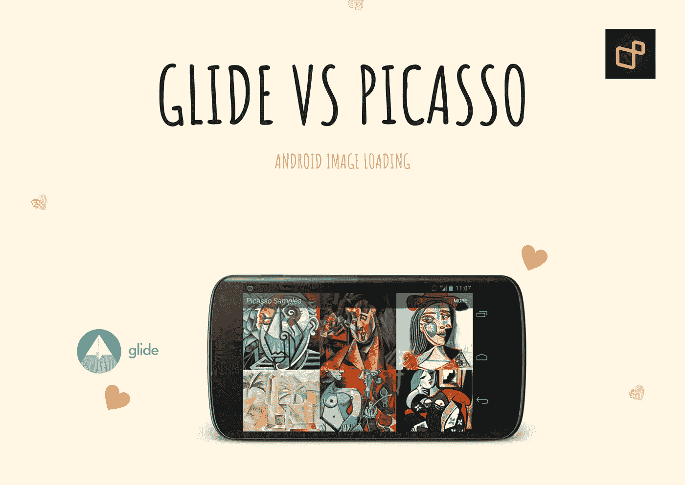

# Android:毕加索，幕后的滑动磁盘缓存

> 原文：<https://medium.com/codex/android-picasso-glide-disk-caching-behind-the-scenes-31c6a9407838?source=collection_archive---------0----------------------->

[https://square.github.io/picasso/](https://square.github.io/picasso/)

# ⚡️语法:

如果您想简单地从 URL 加载图像并在图像视图中显示它们，这两个库的语法几乎相同。两者都支持淡入淡出动画和中间裁剪。您还可以添加占位符图像，以便在加载图像或图像加载失败时显示。

## 毕加索