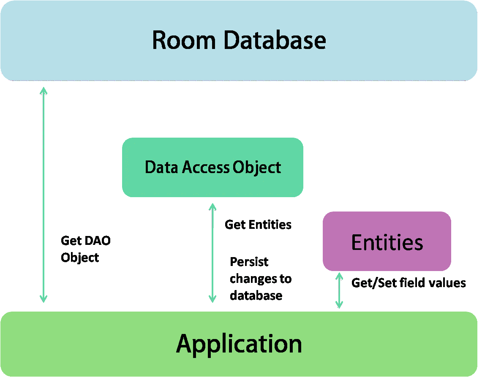
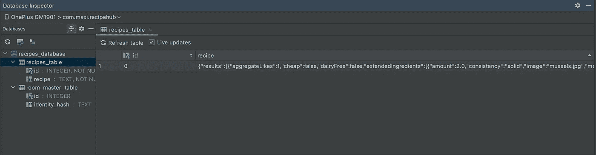

# Android: Room，以现代方式保存本地数据

> 原文：<https://medium.com/codex/android-room-saving-local-data-the-modern-way-b5f5f0e8b423?source=collection_archive---------3----------------------->


弗兰基·查马基在 [Unsplash](https://unsplash.com?utm_source=medium&utm_medium=referral) 上拍摄的照片

我们使用的几乎每个应用程序都出于这样或那样的目的存储数据，比如存储图像、文件、用户偏好等。一个最常见的用例是缓存相关的数据，以便当设备无法访问网络时，用户仍然可以在离线时浏览这些内容。根据我们的使用情况，Android 有很多存储数据的方法。在本文中，我将讨论存储结构化数据的最佳推荐方式，那就是房间库。

> Room persistence 库在 SQLite 上提供了一个抽象层，允许流畅的数据库访问，同时充分利用 SQLite 的强大功能。

## **我们为什么要在 SQLite 上使用空间？**

*   没有运行时查询错误，因为 Room 提供了 SQL 查询的编译时验证。
*   最大限度减少重复和容易出错的样板代码的便利注释。
*   它与其他架构组件无缝集成。

## **主要部件**

*   实体
*   数据访问对象(Data Access Object)
*   数据库ˌ资料库

## **实体**

表示应用程序数据库中的表。Room 为每个具有@Entity 注释的类创建一个表，类中的字段对应于表中的列。因此，实体类是不包含任何逻辑的数据类。

## **刀**

Dao 是用@Dao 注释的接口，它们提供了应用程序可以用来查询、更新、插入和删除数据库中的数据的方法。

## **数据库**

database 类保存数据库，并作为应用程序持久数据的底层连接的主要访问点。database 类为您的应用程序提供了与该数据库相关联的 Dao 实例。反过来，应用程序可以使用 DAOs 从数据库中检索数据，作为相关数据实体对象的实例。



让我们通过一个例子来理解实现。

要开始使用 Room，请将以下依赖项添加到您的应用程序的 *build.gradle* 文件中:

```
dependencies {
    def roomVersion = "2.3.0" implementation("androidx.room:room-runtime:$roomVersion")
    kapt "androidx.room:room-compiler:$roomVersion" implementation "androidx.room:room-ktx:$roomVersion"
    androidTestImplementation "androidx.room:room-       testing:$roomVersion"

 }
```

下面的代码片段定义了一个**配方**模型，它包含一个**结果**的列表，其中 Result 类包含每个配方的属性。我们将在数据库中保存一个食谱列表。

```
data class Recipe(
    @SerializedName("results")
    val results: List<Result>
)data class Result(
    @SerializedName("sourceName")
    val sourceName: String,
    @SerializedName("sourceUrl")
    val sourceUrl: String,
    @SerializedName("summary")
    val summary: String,
    @SerializedName("title")
    val title: String,
    @SerializedName("vegan")
    val vegan: Boolean,
    @SerializedName("vegetarian")
    val vegetarian: Boolean,
    @SerializedName("veryHealthy")
    val veryHealthy: Boolean
)
```

**数据实体:**

```
@Entity(tableName = "recipes_table*"*)
class RecipesEntity(
    var recipe: Recipe
) {

    @PrimaryKey(autoGenerate = false)
    var id: Int = 0

}
```

我们用 **@Entity** 标注的实体类，有个名字***recipes _ table****。*我们在表中只有一行食谱列表，因此在这种情况下我们不需要主键，这就是为什么我将 ***自动生成*** 属性设置为 false。

**数据访问对象(Dao):**

我们的 ***RecipesDao*** ，用 **@Dao** 标注，有两个方法，一个是在表中插入我们的菜谱( *RecipeEntity* )，另一个是读取缓存的菜谱，返回菜谱实体列表流。

```
@Dao
interface RecipesDao {

    @Insert(onConflict = OnConflictStrategy.*REPLACE*)
    suspend fun insertRecipes(recipesEntity: RecipesEntity)

    @Query("SELECT * FROM recipes_table ORDER BY id ASC")
    fun readRecipes(): Flow<List<RecipesEntity>>

}
```

默认情况下，Room 只能存储原始类型，要存储自定义对象，我们需要使用 **TypeConverter** 将自定义对象转换为已知的数据库类型。在我们的例子中，我们将把食谱列表转换成一个字符串。进行类型转换的方法需要用***type converter****进行注释。*

```
class RecipesTypeConverter {

    val gson = Gson()

    @TypeConverter
    fun recipeToString(recipe: Recipe): String {
        return gson.toJson(recipe)
    }

    @TypeConverter
    fun stringToRecipe(recipeString: String): Recipe {
        val objectType = object : TypeToken<Recipe>() {}.*type* return gson.fromJson(recipeString, objectType)
    }

}
```

我定义了两个方法，一个将我们的 Recipe 对象转换成字符串，另一个将字符串转换回 Recipe 对象。我使用 **Gson** 进行类型转换。

**数据库**

```
@Database(
    entities = [RecipesEntity::class],
    version = 1,
    exportSchema = true
)
@TypeConverters(RecipesTypeConverter::class)
abstract class RecipesDatabase : RoomDatabase() {

    abstract fun recipesDao(): RecipesDao

}
```

我们用 **@Database** 标注的数据库类定义了数据库配置，并作为应用程序对持久数据的主要访问点。在数据库中，如果我们想要**将数据库模式**导出到一个文件夹中，我们需要提到**实体列表**、**数据库版本**，以及 t **类型转换器**(如果有的话)。

**用法**:

在我们定义了数据实体、DAO 和数据库对象之后，我们可以使用下面的代码来创建数据库的实例。我用刀柄做 DI。

```
@Module
@InstallIn(SingletonComponent::class)
object DatabaseModule {

    @Singleton
    @Provides
    fun provideDatabase(
        @ApplicationContext context: Context
    ) = Room.databaseBuilder(
        context,
        RecipesDatabase::class.*java*,
        *RECIPES_DATABASE_NAME* ).build()

    @Singleton
    @Provides
    fun provideDao(database: RecipesDatabase) =    database.recipesDao()

}
```

我已经创建了一个 LocalDataSource 类，它将向存储库公开 DAO 的方法。这里我通过构造函数注入来注入 Dao 类。

```
class LocalDataSource @Inject constructor(
    private val recipesDao: RecipesDao
) {

    suspend fun insertRecipes(recipesEntity: RecipesEntity) {
        recipesDao.insertRecipes(recipesEntity)
    }

    fun readRecipes(): Flow<List<RecipesEntity>> {
        return recipesDao.readRecipes()
    }
}
```

现在，在存储库中，我将注入远程数据源。我使用了**@ activity retained scoped**，这样我们的存储库在配置更改后仍然存在。

```
@ActivityRetainedScoped
class Repository @Inject constructor(
    localDataSource: LocalDataSource
) {
    val local = localDataSource
}
```

> 您可以类似地将远程数据注入到存储库中，然后在 ViewModel 类中使用它。

```
@HiltViewModel
class MainViewModel @Inject
constructor(
    private val repository: Repository,
    application: Application,
) :
    AndroidViewModel(application) {

    */**ROOM DATABASE*/* val readRecipes: LiveData<List<RecipesEntity>> = repository.local.readRecipes().*asLiveData*()

    private fun insertRecipes(recipesEntity: RecipesEntity) {
        *viewModelScope*.*launch*(Dispatchers.IO) **{** repository.local.insertRecipes(recipesEntity)
        **}** }

    private fun cacheRecipes(recipe: Recipe) {                        // saving recipe as a Recipe Entity object, and inserting in the db.
        val recipesEntity = RecipesEntity(recipe)
        insertRecipes(recipesEntity)
    } // Other logic }
```

在这里，我从注入的存储库中读取数据，并将其作为实时数据存储在 **readRecipes** 变量中。在一个成功的 API 响应上，我调用**cache recipes(Recipe:Recipe)**。

最后，我正在访问我的片段中的食谱，并将数据设置到适配器，

```
private fun readCachedData() {
    *lifecycleScope*.*launch* **{** mainViewModel.readRecipes.*observeOnce*(*viewLifecycleOwner*) **{** dataBase **->** if (dataBase.*isNotEmpty*()) {
                Log.d(TAG, "readCachedData:() ")

              recipesAdapter.submitList(dataBase[0].recipe.results)
            } else {                                               // in case database is empty
                requestApiData()
            }
        **}
    }** }
```

我们在数据库中的数据会像这样，



> 您可以使用数据库检查器来可视化您的数据并实时运行查询。

这是给你们的房间，希望对你们有所帮助。

这篇文章的灵感来自斯蒂芬·约万诺维奇在 [Udemy](https://www.udemy.com/course/modern-food-recipes-app-android-development-with-kotlin/) 上的一堂课。