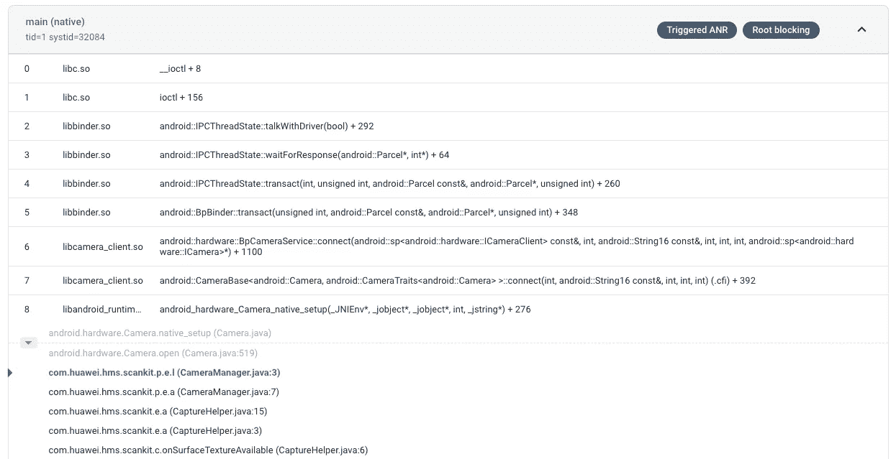
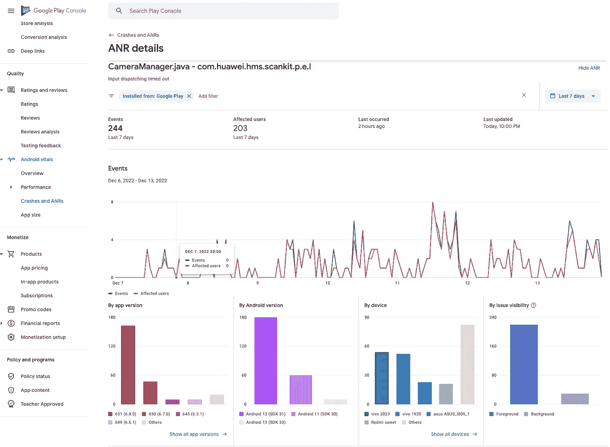

# Android:处理应用程序不响应(ANRs)

> 原文：<https://medium.com/codex/android-tackling-application-not-responding-anrs-3c91360cd023?source=collection_archive---------4----------------------->

斯蒂芬·道森在 [Unsplash](https://unsplash.com?utm_source=medium&utm_medium=referral) 上拍摄的照片

ANR，代表“应用程序没有响应”，是一种当 Android 应用程序长时间没有响应时发生的错误。如果应用程序正在主线程上执行长时间运行的操作，如复杂的计算或网络操作，并且无法及时响应用户输入或其他事件，就会发生这种情况。

崩溃与 ANR 的不同之处在于，崩溃是一种代码异常，而 ANR 是一种持续的无响应状态。因此，当崩溃发生时，应用程序本身就会终止。当 ANR 发生时，用户无法在应用中做任何事情，被迫退出，或者 Android 系统向用户显示错误信息，如果问题没有解决，应用可能会被杀死。

anr 是 Android 用户感到沮丧的一个常见原因，导致负面的应用评论和评级。此外，在这些方面表现不佳会直接影响你的排名和被发现的机会。这将使你的应用在搜索结果中的位置处于危险之中，并影响其被展示的资格。

一个应用程序的 ANR 门槛是在每天至少 **0.47%** 的时段中展示至少一个 ANR。如果你想在 Google Play 上最大化你的标题的可见性，保持在这些阈值以下是至关重要的。此外，如果您的游戏在某个特定手机型号的任何重要核心上超过了设备不良行为阈值，Google Play 可能会降低其在该手机型号上的用户可见性。阅读更多关于提高 Google Play 技术质量标准的信息。

# 预防

根据这些信息，他们观察并检测了相当多的用例，这些用例主要是对 ANRs 有贡献的。为了避免 ANR 错误，开发人员应该始终远离这些危险的实践。

*   **在主线程上执行长时间运行的操作**:如果您的应用正在主线程上执行长时间运行的操作，例如复杂的计算或网络操作，它可能会变得无响应并触发 ANR 错误。
*   **设计糟糕的用户界面**:如果你的应用程序有一个设计糟糕的用户界面，它更有可能触发 ANR 错误。例如，如果你的应用程序有很多按钮或其他控件密集在一起，用户可能很难与你的应用程序交互，他们可能会意外触发 ANR 错误。
*   **输入调度超时:**如果你的应用在 5 秒内没有响应输入事件(如按键或触摸屏幕)。
*   **执行服务:**如果你的 app 声明的某个服务无法在几秒钟内执行完`Service.onCreate()`和`Service.onStartCommand()` / `Service.onBind()`。
*   **Service.startForeground()未被调用:**如果你的 app 使用`Context.startForegroundService()`在前台启动一个新的服务，但是该服务在 5 秒内没有调用`startForeground()`。
*   **意图广播:**如果 a `[BroadcastReceiver](https://developer.android.com/reference/android/content/BroadcastReceiver)`没有在设定的时间内完成执行。如果应用程序在前台有任何活动，超时时间为 5 秒。

# 侦查

找到 ANRs 是解决它们的最大障碍。因为他们不能考虑用户遇到的所有因素，所以开发人员在测试中不能捕捉所有的 anr。此外，anr 不仅仅是软件故障，不可能从系统中完全消除它们。现实是，开发人员必须不断地在提高应用速度和节约系统资源之间取得平衡。此外，由于有如此多的不同设备具有不同的规格和性能，开发人员很难为每一个可能的用例重新创建它们。旧设备上的硬件限制可能会导致大量无效的 UI 更新速度变慢。因此，需要使用工具或库来帮助开发人员找出 anr。以下是免费提供的工具，可能有助于减少 ANRs 事件。

**Firebase crash lytics**
crash lytics 现在开始从 Android 11+设备收集 ANRs 事件。如果开发人员希望深入研究 Firebase Crashlytic kits 收集的 ANRs 事件，他们可以将事件类型过滤到 ANRs。从仪表板附加 ANR 事件的示例日志。这可能有助于开发人员寻找根本原因。

ANR 火箭发动机预演

**Google Play 主机** 相比 Firebase，Google Play 主机更强调受影响的设备。尽管为开发者提供了堆栈跟踪行，但我确实发现 firebase one 在调试方面更有用。选项现在位于**质量**部分下， **Android 生命体征** > **崩溃和来自 **Google Play 控制台仪表板的 ANRs** 。**

Google Play 控制台预览

**ANR 看门狗** 这是一个来自[萨洛蒙布里斯](https://github.com/SalomonBrys)的不可思议的图书馆。请务必查看 Github 的这个库的实现细节以及它是如何工作的。基本上，这个库调度一个简单的 thread/ runnable 尽快在 UI 线程上运行，它带有 5 秒的超时间隔(因为这是 ANR 超时间隔)。如果 runnable 在这 5 秒内已经运行，它将重复调度一个新的 runnable，否则它将引发一个错误，所有正在运行的线程都将被跟踪。开发人员可以将其与 Firebase Crashlytics 或其他首选分析 SDK 集成，以设置报告通道。

希望上述解释能为理解 ANRs 事件并解决它们提供更多见解，从而提高您的应用程序可用性以及提升 Play Store 排名和可见性。附上以下参考:

 [## 安卓开发者

### 当一个 Android 应用程序的 UI 线程被阻塞太久，就会触发“应用程序没有响应”(ANR)错误…

developer.android.com](https://developer.android.com/topic/performance/vitals/anr)  [## 使用 Android vitals 监控应用的技术质量

### 为了让开发者了解他们的游戏给用户带来的流畅感，我们增加了一个新的 Android vitals…

support.google.com](https://support.google.com/googleplay/android-developer/answer/9844486)  [## 根据 Crashlytics 仪表盘| Firebase Crashlytics 中的 ANR 标签调试您的 Android 应用程序

### 应用程序不响应(ANR)错误是在应用程序的 UI 线程没有响应更多…

firebase.google.com](https://firebase.google.com/docs/crashlytics/debug-anr-errors)  [## GitHub-Salomon brys/ANR-WatchDog:一个简单的看门狗，检测 Android ANR(应用程序不…

### 一个简单的看门狗检测 Android ANRs(应用程序不响应)。目前没有办法让一个机器人…

github.com](https://github.com/SalomonBrys/ANR-WatchDog)