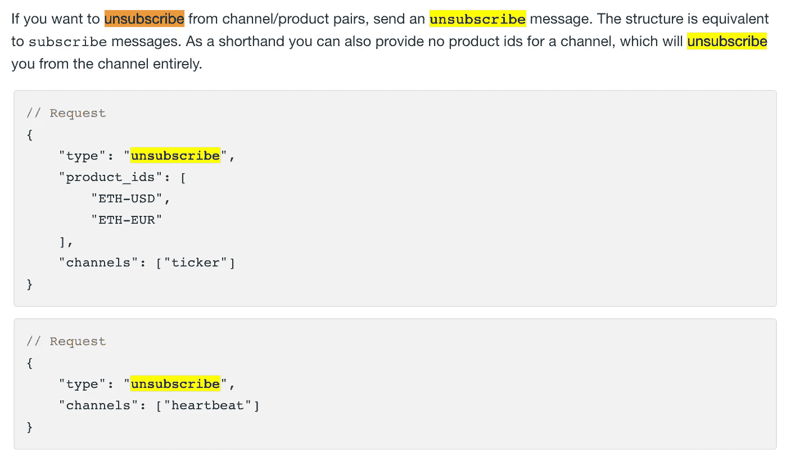
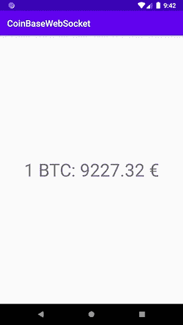
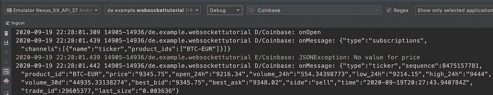
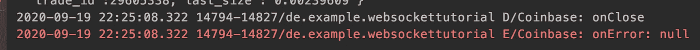
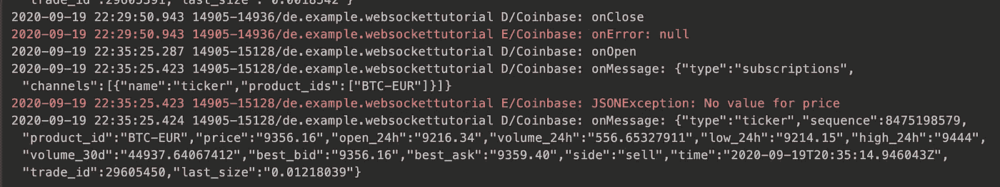

# Android 教程第 2 部分使用 Java-WebSocket 和 Kotlin

> 原文：<https://medium.com/codex/android-tutorial-part-2-using-java-websocket-with-kotlin-dd3105bd3eed?source=collection_archive---------2----------------------->

## [法典](http://medium.com/codex)


照片由[i̇smail·埃尼斯·艾汉](https://unsplash.com/@ismailenesayhan?utm_source=unsplash&utm_medium=referral&utm_content=creditCopyText)在 [Unsplash](https://unsplash.com/s/photos/server-client?utm_source=unsplash&utm_medium=referral&utm_content=creditCopyText) 上拍摄

这是教程的第二部分:通过 Kotlin 使用 Java-WebSocket。

在第 1 部分中，我们设置了 Gradle 依赖关系，看了看比特币基地 Pro 的 websocket feed。然后创建了显示价格的布局。开始实现匿名类***WebSocketClient***并完成实现 *onOpen()* 方法。

## 让我们继续 onMessage()

我们完成了下一个 *onMessage()* 的 *onOpen()* hop。在该方法中， *onMessage()* 从这里开始，也使用 log 语句。然后在 UI 上创建设置比特币欧元价格的方法。

```
override fun onMessage(message: String?) {
    Log.d(TAG, "onMessage: $message")
    setUpBtcPriceText(message)
}
```

方法*setUpBtcPriceText(message)*尚未创建。让我们开始实施它。如果给定的参数不为空，则应首先检查它。创建一个 moshi 实例。在下一行创建适配器实例。然后将 JSON 传递给适配器。为了给 id 为 *btc_price_tv* 的 ***TextView*** 分配价格，必须在能够访问 UI 的线程上进行。我们必须使用 *runOnUiThread {}。*

## 下一次 onClose()

与 *onMessage()* 相同，这里也从一个日志语句开始，然后创建取消订阅 websocket 的方法。

```
override fun onClose(code: Int, reason: String?, remote: Boolean) {
    Log.d(TAG, "onClose")
    unsubscribe()
}
```

但是在开始实现该方法之前。首先，让我们来看看[比特币基地官方 Pro 文档](https://docs.pro.coinbase.com/?r=1#subscribe)。



来自比特币基地专业 websocket 文档的截图

好的，我们再次需要我们的字段 *webSocketClient* 来发送取消订阅的消息。

## 错误上的最后一个方法()

目前我们已经实现了 *onOpen()、onMessage()* 和 *onClose()* 。方法 *onError()* 最容易实现。这里我们只想记录错误发生的时间。

```
override fun onError(ex: Exception?) {
    Log.e(TAG, "onError: ${ex?.message}")
}
```

# 完成 initWebSocket()的实现

我们差不多完成了。跳回方法 *initWebSocket()* 。当前的实现如下所示:

```
private fun initWebSocket() {
    val coinbaseUri: URI? = URI(WEB_SOCKET_URL)

    createWebSocketClient(coinbaseUri)
}
```

下面是方法*createWebSocketClient(coin base uri*)。添加一个类型为 ***SSLSocketFactory*** 的局部变量。这个局部变量是连接到安全 websocket 所必需的，因为“wss://ws-feed.pro.coinbase.com”中的“wss”代表 websocket secure。连接是加密的。如果是“ws ”,连接将是明文。

```
val socketFactory: SSLSocketFactory = SSLSocketFactory.getDefault() as SSLSocketFactory
```

在类型为 ***SSLSocketFactory*** 的局部变量下面，我们需要为我们的字段 *webSocketClient* 设置套接字工厂。在新的一行，我们可以调用我们的字段 *webSocketClient* 的 connect()方法来建立到“wss://ws-feed.pro.coinbase.com”的连接。

```
webSocketClient.setSocketFactory(socketFactory)
webSocketClient.connect()
```

# 允许 Internet 权限

然后我们才能运行应用程序，看看是否一切正常。我们必须打开***androidmanifest . XML***并添加互联网访问权限。

```
<uses-permission android:name="android.permission.INTERNET" />
```

打开 Logcat，查看一切正常

好了，现在运行应用程序，您应该会看到类似这样的内容:



一个比特币的欧元价格

然后打开 Logcat，将其设置为 Debug，并键入搜索“比特币基地”,您应该会看到类似这样的内容:



onOpen()和 onMessage()

然后将该应用程序置于后台，或者在您的设备上打开另一个应用程序。那么您应该会看到这样的内容:



onClose()和 onError()

当屏幕不在前台时，连接将被关闭，这将节省电池和数据量。该逻辑在[第一部分](/@fahri.c93/android-tutorial-part-1-using-java-websocket-with-kotlin-646a5f1f09de)中实现，覆盖 *onPause()。*

```
override fun onPause() {
    super.onPause()
    webSocketClient.close()
}
```

现在再次将应用程序放在前台，并观看 Logcat。你会看到一切都重新开始。



就是这样！祝贺迄今为止的成绩！我希望这篇教程对你有用。这是已完成的项目，您可以检查分支 **part2** :

[](https://github.com/fahrican/WebSocketTutorial/tree/part2) [## fahrican/WebSocketTutorial

### 在本教程中，我将展示如何与 Kotlin 一起使用 Java-Websocket 库。GitHub 是超过 5000 万用户的家园…

github.com](https://github.com/fahrican/WebSocketTutorial/tree/part2) 

# 感谢

特别感谢[比特币基地 Pro](https://pro.coinbase.com/) 为他们的 [websocket feed](https://docs.pro.coinbase.com/?r=1#websocket-feed) 提供文档。