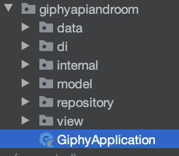

# Android 教程第 3 部分:使用 RxJava 2，Dagger 2，Kotlin 和 MVVM 的房间

> 原文：<https://medium.com/codex/android-tutorial-part-3-using-room-with-rxjava-2-dagger-2-kotlin-and-mvvm-13487515207f?source=collection_archive---------2----------------------->

## [法典](http://medium.com/codex)


[法比奥](https://unsplash.com/@fabioha?utm_source=unsplash&utm_medium=referral&utm_content=creditCopyText)在 [Unsplash](https://unsplash.com/s/photos/database-storage?utm_source=unsplash&utm_medium=referral&utm_content=creditCopyText) 上的照片

这是教程的第三部分:使用 RxJava 2，Dagger 2，Kotlin 和 MVVM 的房间。

在第 2 部分中，我们完成了房间数据库的实现。

# **现在我们需要一个项目申请**

转到您的根包，其中包含包**数据**、 **di** 、**模型**等。在根包 ***中创建 GiphyApplication.kt*** 。



这个类必须从**Android . app . application**扩展而来。当你的类从[应用程序](https://developer.android.com/reference/android/app/Application)扩展时，只要应用程序还在内存中，你的类就会一直存在。

```
class GiphyApplication : Application() {
}
```

然后头转向***androidmanifest . XML***并在标签 **<应用>** 内添加你的***GiphyApplication***作为名字。所以你的应用知道这个你的[应用](https://developer.android.com/reference/android/app/Application)类。

```
<application
    android:name=".GiphyApplication"
```

当你使用完***androidmanifest . XML***后，回到***giphyapplication . kt***并创建两个**同伴**对象。一个字段用于***GiphyApplication***实例，一个字段用于 ***趋势数据库*** 。

```
companion object {
    lateinit var instance: GiphyApplication
    lateinit var database: TrendingDatabase
}
```

接下来在 init 构造函数中实例化您的***GiphyApplication***实例。

```
init {
    instance = this
}
```

当应用程序类来到 ***onCreate()*** 这里我们要实例化数据库实例。

```
override fun onCreate() {
    super.onCreate()
    database = TrendingDatabase.invoke(this)
}
```

# 再次回到存储库

还记得***trending repository . kt***类吗？在添加了一个 **GiphyApi** 实例、 **MutableLiveData** 对象、 **LiveData** 对象并在构造函数中使用了 **Dagger 2** 依赖注入之后，我们离开了这个类。

## 将数据插入数据库。

首先，我们需要在 ***Constant.kt*** 中增加两个全局常量。这两个常量分别用于 giphies 限制和评级，它们都将作为参数附加到 URL 上。

```
const val *LIMIT* = "25"
const val *RATING* = "G"
```

完成后，我们需要一个将数据从端点插入数据库的方法。回到**T5【trending repository . kt对于这个方法 **RxJava 2** 是需要的。因为数据库操作必须在后台线程上进行。**

将数据插入数据库的逻辑在 subscribeToDatabase()中。这些方法包含三个基本的子方法:**on next(trending result:trending result？)**， **onError(t: Throwable？)**和 **onComplete()** 。

我们先从**on next(trending result:trending result？)**。第一步是检查从端点返回的对象是否不为空。第二步是使用***todayataentillist*()**方法从***data mapper . kt***列表中得到数据。为从端点返回的对象创建一个新的局部变量。第三步是使用***GiphyApplication***的数据库实例，用 DAO 将上一步的局部变量插入数据库。

但是当错误发生时会发生什么呢？这就是为什么我们有 **onError(t: Throwable？)**。下面来了 ***可变可变数据*** 对象 **_isInProgress** 和 **_isError** 派上用场。不要忘记，我们还应该在控制台上记录一个错误，以便于调试。

如果没有发生错误并且**on next(trending result:trending result？完了我们来到**。这里将创建一个新方法，用于从数据库中获取数据，并将其显示在 UI 上。****

```
override fun onComplete() {
    getTrendingQuery()
}
```

## 从数据库中取出数据

这里再次需要***GiphyApplication***和 **RxJava 2** 。正如您所记得的，数据库操作必须在后台线程上进行。首先，我们需要来自数据库实例的 DAO 来查询数据。然后我们需要 **Schedulers.io()** 用于后台线程化，需要**androidschedulers . main thread()**用于在 UI 上显示结果。所有的逻辑都发生在 **subscribe()** 中。

```
private fun getTrendingQuery(): Disposable {
    return GiphyApplication.database.dataDao()
        .queryData()
        .subscribeOn(Schedulers.io())
        .observeOn(AndroidSchedulers.mainThread())
        .subscribe()
}
```

**onSuccess()** 我们得到一个**列表< DataEntity >** 如果列表不为 null 或空，我们将它传递给 **MutableLiveData <列表<数据> >** 否则我们必须调用之前创建的 **insertData()** 方法。

好了，现在休息一会儿，看看上面来自 **onSuccess()** 的要点。这是现在教程最重要的部分！正如您在 *else {}* 中看到的，方法**insert data()*被调用。这是整个项目中唯一调用 *insertData()* 的地方。我们总是首先尝试从数据库中获取数据，只是在数据库为空的情况下，然后 *insertData()* 被触发*。*第一次安装并启动应用程序时，如果您有互联网连接(向 Giphy API 发出 GET 请求),方法 *insertData()* 将会触发，因为本地数据库为空。比方说，您关闭应用程序，几分钟、几小时或几天后重新启动，然后每次直接从数据库获取数据，并且 *insertData()* 从未调用过**！这样，本地**房间**数据库是我们唯一的真实来源，我们甚至可以在飞行模式下离线访问数据。***

***onError()** 我们可以从 **insertData()** 中得到相同的逻辑，我建议使用另一个 Logcat 消息。*

```
***{** _isInProgress.postValue(true)
    Log.e("getTrendingQuery()", "Database error: ${**it**.message}")
    _isError.postValue(true)
    _isInProgress.postValue(false)
**}***
```

*下面是对方法 *getTrendingQuery()* 的总结:*

****trending repository***中的最后一个方法是 **ViewModel** 开始从数据库中获取的公共方法。*

```
*fun fetchDataFromDatabase(): Disposable = getTrendingQuery()*
```

# *为 MVVM 创建的最后一个类*

*转到您的根包，其中包含包**数据**、 **di** 、**模型**等。创建一个新包，命名为 **viewmodel** 。在 **viewmodel** 里面创建类**trending viewmodel . kt。这个类必须继承自 ***ViewModel()*** 。***

```
*class TrendingViewModel: ViewModel() {
}*
```

## *又到了依赖注入的时候了*

*回到 ***AppModule*** 这里我们需要一个提供存储库的方法。*

```
*@Provides
fun provideTrendingRepository() = TrendingRepository()*
```

*然后当然我们需要 ***AppComponent*** ，这里我们要告诉 **Dagger 2** 需要注入***TrendingViewModel***。*

```
*fun inject(viewModel: TrendingViewModel)*
```

*现在我们可以使用**视图模型**中的存储库。我们还需要一个字段来存储从存储库发出的所有一次性调用。在***{ init }***构造函数中已经发生了**匕首 2** 注入和添加一次性调用。当 **ViewModel** 被 Android 生命周期破坏时，不要忘记清除/删除所有一次性调用。*

# *最后，是完成主要活动的时候了*

*跳回 ***AppModule*** 并为***ArrayList<Data>***和 ***TrendingAdapter 创建一个提供方法。****

***Dagger 2** 自动将 *provideListData()* 的结果链接到 *provideTrendingAdapter()。*正如你在 ***AppComponent*** 中已经知道的，我们需要 ***MainActivity*** 的 inject 方法。*

```
*fun inject(mainActivity: MainActivity)*
```

*让我们再次回到 ***MainActivity*** ，现在我们可以创建一个字段*和***trending adapter***。将 ***趋势适配器*** 标注为**@注入**。**

```
**@Inject
lateinit var trendingAdapter: TrendingAdapter

private val viewModel: TrendingViewModel by *viewModels*()**
```

**在*on creteae()*中，首先使用***DaggerAppComponent***注入 *TrendingAdapter* 属性，然后创建 *setUpRecyclerView()* 和 *observeLiveData()方法。***

```
**override fun onCreate(savedInstanceState: Bundle?) {
    super.onCreate(savedInstanceState)
    setContentView(R.layout.*activity_main*)

    DaggerAppComponent.create().inject(this)

    setUpRecyclerView()

    observeLiveData()
}**
```

**在方法 **setUpRecyclerView()** 中，我们使用 [KAE](https://antonioleiva.com/kotlin-android-extensions/) 从**r . layout .*activity _ main***中访问 **recycler_view** (这是 RecyclerView 的 ID)。在那里我们设置了固定的大小，动画和适配器。**

```
**private fun setUpRecyclerView() {
    recycler_view.*apply* **{** setHasFixedSize(true)
        *itemAnimator* = DefaultItemAnimator()
        *adapter* = trendingAdapter
    **}** }**
```

**好了，现在 **setUpRecyclerView()** 实现了，让我们继续实现 **observeLiveData()** 。在 **observeLiveData()** 里面创建三个方法:**

```
**private fun observeLiveData() {
    observeInProgress()
    observeIsError()
    observeGiphyList()
}**
```

**从**观察程序()开始。**该方法用于检查数据是否仍在加载。如果是，则显示 ***进度条*** ，隐藏空文本和 ***回收视图。*** 否则，只需隐藏 ***进度条*** 。**

**第二种方法 *observeIsError()* 只是检查加载数据时是否发生了错误(比如没有互联网连接)。如果是的话，我们需要可以在方法*observegiphlist()*中重用的特定逻辑。如果不是错误，应禁用空文本，并启用 ***进度条******。*****

**如果发生了错误。最初应该可以看到 ***进度条*** 。当然空文本也是如此。 ***RecyclerView*** 应该是不可见的，被禁用。适配器的列表应该设置为空列表。最后， ***进度条*** 应该是不可见的，被禁用了。**

**最后，我们到达了要实现的最后一个方法。跳转到*observegiphlist()*这里首先检查是否为空或者列表是否为空。然后 ***进度条*** 应该首先可见。使 ***回收视图*** 可见，并将数据列表设置到适配器中。最后，空文本和 ***进度条*** 应该是*而不是*可见并被禁用。在数据列表为 null 或空列表的情况下，我们重用 *disableViewsOnError()* 的逻辑。**

**就是这样！祝贺迄今为止的成绩！我希望这篇教程对你有用。这里是已完成的项目，你可以结帐分公司 **part3** :**

**[](https://github.com/fahrican/GiphyApiAndRoom/tree/part3) [## fahrican/GiphyApiAndRoom

### 在 GitHub 上创建一个帐户，为 fahrican/GiphyApiAndRoom 的发展做出贡献。

github.com](https://github.com/fahrican/GiphyApiAndRoom/tree/part3) 

# 感谢

特别感谢 [**GIPHY API**](https://developers.giphy.com/docs/api#quick-start-guide) 提供这个免费 API。**