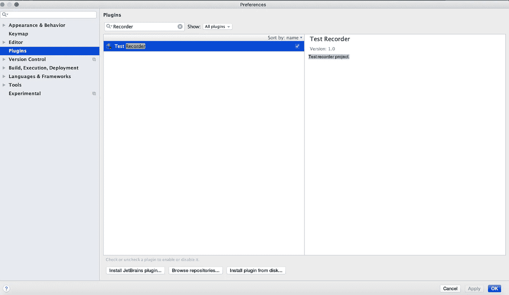
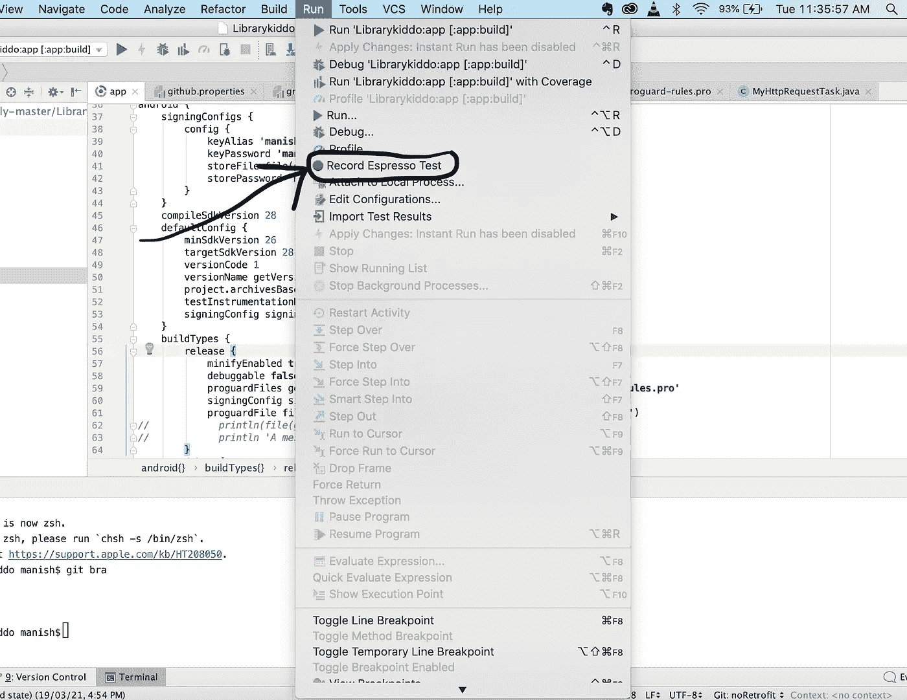
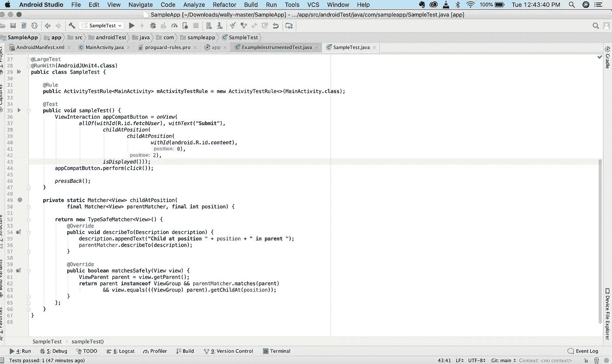

# 用神奇的技巧测试 Android 用户界面

> 原文：<https://medium.com/codex/android-ui-testing-for-beginners-e775b4eb692e?source=collection_archive---------14----------------------->

一个开发者和一个高效的开发者有很大的区别。一个开发人员可以编写一个有效的代码，但是一个高效的开发人员不仅要编写一个有效的代码，还要使用强大的工具来提高工作的整体质量和相关人员的效率。有这么多强大的工具，开发人员可以通过它们在很大程度上减少繁重的工作，但是如果你不知道这些工具，你只是在浪费时间做你不应该做的事情。

作为一名优秀的开发人员，你的代码应该足够健壮，QA/测试团队应该能够通过构建，而不会出现任何问题。可能吗？？？是的，毫无疑问，甚至在一些公司根本没有 QA/测试团队，他们相信开发人员就是 QA，QA 就是开发人员。所以问题是他们是如何管理的？这样的开发(开发人员做 QA)花了这么多时间来发布吗？因此，为了回答这个问题，让我明确地告诉你，这些开发人员是高效的开发人员，他们知道增强他们工作的工具和框架。

移动平台开发人员应该知道哪些覆盖测试用例和 UI 测试的工具或框架？

让我们谈谈 android，如果你正在使用 Java 或 Kotlin 开发 Android 应用程序，那么有一些测试框架可以处理单元测试和工具测试，即 **Junit** 、 **espresso 等**。现在，当你知道你将要开发的特性的细节时，千万不要马上跳到编码上，首先通过思考你应该如何编写函数来计划你的代码，这样你就可以将它们包含在你的单元测试中。在单元测试不可预见的代码中包含单元测试变得非常困难，然后开发人员开始重新编写他们的代码来支持单元测试或结束编写不值得使用的单元测试。

如果你知道 **Espresso 测试插件，在 android 中使用 **espresso** 进行仪器测试要快得多。**编写仪器测试有两种选择，一种是自己编写完整的代码，这需要很长时间，而如果使用 Espresso 测试插件，则只需要几分钟。对我来说，编写覆盖用户旅程的 UI 测试花了 2 天时间，而当我使用这个 **Espresso 测试插件**来记录我的测试时，花了大约 30-35 分钟。

**如何在 Android 中使用 Espresso 进行单元测试和仪器测试？**

在应用程序的 build.gradle 文件中进行以下更改:

在**默认配置**中进行以下更改:

```
defaultConfig {
  ...testInstrumentationRunner **"android.support.test.runner.AndroidJUnitRunner"****..** }
```

在您的**依赖关系中**进行这些更改:

```
dependencies {
...
testImplementation **'junit:junit:4.12'** androidTestImplementation **'com.android.support.test:runner:1.0.2'**androidTestImplementation **'com.android.support.test:rules:1.0.2'** androidTestImplementation **'com.android.support.test.espresso:espresso-core:3.0.2'** }
```

您已经为运行您的单元和仪器测试做好了准备。在物理设备或模拟器上清理、构建和运行您的 android 项目。现在，通过进入首选项>插件并搜索**测试记录器**来启用测试记录器插件，然后启用它。参考下面的截图:



启用测试记录器插件

# 神奇的提示

在 Record espresso test 的帮助下，当用户通过交互使用你的应用程序时，你将能够模仿你的应用程序。



记录浓缩咖啡测试

上面提到的步骤会自动为你的项目生成代码，无论是 Java 还是 Kotlin。



启用记录 espresso 测试后自动生成的 Java 代码

**蛋糕尖上的樱桃**

因为你在模仿你的应用程序，所以你在两次交互之间的等待时间或暂停没有被注册或记录，所以你需要在你的代码中提供一些等待时间，在任何 performClick 之前或之后。因此，如果您的操作需要一些等待时间，如等待 api 调用的结果或动画过渡时间，那么您需要手动提供等待时间来查看实际行为。

```
appCompatButton.perform(*click*());Thread.sleep(1000);
//Adding thread.sleep will wait 1 second before clicking back button and it will be visible to your eyes *pressBack*(); 
```