# 如何用 Sendbird 呼叫建立一个 Android 视频聊天应用程序

> 原文：<https://medium.com/codex/android-video-chat-sendbird-calls-57e917f6047b?source=collection_archive---------5----------------------->

仙鸟 2022。

解决方案工程师| [Sendbird](https://www.sendbird.com)

*你可能会发现查看一个通话应用的* [*样本代码*](https://github.com/sendbird-community/SendbirdCallsTutorial) *很有用。如需进一步指导，请参考我们的* [*文档*](https://sendbird.com/docs/calls/v1/android/guides/direct-call) *。要了解更多关于 Sendbird 调用 API 的信息，请访问* [*本页*](https://sendbird.com/features/voice-and-video) *。*

*更多有用的教程，查看我们的* [*开发者门户*](https://sendbird.com/developer) *。*

# 介绍

在本教程中，我们将讨论如何使用 [Sendbird Calls](https://sendbird.com/features/voice-and-video) 来构建一个 Android 视频通话应用程序。本教程结束时，您将了解如何在 Sendbird 仪表盘上创建应用程序、构建 UI、创建用户以及在应用程序中拨打和接听视频电话。在本教程中，我们将使用 Android Studio 和 Firebase。

请注意，这是一个由两部分组成的指南。第一部分展示了如何在 Sendbird 中设置调用， [**第二部分**](https://sendbird.com/developer/tutorials/screen-sharing-android) 展示了如何在对实现进行最小改动的情况下实现屏幕共享功能。

**注意:**为了本教程的简单，我们将在我们的 **gradle** 文件中使用 **targetSdkVersion 28** ，因此如果您使用版本 29 或更旧版本，我们不必实现 Google 要求的服务。

我们开始吧！

# 第一步。创建一个 Sendbird 帐户

1.  注册一个[免费 Sendbird 账户](https://dashboard.sendbird.com/auth/signup)。
    1。使用您的电子邮件 id 或“继续使用 Google”创建一个帐户。
    2。通过输入“组织名称”和“电话号码”来设置您的组织。
    3。在离您所在地最近的地区创建一个新的“聊天+通话”应用程序。

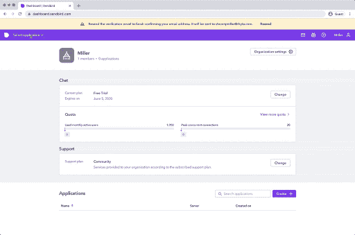

*   在屏幕的左侧，您应该会看到一个“通话”菜单；进入“工作室”并创建一个新的“电话亭”用户。
*   定义要呼叫的用户 ID。我们版主的 ID 是 789298。你想叫它什么都可以。

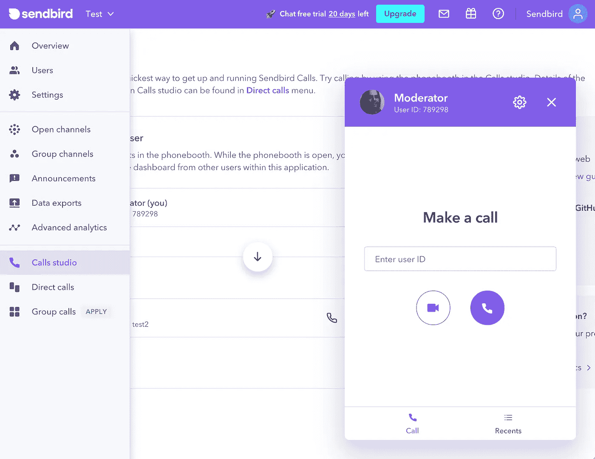

带有呼叫工作室的 Sendbird 仪表板

# 第二步。创建新项目

1.  让我们从使用 Android Studio 创建一个空白项目开始。选择空活动。

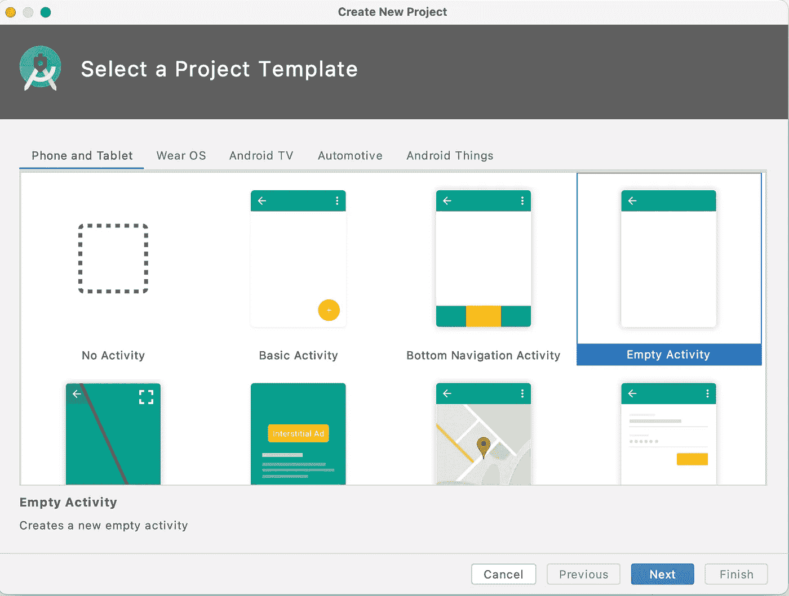

创建新的 Android 项目

2.下一步是提供一个名称。我们将称之为 SendbirdScreenShare，因为本指南的第二部分涵盖了屏幕共享以完成我们的教程。

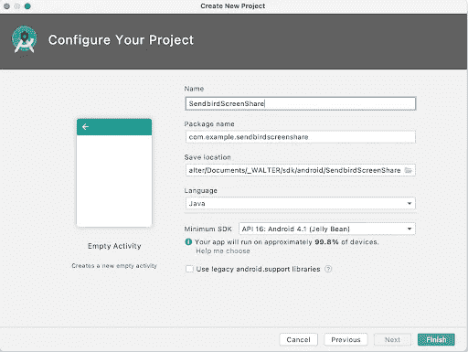

为我们的 Android 项目命名。

3.找到您的`build.gradle`文件(用于您的模块的文件)并包含 Sendbird 调用的实现(您的版本可能比本教程中显示的版本高)

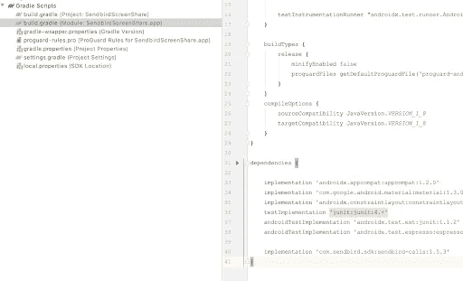

为我们的模块设置 Gradle 文件。

4.您需要对此文件进行另一项更改。确保这些值如下所示:

21 世纪

目标版本 28

如前所述，这些值允许我们在没有前台服务的情况下实现媒体投影。这将是指南第二部分所需要的。

## Android 清单

1.打开您的`AndroidManifest.xml`文件并添加以下权限:

向 Android 清单添加权限

2.我们告诉 Android，我们将可以访问:

*   此设备的摄像头
*   修改音频设置
*   录制音频
*   接入蓝牙
*   访问互联网
*   对网络状态的访问

# 第三步。创建用户界面

1.为了使本教程简单，我们将只使用一个屏幕。我们将展示:

*   连接到 Sendbird 的按钮
*   打电话的按钮
*   两个视频元素(一个用于我的摄像机，另一个用于远程用户)

我们建议添加一个“结束”按钮来结束通话，但在本教程中我们将跳过这一步。

2.打开您的`activity_main.xml`布局文件，并添加以下内容:

3.请阅读评论(灰色)以了解每个元素是什么。它们将在屏幕上一个接一个。通话建立后，Sendbird 视频元素会自动调整，所以不必担心移动这些元素。

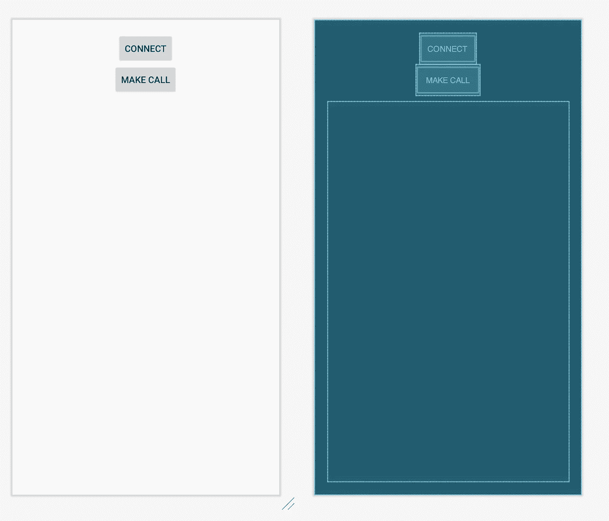

我们呼叫屏幕的布局

# 第四步。实施

为了简化这个例子，我们将把这个屏幕的所有逻辑添加到 MainActivity.java 的**文件中。**

## 全局变量

定义连接到 Sendbird 的信息:您的应用程序 ID、任何用户 ID 以及用户的访问令牌(如果需要的话)。

接下来，指定 CALLEE_ID。这个 Id 是您要呼叫的人的用户 ID。对于这个例子，我们将引用我们在第 1 部分中创建的用户。

对于 Sendbird 调用，我们需要一个惟一的处理程序 ID(可以是您想要的任何东西)。

保持全局的一个重要对象是`DirectCall`。这个元素是由 Sendbird 提供的，它将保存我们与另一个远程用户建立的呼叫的引用。更多信息请参考[我们的 API](https://sendbird.com/docs/calls/v1/android/ref/index.html) :

我们还引用了屏幕上的对象(按钮和视频元素)。

Android 还要求我们在运行时向用户请求权限:

## onCreate

在 Android 中，一切都从 **onCreate** 方法开始。在这里，我们初始化屏幕上的元素(按钮和显示给用户的视频元素)。

## 连接到 Sendbird

一旦按下了 **Connect** 按钮，我们就调用 **connect()** 方法来用 Sendbird 验证我们的信息。我们还需要建立一个 WebSocket 连接来接收和发出调用。

验证您的用户 ID(如有必要，发送访问令牌)并验证:

## 检查相机权限

Android 要求我们在运行时请求访问该设备的摄像头的权限(用户应该只批准一次)。

## 到

一旦连接并通过验证，我们就可以打电话了。点击屏幕上的**拨打电话**按钮。

将调用此方法:

在这个方法中，我们将:

1.  设置一些基本选项:
    a .我们将用于摄像机的视频元素
    b .我们将用于远程摄像机的视频元素
    c .是否启用音频(true)
    d .是否启用视频(true)
2.  我们还设置拨号参数:
    a .发送我们的授权用户 ID
    b .如果这将是一个视频呼叫(真)
    c .我们通过上面的`CallOptions`

下一步是**拨**。这个拨号过程有一个处理程序，我们将使用它来验证是否有任何错误发生。

成功连接后，我们立即为以下事件设置了一些侦听器:

1.  `onConnected`:我们的设备连接到远程设备。
2.  `onEstablished`:远程用户接受呼叫。
3.  `onEnded`:通话结束。

您还可以定义通话建立后本地和远程摄像机将使用的视频元素:

此时，您正在连接仪表板。

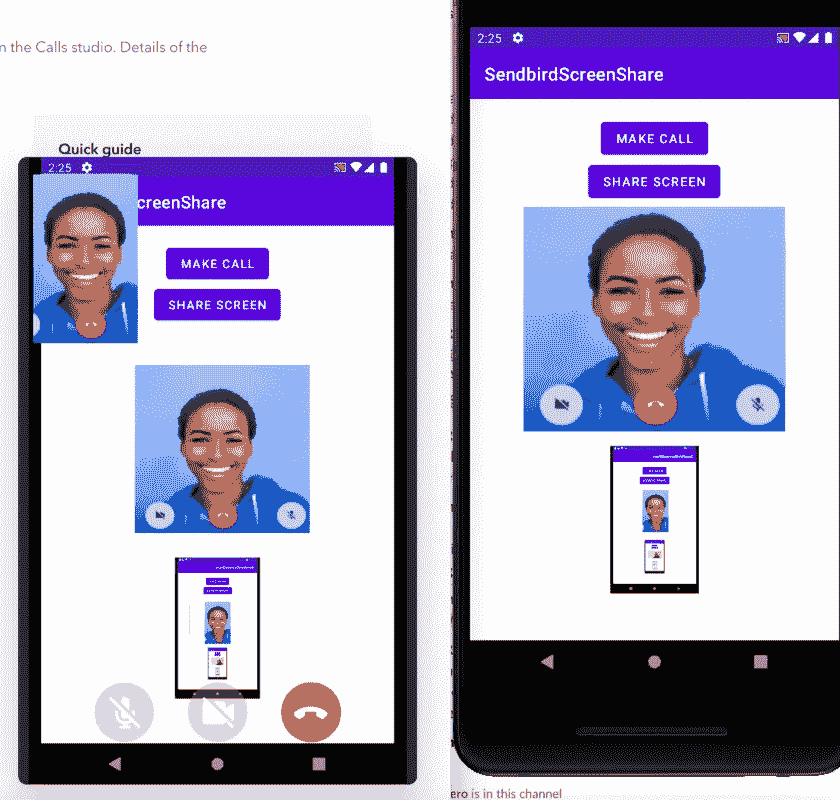

从仪表板呼叫

# 接待

如果您想使用另一个 Android 设备(而不是您的仪表板)来测试这个示例，那么您应该实现以下方法:

但是，在这样做之前，我们需要做一些**的基础工作。Sendbird 与 **FCM** 协同工作，在另一个设备需要呼叫时发送通知。**

## 创建您的 Firebase 应用程序

这些步骤是谷歌 Firebase 的一部分。如果你不能按照这些步骤或某些东西不工作，请与谷歌 Firebase 支持取得联系。

完成这些步骤后，您将拥有:

1.  一个新的 Firebase Android 应用程序
2.  您的私人服务器密钥
3.  一个 google-services.json 文件
4.  进入[火焰基座控制台](https://console.firebase.google.com/)。如果您的客户端应用程序没有 Firebase 项目，请创建一个新的

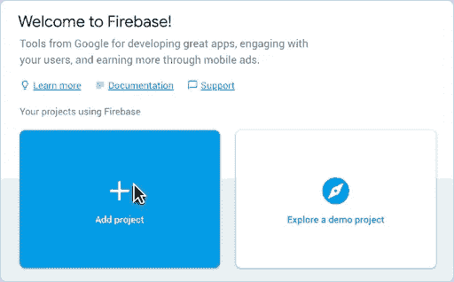

创建 Firebase 项目。

1.  选择您的项目卡，移至**项目概述**。
2.  点击左上角的齿轮图标，选择**项目设置。**

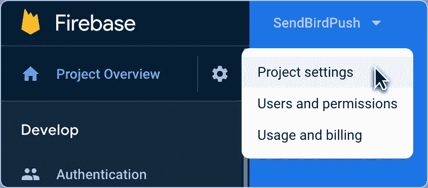

在 Firebase 中访问项目设置:

1.  转到**云消息** > **项目凭证**并复制您的**服务器密钥**。

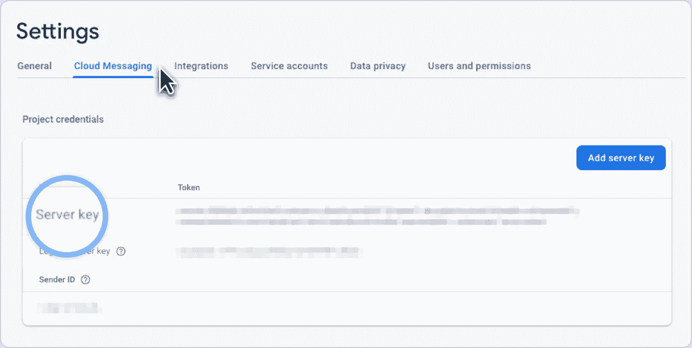

服务器密钥:

1.  转到**常规**选项卡，选择您的 Android 应用程序以添加 Firebase。输入你的包名，下载`google-services.json` 文件，在注册过程中放在你的 Android app 模块根目录下。

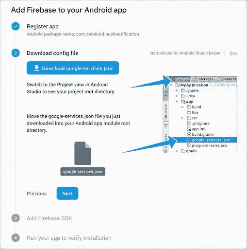

下载设置文件并将其放入项目中。

## 在 Sendbird 仪表板中注册您的服务器密钥

您需要将步骤 5 中复制的服务器密钥添加到 Sendbird 仪表板中，以允许 Sendbird 向您的客户端发送消息。

1.  登录到您的[仪表盘](https://dashboard.sendbird.com/?_ga=2.144466229.1282152018.1618837337-1478885345.1614618493)，进入**设置** > **通话** > **通知**。
2.  点击**添加凭证**按钮，注册您的服务器密钥。

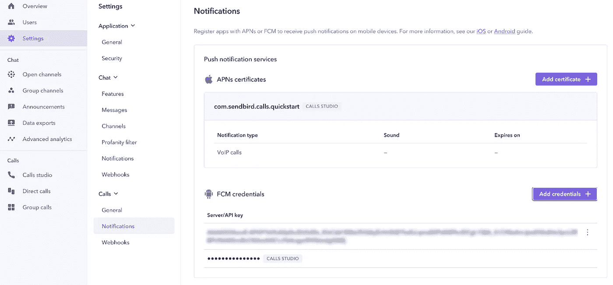

添加您的服务器密钥

## 更新你的档案

你需要进入你的 **build.gradle** 文件(对于项目和应用程序)并添加一些行来包含 Firebase。这是你的**项目级**的 **build.gradle** 文件应该是这样的:

这是你的`build.gradle`文件应该看起来的样子(在**应用级**):

记得再次点击**立即同步**按钮下载新文件。

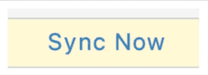

立即同步按钮

## 从 Firebase 获取令牌

一旦完成，您就可以使用 Firebase 中的所有类和方法了。我们将使用它们获得一个令牌，并在 Sendbird 上注册它。

Sendbird 最终将使用这个令牌向这个设备发送消息。

打开你的`MainActivity.java`，添加这个新方法:

在这个`MainActivity.java`中修改`waitForCalls()` { … }方法:

再次运行您的应用程序，让这些新方法从 Firebase 获得一个令牌，然后将它们发送给 Sendbird。

您可以从 Sendbird 仪表板验证这一点。找到您的用户并检查 **Android** 的**推送令牌**值。

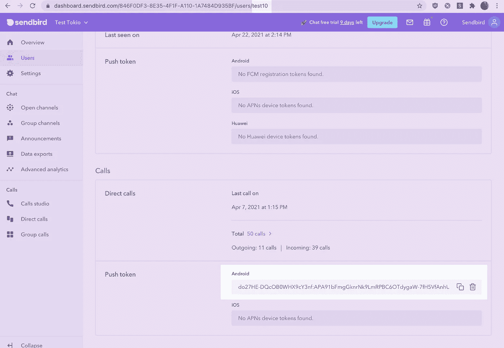

具有从应用程序分配的推送令牌的用户。

正如你在上面看到的(在顶部)，我的用户 ID 是 **test10** 。在屏幕底部，您可以看到该用户的**推送令牌**。

您必须看到类似的内容才能收到 Sendbird 的呼叫通知。

# 结论

这就是一切！本指南介绍了如何在仪表板上创建新的应用程序、创建用户以及创建能够拨打和接听视频电话的示例应用程序。

正如开始提到的，这是一个两部分的指南，我们的下一部分将展示如何实现 [**屏幕共享**](https://sendbird.com/developer/tutorials/screen-sharing-android) 。

看看吧，快乐的应用内通话建设！