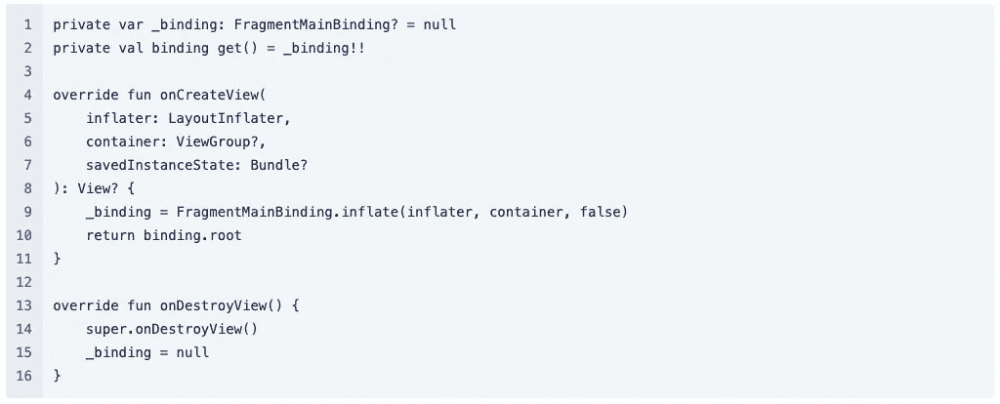

# Android ViewBinding 迁移

> 原文：<https://medium.com/codex/android-viewbinding-migration-16070e24b752?source=collection_archive---------1----------------------->

kot Lin Android Extensions**已被弃用**，这意味着不再支持使用 Kotlin synthetics 进行视图绑定。如果您的应用程序使用 Kotlin synthetics 进行视图绑定，请使用本指南迁移到 Jetpack 视图绑定。这里可以看到详细的公布信息[。](https://developer.android.com/topic/libraries/view-binding/migration)

来自 https://www.kodefin.com/[的图片 src](https://www.kodefin.com/post/57/from-butterknife-to-android-view-binding-java)

我做了一件你以后会做的事，或者你已经做了。但是我会分享我所做的和我知道的任何事情，也许不是全部，但至少我分享我所知道的，请随时评论和分享你的知识，以便我们可以交流我们的知识，成为更好的工程师。

正如我们所知，我们有多种方式来绑定/膨胀我们的视图，通过绑定/膨胀我们的视图意味着我们可以在我们的 android 逻辑文件(Kotlin/Java)中读取我们的视图。

根据我目前的知识

## [findViewById <视图> (R.id.xxx)](https://developer.android.com/reference/android/view/View#findViewById(int))

这是从我们的逻辑文件中获取视图的老方法，逻辑文件在 activity/fragment/view 类中。它总是有效的，但是你知道，你可能会在使用它时发现一些问题，正如你从上表中看到的，你可能会泄漏视图，并在运行时得到 **NullPointerException** 。它还包含许多样板文件，你需要编写 **findViewById** 并将其转换为视图，然后再次放置 Id。

## [黄油刀](https://github.com/JakeWharton/butterknife)

由于这已被否决，Jake 已经在他的 git 上提到了它，但它并没有解决我们的问题。它在代码上仍然有一些样板文件，比如`@BindView`，它仍然没有解决样板文件问题，我们需要把我们的 id 放在那里，我们需要把视图类型放在那里。因为它使用了注释处理，所以会稍微减慢构建时间。在更大的项目中比 findViewById 更糟糕。

## [科特林合成](https://android-developers.googleblog.com/2020/11/the-future-of-kotlin-android-extensions.html)

正如团队 [2017](https://plugins.gradle.org/plugin/org.jetbrains.kotlin.android.extensions) 所宣布的，它已经成为一个很好的候选/选项，因为它很轻，使用的代码量更少，并且它使我们可以更快地开发 android 应用程序。我们在这里不会发现类型转换的问题，因为它已经给出了一个很好的参考方式。但是，这里我们有一个问题，它不完全支持 **NullPointerException** ，它不支持 Java，并且没有一个很好的使用它的约定(我们的 XML 将使用 camelCase 而不是 snake_case)。

## [数据绑定](https://developer.android.com/topic/libraries/data-binding)

我们知道另一种方法是使用数据绑定，google 提议这样你可以绑定 UI 组件并与逻辑共享数据，或者我们知道它是双向绑定。例如，在我们的 XML 中，我们可以做类似于`<TextView android:text="@{viewmodel.text}" />`的事情，哇，这很好，我们现在可以更快地编码，但是，我们需要更长的构建时间，在我们用于数据绑定的每个 XML 上有许多样板`<layout>`标记。它解决了我们的 **NullPointerException** 问题，它提供了正确的参考，它支持 Java 和 Kotlin，但是我们是否想浪费时间等待 Android Studio 来构建我们的项目，对我来说，我不想要它。😢

## [查看绑定](https://developer.android.com/topic/libraries/view-binding)

视图绑定在这里是我们的英雄，它可以解决我们所有已知的问题，它解决了 **NullPointerException** 问题，它解决了错误的引用 id 问题，它支持 Kotlin 和 Java，它需要做的代码更少，它没有像 ButterKnife 和 DataBinding 那样增加我们的构建时间。但是，为什么呢

视图绑定将为模块中的每个 XML 布局生成一个绑定对象。假设您有`activity_main.xml`，它将创建一个名为`ActivityMainBinding.java`的文件，您可以直接从您的逻辑文件中调用它。

视图绑定是 Kotlin 友好的，因为所有属性都用`@Nullable`或`@NonNull`进行了注释，这样 Kotlin 就知道如何将它们公开为空安全类型。

## 如何在 Activity、Fragments 或 CustomView 上使用 ViewBinding？

首先，你需要将它添加到你的“build.gradle”模块中，为 app 添加“build.gradle”

**关于活动，你可以按照这个样本**

**对于一个片段，可以按照这个样本**

**对于 CustomView，您可以遵循此示例**

**用于回收查看适配器**

## 如何在 ParentActivity，ParentFragments 上使用 ViewBinding？

但是，我有一个父类/超类，我如何移动到 ViewBinding？

**以防您将其用于活动层级**

**如果你使用片段层次**

当然，如果你想简化这些实现，你可以简化任何事情，而且没有解决所有问题的灵丹妙药，这是基于我目前的知识。如果你有什么要补充的，请告诉我。😃

**参考:**

 [## 将过时的 Kotlin Android Extensions 编译器插件迁移到 ViewBinding

### 在 Koltin 1.4.20-M2 JetBrains 不赞成 Kotlin Android 扩展编译器插件。以下是原因和下一步要做的事情。

proandroiddev.com](https://proandroiddev.com/migrating-the-deprecated-kotlin-android-extensions-compiler-plugin-to-viewbinding-d234c691dec7)  [## 为什么 Kotlin 合成纤维被弃用，有什么替代品？

### 比较使用哪一个:findViewById vs. Kotlin 合成 vs .数据绑定 vs .视图绑定

better 编程. pub](https://betterprogramming.pub/why-are-kotlin-synthetics-deprecated-and-what-are-the-alternatives-5c2b087dda1c)