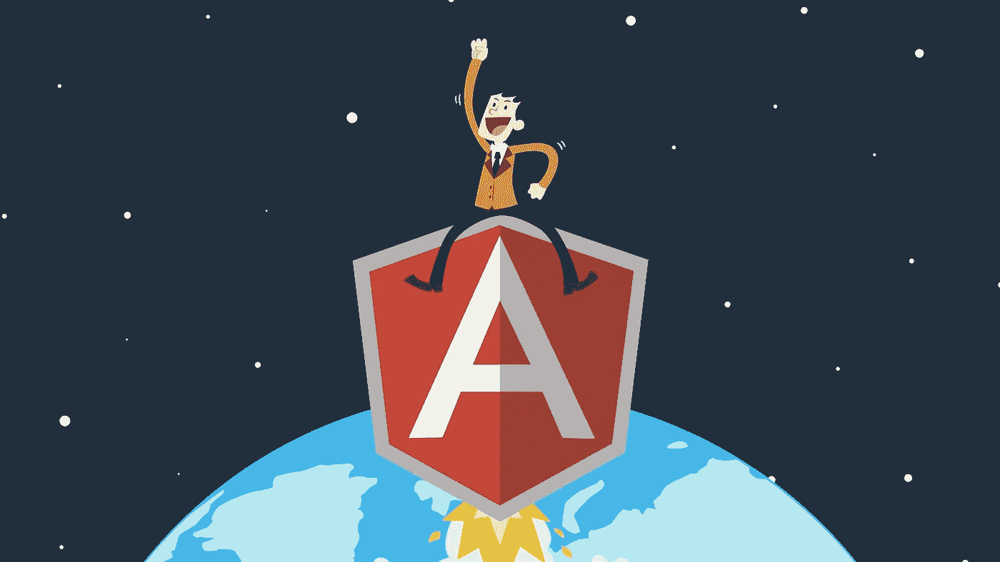
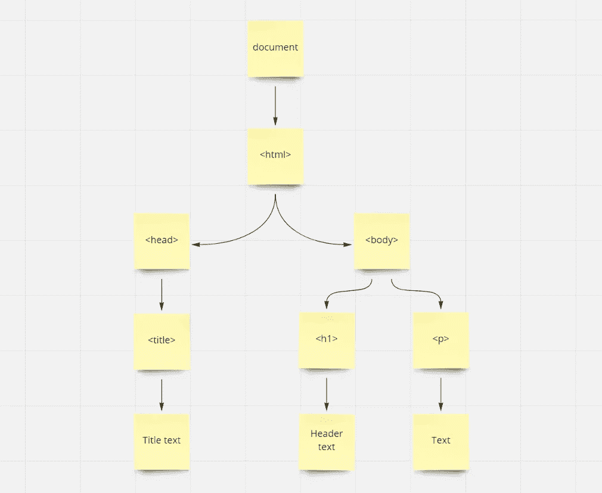
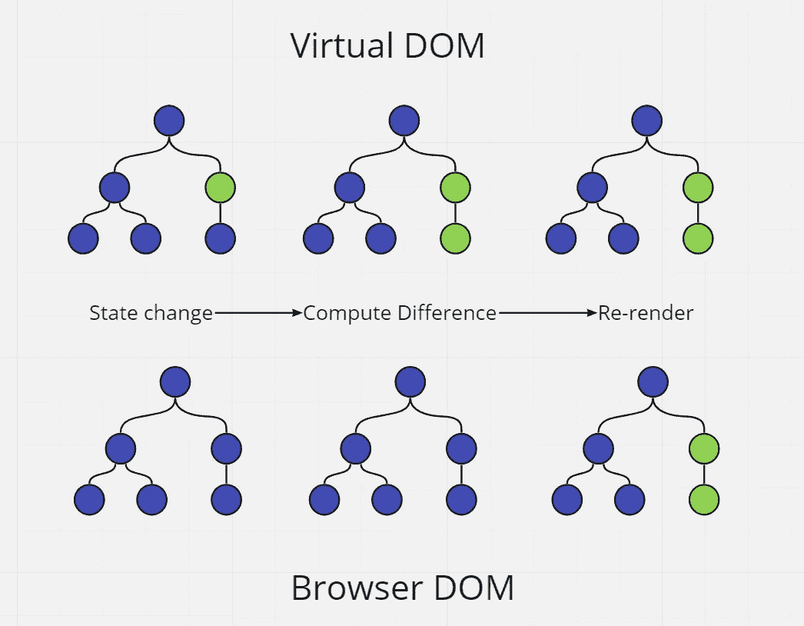
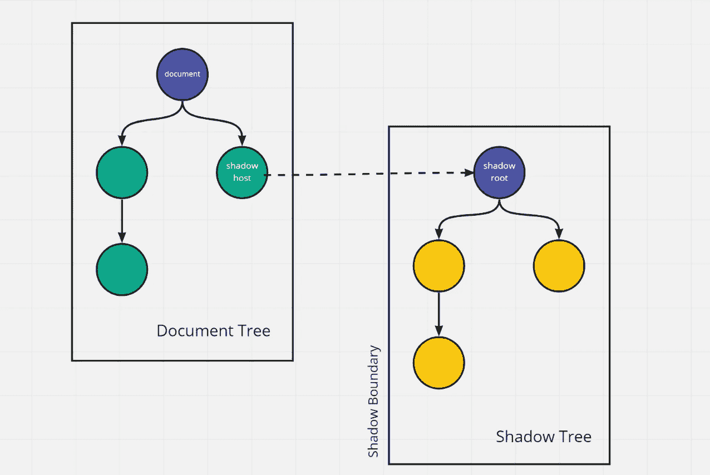

# Angular 解释:什么是视图封装？

> 原文：<https://medium.com/codex/angular-explained-what-is-view-encapsulation-a9ad905456b?source=collection_archive---------1----------------------->



在本文中，我们将介绍前端开发中的一个基本概念— DOM(文档对象模型)。我们将讨论现代框架中使用的两种基本类型:影子 DOM 和虚拟 DOM。解释它们的区别，并说明哪一个用于 Angular。

# 什么是 DOM？

文档对象模型(简称 DOM)定义了 HTML 或 XML 文档的结构以及访问和操作它的方式。它的目的是提供一个标准的编程接口，可以用于不同的语言和环境。我们可以通过在 HTML 中添加、更新和删除元素来修改网页的结构。

每个浏览器都有一个全局对象，名为 *window* 。它的属性之一是文档，文档也有不同的属性和方法。下面是 DOM 外观的图形表示:



正如我们所看到的，它包含一组以树形结构呈现的节点。每个节点代表一个带有属性和特性 HTML 元素，允许修改。

# 什么是虚拟 DOM？

在虚拟 DOM 中，真实 DOM 的一个副本被保存在内存中，当 DOM 发生变化时，它会被比较以找出差异。那么应用程序将只更新那些有变化的部分。通过避免重新渲染所有元素，性能也将得到提高。参见虚拟 DOM 的图解说明。



首先，对虚拟 DOM 进行更改，然后将其与真实 DOM 进行比较。这个过程叫做*差分。*当发现任何差异时，浏览器更新原始 DOM 中的那些元素。React 和 Vue 框架使用了这个概念。

# 什么是暗影 DOM？

影子 DOM 允许一个组件拥有自己的 DOM 树，它与元素相连，但与子元素分开。它不能从主文档中访问，这就带来了巨大的优势。组件可以有自己的本地样式规则。

它隔离了 DOM，所以组件的 DOM 不会出现在全局 DOM 中。当我们想到一个应用程序时，我们想象它是由块而不是一个胡德对象构建的，这意味着影子 DOM 也将提高性能。



影子 DOM 和虚拟 DOM 的概念有点不同，但是它们都有助于提高性能。虚拟 DOM 创建整个 DOM 树的副本，而影子 DOM 创建小部分，每个组件都有独立的范围。

# 角度中的阴影 DOM

在 Angular 中，组件是一个拥有自己的模板和样式的类。当我们创建一个组件时，Angular 将它的模板放入 **shadowRoot，**中，这基本上是那个组件的影子 DOM。事实上，Angular 不使用原生阴影 DOM，它使用模拟。因为大多数浏览器还不支持影子 DOM。

# 角度视图封装类型

有三种内置的视图封装类型，这允许我们使用影子 DOM。

*   **查看封装。无** —无阴影 DOM 和无样式封装
*   **查看封装。仿真的** —没有影子 DOM，但是提供了样式封装的仿真
*   **查看封装。ShadowDOM** —使用原生的 ShadowDOM 和它所拥有的一切

## 查看封装。没有人

在这个例子中 Angular 根本没有使用阴影 DOM。所有样式都应用于整个文档，这意味着一个组件可以覆盖另一个组件的样式。

```
import {ViewEncapsulation} from '@angular/core';

@Component({
  selector: 'card',
  templateUrl: 'card.component.html',
  styles: [`
    .card-container {
      width: 200px;
      height: 400px;
      background: red;
    }
  `],
  encapsulation: ViewEncapsulation.None
})
class CardComponent {
  @Input() title: string;
  @Input() content: string;
}
```

让我们也创建一个模板:

```
<div class="card-container">
  <h3>{{title}}</h3>
  <div class="content">
    <p>{{content}}</p>
  </div>
</div>
```

Angular 将创建一个 DOM 树，如下所示:

```
<!DOCTYPE html>
<html>
  <head>
    <style>
      .container {
        width: 200px;
        height: 400px;
        background: red;
      }
    </style>
  </head>
  <body>
    <card title="Card example" description="Some details">
      <div class="card-container">
        <h3>Card example</h3>
        <div class="content">
          <p>Some details</p>
        </div>
      </div>
    </card>
  </body>
</html>
```

## 查看封装。模仿

它模拟样式封装，即使没有影子 DOM。它将一个特定的属性添加到组件的主机元素中，并将相同的属性应用到通过样式提供的所有 CSS 选择器中。

```
import {ViewEncapsulation} from '@angular/core';

@Component({
  selector: 'card',
  templateUrl: 'card.component.html',
  styles: [`
    .card-container {
      width: 200px;
      height: 400px;
      background: red;
    }
  `],
  encapsulation: ViewEncapsulation.Emulated
})
class CardComponent {
  @Input() title: string;
  @Input() content: string;
}
```

以下是文档头的样子:

```
<head>
  <style>
    .card[_ngcontent-1] {
      width: 200px;
      height: 400px;
      background: green;
    }
  </style>
</head>
```

以及组件的模板:

```
<div class="card-container" _ngcontent-0 _nghost-1>
  <h3 _ngcontent-1>{{title}}</h3>
  <div class="content" _ngcontent-1>
    <p _ngcontent-1>{{content}}</p>
  </div>
</div>
```

## 查看封装。阴影世界

它使用原生的 ShadowDOM 制作 Angular，并启用它的所有功能。

```
import {ViewEncapsulation} from '@angular/core';

@Component({
  selector: 'card',
  templateUrl: 'card.component.html',
  styles: [`
    .card-container {
      width: 200px;
      height: 400px;
      background: red;
    }
  `],
  encapsulation: ViewEncapsulation.ShadowDOM
})
class CardComponent {
  @Input() title: string;
  @Input() content: string;
}
```

当我们的代码在浏览器中运行时，我们可以看到文档头中没有样式。相反，它被添加到组件的影子根中。

```
<card title="Card example" description="Some details">
  #shadow-root
  | <style>
  |   .card {
  |     background: red;
  |     width: 200px;
  |     height: 400px;
  |   }
  | </style>
  | <div class="card">
  |   <h3>
  |     Card example
  |   </h3>
  |   <div class="content">
  |     <p>{{content}}</p>
  |   </div>
  | </div>      
</card>
```

# 结论

现在我们了解了什么是 DOM 以及它的主要概念类型:虚拟 DOM 和影子 DOM。我们看到，当我们想要提高性能时，它们都非常有用。使用角度视图封装，我们可以决定在我们的情况下哪种方法是正确的选择。