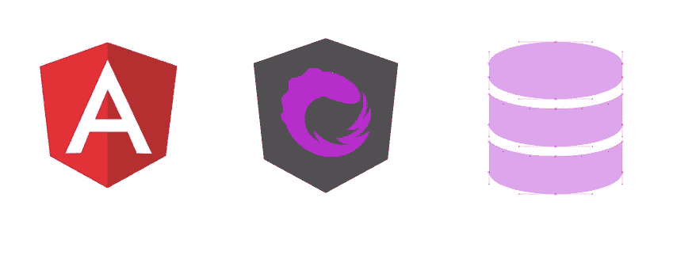
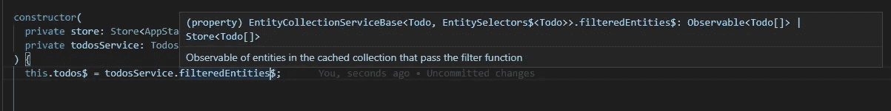
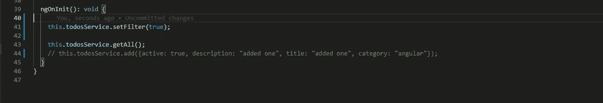
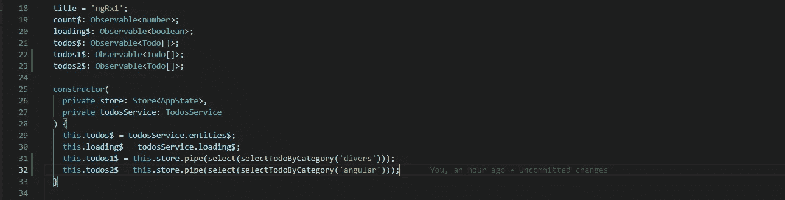
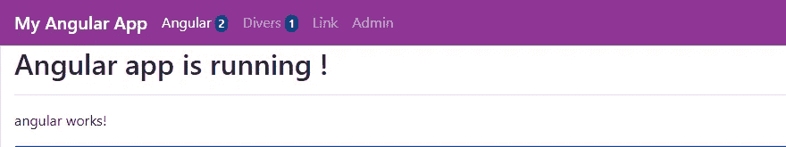

# 角度 NgRx 数据自定义选择器

> 原文：<https://medium.com/codex/angular-ngrx-data-custom-selectors-664f04f1637d?source=collection_archive---------3----------------------->



角度 NgRx 数据

如何扩展 NgRx 数据，只选择我们需要的数据。

> 本文假设您已经安装了一个带有 NgRx 和 NgRx 数据的 Angular 项目。

在之前的文章中，我展示了通过 NgRx 数据请求一个符合约定的标准 CRUD 后端是多么容易。

这是一个伟大的工具，但有时我们有一个简单的需求，来自它提供的简单途径。

# 显示过滤的数据

假设我们有自己的 Todo 应用程序。我们在 DTO 中处理一个布尔型的“活动”字段。我想知道我的实体中有多少是“活动的”。有一个工具可以做到这一点:过滤器。这是[实体元数据](https://ngrx.io/guide/data/entity-metadata)的一个属性。你只需要指定如何过滤你的列表，然后从你的服务中消费可观察的: **filteredEntities$** 。



你如何设置这个过滤器？只需在 EntityMetadata 中声明过滤器 Fn:

在组件中，需要时就需要设置过滤器，否则 filteredEntities$ Observable 会发出一个空列表。你只要打电话。使用与您的函数签名相匹配的适当参数:



# 对实体进行高级筛选

如果您需要一些更高级的过滤，您可以使用[propsfilternfactory](https://ngrx.io/api/data/PropsFilterFnFactory)来处理 regexp。如果您想对两个不同的字段进行过滤，不区分大小写，则可能是这样的:

一旦您配置了此过滤器，就可以将它与来自用户或类似来源的任何输入一起使用:

```
// well this is hardcoded filter **obviously** :)
this.todosService.**setFilter**('angular');
```

这很好，但是你只有一个可观察的，如果你想同时显示多个信息呢？知道我们有多少活跃的和不活跃的元素呢？**显然**，你只能在你的实体元数据中声明一个 filterFn。


很明显… :D

# NgRx 数据中的自定义选择器

NgRx 数据有[一些扩展点](https://ngrx.io/guide/data/extension-points)，其中一个有用的扩展点是[自定义选择器](https://ngrx.io/guide/data/extension-points#custom-selectors)。官方文档有正确的代码，但是它与另一个实体选择器混合在一起，可能会令人困惑。这里有一个简单的方法:

我们想同时显示“潜水者”类别和“有角者”类别中的 Todos 数量。

我们只需创建一个新的选择器，原理图没做什么:

```
ng g selector selectors/Todo --skip-tests
```

它用无用的导入创建了一个空文件，因为选择器是真正的纯函数，被插入到现有的存储中。创建后，我们只需填充选择器，以检索按类别过滤的所需待办事项:

现在，在任何组件中，我们简单地基于这个选择器创建 Observables，它接受一个字符串作为参数(它可以接受任何其他内容) :

```
this.store.pipe(select(**selectTodoByCategory**('angular')))
```



现在，我们有了多个可观察对象，可以在模板中使用它们来获得关于数据实体的特定信息。请记住，这些 Observables 只查询商店中的数据，在订阅它们时不会发出任何 XHR 查询。

```
<p>todos "divers" : <span>{{(todos1$ | async)?.length}}</span></p><p>todos "angular" : <span>{{(todos2$ | async)?.length}}</span></p>
```

用一点点 bootsrap，你会得到这个:



NgRx 数据有许多扩展点，只等我们使用它们，如果默认的 URL 不适合您的服务，您可以更改 URL 的处理方式。当然，您可以使用 EntityMetadata 的 sortComparer 对集合进行排序，这非常有用，比如:

很明显，就是它了，但是我会继续玩这个伟大的工具，我喜欢 NgRx 和它的组件，以及为它工作的团队，我希望这可以帮助任何开始定制他的配置的人。

在这里查看运行中的代码(在我写这几行的时候没有任何 CSS，但是我可以很快改变主意…):

[](https://github.com/aboudard/ngrx-data-todo) [## GitHub - aboudard/ngrx-data-todo:角度 ngrx 数据

### 一个使用 Angular NgRx 数据和 json-server 后端的简单项目。本文中描述的…

github.com](https://github.com/aboudard/ngrx-data-todo)