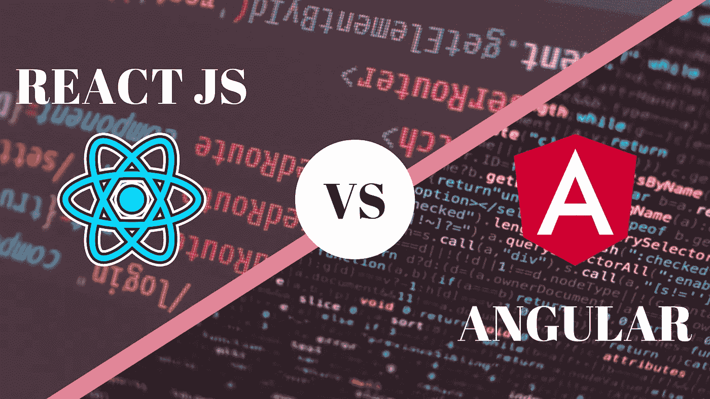

# 有棱角和有反应——哪个更好？

> 原文：<https://medium.com/codex/angular-or-react-which-is-better-f3038ddbfa8f?source=collection_archive---------14----------------------->

## 学习 Angular 或 React，这两个最流行的 JavaScript 框架。

AngularJS 和 React 是当今最流行的两种前端框架。虽然这两个框架都提供了许多有助于构建 web 应用程序的特性，但它们也有一些显著的区别。在本文中，我们将探讨 Angular 和 React 之间的主要区别，以便…