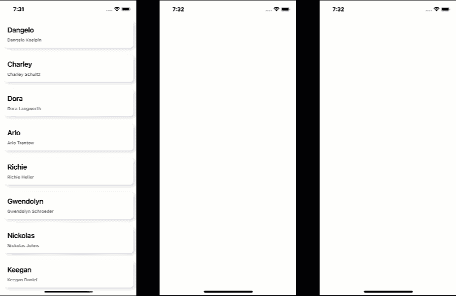
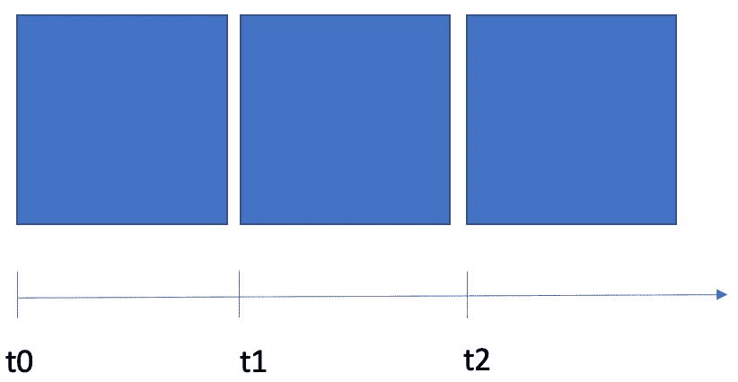
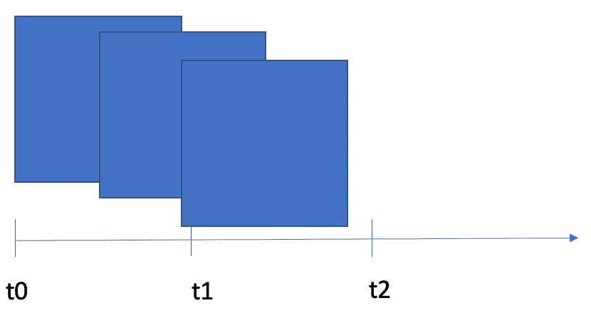

# React Native 中的动画平面列表

> 原文：<https://medium.com/codex/animated-flatlist-in-react-native-7cd1119bb5ca?source=collection_archive---------0----------------------->

在最近的 React Native 项目中，我被要求以一种比不使用任何动画渲染每个项目更有吸引力的方式来可视化一个项目列表。通过这种方式，我们希望为我们的整体互动应用程序外观和感觉做出更多贡献。

不同的动画配置

**TLDR；**React Native 中动画化平面列表的模块在 npmjs.com[可用](https://www.npmjs.com/package/@ja-ka/react-native-fade-in-flatlist)。该代码在 github.com 的[上公开。去看看，借给它一颗星！](https://github.com/ja-ka/react-native-fade-in-flatlist)

正如你在上面的图片中看到的，要求是动画的项目给一个平面列表一个接一个，但渲染必须是可定制的。我们希望控制渲染每个项目需要多长时间，在渲染第一个项目之前有一个可选的初始延迟，以及让用户有机会控制并行渲染多少个项目。当然，与直接使用基本的 React Native FlatList 组件相比，使用这个库不需要用户做任何不同的事情。

首先，我创建了一个简单的包装 React Native 的 FlatList 组件的包装器。我已经添加了额外的道具和一些配置动画所需的默认值。

我使用 React Native 的动画库来制作每个项目的动画。

因为我们通常需要线性动画，所以 Animated.timing 函数是正确的选择。所需的配置参数可以很容易地从我们为新组件引入的附加属性中获得。此动画的总持续时间可以计算为每个项目的持续时间与要制作动画的所有项目的数量的乘积。我们选择线性缓动，并将 to 值设置为动画+ 1 的项目，因为索引为 0 的第一个项目在下一个项目从索引 1 开始渲染时应该完全可见，依此类推。

值得注意的是，我们仅使用一个单一的平面列表全局动画值来控制所有项目淡入的不透明度。这样，所有的项目，不管它们是什么时候被渲染的，都会以一种全局控制的方式淡入淡出，从而坚持调用者提供的配置。

接下来，为了淡入一个项目，我们需要处理它的不透明度。不透明度在相应动画值的下限为 0，在上限达到 1。由于我们需要动画显示两者，即要呈现的实际项目和可选分隔符，我们创建了一个名为 FadeInComponent 的新组件，它根据给定的索引和配置处理其子组件中的淡入淡出。

moveBy 值允许我们将多个要并行制作动画的项目“组合在一起”，其中第一个项目从 t=0 开始可见，下一个项目从 t=0+1 开始-(1-1/ <number of="" parallel="" items="">)。</number>

为了便于理解，矩形之间增加了空间。实际上，每个块都直接跟随它的后继块。请原谅我的绘画技巧。；-)

如果要并行渲染的项目数为 1，则项目会一个接一个地渲染，正如您在开头的动画 gif 中看到的那样(左视图)。当您开始增加要并行渲染的项目数时，除了第一个块之外的所有块都将向左移动上述公式的量。

再说一次，我不是 PowerPoint 专家

平行项目的数量越多，块越向左移动。

接下来，让我们淡入物品，最后！

正如你所注意到的，我们现在正在处理 renderItem 函数。我们用自己的内部 renderItem 函数包装原始 RenderItem 函数，我们将其重命名为 original renderItem 函数。根据要淡入多少项的配置，我们的内部 renderItem 函数要么在我们的内部 FadeInComponent 中包装要呈现的组件，要么直接返回原始 RenderItem 函数的结果。

但是你可能会问，可选的分隔符呢？

为了以同样的方式处理分隔符，我们还创建了一个内部分隔符组件，并用它包装提供的 ItemSeparatorComponent。React Native 的 FlatList 组件提供了一种便捷的方式来处理依赖于前导或尾随项的分隔符的不透明度。使用 info.separators.updateProps 函数，我们可以将各个属性传递给 Separator 功能组件。因为我们需要告诉当前项的前导分隔符淡入当前索引是什么，并且为了避免呈现期间无效的 setState 调用，我们将更新分隔符的 props 包装到一个 useEffect 钩子中。

**就是这样！**我们现在可以很好地动画我们的平面列表。此外，使用这个库是小菜一碟，因为只需用新的 FadeInFlatList 组件替换 React Native 的 FlatList，并可选地覆盖动画项目的默认值。

更新后的组件看起来没什么不同，但现在很好地淡入了要呈现的项目。

尽情享受吧！