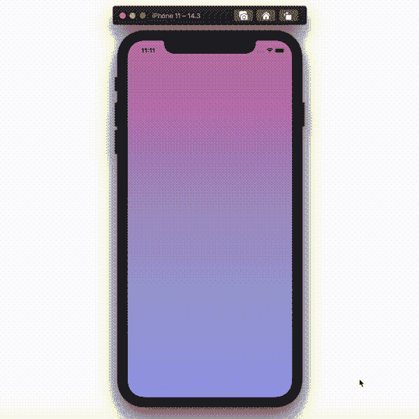

# 如何在 Swift [2022 指南]中创建动画渐变

> 原文：<https://medium.com/codex/animated-gradient-in-swift-5033bb3c54c9?source=collection_archive---------6----------------------->

## 逐步指南

这里是动画渐变 [ViewController.swift](https://gist.github.com/artturijalli/4a1cdf3e83ff90af18ec5c578e677405) 的完整代码的链接。想知道这是怎么做到的，请留下来。

# 设置渐变

## 选择颜色