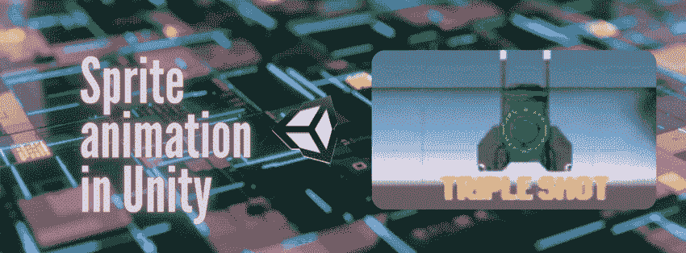
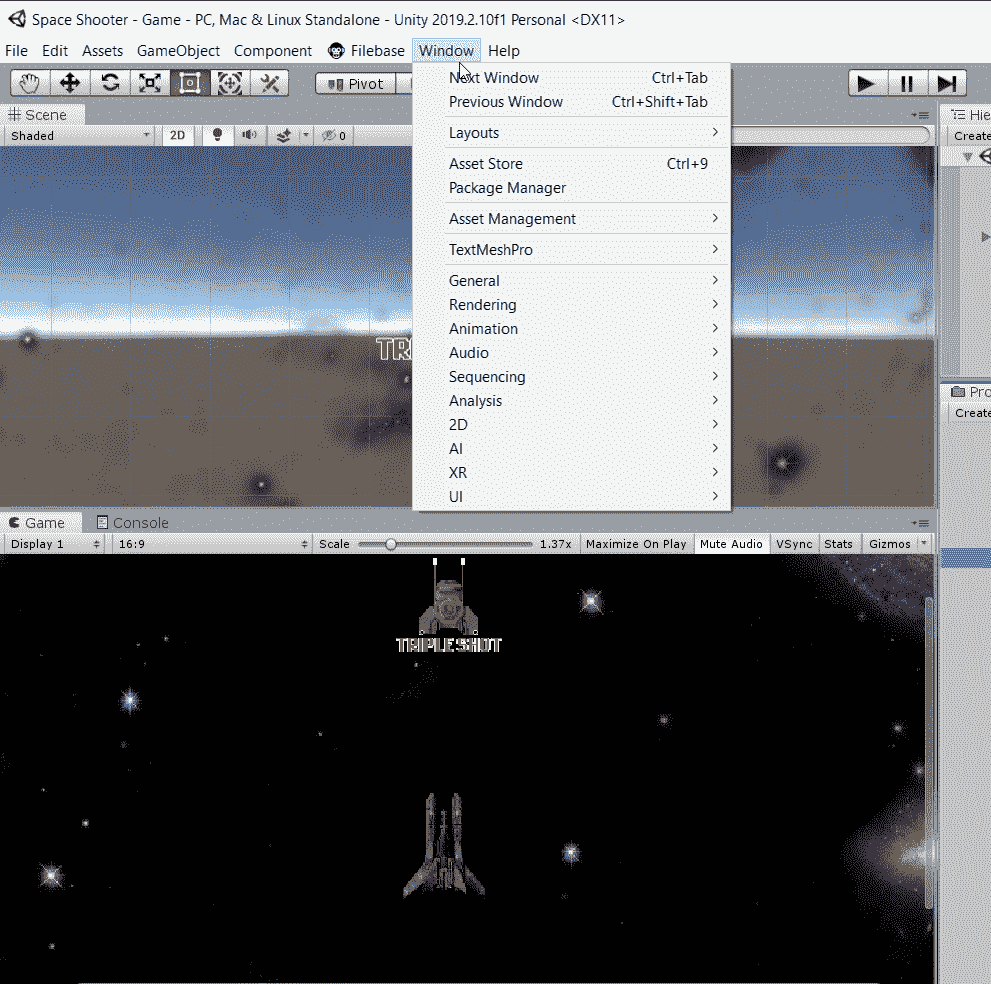
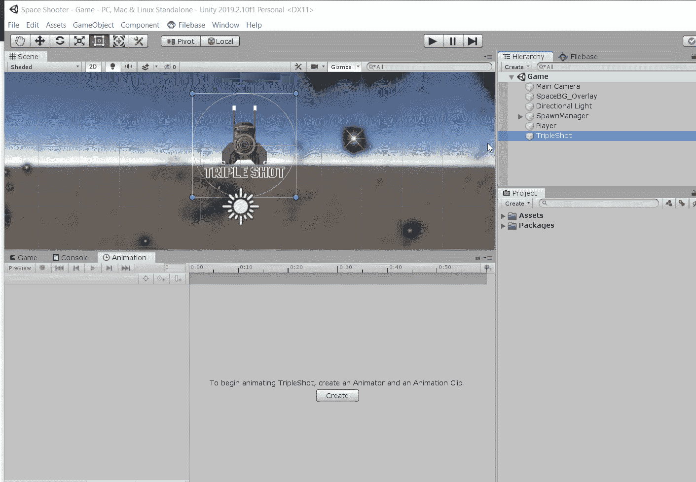
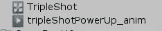
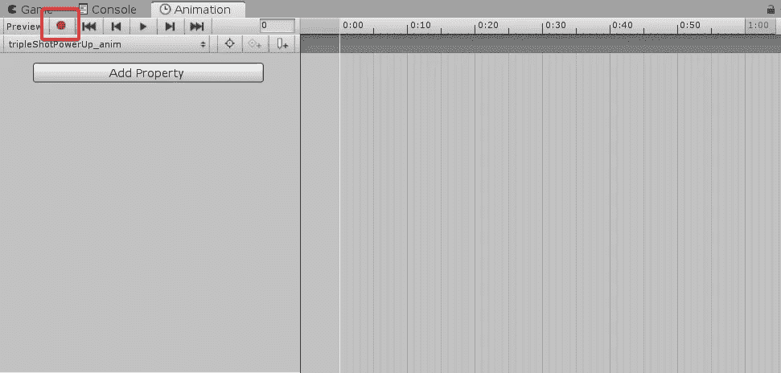
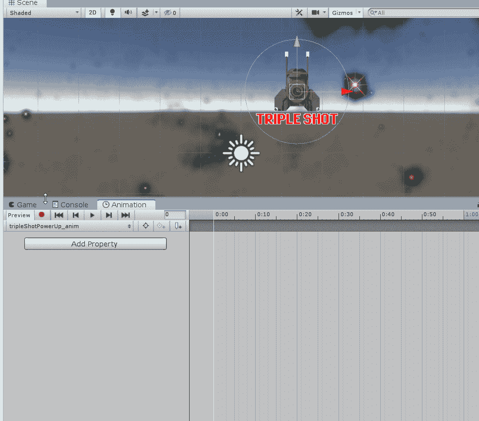
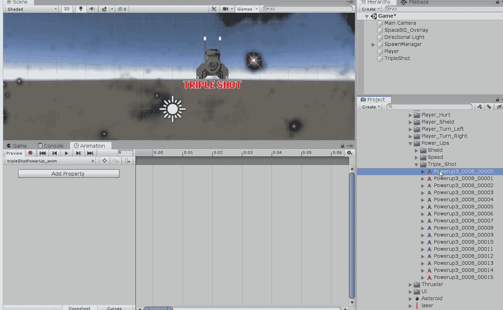

# 用 Unity 的动画窗口制作精灵动画

> 原文：<https://medium.com/codex/animating-a-sprite-with-unitys-animation-window-b049493f69a1?source=collection_archive---------11----------------------->

精灵动画是专门为二维资源制作的剪辑。它们可以通过各种不同的方式制作，其中一种是通过在 Unity 的动画窗口中使用关键帧动画。关键帧是动画剪辑连续体上的点，提供关于游戏对象的信息，如其变换细节。这些关键帧表示数据中的过渡或变化，以便创建动画。要播放动画，Unity 会将数据从一个关键帧插入到下一个关键帧。

# 如何创建精灵关键帧动画

1.  要打开动画窗口，请转到窗口菜单，选择动画。为你的编辑将动画窗口停靠在一个舒适的位置。如果你想学习如何通过三个简单的步骤让你的 Unity 编辑器更有效率，看看这个！

2.从层次中选择一个精灵。一旦你的精灵被选中，点击创建，并给动画一个合适的名字。

要记住的一个好的命名惯例是使用下划线后跟单词“anim ”,这样在必要时更容易定位动画。

**注意**:在项目视图中你新创建的动画上方的图标被称为 [**动画控制器**](https://docs.unity3d.com/Manual/class-AnimatorController.html) 。您现在不需要担心这个问题，但是我已经提供了一个链接，以便您可以熟悉这个概念。

3.Unity 采用自动关键帧技术，这意味着一旦动画模式激活，在场景视图中添加到游戏对象的任何运动都将被捕捉到动画中。要开始制作关键帧，请单击动画窗口中的录制按钮。

**注意:****播放头**是动画时间线中的白线，表示何时插入关键帧。如有必要，只需左键单击并拖动播放头至正确的帧。

4.现在，我们可以记录下精灵的运动。这可以通过使用移动工具在场景视图中移动精灵或游戏对象来完成。执行此操作时，记录移动的关键帧将插入播放头所在的位置。

如果已经为您提供了或设置了一个 Sprite，这个过程非常简单，只需将设置拖放到动画窗口中。

5.完成录制后，您可以按下录制按钮来停止注册关键帧。如果您使用了拖放方法，则不需要在任何给定的时间按下 record 按钮，但是最好这样做。

在下一篇文章中，我们将看看如何确定加电效果的长度！