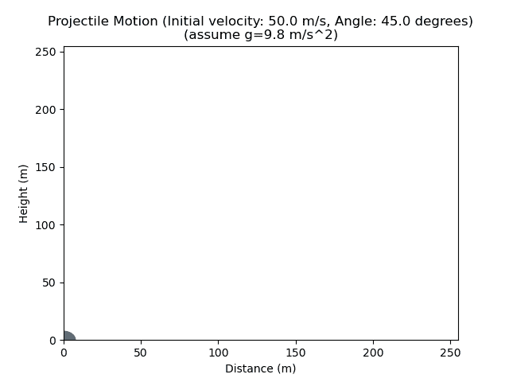

# 用 Python 制作抛射体运动动画

> 原文：<https://medium.com/codex/animating-projectile-motion-in-python-944e5ca69952?source=collection_archive---------0----------------------->

以 50 米/秒的速度以 45 度角发射的抛射体运动。

## 介绍

抛射体运动是物体在地球表面附近投射并沿曲线路径运动所经历的一种运动形式。这种类型的运动也被称为弹道轨迹。你会在日常生活中遇到这种情况，比如有人试图把篮球扔进篮筐，或者你试图把一张皱巴巴的纸扔进垃圾桶…