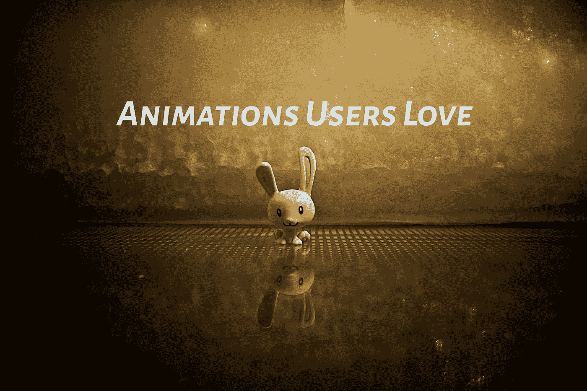

# 用户喜欢的动画

> 原文：<https://medium.com/codex/animations-users-love-75a57a8cad5?source=collection_archive---------4----------------------->

汉斯·艾斯科宁在 [Unsplash](https://unsplash.com/s/photos/animation?utm_source=unsplash&utm_medium=referral&utm_content=creditCopyText) 上拍摄的照片

这是对你的 flutter 应用程序的 rive(以前叫 flare)动画的介绍。为什么应该使用 rive？

首先，Adobe After Effects 动画文件可以通过 rive studio 加载和转换，这也意味着 Lottie files 网站文件也可以通过-rive studio web 应用程序加载和转换为 riv 格式。要点是它允许你减少动画控制器的数量…