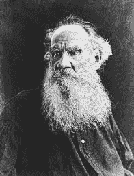
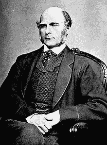
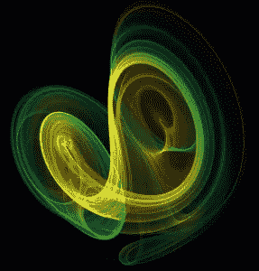
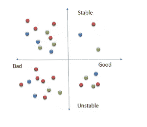

# 软件工程中的安娜·卡列尼娜原理

> 原文：<https://medium.com/codex/anna-karenina-principle-in-software-engineering-abe5a2b03004?source=collection_archive---------1----------------------->

图片:来自经典改编小说《安娜·卡列尼娜》Mosfilm 的一个镜头。1967

最近，我又读了列夫·托尔斯泰的伟大小说《安娜·卡列尼娜》。我第一次读它是在我上学的时候，那是文学老师对我们的要求。但要理解这样的书，应该在成年后读，积累了足够的个人生活经验和对人性的理解。列夫·托尔斯泰一章接一章地描述正在发生的事情，仿佛是通过一个或另一个参与者的眼睛来观察它们。小说中的一些英雄的行为，以前被认为是轻浮的滑稽动作或邪恶的表现，将从另一个角度来考虑，似乎是非常符合逻辑的，甚至是唯一的可能。
读完这部小说后，我有一种印象，事情不可能是另外一种样子。一个已婚女人和一个年轻军官之间的轻微调情变成了热烈的爱情，然后变成了恋人之间的道德崩溃，最后，女主角在火车车轮下自杀。

而阅读时这个可怕的事件链中的每一个环节都是可以理解的，也是符合逻辑的。
读完这本小说后，每个人都可以自己判断这本神秘的小说的第一句话意味着什么:

图片:列夫·托尔斯泰。来源:维基百科

> ***“所有幸福的家庭都是相似的，每个不幸的家庭各有各的不幸。***

一种可能的解释是，列夫·托尔斯泰在这句话中阐述了一个更普遍的哲学原理，它体现在医学、社会学、生物学、全球地球物理现象中，在我看来，也体现在软件工程中。

# 安娜·卡列尼娜原理是什么意思？

许多科学出版物甚至维基百科上的文章都有对这一原则的解释。

这个原理是什么意思？非常复杂的化学、物理、生物、心理、社会和其他系统只有在它们的各个部分相互之间以及与外部环境都非常适合的情况下，才能长期而成功地存在。**如果我们能够用一定数量的参数来描述这样的系统，我们会注意到，对于每一类系统，这些参数的“成功”组合非常少。**

*注意:为了让我们的参数化模型更加真实，我们不应该谈论单独的参数值，而是参数的等价类。但这并没有改变本质。*

矛盾的是，系统越复杂，成功的组合就越少。

不同制造商的咖啡机在技术方案上互不相同，甚至在外观上比汽车更不同，比客机更不同。

# 安娜·卡列尼娜的原则和动物的驯化或选择参数的限制和次要性质

与托尔斯泰同时代的英国科学家弗朗西斯·高尔顿考虑到动物的驯化，制定了一个类似于安娜·卡列尼娜原理的原理:

图片:弗朗西斯·高尔顿。来源:维基百科

> “看来每一种野生动物都有被驯化的机会，很少。。。我们很久以前就被驯化了，但是大部分的剩余者，有时仅仅在一个小细节上失败了，注定要永远处于野蛮状态。”

在一本有趣的书**贾雷德·戴蒙德的《枪炮、细菌和钢铁》**中可以找到关于这个原理是如何实现的更有趣的讨论

Глава 9.第九章。《斑马、不幸的婚姻和安娜·卡列尼娜原则》这本书以这样一句话开头:

> 可驯化的动物都是相似的，每一种不可驯化的动物都有其独特的不可驯化之处。如果你认为你以前已经读过类似的东西，那你就对了。只要做几处改动，就有了托尔斯泰伟大小说《安娜·卡列尼娜》中著名的第一句话:“幸福的家庭都是相似的；每个不幸的家庭都有自己的不幸。”这句话，托尔斯泰的意思是，为了幸福，婚姻必须在许多不同的方面成功:性吸引力，金钱协议，儿童纪律，宗教，姻亲和其他重要问题。任何一个重要方面的失败都会毁灭一段婚姻，即使它拥有幸福所需的所有其他因素。

此外，作者呼吁因素，阻止，尽管无数和持续的尝试驯化野生动物。它们为数不多:饮食、增长率、圈养繁殖问题、性格的“野性”、恐慌倾向、社会结构。

有趣的是，作者列出的所有因素都是“次要的”。例如，人类用更小的动物——牛、猪和羊——而不是犀牛(3 吨肉)作为肉类供应商。

换句话说，如果我们为驯养编写了一个动物选择算法，我们将不得不使用这种动物的主要属性(体重、身高、寿命等)作为参数。)，而是次要的，用特殊函数计算出来的。我们已经对他们施加了非常严格的限制。
如果你有兴趣，那就去读这本书。
但是作者在某个特定的主题领域解释了这个原理。有没有更宽泛的解读？

# 善的脆弱性原则

杰出的数学家弗拉基米尔·阿诺德在他的著作《灾变论》中试图从更广阔同时又是纯数学的角度来看待这个问题

在那里他描述了**“善的脆弱性原理”**。
他写道:

图片:阿诺德，弗拉基米尔·伊戈雷维奇。来源:维基百科

> ***…对于一个属于稳定边界特定部分的系统来说，参数的微小变化更有可能触及不稳定区域而不是稳定区域。这是一个普遍原则的体现，即一切好的东西(比如稳定)都比坏的东西脆弱。显然，所有好的对象同时满足几个要求，而至少有一个缺点的对象被认为是坏的。***

在这种背景下，弗拉基米尔·阿诺德可能是对的。但在更广泛的背景下，人们可以看到，事实上，他说的是脆弱，或者说是罕见的稳定，而不是“善良”。

不是所有不稳定的东西都是不好的。不是所有稳定的东西都是好的。

不管是谁经过横梁上的水坑或沟渠，都明白我的意思。在光束周围移动是不稳定的。但总比掉下去在沟里站稳好🙂

另一方面，任何运动都是不平衡的。树和花只要活着，生长着，枯萎着——通常不是。

而同时，关于一棵生长了几百年的树，直观上我们想说它稳定(稳步)生长。

我们来总结一下总结:稳定和良好——指标之间更加相互独立，取决于我们测量或模拟的内容。应该补充的是，稳定性更多的是一个客观的、可测量的参数。什么是好，什么是坏，是观察者的主观决定。

# 安娜·卡列尼娜原理和吸引子

反思动态不稳定性，我们几乎不可避免地要谈到混沌的概念。

混沌理论是一门相对年轻的科学。关于它的形成和最初的步骤，詹姆斯·格雷克所著的《**混沌:创造一门新科学**》一书。这本书最吸引人的主题之一是发现了吸引子这种现象。

吸引子是动力系统相空间的一个紧致子集，从它的某个邻域出发的所有轨迹在一段时间内趋向于无穷。吸引子可以是吸引的不动点(例如，在关于空气有摩擦的摆的问题中)，可以是周期轨迹(例如，具有正反馈的电路中的自激振荡)，也可以是内部具有不稳定轨迹的某个有界区域(如在奇异吸引子中)。

下面是洛伦兹吸引子的一个变体。

图片:洛伦兹吸引子。来源:纽卡斯尔工程设计中心——纽卡斯尔大学

吸引子和安娜·卡列尼娜原理有什么关系？

我认为，从哲学的角度来看，吸引子代表混沌世界中的“幸福家庭”，而相空间的其他点则是“不幸的家庭，各有各的不幸”

# 桌上的王牌太少了…

你可能听说过爱因斯坦和玻尔关于量子物理学基础的长期争论。讨论集中在哪个模型必须描述单个基本粒子的轨迹:确定性的还是概率性的。两位伟大的物理学家将这场争论的本质抽象为一个半开玩笑的问题:上帝是否在掷骰子，控制我们世界的粒子运动？

在过去的一个世纪里，对世界的描述令人难以置信地成倍增长，变得更加复杂。延续爱因斯坦和玻尔关于当前形势的观点，我们可以说，为了管理世界，上帝需要比骰子更复杂的工具。例如——一副牌😉

那么，考虑到安娜·卡列尼娜的原则，人们可以说，上帝选择用来管理自然和社会现象的那副牌通常不太好。他们的王牌太少了…

嗯，现象本身就分稳定和不稳定。同时，随着时间的推移，“非常”不稳定的经常“滚下”到吸引子上。

我们如何把他们分成好的和坏的取决于我们自己。但目前的世界似乎不稳定多于稳定。而且它包含的坏事比好事多。

换句话说，这个世界看起来就像我下图中的一样。

# 软件工程中的安娜·卡列尼娜原则

所有这些论点都可能是真的，似乎是真的，也许其中一位读者已经这样想了。但是《软件工程》这个标题中的承诺在哪里呢？安娜·卡列尼娜的原理在人类活动的这些领域起作用吗？

我确信它是有效的。仅仅是因为这一普遍原则必须在这一特定的主题领域发挥作用。至少对于那些相当复杂和动态的软硬件和纯软件系统来说是这样。

# 安娜·卡列尼娜综合症

如果软件工程中的安娜·卡列尼娜原理(AKP)存在，如何才能被注意到？首先，如果你的系统是稳定的，并且允许你轻松地扩展和配置它，你不需要太担心。您的系统处于稳定-良好状态(见上图)。

如果你的系统不是很好或者一点也不好，但是很稳定，并且完成了它的工作(位于世界上一个稳定的、坏的部分)，你应该仔细考虑是否值得冒险和彻底改变一些东西。

如果试图纠正具体错误只会使局势恶化，AKP 就开始显示其消极的一面。错误确实被纠正了，补丁被安装了，但是新的、更棘手的错误不知从哪里冒出来。在这样的情况下，我们可以谈**安娜卡列尼娜综合症**。

回想一下，该综合征是有机相关症状(症状)的复合体，通过单一的发生和发展机制结合在一起。

根据系统规模的不同，AKS 的表现也有所不同。但大多数表现都可以归结为某些“丑闻”。

在底部，我试图根据系统的大小列出(远非完整)属于 AKS 的特征症状。

# 企业中争吵的人

在大型企业系统中，IT 组件的软件和硬件问题会迅速转化为经理或整个部门之间的心理战。如果我们试图过滤掉主观的心理方面，那么客观记录的现象往往会保留下来:

*   我们必须做越来越多的变通办法。
*   在工作流中突然出现了流程的幻影实例。
*   工作流流程的实例分裂或没有正确结束，并开始在工作流中漫游。由于他们的不可理解，工作人员有意无意地把他们越推越远。
*   工作流程的自动化被手动操作所取代。
*   使用夜间运行的脚本来纠正数据。
*   正在运行的系统必须更频繁地停止和重启。

# 在大型客户机-服务器系统中，组件之间争吵不休

在具有客户端-服务器架构的单个系统级别，AKS 通常表现为:

*   “僵尸”出人意料地出现在数据库中。(在“zombi”下，我指的是带有不正确外部链接的不完整条目，这些条目似乎不可能由常规脚本和处理程序创建。在德国 IT 术语中，它们被称为陈雷——尸体。
*   当您的系统“爬行”时，情况通常是这样的。有时你的系统会出乎意料地“倒下”
*   “特殊区域”出现。它可以是只有少数用户敢使用的用户掩码组，或者是在没有可理解的原因的情况下被限制或关闭的用户掩码组。
*   转换数据时会出现奇怪的错误，例如，向伙伴系统发送数据时。

# 小系统中的战斗模块和类

在小型系统级别(例如，桌面应用程序)，AKS 表现在以下方面:

*   用户抱怨无法重现的现象。
*   线性扩展，比如新的业务功能，会导致以前工作的模块出错或失败。
*   次要的改变(比如改变 GUI 中的颜色)会导致主要功能的错误或失败。
*   运算的幂等性丢失(例如，理论上不应该改变系统状态的计算，重复几次给出不同的结果。

# 我们能改变象限吗？

我们的系统有没有可能从左下象限(见上图)把这个象限换到另一个象限？

我认为不总是这样。有时候，更换系统比试图治愈更容易。幸运的是，现代 IT 系统的平均寿命很短——大约 10 年。(这个说法是我观察的结果，不是官方统计。令人惊讶的是，我们身体细胞的完全更新需要大约同样长的时间。)
我们的问题从何而来？通常，大多数问题都是在个别组件选择或编程不正确，或者基本框架的元素使用不正确时出现的。
例如，在我的职业生涯中，我观察了几个基于卓越算法的项目的开发。这些算法首先在过时的编程语言中实现。在项目开始时，这些初始内核的重要性似乎是巨大的。因此，客户坚持认为这些内核必须保留在系统中。

系统的架构甚至用户界面都是为了使用这些内核而开发的。最终，包装器和内核接口的成本要比实现内核本身的成本高几十倍(如果重新实现的话)。包装器和接口不稳定，并“产生”许多问题。

# 我们能做什么

企业通常能够负担得起一个激进的解决方案—用一个组件替换另一个组件。通常这是唯一可以接受的解决方案，尽管非常痛苦。

如果系统是独一无二的，对您的业务太重要，或者新系统的迁移和许可证成本太大，您应该尝试在适当的位置处理 AKS。于是出现了一个问题:

# 我们怎么了？

这是关键问题。为什么一个竞争或者类似的系统在这个地方不倒，你的倒了？
通常，因为您的系统中有几个组件不符合经过验证的最佳实践。

如果你找到它们并系统地修复它们，替换它们，适当地配置它们——那么也许你的系统会变得不那么独特、奇特、深奥、神秘，但它会停止折磨你。但是我重复一遍——任务不是纠正累积的错误，而是进行系统分析，并因此对你的系统进行重构或再造。

但是然后…-它会变得更像其他成功的系统。就像“…所有幸福的家庭都是相似的。”

最后，我将允许自己提出一个关于信息技术系统和程序设计的安娜·卡列尼娜原则的专门表述:

> *所有相同领域的成功系统都是相似的，每个有问题的系统都有自己的问题。
> 由于使用“外来”解决方案和组件而不是最佳实践，问题经常出现。“外来的”解决方案和组件“渗透”到系统中，因为开发人员、管理人员或客户的低技能或不必要的热情。*
> 
> 如果系统的业务和技术指标不好，纠正其中的一些错误会导致新错误的出现——这很可能是安娜卡列尼娜综合征的表现。通常，在这种情况下，需要对系统进行彻底的重构，或者更换其某些部分或整个系统。

*原载于 https://habr.com/ru/post/345988/*