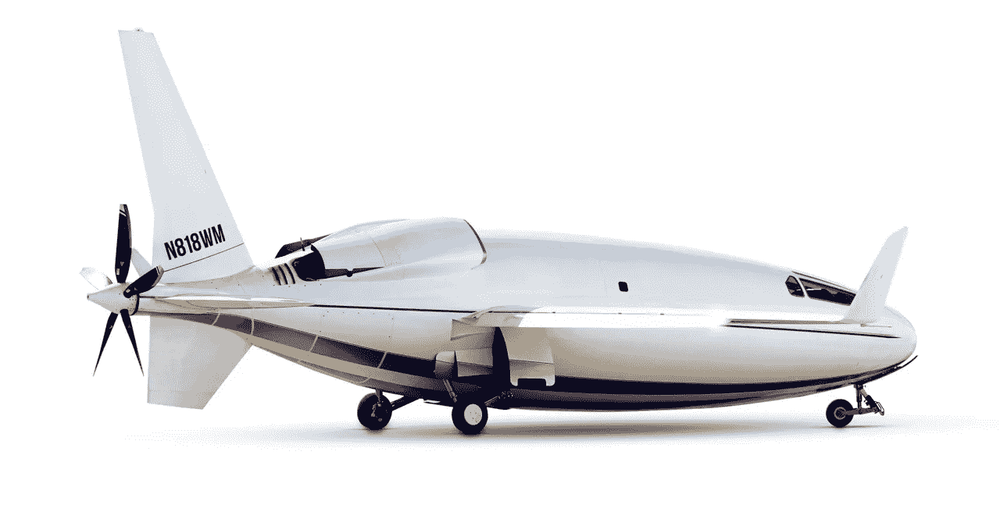

# 另一架形状奇特的飞机！

> 原文：<https://medium.com/codex/another-oddly-shaped-aircraft-9028854ff0c8?source=collection_archive---------2----------------------->

## 形状越奇怪，效率越高！

[Celera 500 l(奥托航空公司的媒体)](https://images.squarespace-cdn.com/content/v1/5f3541f19bb2e80bcd4b0f98/1597342625384-WNUTSHCNHX52IMKCKP6M/image-asset.png?format=2500w)

上图中球根状的 Celera 500L 飞机是威廉·奥托和他的奥托航空公司的作品。奥托航空公司的以下声明总结了威廉·奥托的 Celera 设计:

> [威廉·奥托有一点值得一提——他用非常规的方法解决看似不可能的问题。](https://ottoaviation.com/about-us)