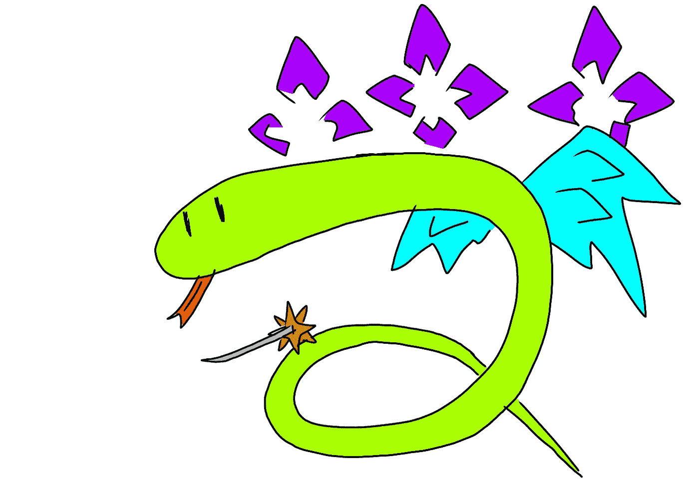

# 另一个 Python 问题，作为初学者，我花了几天时间才解决

> 原文：<https://medium.com/codex/another-python-question-that-took-me-days-to-solve-as-a-beginner-37b5e144ecc?source=collection_archive---------1----------------------->

一条蟒蛇的涂鸦，但带有一个 bankai

我于 2017 年开始在大学学习 Python 编程，遇到了几个奇怪的练习题，花了我几天时间才解决。一个这样的问题: