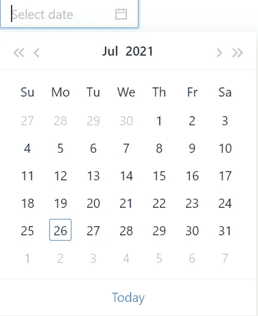
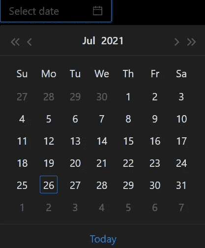

# Ant Design:世界第二大流行的 React UI 库

> 原文：<https://medium.com/codex/ant-design-the-worlds-2nd-most-popular-react-ui-library-b6c4853aefaa?source=collection_archive---------8----------------------->


图片来自 Fiverr.com

# **什么是蚂蚁设计？**

蚂蚁设计是由中国企业集团阿里巴巴创建的一个反应式用户界面库。它有易于使用的组件，有助于构建优雅的用户界面，也可以很容易地定制。它是用 i18n 构建的，已经被本地化为[几十种语言](https://ant.design/docs/react/i18n#Supported-languages:)。

Ant design 不仅仅是一个 React UI 库，它远不止于此。这是一个相互连接的库的集合，围绕着它们有一个严肃的生态系统，这个库的 UI 组件本身就是迷你项目——参见[这篇报道](https://github.com/react-component)了解更多信息。

# **Ant 设计入门**

让我们在蚂蚁设计的世界里动手吧。为了了解如何借助 Ant Design 开发企业应用程序，我们需要从基础开始。

首先，让我们使用下面的命令创建 react 应用程序。

```
npx create-react-app my-app
cd my-app
```

然后在下面代码的帮助下设置 antd:

```
npm i antd
```

在 antd 成功安装到 react 应用程序中之后，您可以在您的依赖项中看到它。

现在，正如我们所知，有几个组件可以在 antd 的帮助下轻松使用。因此，让我们试着理解其中的一些组件，看看它们是如何工作的。让我们尝试在应用程序中添加一个数据选择器。为此，请将以下代码添加到 src/App.js 中:

```
import { DatePicker } from 'antd';
import 'antd/dist/antd.css'; function App() 
{  
 return 
 (
  <DatePicker/>
 );
} export default App;
```

在上面的代码中，我们已经从 Ant Design Library 及其 CSS 中导入了数据选择器组件。添加完这段代码后，当我们运行应用程序时，我们将看到日期选择器。



图片来自作者

如果我们喜欢深色主题而不是普通主题，我们也可以将其主题改为深色，这样做只需添加这个 CSS 并从代码中删除以前的 CSS。

```
import 'antd/dist/antd.dark.css';
```

在我们成功地添加了 CSS 之后，我们将我们的数据选择器设置为深色主题。



图片来自作者

看看我们如何毫不费力地将数据选择器添加到我们的应用程序中，以及我们的代码有多干净。

就像数据选择器一样，还有许多其他组件，如图标、按钮、字体、模态、表格、树等等，我们将在其他博客中简要讨论。

# **结论**

由于 Ant Design 是一个开源代码，可以免费使用，所以它可以为我们提供很多东西，只是我们可以如何利用它。它也使我们的代码更加干净和精细，所以我的建议是在您的 react 应用程序中使用它，您会感觉到不同。

如果您对此有任何疑问，可以在 [LinkedIn](https://www.linkedin.com/in/harsh-8711a81a0/) 上发表评论或联系我。