# 古董 iPads，热传感器，没有芯片！

> 原文：<https://medium.com/codex/antique-ipads-heat-sensors-and-no-chips-bd34a98a23c2?source=collection_archive---------12----------------------->

## 苹果视图综述 2022 年 5 月 2 日至 5 月 6 日

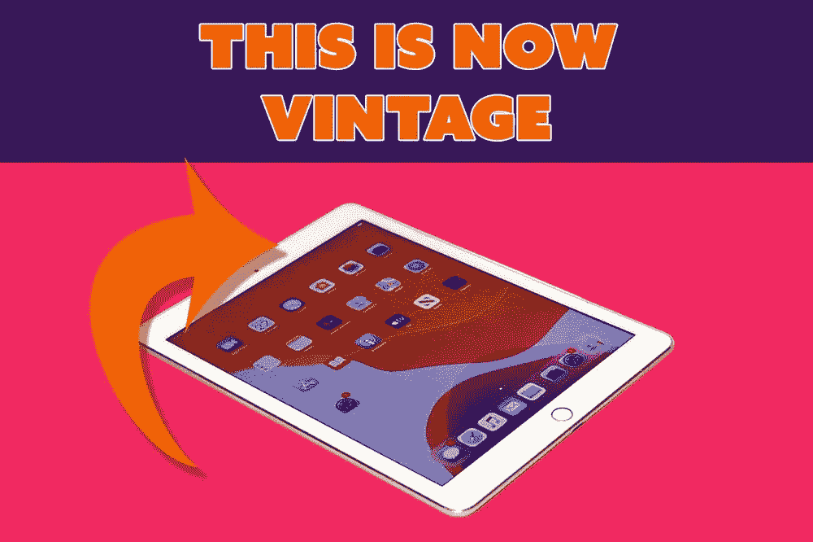

## 安全就是这个词

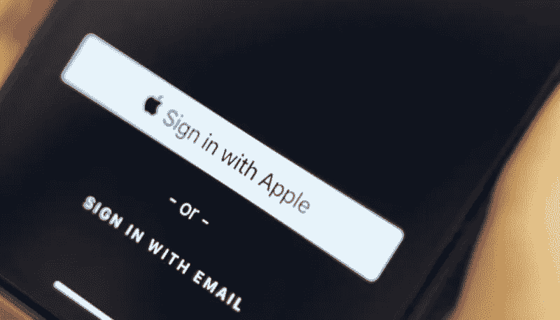

更高的在线安全性

本周，苹果、谷歌和微软都宣誓效忠 FIDO(在线快速身份认证)。这三家科技公司都宣布，他们正在扩大对联盟无密码登录标准的支持。隐私一直是苹果核心价值观的核心，他们认为 FIDO 是让 Mac 用户在线更安全的一种方式。Fido 将意味着不再有密码，这是非常脆弱的。未来将基于面部、指纹或设备密码，所有这些都被视为更安全的登录方式。任何意味着更少的密码和更高的安全性的东西都是好东西。

 [## 搞定面试

### 如何进行采访…并在苹果电脑上记录下来

medium.com](/codex/nailing-the-interview-f10efb41b36a) 

## 对工作室展示的更多热爱

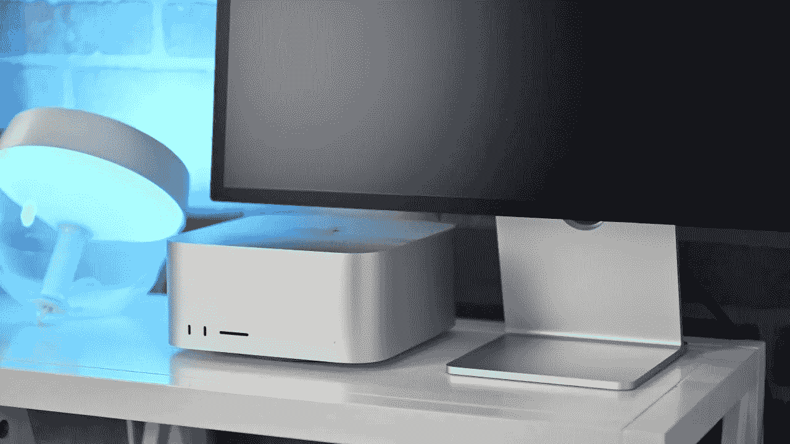

另一个固件发布的恶意工作室显示

本周二发布了大量固件更新。iOS 15.5、iPadOS 15.5、tvOS 15.5、watchOS 8.5 和 Monterey 12.4 都是作为测试版发布的。还有 Studio Display 固件 15.5，旨在修复显示器网络摄像头上较差的摄像头质量。发行时，用户抱怨图像粗糙、褪色。这第二个固件版本承诺更新相机调谐。该固件更新目前仅限于运行 macOS Monterey‌ 12.4 测试版的 MAC 电脑。安装 macOS 12.4 测试版后，Studio Display 用户可以进入系统偏好设置>软件更新来安装固件。好吧，六月中旬来，我希望能让你知道相机怎么样了，当我的相机最终到达的时候。

## 暖气打开了

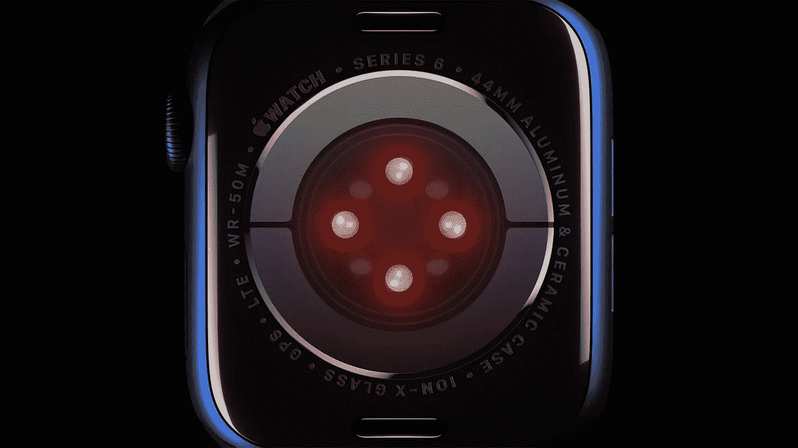

热传感器会成为 8 系列 Apple Watch 吗？

主角郭明志在周日晚些时候发布了一系列推文，解释了体温传感器未能成功应用于 Apple Watch Series 7 的原因。这是由于算法未能满足去年的工程验证测试(EVT)阶段。但是，现在似乎更加确定的是，它将会出现在今年的手表上。苹果面临的最大障碍是皮肤的温度根据环境变化的速度有多快。由于智能手表无法使用硬件监测核心体温，因此该功能在很大程度上依赖于产生准确结果的算法。 ***我会被一个系列 8 诱惑吗？***

 [## 我的 Mac 奥德赛

### 从 PC 到 Mac 的旅程

medium.com](/codex/my-mac-odyssey-79c344139c11) 

## (用于命令)等待下面发表的消息

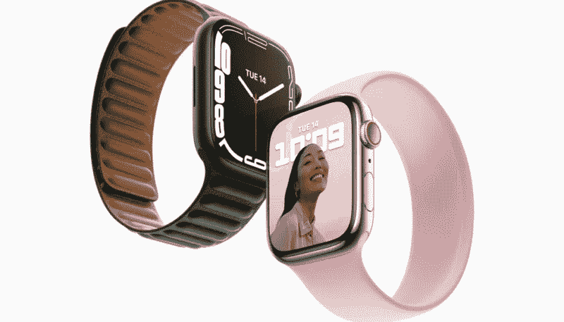

apple Watch Series 7——现已翻新

周一，苹果美国网站将 Series 7 手表添加到他们的翻新部分。这款手表于去年 9 月首次发布，现在 41 毫米版本的售价仅为 339 美元。这相当于大约 60 美元的折扣。目前，只有 GPS 型号可用，但您可以从多种颜色中选择。翻新的 Apple Watch 经过检查、测试、清洁，然后用新的盒子、新的手册和新的 Apple Watch 充电器重新包装。苹果也提供标准的一年保修。那个翻新的部分是一个真正的宝藏。

## 先生，那是收藏品吗？

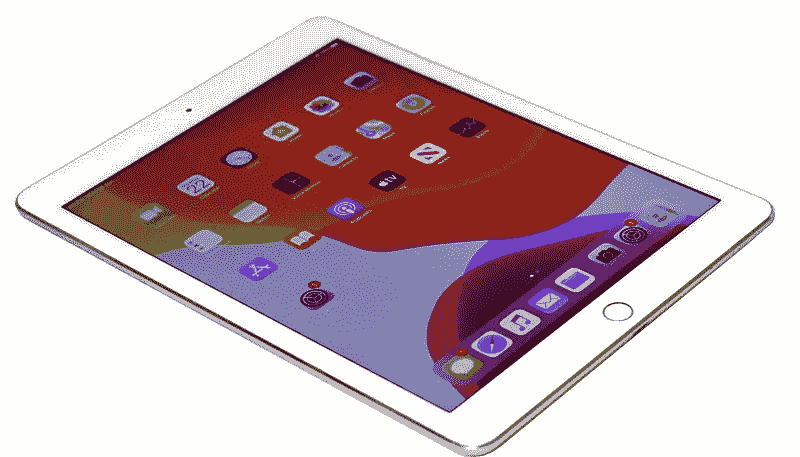

iPad Air 2——现在是一款经典产品

如果你有一台 iPad Air 2 或者 iPad Mini 2，那么从技术上来说，它们现在已经是复古产品了！本周，苹果将它们加入了他们的[经典&晦涩清单](https://support.apple.com/en-us/HT201624)。在 Apple-land，年份的定义是生产时间不超过 5 年且不超过 7 年的产品。过时的产品是指 7 年前*生产的产品。由于这两款 iPad 分别生产于 2013 年和 2104 年，它们现在已经成为复古计划的一部分。要注意的要点是，他们将不再能够更新到最新的 iPadOS 版本。 ***苹果是伟大的长度支持。****

负十六播客

## 还在淘气的一步

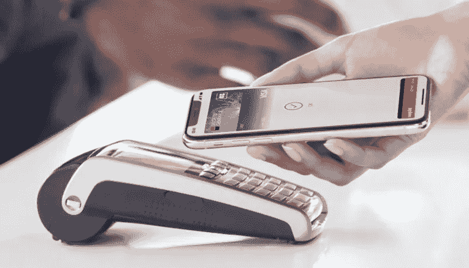

苹果再次与欧盟发生纠纷

上周，我报道了苹果在 NFC 支付接入上陷入困境。本周，事情变得更严重了，欧盟委员会发布了一份反对苹果的声明。它的立场是，他们正在限制第三方服务对 iPhone 中 NFC 支付芯片的访问。苹果已经被告知，欧盟认为他们滥用了自己的市场主导地位。他们希望看到苹果向能够使用近场技术(NFT)的第三方开放道路，这就是我们最熟悉的 tap & go。 ***我必须承认，我确实热爱 tap & go 支付。***

## 一点也不开心

员工不喜欢回到办公室

在过去的一周里，苹果实现了他们的下一波回到办公室的工作。目前，员工预计每周在苹果公园工作两天，到 5 月 23 日，这一数字将增加到三天。蒂姆·库克认为“与同事不期而遇的意外收获”是不可替代的。作为回应，工人们给管理层写了一封公开信。他们觉得每天通勤所浪费的时间没有被考虑在内，随之而来的是精神和身体的消耗。他们还认为，这将有利于那些住得离苹果总部更近的人，因此有利于特权阶层。员工们感到有点讽刺的是，苹果公司宣传他们的产品是远程工作的完美之选，然而他们却不被允许这样做。别忘了，我上周还报道过，越来越多的商店加入了工会，所以这种不安情绪似乎蔓延很广。如果苹果公司的老板们不能为各方制定出一个合适的安排，我认为他们会很不安。这不会很快消失。

## 我没有忘记你

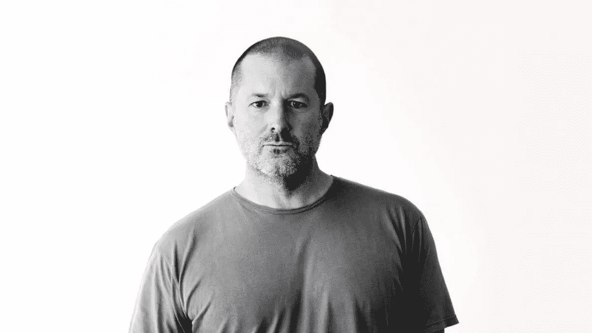

乔尼·伊夫

你还记得那些宁静的日子吗？这个周末(计划在 5 月 7 日)，我将成为《金融时报》生活方式杂志《如何消费》的客座编辑。我对*《创造和制作的过程》*很着迷。他召集了一些朋友来帮忙，包括大提琴家马友友、创作歌手莉莉·艾伦，以及获奖的长号手和小号手 Shorty。封面人物将是乔尼·伊夫和他的父亲。他们真的是特殊的时代，不是吗？

## 我感觉这一个

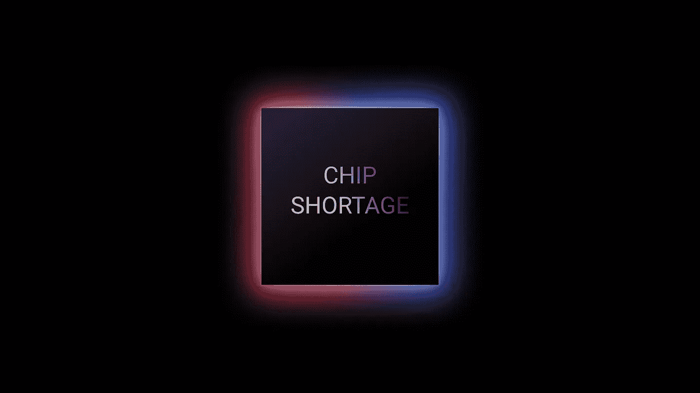

芯片短缺仍在继续(Shutterstock)

芯片短缺重创苹果**！这是我很清楚的一件事，我为此付出了代价。早在 3 月 29 日，我就订购了一台 M1 Max，16 英寸 MacBook Pro，存储容量为 2TB，统一内存为 32GB。直到本周，我的分娩日期一直是 5 月 4 日至 10 日。然后，我通过电子邮件被告知，我要到 7 月份才能看到它！幸运的是，在打了很多电话后，我设法找到了同样的机器(但有 4TB 的存储空间)，可以在第二天送货。然而，似乎我并不孤单。工作室显示器(wonky camera n'all)最早将推迟到 6 月下旬。至于 MAC，嗯，也好不到哪里去。如果你想要一个 M1 超 Mac 工作室，不要指望在 7 月初之前有人来敲你的门。**我是一个非常幸运的男孩。但是这些延迟是痛苦的。****

## ****平视****

**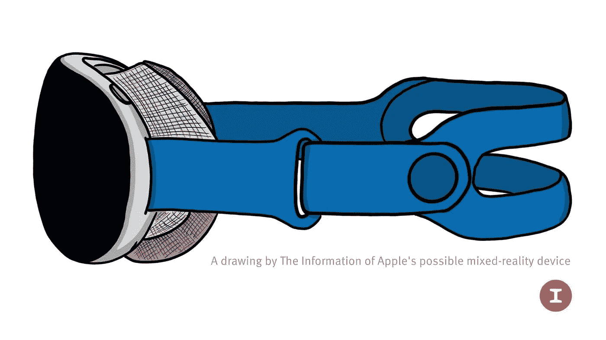**

**苹果 AR/VR 耳机——电量很大**

**郭明志(Ming-Chi Kuo)本周一直忙于信息(一如既往)。根据 Kuo 的说法，期待已久的 AR/VR 耳机*将于 2012 年第四季度推出*，并将配备两个处理器，使其几乎达到 Mac 级别的性能。特别有趣的是，我们了解到它将能够独立于 iPhone 运行。在同一份报告中，他还告诉我们，iPhone 14 的耳机将采用 Wi-Fi 6E 规范。 ***对我来说博彩从来都不是。*****

** [## 所以，我想我终于明白了！

### 那就是苹果电视，这也是我为什么要加入的原因

medium.com](/codex/so-i-think-ive-finally-got-it-616359b03673)** 

## **长度很重要**

**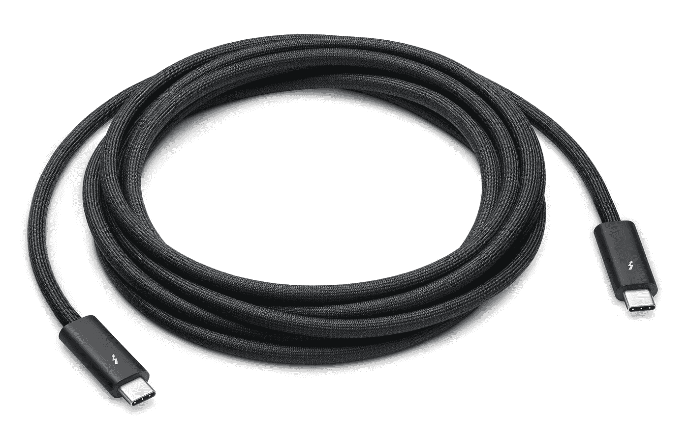**

**Thunderbolt 4 线缆— 4m 版本现已上市**

**你知道这是一个缓慢的新闻周，当一个电缆使苹果视图！对于那些抱怨 1.8 米的 Thunderbolt Pro 4 电缆太短的人来说，好吧，你的梦想得到了回应！你现在可以购买早在三月份发布的 400 万版本。…快速前进..**

## **如果你认为苹果很吝啬…**

****

**特斯拉充电套件——现在是可选配件**

**我们都抱怨苹果公司对我们盒子里的东西有多严格。嗯，甚至比不上特斯拉。虽然 Elon Musk 本周一直在 Twitter 上占据头条，但我们了解到，如果你购买特斯拉，他们现在已经*停止*为他们的汽车免费提供移动充电电缆。现在，为您的汽车购买该套件将花费 275 美元以上！不管怎样，我还是想要一个！**

## **最后…**

**就在你以为一周没有 iPhone 消息的时候，让我把这个留给你…..这位天才艺术家最新的华丽作品。这是我们可能在九月份得到的。动心？ ***谁不会。看起来很可爱！*****

**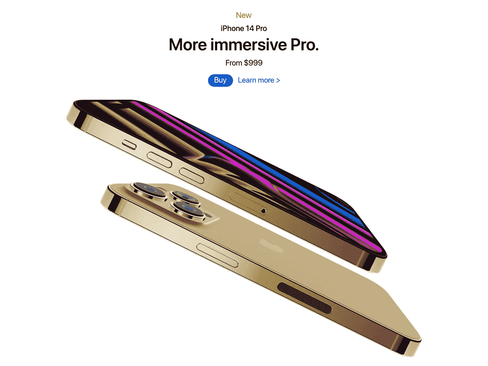**

**图片提供 [@LD_Vova](http://image courtesy @LD_Vova)**

**下周见…**

## **在你走之前**

**我只是高端博客网站 Medium 的众多作者之一。这是如此好的价值，你可以在这里加入[https://medium.com/membership](https://medium.com/membership)**

**加入我的幕后邮件列表**

**最初发表于 2022 年 5 月 6 日 https://www.talkingtechandaudio.com/blog。**